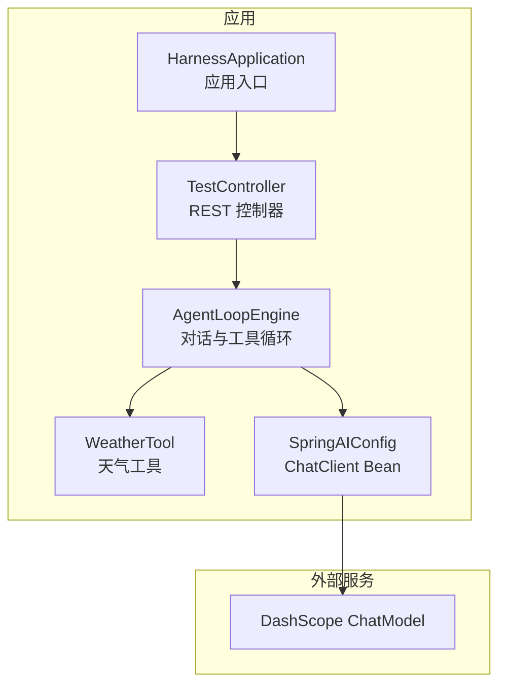
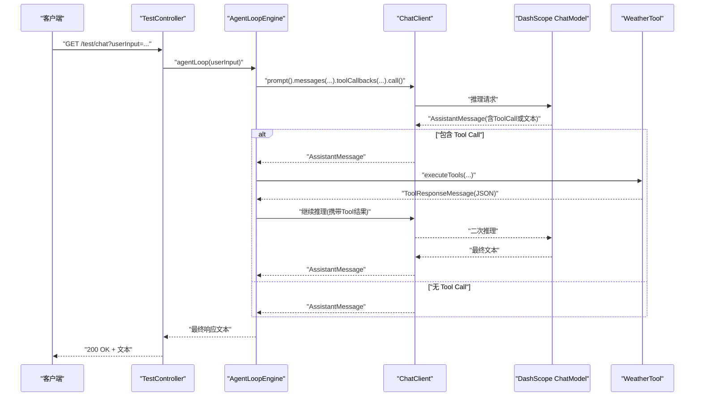
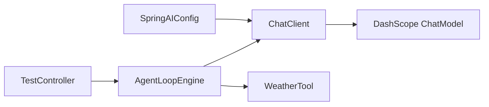

# API 参考

<cite>
**本文引用的文件**
- [TestController.java](file://src/main/java/com/learn/harness/TestController.java)
- [AgentLoopEngine.java](file://src/main/java/com/learn/harness/core/AgentLoopEngine.java)
- [WeatherTool.java](file://src/main/java/com/learn/harness/tools/WeatherTool.java)
- [SpringAIConfig.java](file://src/main/java/com/learn/harness/config/SpringAIConfig.java)
- [HarnessApplication.java](file://src/main/java/com/learn/harness/HarnessApplication.java)
- [application.yml](file://src/main/resources/application.yml)
- [pom.xml](file://pom.xml)
- [HarnessApplicationTests.java](file://src/test/java/com/learn/harness/HarnessApplicationTests.java)
</cite>

## 目录
1. [简介](#简介)
2. [项目结构](#项目结构)
3. [核心组件](#核心组件)
4. [架构总览](#架构总览)
5. [详细组件分析](#详细组件分析)
6. [依赖分析](#依赖分析)
7. [性能与可靠性](#性能与可靠性)
8. [故障排查指南](#故障排查指南)
9. [结论](#结论)
10. [附录](#附录)

## 简介
本文件为 learn-harness 项目的 API 参考文档，聚焦于两个测试端点：
- GET /test/chat
- GET /test/weather/agent

这两个端点均通过 Spring Web MVC 暴露，内部委托给 AgentLoopEngine 执行多轮对话与工具调用循环，并在需要时调用内置的天气工具以演示工具链路。本文将说明端点的 HTTP 方法、URL 模式、请求/响应格式、认证与安全、错误处理策略、状态码含义、速率限制与版本管理现状、客户端实现指南、性能优化建议以及扩展性与自定义选项。

## 项目结构
- 后端框架：Spring Boot 3.2.0 + Spring Web MVC
- AI 框架：Spring AI Alibaba（DashScope ChatModel）
- 主要模块：
  - 控制器层：TestController
  - 核心引擎：AgentLoopEngine
  - 工具：WeatherTool
  - 配置：SpringAIConfig
  - 应用入口：HarnessApplication
  - 配置文件：application.yml
  - 构建脚本：pom.xml

图表来源
- [HarnessApplication.java:1-14](file://src/main/java/com/learn/harness/HarnessApplication.java#L1-L14)
- [TestController.java:11-44](file://src/main/java/com/learn/harness/TestController.java#L11-L44)
- [AgentLoopEngine.java:34-68](file://src/main/java/com/learn/harness/core/AgentLoopEngine.java#L34-L68)
- [WeatherTool.java:17-42](file://src/main/java/com/learn/harness/tools/WeatherTool.java#L17-L42)
- [SpringAIConfig.java:13-25](file://src/main/java/com/learn/harness/config/SpringAIConfig.java#L13-L25)

章节来源
- [HarnessApplication.java:1-14](file://src/main/java/com/learn/harness/HarnessApplication.java#L1-L14)
- [pom.xml:16-43](file://pom.xml#L16-L43)
- [application.yml:1-13](file://src/main/resources/application.yml#L1-L13)

## 核心组件
- TestController：暴露 /test/chat 与 /test/weather/agent 两个 GET 端点，接收字符串参数并转发至 AgentLoopEngine。
- AgentLoopEngine：负责构建消息历史、调用 ChatClient、判断并执行 Tool Calls、限制最大循环次数、回调钩子、异常兜底。
- WeatherTool：提供名为 getWeather 的工具，用于查询天气（当前为模拟数据）。
- SpringAIConfig：装配 ChatClient Bean，依赖 DashScope ChatModel。
- application.yml：配置服务器端口、应用名及 DashScope API Key 与模型选项。

章节来源
- [TestController.java:11-44](file://src/main/java/com/learn/harness/TestController.java#L11-L44)
- [AgentLoopEngine.java:34-182](file://src/main/java/com/learn/harness/core/AgentLoopEngine.java#L34-L182)
- [WeatherTool.java:17-66](file://src/main/java/com/learn/harness/tools/WeatherTool.java#L17-L66)
- [SpringAIConfig.java:13-25](file://src/main/java/com/learn/harness/config/SpringAIConfig.java#L13-L25)
- [application.yml:1-13](file://src/main/resources/application.yml#L1-L13)

## 架构总览
以下序列图展示了 /test/chat 与 /test/weather/agent 的典型调用流程：客户端发起 GET 请求，TestController 将参数传入 AgentLoopEngine，AgentLoopEngine 通过 ChatClient 调用 DashScope ChatModel；若模型返回 Tool Call，则执行 WeatherTool 并将结果回写到消息历史，继续多轮对话直至无 Tool Call 或达到最大循环次数。

图表来源
- [TestController.java:24-27](file://src/main/java/com/learn/harness/TestController.java#L24-L27)
- [AgentLoopEngine.java:96-182](file://src/main/java/com/learn/harness/core/AgentLoopEngine.java#L96-L182)
- [WeatherTool.java:30-42](file://src/main/java/com/learn/harness/tools/WeatherTool.java#L30-L42)
- [SpringAIConfig.java:21-24](file://src/main/java/com/learn/harness/config/SpringAIConfig.java#L21-L24)

## 详细组件分析

### 端点定义与行为
- 端点一：GET /test/chat
  - 请求参数：
    - userInput: string（必填）
  - 响应类型：text/plain
  - 行为：将 userInput 作为初始用户消息，进入 AgentLoopEngine 的多轮对话循环；若模型触发工具调用则执行 WeatherTool 并继续对话，直到无工具调用或达到最大循环次数。
- 端点二：GET /test/weather/agent
  - 请求参数：
    - query: string（必填）
  - 响应类型：text/plain
  - 行为：与上类似，但参数名不同，语义上更偏向“天气查询”意图。

章节来源
- [TestController.java:24-27](file://src/main/java/com/learn/harness/TestController.java#L24-L27)
- [TestController.java:40-43](file://src/main/java/com/learn/harness/TestController.java#L40-L43)

### 请求/响应格式
- 请求
  - Content-Type: application/x-www-form-urlencoded 或 application/json（取决于客户端发送方式）
  - 参数：
    - /test/chat：userInput
    - /test/weather/agent：query
- 响应
  - Content-Type: text/plain
  - 成功：Agent 的最终回复文本
  - 失败：AgentLoopEngine 在异常或达到最大循环次数时返回的兜底文本

章节来源
- [TestController.java:24-27](file://src/main/java/com/learn/harness/TestController.java#L24-L27)
- [TestController.java:40-43](file://src/main/java/com/learn/harness/TestController.java#L40-L43)
- [AgentLoopEngine.java:170-182](file://src/main/java/com/learn/harness/core/AgentLoopEngine.java#L170-L182)

### 认证与安全
- 认证方式：当前项目未启用任何认证机制（如无 @EnableWebSecurity、无拦截规则、无 Token 校验）。所有端点对公网开放。
- 安全建议：
  - 在生产环境添加 Spring Security，启用基于路径的访问控制与限流。
  - 为 DashScope ChatModel 配置 API Key 的安全存储（如环境变量或密钥管理服务），避免硬编码。
  - 对用户输入进行最小化校验与日志脱敏，避免敏感信息泄露。

章节来源
- [application.yml:8-13](file://src/main/resources/application.yml#L8-L13)
- [HarnessApplication.java:6-11](file://src/main/java/com/learn/harness/HarnessApplication.java#L6-L11)

### 错误处理策略与状态码
- 当前实现：
  - 控制器未显式抛出异常或设置 HTTP 状态码；Spring MVC 默认返回 200 OK。
  - AgentLoopEngine 在异常或达到最大循环次数时返回兜底文本，不抛出 HTTP 异常。
- 建议改进：
  - 显式捕获异常并返回 4xx/5xx 状态码。
  - 对无效参数（如缺少 query/userInput）返回 400。
  - 对上游服务错误（如 DashScope 返回非 200）返回 502/504。
  - 对速率限制触发返回 429，并设置 Retry-After 响应头。

章节来源
- [TestController.java:24-27](file://src/main/java/com/learn/harness/TestController.java#L24-L27)
- [TestController.java:40-43](file://src/main/java/com/learn/harness/TestController.java#L40-L43)
- [AgentLoopEngine.java:170-182](file://src/main/java/com/learn/harness/core/AgentLoopEngine.java#L170-L182)

### 速率限制与版本管理
- 速率限制：当前未实现任何速率限制逻辑。
- 版本管理：未见明确的 API 版本号（如 /api/v1/...）。建议在路径中引入版本前缀，便于未来演进。
- 建议：
  - 引入基于 IP 或 API Key 的限流策略（如 Guava RateLimiter 或 Spring Cloud Gateway）。
  - 在路径中增加版本号，例如 /api/v1/test/chat。

章节来源
- [TestController.java:11-13](file://src/main/java/com/learn/harness/TestController.java#L11-L13)

### 客户端实现指南
- 基础调用
  - /test/chat：GET /test/chat?userInput=你好
  - /test/weather/agent：GET /test/weather/agent?query=北京天气如何
- 响应处理
  - 期望 text/plain；若为空或仅包含兜底提示，检查上游模型响应与工具执行日志。
- 重试与退避
  - 若上游服务不稳定，建议在客户端实现指数退避重试。
- 日志与可观测性
  - 记录请求 ID、userInput/query、响应时间与最终文本，便于问题定位。

章节来源
- [TestController.java:24-27](file://src/main/java/com/learn/harness/TestController.java#L24-L27)
- [TestController.java:40-43](file://src/main/java/com/learn/harness/TestController.java#L40-L43)

### 性能优化建议
- 减少消息历史长度：在 AgentLoopEngine 中可引入消息压缩或摘要策略，降低 Token 消耗。
- 工具调用优化：合并多次 Tool Call，减少往返次数。
- 缓存：对外部工具（如天气）结果进行短期缓存，避免重复调用。
- 连接池与超时：合理配置 ChatClient 的连接与超时参数，提升吞吐量与稳定性。
- 并发：在控制器层按需引入异步处理，避免阻塞主线程。

章节来源
- [AgentLoopEngine.java:96-182](file://src/main/java/com/learn/harness/core/AgentLoopEngine.java#L96-L182)

### 扩展性与自定义选项
- 新增工具
  - 通过 @Tool 注解定义新工具方法，AgentLoopEngine 会在初始化时自动扫描注册。
  - 在 AgentLoopEngine.initTools 中会遍历 ToolCallbacks 并注册工具回调。
- 自定义模型
  - 通过 application.yml 修改 DashScope 模型名称与参数，或切换其他 ChatModel。
- 回调钩子
  - AgentLoopEngine 提供 onLoopStart/onLoopEnd/onToolExecuted 回调，可用于审计、监控与可观测性。
- 最大循环次数
  - 可通过 maxLoopCount(int) 自定义上限，防止无限循环。

章节来源
- [AgentLoopEngine.java:58-68](file://src/main/java/com/learn/harness/core/AgentLoopEngine.java#L58-L68)
- [AgentLoopEngine.java:273-300](file://src/main/java/com/learn/harness/core/AgentLoopEngine.java#L273-L300)
- [application.yml:8-13](file://src/main/resources/application.yml#L8-L13)

## 依赖分析
- 模块间依赖
  - TestController 依赖 AgentLoopEngine
  - AgentLoopEngine 依赖 ChatClient 与 WeatherTool
  - SpringAIConfig 提供 ChatClient Bean
  - application.yml 配置 DashScope API Key 与模型
- 外部依赖
  - Spring AI Alibaba Agent Framework 与 DashScope Starter

图表来源
- [TestController.java:15-16](file://src/main/java/com/learn/harness/TestController.java#L15-L16)
- [AgentLoopEngine.java:44-48](file://src/main/java/com/learn/harness/core/AgentLoopEngine.java#L44-L48)
- [SpringAIConfig.java:21-24](file://src/main/java/com/learn/harness/config/SpringAIConfig.java#L21-L24)
- [application.yml:8-13](file://src/main/resources/application.yml#L8-L13)

章节来源
- [pom.xml:28-40](file://pom.xml#L28-L40)

## 性能与可靠性
- 当前实现
  - 无显式限流与熔断；异常时返回兜底文本而非 HTTP 错误码。
- 建议
  - 引入限流与熔断（Resilience4j 或 Spring Cloud Circuit Breaker）。
  - 对上游服务错误进行分类与重试策略（指数退避）。
  - 在 AgentLoopEngine 中增加超时控制与最大消息长度限制。

章节来源
- [AgentLoopEngine.java:170-182](file://src/main/java/com/learn/harness/core/AgentLoopEngine.java#L170-L182)

## 故障排查指南
- 常见问题
  - 404：路径拼写错误或未部署到正确上下文。
  - 500：AgentLoopEngine 抛出异常或达到最大循环次数，返回兜底文本。
  - 无工具响应：确认 WeatherTool 是否被正确注册（@Tool 注解与 ToolCallbacks 扫描）。
- 排查步骤
  - 查看后端日志中的 AgentLoopEngine 日志与工具执行日志。
  - 检查 DashScope API Key 与模型配置是否正确。
  - 确认参数名与值是否符合预期（userInput/query）。

章节来源
- [AgentLoopEngine.java:170-182](file://src/main/java/com/learn/harness/core/AgentLoopEngine.java#L170-L182)
- [WeatherTool.java:30-42](file://src/main/java/com/learn/harness/tools/WeatherTool.java#L30-L42)
- [application.yml:8-13](file://src/main/resources/application.yml#L8-L13)

## 结论
learn-harness 提供了简洁的测试端点与可扩展的 Agent 循环引擎，支持工具链路与多轮对话。当前实现未包含认证、限流与明确的错误状态码，建议在生产环境中补齐安全与可靠性措施，并引入版本化 API 与更完善的错误处理策略。

## 附录
- 端点一览
  - GET /test/chat?userInput=... → 返回 Agent 最终回复文本
  - GET /test/weather/agent?query=... → 返回 Agent 最终回复文本
- 关键配置
  - 服务器端口：application.yml 中 server.port
  - DashScope API Key 与模型：application.yml 中 spring.ai.dashscope
- 测试
  - 应用上下文加载测试：HarnessApplicationTests

章节来源
- [TestController.java:24-27](file://src/main/java/com/learn/harness/TestController.java#L24-L27)
- [TestController.java:40-43](file://src/main/java/com/learn/harness/TestController.java#L40-L43)
- [application.yml:1-13](file://src/main/resources/application.yml#L1-L13)
- [HarnessApplicationTests.java:6-11](file://src/test/java/com/learn/harness/HarnessApplicationTests.java#L6-L11)