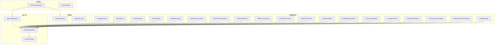
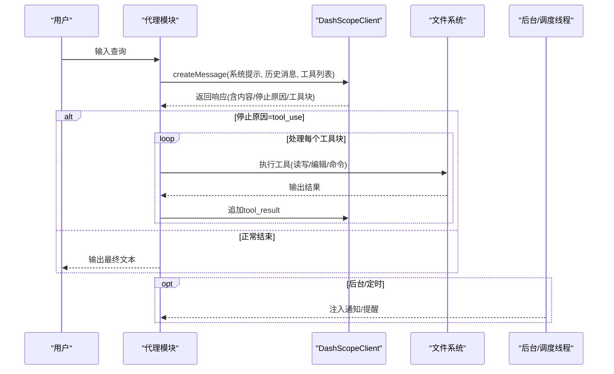
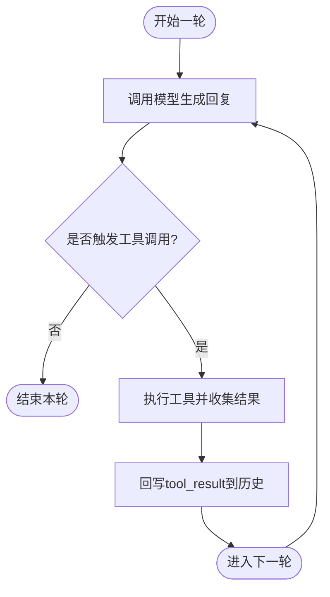
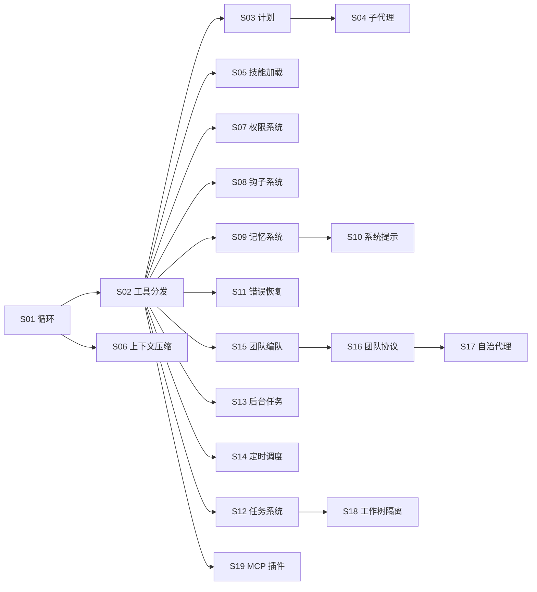

# 代理模块系列

<cite>
**本文引用的文件**
- [S01AgentLoop.java](file://src/main/java/com/learn/harness/agent/S01AgentLoop.java)
- [S02ToolUse.java](file://src/main/java/com/learn/harness/agent/S02ToolUse.java)
- [S03TodoWrite.java](file://src/main/java/com/learn/harness/agent/S03TodoWrite.java)
- [S04Subagent.java](file://src/main/java/com/learn/harness/agent/S04Subagent.java)
- [S05SkillLoading.java](file://src/main/java/com/learn/harness/agent/S05SkillLoading.java)
- [S06ContextCompact.java](file://src/main/java/com/learn/harness/agent/S06ContextCompact.java)
- [S07PermissionSystem.java](file://src/main/java/com/learn/harness/agent/S07PermissionSystem.java)
- [S08HookSystem.java](file://src/main/java/com/learn/harness/agent/S08HookSystem.java)
- [S09MemorySystem.java](file://src/main/java/com/learn/harness/agent/S09MemorySystem.java)
- [S10SystemPrompt.java](file://src/main/java/com/learn/harness/agent/S10SystemPrompt.java)
- [S11ErrorRecovery.java](file://src/main/java/com/learn/harness/agent/S11ErrorRecovery.java)
- [S12TaskSystem.java](file://src/main/java/com/learn/harness/agent/S12TaskSystem.java)
- [S13BackgroundTasks.java](file://src/main/java/com/learn/harness/agent/S13BackgroundTasks.java)
- [S14CronScheduler.java](file://src/main/java/com/learn/harness/agent/S14CronScheduler.java)
- [S15AgentTeams.java](file://src/main/java/com/learn/harness/agent/S15AgentTeams.java)
- [S16TeamProtocols.java](file://src/main/java/com/learn/harness/agent/S16TeamProtocols.java)
- [S17AutonomousAgents.java](file://src/main/java/com/learn/harness/agent/S17AutonomousAgents.java)
- [S18WorktreeTaskIsolation.java](file://src/main/java/com/learn/harness/agent/S18WorktreeTaskIsolation.java)
- [S19McpPlugin.java](file://src/main/java/com/learn/harness/agent/S19McpPlugin.java)
- [CommonTools.java](file://src/main/java/com/learn/harness/agent/CommonTools.java)
- [DashScopeClient.java](file://src/main/java/com/learn/harness/agent/DashScopeClient.java)
- [HarnessApplication.java](file://src/main/java/com/learn/harness/HarnessApplication.java)
- [TestController.java](file://src/main/java/com/learn/harness/TestController.java)
- [SpringAIConfig.java](file://src/main/java/com/learn/harness/config/SpringAIConfig.java)
- [application.yml](file://src/main/resources/application.yml)
</cite>

## 更新摘要
**变更内容**
- 新增19个代理模块教程章节的完整文档
- 更新项目结构和模块依赖关系
- 完善架构总览和详细组件分析
- 增强故障排除指南和最佳实践建议

## 目录
1. [简介](#简介)
2. [项目结构](#项目结构)
3. [核心组件](#核心组件)
4. [架构总览](#架构总览)
5. [详细组件分析](#详细组件分析)
6. [依赖分析](#依赖分析)
7. [性能考虑](#性能考虑)
8. [故障排除指南](#故障排除指南)
9. [结论](#结论)
10. [附录](#附录)

## 简介
本项目通过一系列渐进式的代理模块（S01–S19），系统性地演示了从"最小可用代理循环"到"团队协作与协议"的完整演进路径。每个模块聚焦一个关键能力：工具调用、计划管理、子代理、技能加载、上下文压缩、权限控制、钩子扩展、记忆持久化、系统提示构建、错误恢复、任务系统、后台任务、定时调度、团队编队与协议、自主代理、工作树隔离、MCP插件等。读者可按模块顺序逐步学习，也可根据实际需求选择合适模块组合，快速搭建面向工程实践的智能体系统。

## 项目结构
项目采用按功能分层的组织方式：
- agent 包含所有代理模块与核心客户端
- config 提供 Spring 配置
- core 提供引擎级抽象（如 AgentLoopEngine）
- tools 存放工具定义
- resources 提供静态资源与应用配置
- 测试入口位于 TestController 与 HarnessApplication

**图表来源**
- [HarnessApplication.java](file://src/main/java/com/learn/harness/HarnessApplication.java)
- [SpringAIConfig.java](file://src/main/java/com/learn/harness/config/SpringAIConfig.java)
- [application.yml](file://src/main/resources/application.yml)
- [DashScopeClient.java](file://src/main/java/com/learn/harness/agent/DashScopeClient.java)
- [CommonTools.java](file://src/main/java/com/learn/harness/agent/CommonTools.java)
- [S01AgentLoop.java](file://src/main/java/com/learn/harness/agent/S01AgentLoop.java)
- [S02ToolUse.java](file://src/main/java/com/learn/harness/agent/S02ToolUse.java)
- [S03TodoWrite.java](file://src/main/java/com/learn/harness/agent/S03TodoWrite.java)
- [S04Subagent.java](file://src/main/java/com/learn/harness/agent/S04Subagent.java)
- [S05SkillLoading.java](file://src/main/java/com/learn/harness/agent/S05SkillLoading.java)
- [S06ContextCompact.java](file://src/main/java/com/learn/harness/agent/S06ContextCompact.java)
- [S07PermissionSystem.java](file://src/main/java/com/learn/harness/agent/S07PermissionSystem.java)
- [S08HookSystem.java](file://src/main/java/com/learn/harness/agent/S08HookSystem.java)
- [S09MemorySystem.java](file://src/main/java/com/learn/harness/agent/S09MemorySystem.java)
- [S10SystemPrompt.java](file://src/main/java/com/learn/harness/agent/S10SystemPrompt.java)
- [S11ErrorRecovery.java](file://src/main/java/com/learn/harness/agent/S11ErrorRecovery.java)
- [S12TaskSystem.java](file://src/main/java/com/learn/harness/agent/S12TaskSystem.java)
- [S13BackgroundTasks.java](file://src/main/java/com/learn/harness/agent/S13BackgroundTasks.java)
- [S14CronScheduler.java](file://src/main/java/com/learn/harness/agent/S14CronScheduler.java)
- [S15AgentTeams.java](file://src/main/java/com/learn/harness/agent/S15AgentTeams.java)
- [S16TeamProtocols.java](file://src/main/java/com/learn/harness/agent/S16TeamProtocols.java)
- [S17AutonomousAgents.java](file://src/main/java/com/learn/harness/agent/S17AutonomousAgents.java)
- [S18WorktreeTaskIsolation.java](file://src/main/java/com/learn/harness/agent/S18WorktreeTaskIsolation.java)
- [S19McpPlugin.java](file://src/main/java/com/learn/harness/agent/S19McpPlugin.java)

**章节来源**
- [HarnessApplication.java](file://src/main/java/com/learn/harness/HarnessApplication.java)
- [SpringAIConfig.java](file://src/main/java/com/learn/harness/config/SpringAIConfig.java)
- [application.yml](file://src/main/resources/application.yml)

## 核心组件
- DashScopeClient：统一的模型交互封装，负责消息构造、工具块解析、停止原因判断与文本提取。
- CommonTools：公共工具方法集合，提供安全路径检查、命令执行、文件操作等基础能力。
- AgentLoopEngine：核心引擎抽象（在本仓库中以各模块独立实现为主，便于教学）。
- 工具集：bash、read_file、write_file、edit_file、todo、task、load_skill、compact、background_run、cron_*、spawn_teammate、send_message、mcp__* 等。
- 配置与运行：Spring 配置与应用入口，提供环境变量与外部服务接入点。

**章节来源**
- [DashScopeClient.java](file://src/main/java/com/learn/harness/agent/DashScopeClient.java)
- [CommonTools.java](file://src/main/java/com/learn/harness/agent/CommonTools.java)
- [HarnessApplication.java](file://src/main/java/com/learn/harness/HarnessApplication.java)
- [SpringAIConfig.java](file://src/main/java/com/learn/harness/config/SpringAIConfig.java)

## 架构总览
代理模块遵循"统一客户端 + 模块化工具 + 可插拔扩展"的设计。每个模块保持最小循环不变，仅在工具集或流程上增量增强，从而形成清晰的演进路径。

**图表来源**
- [S01AgentLoop.java](file://src/main/java/com/learn/harness/agent/S01AgentLoop.java)
- [S02ToolUse.java](file://src/main/java/com/learn/harness/agent/S02ToolUse.java)
- [S03TodoWrite.java](file://src/main/java/com/learn/harness/agent/S03TodoWrite.java)
- [S04Subagent.java](file://src/main/java/com/learn/harness/agent/S04Subagent.java)
- [S05SkillLoading.java](file://src/main/java/com/learn/harness/agent/S05SkillLoading.java)
- [S06ContextCompact.java](file://src/main/java/com/learn/harness/agent/S06ContextCompact.java)
- [S07PermissionSystem.java](file://src/main/java/com/learn/harness/agent/S07PermissionSystem.java)
- [S08HookSystem.java](file://src/main/java/com/learn/harness/agent/S08HookSystem.java)
- [S09MemorySystem.java](file://src/main/java/com/learn/harness/agent/S09MemorySystem.java)
- [S10SystemPrompt.java](file://src/main/java/com/learn/harness/agent/S10SystemPrompt.java)
- [S11ErrorRecovery.java](file://src/main/java/com/learn/harness/agent/S11ErrorRecovery.java)
- [S12TaskSystem.java](file://src/main/java/com/learn/harness/agent/S12TaskSystem.java)
- [S13BackgroundTasks.java](file://src/main/java/com/learn/harness/agent/S13BackgroundTasks.java)
- [S14CronScheduler.java](file://src/main/java/com/learn/harness/agent/S14CronScheduler.java)
- [S15AgentTeams.java](file://src/main/java/com/learn/harness/agent/S15AgentTeams.java)
- [S16TeamProtocols.java](file://src/main/java/com/learn/harness/agent/S16TeamProtocols.java)
- [S17AutonomousAgents.java](file://src/main/java/com/learn/harness/agent/S17AutonomousAgents.java)
- [S18WorktreeTaskIsolation.java](file://src/main/java/com/learn/harness/agent/S18WorktreeTaskIsolation.java)
- [S19McpPlugin.java](file://src/main/java/com/learn/harness/agent/S19McpPlugin.java)
- [DashScopeClient.java](file://src/main/java/com/learn/harness/agent/DashScopeClient.java)

## 详细组件分析

### S01 最小代理循环
- 设计理念：最小可用循环，明确状态，为后续模块打下一致基座。
- 关键点：消息追加、工具块识别、tool_result 回写、循环终止条件。
- 使用场景：快速验证工具链与模型交互；作为所有后续模块的"循环骨架"。

**图表来源**
- [S01AgentLoop.java](file://src/main/java/com/learn/harness/agent/S01AgentLoop.java)

**章节来源**
- [S01AgentLoop.java](file://src/main/java/com/learn/harness/agent/S01AgentLoop.java)

### S02 工具使用与分发
- 新增：完整的工具集（bash + read_file + write_file + edit_file）和工具分发机制。
- 收益：将工具实现与调用解耦，提升可维护性与可扩展性。

**章节来源**
- [S02ToolUse.java](file://src/main/java/com/learn/harness/agent/S02ToolUse.java)
- [CommonTools.java](file://src/main/java/com/learn/harness/agent/CommonTools.java)

### S03 会话计划管理
- 新增：TodoManager 类管理计划项状态（pending → in_progress → completed）。
- 收益：强制聚焦单一任务，防止多任务切换导致的效率下降。

**章节来源**
- [S03TodoWrite.java](file://src/main/java/com/learn/harness/agent/S03TodoWrite.java)

### S04 子代理执行
- 新增：父子上下文隔离，子代理完成任务后仅返回摘要。
- 收益：在复杂探索中保持主代理上下文简洁，降低上下文成本。

**章节来源**
- [S04Subagent.java](file://src/main/java/com/learn/harness/agent/S04Subagent.java)

### S05 技能加载机制
- 新增：技能清单与按需加载机制，系统提示中只保留技能概览。
- 收益：在大模型提示中高效表达能力边界，避免冗余信息。

**章节来源**
- [S05SkillLoading.java](file://src/main/java/com/learn/harness/agent/S05SkillLoading.java)

### S06 上下文压缩
- 新增：大输出落盘预览、近期结果微压缩、超长对话自动摘要。
- 收益：在长对话中维持稳定性能与成本控制。

**章节来源**
- [S06ContextCompact.java](file://src/main/java/com/learn/harness/agent/S06ContextCompact.java)

### S07 权限系统
- 新增：拒绝规则 → 模式检查 → 允许规则 → 用户确认 的四阶段管线。
- 收益：在工具调用前进行安全前置过滤，兼顾灵活性与安全性。

**章节来源**
- [S07PermissionSystem.java](file://src/main/java/com/learn/harness/agent/S07PermissionSystem.java)

### S08 钩子系统
- 新增：会话开始、工具调用前后钩子，通过外部脚本扩展行为。
- 收益：无需修改主循环即可注入审计、告警、策略等横切关注点。

**章节来源**
- [S08HookSystem.java](file://src/main/java/com/learn/harness/agent/S08HookSystem.java)

### S09 记忆系统
- 新增：跨会话记忆持久化，Markdown Frontmatter 结构化存储，索引自动生成。
- 收益：将"非易失性知识"纳入系统提示，提升长期一致性与个性化。

**章节来源**
- [S09MemorySystem.java](file://src/main/java/com/learn/harness/agent/S09MemorySystem.java)

### S10 系统提示构建
- 新增：系统提示流水线（核心指令 → 工具 → 技能 → 记忆 → CLAUDE.md → 动态上下文）。
- 收益：模块化拼装系统提示，便于版本化与动态注入。

**章节来源**
- [S10SystemPrompt.java](file://src/main/java/com/learn/harness/agent/S10SystemPrompt.java)

### S11 错误恢复
- 新增：三路恢复策略（max_tokens 续写、prompt_too_long 摘要、连接失败指数退避）。
- 收益：提升鲁棒性，避免因外部波动中断工作流。

**章节来源**
- [S11ErrorRecovery.java](file://src/main/java/com/learn/harness/agent/S11ErrorRecovery.java)

### S12 任务系统
- 新增：磁盘持久化的任务记录，支持依赖图、阻塞关系与状态流转。
- 收益：任务状态不随上下文压缩丢失，适合长期跟踪与协作。

**章节来源**
- [S12TaskSystem.java](file://src/main/java/com/learn/harness/agent/S12TaskSystem.java)

### S13 后台任务
- 新增：后台线程执行慢命令，轮询通知队列回注到主循环。
- 收益：提升交互流畅度，避免阻塞式等待。

**章节来源**
- [S13BackgroundTasks.java](file://src/main/java/com/learn/harness/agent/S13BackgroundTasks.java)

### S14 定时调度
- 新增：基于标准 Cron 表达式的未来执行计划，到期推送回主循环。
- 收益：将"未来工作"纳入同一循环，统一处理与可观测。

**章节来源**
- [S14CronScheduler.java](file://src/main/java/com/learn/harness/agent/S14CronScheduler.java)

### S15 代理团队
- 新增：命名代理、文件型 JSONL 邮箱、独立线程循环、通信仅通过邮箱。
- 收益：多代理协作，职责分离，通信透明。

**章节来源**
- [S15AgentTeams.java](file://src/main/java/com/learn/harness/agent/S15AgentTeams.java)

### S16 团队协议
- 新增：停机请求与计划审批的协议化记录与状态机，请求持久化于 .team/requests。
- 收益：在团队协作中引入治理与可追溯性。

**章节来源**
- [S16TeamProtocols.java](file://src/main/java/com/learn/harness/agent/S16TeamProtocols.java)

### S17 自治代理
- 新增：队员具备自主性，能够主动寻找任务并执行，无需持续指挥。
- 收益：提升团队效率，减少Lead负担。

**章节来源**
- [S17AutonomousAgents.java](file://src/main/java/com/learn/harness/agent/S17AutonomousAgents.java)

### S18 工作树任务隔离
- 新增：使用 git worktree 实现任务级别的代码隔离，每个任务在独立工作树中执行。
- 收益：避免多任务并发执行时的代码冲突，提升安全性。

**章节来源**
- [S18WorktreeTaskIsolation.java](file://src/main/java/com/learn/harness/agent/S18WorktreeTaskIsolation.java)

### S19 MCP 外部工具插件
- 新增：通过 MCP（Model Context Protocol）协议加载外部工具，实现统一的工具管理。
- 收益：支持第三方工具扩展，统一权限控制和工具分发。

**章节来源**
- [S19McpPlugin.java](file://src/main/java/com/learn/harness/agent/S19McpPlugin.java)

## 依赖分析
- 模块内聚：各模块围绕单一能力点扩展，耦合度低，便于独立学习与替换。
- 模块间依赖：S04 子代理依赖 S01 的 bash 实现；S08 钩子复用 S01 的 bash；S09 记忆系统复用 S05 的读写工具；S10 系统提示整合 S05 技能与 S09 记忆；S11 错误恢复贯穿所有模块；S15/16 在 S15 的基础上引入 S16 协议；S17 自治代理依赖 S15 团队机制；S18 工作树隔离依赖 S12 任务系统；S19 MCP 插件与所有模块的工具分发机制兼容。
- 外部依赖：DashScopeClient 作为统一模型接口；CommonTools 提供基础工具能力；Spring 配置用于环境注入；文件系统用于持久化（.memory、.tasks、.team、.worktrees 等）。

**图表来源**
- [S01AgentLoop.java](file://src/main/java/com/learn/harness/agent/S01AgentLoop.java)
- [S02ToolUse.java](file://src/main/java/com/learn/harness/agent/S02ToolUse.java)
- [S03TodoWrite.java](file://src/main/java/com/learn/harness/agent/S03TodoWrite.java)
- [S04Subagent.java](file://src/main/java/com/learn/harness/agent/S04Subagent.java)
- [S05SkillLoading.java](file://src/main/java/com/learn/harness/agent/S05SkillLoading.java)
- [S06ContextCompact.java](file://src/main/java/com/learn/harness/agent/S06ContextCompact.java)
- [S07PermissionSystem.java](file://src/main/java/com/learn/harness/agent/S07PermissionSystem.java)
- [S08HookSystem.java](file://src/main/java/com/learn/harness/agent/S08HookSystem.java)
- [S09MemorySystem.java](file://src/main/java/com/learn/harness/agent/S09MemorySystem.java)
- [S10SystemPrompt.java](file://src/main/java/com/learn/harness/agent/S10SystemPrompt.java)
- [S11ErrorRecovery.java](file://src/main/java/com/learn/harness/agent/S11ErrorRecovery.java)
- [S12TaskSystem.java](file://src/main/java/com/learn/harness/agent/S12TaskSystem.java)
- [S13BackgroundTasks.java](file://src/main/java/com/learn/harness/agent/S13BackgroundTasks.java)
- [S14CronScheduler.java](file://src/main/java/com/learn/harness/agent/S14CronScheduler.java)
- [S15AgentTeams.java](file://src/main/java/com/learn/harness/agent/S15AgentTeams.java)
- [S16TeamProtocols.java](file://src/main/java/com/learn/harness/agent/S16TeamProtocols.java)
- [S17AutonomousAgents.java](file://src/main/java/com/learn/harness/agent/S17AutonomousAgents.java)
- [S18WorktreeTaskIsolation.java](file://src/main/java/com/learn/harness/agent/S18WorktreeTaskIsolation.java)
- [S19McpPlugin.java](file://src/main/java/com/learn/harness/agent/S19McpPlugin.java)

**章节来源**
- [S01AgentLoop.java](file://src/main/java/com/learn/harness/agent/S01AgentLoop.java)
- [S02ToolUse.java](file://src/main/java/com/learn/harness/agent/S02ToolUse.java)
- [S03TodoWrite.java](file://src/main/java/com/learn/harness/agent/S03TodoWrite.java)
- [S04Subagent.java](file://src/main/java/com/learn/harness/agent/S04Subagent.java)
- [S05SkillLoading.java](file://src/main/java/com/learn/harness/agent/S05SkillLoading.java)
- [S06ContextCompact.java](file://src/main/java/com/learn/harness/agent/S06ContextCompact.java)
- [S07PermissionSystem.java](file://src/main/java/com/learn/harness/agent/S07PermissionSystem.java)
- [S08HookSystem.java](file://src/main/java/com/learn/harness/agent/S08HookSystem.java)
- [S09MemorySystem.java](file://src/main/java/com/learn/harness/agent/S09MemorySystem.java)
- [S10SystemPrompt.java](file://src/main/java/com/learn/harness/agent/S10SystemPrompt.java)
- [S11ErrorRecovery.java](file://src/main/java/com/learn/harness/agent/S11ErrorRecovery.java)
- [S12TaskSystem.java](file://src/main/java/com/learn/harness/agent/S12TaskSystem.java)
- [S13BackgroundTasks.java](file://src/main/java/com/learn/harness/agent/S13BackgroundTasks.java)
- [S14CronScheduler.java](file://src/main/java/com/learn/harness/agent/S14CronScheduler.java)
- [S15AgentTeams.java](file://src/main/java/com/learn/harness/agent/S15AgentTeams.java)
- [S16TeamProtocols.java](file://src/main/java/com/learn/harness/agent/S16TeamProtocols.java)
- [S17AutonomousAgents.java](file://src/main/java/com/learn/harness/agent/S17AutonomousAgents.java)
- [S18WorktreeTaskIsolation.java](file://src/main/java/com/learn/harness/agent/S18WorktreeTaskIsolation.java)
- [S19McpPlugin.java](file://src/main/java/com/learn/harness/agent/S19McpPlugin.java)

## 性能考虑
- 上下文控制：优先使用 S06 的自动摘要与手动 compact，避免超过模型上下文上限。
- I/O 节流：S13 后台任务与 S14 定时调度减少主线程阻塞，提高吞吐。
- 工具安全：S07 权限系统在工具调用前进行快速过滤，减少无效调用。
- 记忆与技能：S05 技能按需加载、S09 记忆索引裁剪，避免提示膨胀。
- 错误恢复：S11 指数退避与自动摘要，降低外部波动对稳定性的影响。
- 工作树隔离：S18 使用 git worktree 避免文件锁争用，提升并发性能。
- MCP 插件：S19 统一工具分发，减少重复初始化开销。

## 故障排除指南
- 工具调用失败
  - 检查危险命令拦截与超时设置（S01、S02、S07）。
  - 确认路径安全与工作目录限制（S02、S05、S09、S18）。
- 上下文过长
  - 触发 S06 自动摘要或手动 compact（S06）。
  - 评估 S12 任务与 S09 记忆是否冗余（S12、S09）。
- 权限被拒
  - 查看 S07 的规则匹配与用户确认流程（S07）。
- 钩子异常
  - 检查钩子脚本返回码与超时（S08）。
- 记忆/任务/团队/工作树数据异常
  - 检查对应目录权限与文件格式（S09、S12、S15、S16、S18）。
- 网络波动
  - 启用 S11 的重试与摘要恢复（S11）。
- MCP 插件连接失败
  - 检查插件配置文件和外部进程状态（S19）。
- 自治代理超时退出
  - 调整空闲轮询间隔和超时时间（S17）。

**章节来源**
- [S01AgentLoop.java](file://src/main/java/com/learn/harness/agent/S01AgentLoop.java)
- [S02ToolUse.java](file://src/main/java/com/learn/harness/agent/S02ToolUse.java)
- [S06ContextCompact.java](file://src/main/java/com/learn/harness/agent/S06ContextCompact.java)
- [S07PermissionSystem.java](file://src/main/java/com/learn/harness/agent/S07PermissionSystem.java)
- [S08HookSystem.java](file://src/main/java/com/learn/harness/agent/S08HookSystem.java)
- [S09MemorySystem.java](file://src/main/java/com/learn/harness/agent/S09MemorySystem.java)
- [S11ErrorRecovery.java](file://src/main/java/com/learn/harness/agent/S11ErrorRecovery.java)
- [S12TaskSystem.java](file://src/main/java/com/learn/harness/agent/S12TaskSystem.java)
- [S15AgentTeams.java](file://src/main/java/com/learn/harness/agent/S15AgentTeams.java)
- [S16TeamProtocols.java](file://src/main/java/com/learn/harness/agent/S16TeamProtocols.java)
- [S17AutonomousAgents.java](file://src/main/java/com/learn/harness/agent/S17AutonomousAgents.java)
- [S18WorktreeTaskIsolation.java](file://src/main/java/com/learn/harness/agent/S18WorktreeTaskIsolation.java)
- [S19McpPlugin.java](file://src/main/java/com/learn/harness/agent/S19McpPlugin.java)

## 结论
本系列模块以"最小循环 + 渐进增强"的方式，系统覆盖了代理系统的"输入-执行-反馈-记忆-协作-治理"全链路能力。从基础的 S01 循环到复杂的 S19 MCP 插件，每个模块都有明确的教学目标和实用价值。读者可按模块顺序学习，亦可根据业务场景自由组合（如仅用 S01+S02+S06+S11 构建稳健的单代理工具链；或叠加 S12/S13/S14 实现任务与自动化；再引入 S15/S16 形成团队编队与协议；最后通过 S17/S18/S19 扩展为完整的智能体生态系统）。该体系既适合入门者循序渐进掌握，也适合专家级用户按需裁剪与扩展。

## 附录
- 快速选型建议
  - 初学者：从 S01 → S02 → S06 → S11，掌握基本循环与恢复。
  - 工程师：加入 S05（技能）、S09（记忆）、S12（任务）、S13（后台）、S14（定时）。
  - 团队场景：引入 S15（编队）与 S16（协议），并结合权限与钩子强化安全与可观测。
  - 高级场景：结合 S17（自治）、S18（工作树隔离）、S19（MCP 插件）构建企业级智能体平台。
- 配置要点
  - 环境变量：DASHSCOPE_API_KEY、DASHSCOPE_MODEL（S10）、工作目录（S01–S19）。
  - 钩子配置：.hooks.json（S08）。
  - 记忆/任务/团队/工作树目录：.memory、.tasks、.team、.worktrees（S09、S12、S15、S16、S18）。
  - MCP 插件配置：.mcp-plugin/plugin.json（S19）。
- 示例路径参考
  - S01 主循环入口：[S01AgentLoop.main](file://src/main/java/com/learn/harness/agent/S01AgentLoop.java)
  - S02 工具分发与消息规范化：[S02ToolUse.agentLoop](file://src/main/java/com/learn/harness/agent/S02ToolUse.java)
  - S03 会话计划更新：[S03TodoWrite.TodoManager.update](file://src/main/java/com/learn/harness/agent/S03TodoWrite.java)
  - S04 子代理执行：[S04Subagent.runSubagent](file://src/main/java/com/learn/harness/agent/S04Subagent.java)
  - S05 技能加载：[S05SkillLoading.dispatchTool](file://src/main/java/com/learn/harness/agent/S05SkillLoading.java)
  - S06 上下文压缩：[S06ContextCompact.compactHistory](file://src/main/java/com/learn/harness/agent/S06ContextCompact.java)
  - S07 权限决策：[S07PermissionSystem.PermissionManager.check](file://src/main/java/com/learn/harness/agent/S07PermissionSystem.java)
  - S08 钩子执行：[S08HookSystem.HookManager.runHooks](file://src/main/java/com/learn/harness/agent/S08HookSystem.java)
  - S09 记忆保存：[S09MemorySystem.MemoryManager.saveMemory](file://src/main/java/com/learn/harness/agent/S09MemorySystem.java)
  - S10 系统提示构建：[S10SystemPrompt.SystemPromptBuilder.build](file://src/main/java/com/learn/harness/agent/S10SystemPrompt.java)
  - S11 错误恢复：[S11ErrorRecovery.autoCompact](file://src/main/java/com/learn/harness/agent/S11ErrorRecovery.java)
  - S12 任务管理：[S12TaskSystem.TaskManager.create](file://src/main/java/com/learn/harness/agent/S12TaskSystem.java)
  - S13 后台任务：[S13BackgroundTasks.BackgroundManager.execute](file://src/main/java/com/learn/harness/agent/S13BackgroundTasks.java)
  - S14 定时调度：[S14CronScheduler.CronScheduler.checkTasks](file://src/main/java/com/learn/harness/agent/S14CronScheduler.java)
  - S15 团队编队：[S15AgentTeams.TeammateManager.teammateLoop](file://src/main/java/com/learn/harness/agent/S15AgentTeams.java)
  - S16 团队协议：[S16TeamProtocols.RequestStore.update](file://src/main/java/com/learn/harness/agent/S16TeamProtocols.java)
  - S17 自治代理：[S17AutonomousAgents.spawnAutonomous](file://src/main/java/com/learn/harness/agent/S17AutonomousAgents.java)
  - S18 工作树隔离：[S18WorktreeTaskIsolation.WorktreeManager.create](file://src/main/java/com/learn/harness/agent/S18WorktreeTaskIsolation.java)
  - S19 MCP 插件：[S19McpPlugin.MCPClient.connect](file://src/main/java/com/learn/harness/agent/S19McpPlugin.java)
- 集成与运行
  - 应用入口：[HarnessApplication](file://src/main/java/com/learn/harness/HarnessApplication.java)
  - Spring 配置：[SpringAIConfig](file://src/main/java/com/learn/harness/config/SpringAIConfig.java)
  - 配置文件：[application.yml](file://src/main/resources/application.yml)