# 团队协作模块

<cite>
**本文档引用的文件**
- [S12TaskSystem.java](file://src/main/java/com/learn/harness/agent/S12TaskSystem.java)
- [S13BackgroundTasks.java](file://src/main/java/com/learn/harness/agent/S13BackgroundTasks.java)
- [S14CronScheduler.java](file://src/main/java/com/learn/harness/agent/S14CronScheduler.java)
- [S15AgentTeams.java](file://src/main/java/com/learn/harness/agent/S15AgentTeams.java)
- [S16TeamProtocols.java](file://src/main/java/com/learn/harness/agent/S16TeamProtocols.java)
- [S17AutonomousAgents.java](file://src/main/java/com/learn/harness/agent/S17AutonomousAgents.java)
- [S18WorktreeTaskIsolation.java](file://src/main/java/com/learn/harness/agent/S18WorktreeTaskIsolation.java)
- [S19McpPlugin.java](file://src/main/java/com/learn/harness/agent/S19McpPlugin.java)
- [CommonTools.java](file://src/main/java/com/learn/harness/agent/CommonTools.java)
- [DashScopeClient.java](file://src/main/java/com/learn/harness/agent/DashScopeClient.java)
- [BUILD.md](file://src/main/java/com/learn/harness/agent/BUILD.md)
- [application.yml](file://src/main/resources/application.yml)
</cite>

## 更新摘要
**变更内容**
- 新增高级代理模块：S15AgentTeams（代理团队）、S16TeamProtocols（团队协议）、S17AutonomousAgents（自主代理）、S18WorktreeTaskIsolation（工作树隔离）、S19McpPlugin（MCP插件）
- 更新架构总览以反映新增的五个高级模块
- 增强多代理协作工作流程和通信机制说明
- 完善团队协议和权限控制相关内容
- 新增MCP插件集成和外部工具统一接入的详细说明

## 目录
1. [简介](#简介)
2. [项目结构](#项目结构)
3. [核心组件](#核心组件)
4. [架构总览](#架构总览)
5. [详细组件分析](#详细组件分析)
6. [依赖关系分析](#依赖关系分析)
7. [性能考虑](#性能考虑)
8. [故障排除指南](#故障排除指南)
9. [结论](#结论)
10. [附录](#附录)

## 简介
本文件面向团队协作模块（S12-S19），系统性阐述八个模块的设计思想与实现细节，重点覆盖：
- 任务系统：持久化任务、依赖图与状态管理
- 后台任务：异步执行与通知回流
- 定时调度：基于标准 cron 的未来执行
- 代理团队：多代理协作与消息总线
- 团队协议：停机请求与计划审批的握手协议
- 自主代理：空闲轮询与自动认领
- 工作树隔离：Git worktree 并行执行与事件追踪
- MCP 插件：外部工具统一接入与权限控制

文档同时提供多代理协作工作流、通信机制、协调策略、配置方法、部署方案、性能优化建议、实际场景示例与故障排除指南，并解释与基础模块的集成方式。

## 项目结构
该仓库采用按章节划分的模块化设计，每个 Sxx 文件独立运行，共享 DashScopeClient 作为统一的 LLM 调用客户端。团队协作模块位于 agent 包下，每个模块围绕一个核心能力展开，通过工具函数与消息循环实现与 LLM 的交互。

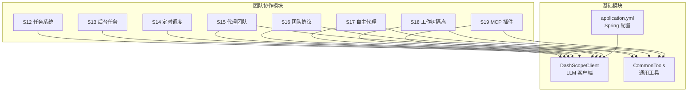

**图表来源**
- [S15AgentTeams.java:39](file://src/main/java/com/learn/harness/agent/S15AgentTeams.java#L39)
- [S16TeamProtocols.java:40](file://src/main/java/com/learn/harness/agent/S16TeamProtocols.java#L40)
- [S17AutonomousAgents.java:35](file://src/main/java/com/learn/harness/agent/S17AutonomousAgents.java#L35)
- [S18WorktreeTaskIsolation.java:37](file://src/main/java/com/learn/harness/agent/S18WorktreeTaskIsolation.java#L37)
- [S19McpPlugin.java:43](file://src/main/java/com/learn/harness/agent/S19McpPlugin.java#L43)
- [DashScopeClient.java:25](file://src/main/java/com/learn/harness/agent/DashScopeClient.java#L25)
- [CommonTools.java:23](file://src/main/java/com/learn/harness/agent/CommonTools.java#L23)

**章节来源**
- [S12TaskSystem.java:1-243](file://src/main/java/com/learn/harness/agent/S12TaskSystem.java#L1-L243)
- [S13BackgroundTasks.java:1-196](file://src/main/java/com/learn/harness/agent/S13BackgroundTasks.java#L1-L196)
- [S14CronScheduler.java:1-259](file://src/main/java/com/learn/harness/agent/S14CronScheduler.java#L1-L259)
- [S15AgentTeams.java:1-330](file://src/main/java/com/learn/harness/agent/S15AgentTeams.java#L1-L330)
- [S16TeamProtocols.java:1-251](file://src/main/java/com/learn/harness/agent/S16TeamProtocols.java#L1-L251)
- [S17AutonomousAgents.java:1-259](file://src/main/java/com/learn/harness/agent/S17AutonomousAgents.java#L1-L259)
- [S18WorktreeTaskIsolation.java:1-527](file://src/main/java/com/learn/harness/agent/S18WorktreeTaskIsolation.java#L1-L527)
- [S19McpPlugin.java:1-449](file://src/main/java/com/learn/harness/agent/S19McpPlugin.java#L1-L449)
- [DashScopeClient.java:1-297](file://src/main/java/com/learn/harness/agent/DashScopeClient.java#L1-L297)
- [CommonTools.java:1-282](file://src/main/java/com/learn/harness/agent/CommonTools.java#L1-L282)

## 核心组件
- 任务系统（S12）：以 JSON 文件形式持久化任务，支持状态变更、依赖关系维护与列表展示；任务状态在上下文压缩后仍可恢复。
- 后台任务（S13）：在独立线程中执行耗时命令，通过阻塞队列将结果回流到对话历史，避免阻塞主循环。
- 定时调度（S14）：使用标准 cron 表达式在未来时间点触发提示词，支持一次性与周期性任务，具备自动过期清理。
- 代理团队（S15）：命名代理与文件型只追加收件箱，每个成员独立运行代理循环并通过收件箱通信。
- 团队协议（S16）：定义停机请求与计划审批的握手协议，使用持久化请求记录与响应回流。
- 自主代理（S17）：代理在空闲阶段轮询收件箱与任务板，自动认领未占用任务，实现低干预的自治协作。
- 工作树隔离（S18）：基于 Git worktree 的并行执行通道，任务与执行空间解耦，通过事件总线追踪状态。
- MCP 插件（S19）：通过 stdio JSON-RPC 接入外部工具，统一权限门控与工具路由，实现"外部工具进入同一工具管道"。

**章节来源**
- [S12TaskSystem.java:18-243](file://src/main/java/com/learn/harness/agent/S12TaskSystem.java#L18-L243)
- [S13BackgroundTasks.java:19-196](file://src/main/java/com/learn/harness/agent/S13BackgroundTasks.java#L19-L196)
- [S14CronScheduler.java:21-259](file://src/main/java/com/learn/harness/agent/S14CronScheduler.java#L21-L259)
- [S15AgentTeams.java:19-330](file://src/main/java/com/learn/harness/agent/S15AgentTeams.java#L19-L330)
- [S16TeamProtocols.java:18-251](file://src/main/java/com/learn/harness/agent/S16TeamProtocols.java#L18-L251)
- [S17AutonomousAgents.java:18-259](file://src/main/java/com/learn/harness/agent/S17AutonomousAgents.java#L18-L259)
- [S18WorktreeTaskIsolation.java:15-527](file://src/main/java/com/learn/harness/agent/S18WorktreeTaskIsolation.java#L15-L527)
- [S19McpPlugin.java:20-449](file://src/main/java/com/learn/harness/agent/S19McpPlugin.java#L20-L449)

## 架构总览
团队协作模块围绕"工具池 + 消息循环 + 外部系统"的模式组织，各模块通过 DashScopeClient 统一调用 LLM，通过工具函数实现文件读写、命令执行、消息投递、任务管理等能力。模块间通过文件系统（任务、收件箱、事件）与进程间通信（MCP）进行解耦协作。

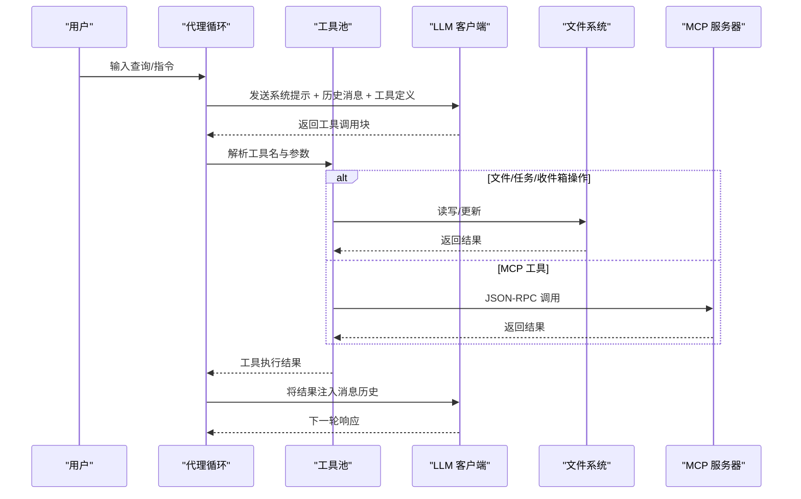

**图表来源**
- [DashScopeClient.java:74-127](file://src/main/java/com/learn/harness/agent/DashScopeClient.java#L74-L127)
- [CommonTools.java:262-280](file://src/main/java/com/learn/harness/agent/CommonTools.java#L262-280)
- [S15AgentTeams.java:259-303](file://src/main/java/com/learn/harness/agent/S15AgentTeams.java#L259-L303)
- [S16TeamProtocols.java:189-229](file://src/main/java/com/learn/harness/agent/S16TeamProtocols.java#L189-L229)
- [S17AutonomousAgents.java:200-237](file://src/main/java/com/learn/harness/agent/S17AutonomousAgents.java#L200-L237)
- [S18WorktreeTaskIsolation.java:465-488](file://src/main/java/com/learn/harness/agent/S18WorktreeTaskIsolation.java#L465-L488)
- [S19McpPlugin.java:338-364](file://src/main/java/com/learn/harness/agent/S19McpPlugin.java#L338-L364)

## 详细组件分析

### 任务系统（S12）
- 设计要点
  - 使用 .tasks/ 目录存储任务 JSON 文件，任务 ID 自增，支持 pending/in_progress/completed/deleted 状态。
  - 支持 blockedBy/blocks 依赖关系，完成任务时自动清理依赖。
  - 提供 task_create/task_update/task_list/task_get 等工具，结合 bash/read_file/write_file/edit_file 实现任务生命周期管理。
- 数据结构与复杂度
  - 任务列表遍历与排序：O(n log n)，其中 n 为任务数量。
  - 依赖清理：对所有任务扫描，最坏 O(n)。
- 错误处理
  - 文件读写异常、路径逃逸检测、危险命令拦截。
- 关键流程（任务创建与状态更新）

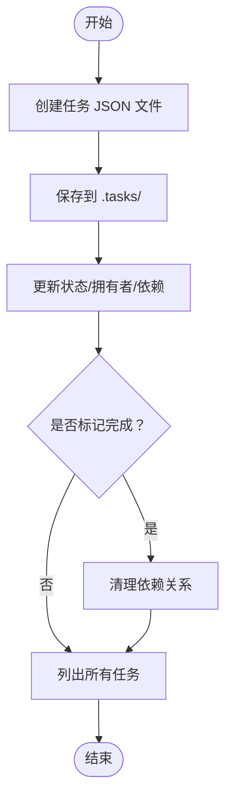

**图表来源**
- [S12TaskSystem.java:54-93](file://src/main/java/com/learn/harness/agent/S12TaskSystem.java#L54-L93)
- [S12TaskSystem.java:95-110](file://src/main/java/com/learn/harness/agent/S12TaskSystem.java#L95-L110)
- [S12TaskSystem.java:112-129](file://src/main/java/com/learn/harness/agent/S12TaskSystem.java#L112-L129)

**章节来源**
- [S12TaskSystem.java:18-243](file://src/main/java/com/learn/harness/agent/S12TaskSystem.java#L18-L243)

### 后台任务（S13）
- 设计要点
  - 使用并发映射与阻塞队列管理后台任务，独立线程执行命令，超时强制终止。
  - 在每次 LLM 循环前将通知注入消息历史，确保模型能感知已完成的任务。
- 关键流程（后台任务执行与回流）

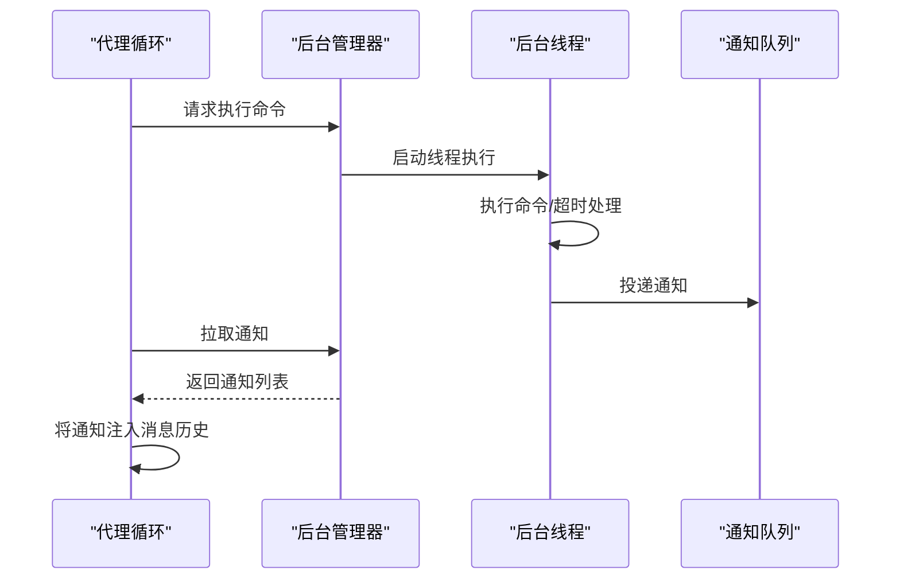

**图表来源**
- [S13BackgroundTasks.java:25-75](file://src/main/java/com/learn/harness/agent/S13BackgroundTasks.java#L25-L75)
- [S13BackgroundTasks.java:133-177](file://src/main/java/com/learn/harness/agent/S13BackgroundTasks.java#L133-L177)

**章节来源**
- [S13BackgroundTasks.java:19-196](file://src/main/java/com/learn/harness/agent/S13BackgroundTasks.java#L19-L196)

### 定时调度（S14）
- 设计要点
  - 基于标准 cron 表达式匹配当前时间，分钟级检查，支持一次性与周期性任务。
  - 任务持久化存储，具备自动过期清理（默认 7 天）。
- 关键流程（任务创建与触发）

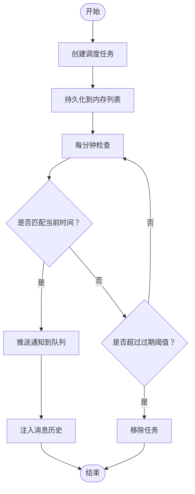

**图表来源**
- [S14CronScheduler.java:56-134](file://src/main/java/com/learn/harness/agent/S14CronScheduler.java#L56-L134)
- [S14CronScheduler.java:193-237](file://src/main/java/com/learn/harness/agent/S14CronScheduler.java#L193-L237)

**章节来源**
- [S14CronScheduler.java:21-259](file://src/main/java/com/learn/harness/agent/S14CronScheduler.java#L21-L259)

### 代理团队（S15）
- 设计要点
  - 每个代理有独立配置与收件箱，通过 append-only JSONL 文件通信。
  - 领导者负责 spawn/list/send/read_inbox/broadcast 等管理工具。
- 关键流程（团队协作循环）

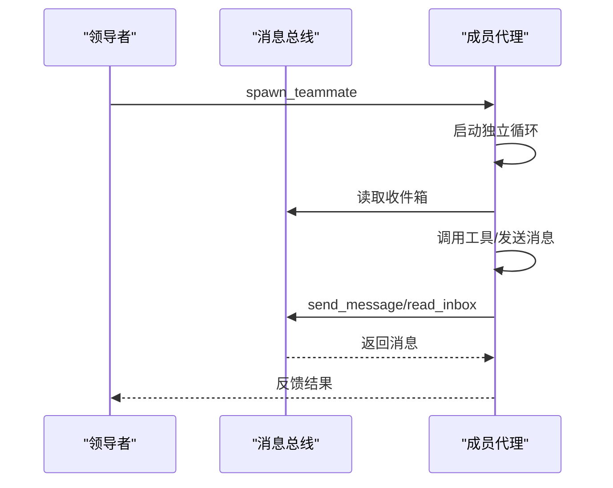

**图表来源**
- [S15AgentTeams.java:63-180](file://src/main/java/com/learn/harness/agent/S15AgentTeams.java#L63-L180)
- [S15AgentTeams.java:259-303](file://src/main/java/com/learn/harness/agent/S15AgentTeams.java#L259-L303)

**章节来源**
- [S15AgentTeams.java:19-330](file://src/main/java/com/learn/harness/agent/S15AgentTeams.java#L19-L330)

### 团队协议（S16）
- 设计要点
  - 定义停机请求与计划审批的握手协议，使用 .team/requests/{id}.json 记录请求状态。
  - 成员代理通过 shutdown_response/plan_approval 工具提交响应，领导者集中审批。
- 关键流程（停机请求与审批）

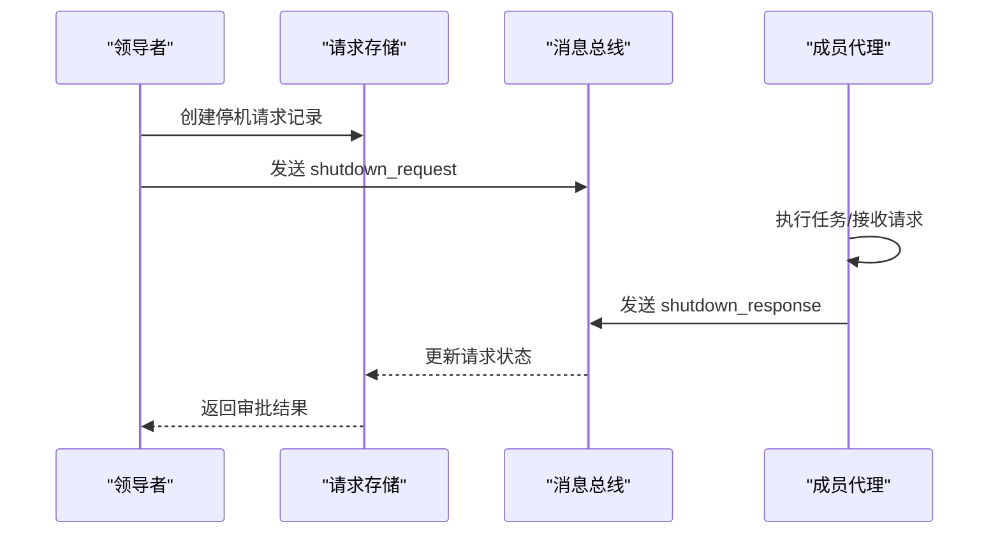

**图表来源**
- [S16TeamProtocols.java:108-138](file://src/main/java/com/learn/harness/agent/S16TeamProtocols.java#L108-L138)
- [S16TeamProtocols.java:210-227](file://src/main/java/com/learn/harness/agent/S16TeamProtocols.java#L210-L227)

**章节来源**
- [S16TeamProtocols.java:18-251](file://src/main/java/com/learn/harness/agent/S16TeamProtocols.java#L18-L251)

### 自主代理（S17）
- 设计要点
  - 代理在工作阶段与空闲阶段之间切换，空闲阶段轮询收件箱与任务板，自动认领未占用任务。
  - 通过身份注入保持上下文连贯，支持手动 idle 信号。
- 关键流程（工作/空闲循环）

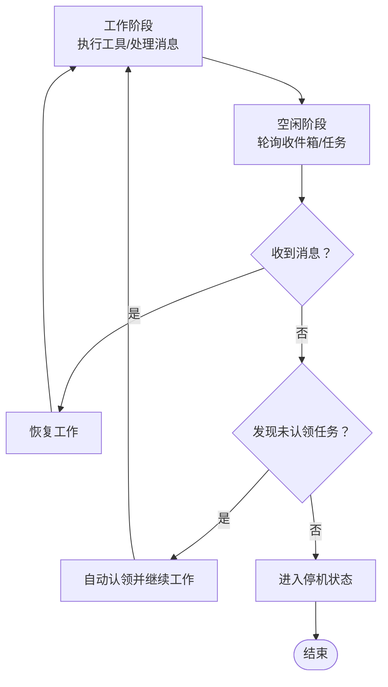

**图表来源**
- [S17AutonomousAgents.java:150-174](file://src/main/java/com/learn/harness/agent/S17AutonomousAgents.java#L150-L174)
- [S17AutonomousAgents.java:200-237](file://src/main/java/com/learn/harness/agent/S17AutonomousAgents.java#L200-L237)

**章节来源**
- [S17AutonomousAgents.java:18-259](file://src/main/java/com/learn/harness/agent/S17AutonomousAgents.java#L18-L259)

### 工作树隔离（S18）
- 设计要点
  - 任务为控制平面，Git worktree 为执行平面，通过绑定任务与工作树实现隔离。
  - 使用事件总线记录工作树生命周期事件，支持状态查询与关闭结算。
- 关键流程（工作树创建与运行）

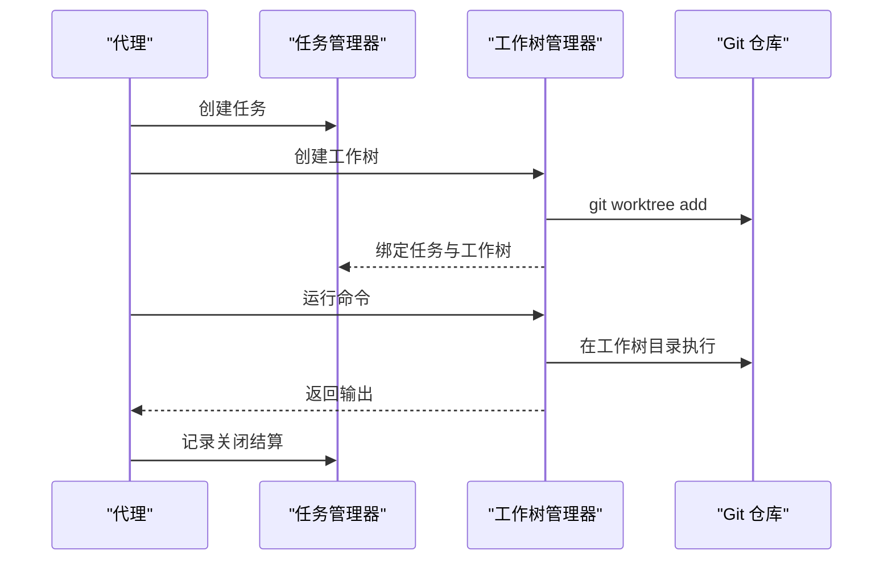

**图表来源**
- [S18WorktreeTaskIsolation.java:262-293](file://src/main/java/com/learn/harness/agent/S18WorktreeTaskIsolation.java#L262-L293)
- [S18WorktreeTaskIsolation.java:465-488](file://src/main/java/com/learn/harness/agent/S18WorktreeTaskIsolation.java#L465-L488)

**章节来源**
- [S18WorktreeTaskIsolation.java:15-527](file://src/main/java/com/learn/harness/agent/S18WorktreeTaskIsolation.java#L15-L527)

### MCP 插件（S19）
- 设计要点
  - 通过 stdio JSON-RPC 与外部 MCP 服务器通信，统一权限门控与工具路由。
  - 工具名称前缀 mcp__{server}__{tool}，权限根据风险级别决定自动放行或用户确认。
- 关键流程（工具调用与权限控制）

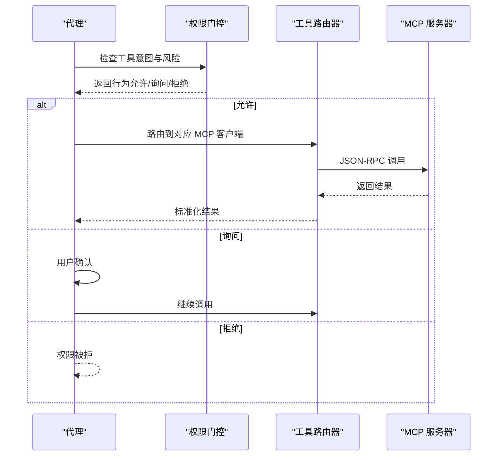

**图表来源**
- [S19McpPlugin.java:53-105](file://src/main/java/com/learn/harness/agent/S19McpPlugin.java#L53-L105)
- [S19McpPlugin.java:168-188](file://src/main/java/com/learn/harness/agent/S19McpPlugin.java#L168-L188)
- [S19McpPlugin.java:338-364](file://src/main/java/com/learn/harness/agent/S19McpPlugin.java#L338-L364)

**章节来源**
- [S19McpPlugin.java:20-449](file://src/main/java/com/learn/harness/agent/S19McpPlugin.java#L20-L449)

## 依赖关系分析
- 内部依赖
  - 所有 S12–S19 模块均依赖 DashScopeClient 进行 LLM 调用。
  - S15/S16/S17 依赖文件系统中的 .team 目录进行团队配置与消息传递。
  - S18 依赖 Git 工具链与 .tasks/.worktrees 目录。
  - S19 依赖外部 MCP 服务器与插件清单。
  - 所有模块共享 CommonTools 提供的基础工具函数。
- 外部依赖
  - Gson 用于 JSON 序列化与解析。
  - Spring AI 配置（application.yml）提供 DashScope 的 API Key 与模型选择。

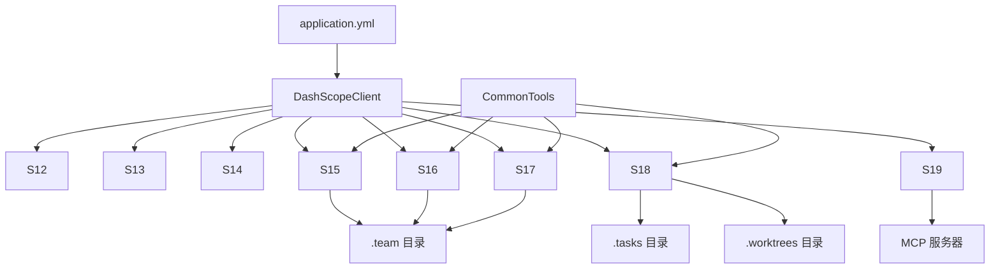

**图表来源**
- [DashScopeClient.java:25](file://src/main/java/com/learn/harness/agent/DashScopeClient.java#L25)
- [CommonTools.java:23](file://src/main/java/com/learn/harness/agent/CommonTools.java#L23)
- [S15AgentTeams.java:42](file://src/main/java/com/learn/harness/agent/S15AgentTeams.java#L42)
- [S16TeamProtocols.java:41](file://src/main/java/com/learn/harness/agent/S16TeamProtocols.java#L41)
- [S17AutonomousAgents.java:36](file://src/main/java/com/learn/harness/agent/S17AutonomousAgents.java#L36)
- [S18WorktreeTaskIsolation.java:38](file://src/main/java/com/learn/harness/agent/S18WorktreeTaskIsolation.java#L38)
- [S19McpPlugin.java:43](file://src/main/java/com/learn/harness/agent/S19McpPlugin.java#L43)
- [application.yml:8-13](file://src/main/resources/application.yml#L8-L13)

**章节来源**
- [DashScopeClient.java:1-297](file://src/main/java/com/learn/harness/agent/DashScopeClient.java#L1-L297)
- [CommonTools.java:1-282](file://src/main/java/com/learn/harness/agent/CommonTools.java#L1-L282)
- [application.yml:1-13](file://src/main/resources/application.yml#L1-L13)

## 性能考虑
- I/O 与并发
  - 后台任务使用独立线程与超时控制，避免阻塞主循环。
  - 定时调度每分钟检查一次，减少 CPU 占用。
  - 自主代理空闲轮询间隔可调，平衡响应速度与资源消耗。
- 存储与索引
  - 任务与工作树索引采用 JSON 文件，建议定期清理过期任务与工作树，避免目录膨胀。
  - 事件日志采用 JSONL 追加写入，注意磁盘空间监控。
- LLM 调用
  - 控制工具数量与消息长度，避免超出 token 上限。
  - 合理设置 max_tokens，平衡响应质量与成本。
- MCP 工具
  - 外部工具调用可能较慢，建议在权限门控中启用自动放行低风险工具，减少用户交互。

## 故障排除指南
- LLM API 错误
  - 检查 DASHSCOPE_API_KEY 环境变量是否正确设置。
  - 查看 DashScopeClient 的错误信息与 HTTP 状态码。
- 文件系统问题
  - 路径逃逸保护：确保文件操作路径在工作目录内。
  - 权限不足：检查 .tasks/.team/.worktrees 目录的读写权限。
- Git 相关错误（S18）
  - 不在 Git 仓库：S18 会检测并提示，需在有效仓库中运行。
  - 工作树创建失败：检查分支名与路径合法性，确认 git 工具可用。
- MCP 插件连接失败
  - 检查插件清单与 MCP 服务器命令、参数、环境变量。
  - 确认 JSON-RPC 协议版本与初始化流程。
- 定时任务未触发
  - 检查 cron 表达式格式与时区设置。
  - 确认调度器线程仍在运行且分钟级检查正常。
- 团队协议未生效
  - 检查请求记录是否存在，消息类型是否合法。
  - 确保成员代理已正确接收并响应请求。

**章节来源**
- [DashScopeClient.java:50-60](file://src/main/java/com/learn/harness/agent/DashScopeClient.java#L50-L60)
- [S18WorktreeTaskIsolation.java:50-62](file://src/main/java/com/learn/harness/agent/S18WorktreeTaskIsolation.java#L50-L62)
- [S19McpPlugin.java:125-154](file://src/main/java/com/learn/harness/agent/S19McpPlugin.java#L125-L154)
- [S14CronScheduler.java:62-75](file://src/main/java/com/learn/harness/agent/S14CronScheduler.java#L62-75)
- [S16TeamProtocols.java:108-138](file://src/main/java/com/learn/harness/agent/S16TeamProtocols.java#L108-L138)

## 结论
团队协作模块通过"工具池 + 消息循环 + 文件系统/进程间通信"的架构，实现了从任务管理、后台执行、定时调度到多代理协作、协议治理、工作树隔离与 MCP 插件接入的完整闭环。模块间松耦合、职责清晰，既适合单人开发场景，也能支撑多代理协同的复杂任务编排。建议在生产环境中结合权限门控、资源监控与日志审计，持续优化工具数量与调用频率，提升整体稳定性与效率。

## 附录

### 配置方法
- 环境变量
  - DASHSCOPE_API_KEY：API 密钥（必需）
  - DASHSCOPE_MODEL：模型标识（可选，默认 qwen-plus）
- Spring 配置
  - application.yml 中可配置 DashScope 的 API Key 与模型选项，便于替换不同推理后端。

**章节来源**
- [BUILD.md:22-28](file://src/main/java/com/learn/harness/agent/BUILD.md#L22-L28)
- [application.yml:8-13](file://src/main/resources/application.yml#L8-L13)

### 部署方案
- 单机部署
  - 使用 Java 19+ 运行 Sxx 模块，确保工作目录具有读写权限。
  - 对于 S18，确保 Git 工具可用且在有效仓库中运行。
- 多实例部署
  - 通过不同的工作目录隔离任务与收件箱，避免文件冲突。
  - 使用容器化部署时，挂载持久卷以保留 .tasks/.team/.worktrees。
- MCP 插件
  - 在启动前扫描插件清单并建立 MCP 连接，确保外部工具可用性。

### 性能优化建议
- 减少不必要的工具数量，降低 LLM 负担。
- 合理设置后台任务超时与通知频率，避免频繁回流。
- 对定时任务进行分批与去重，避免高峰时段集中触发。
- 使用事件日志与指标监控，及时发现异常与瓶颈。

### 实际场景示例
- 多代理协作
  - 场景：代码审查团队由 lead 与多个审阅员组成，通过收件箱分发任务，协议保障停机与计划审批。
  - 流程：lead 创建任务 → 分配给审阅员 → 审阅员完成 → 协议审批 → 结算与归档。
- 工作树隔离
  - 场景：并行修复多个安全漏洞，每个漏洞分配独立工作树，互不干扰。
  - 流程：创建任务 → 创建工作树 → 在工作树中修复 → 关闭结算 → 合并或保留。
- MCP 插件
  - 场景：集成外部数据库查询与文件系统扫描工具，统一权限控制。
  - 流程：加载插件 → 连接 MCP 服务器 → 权限门控 → 工具调用 → 结果标准化。