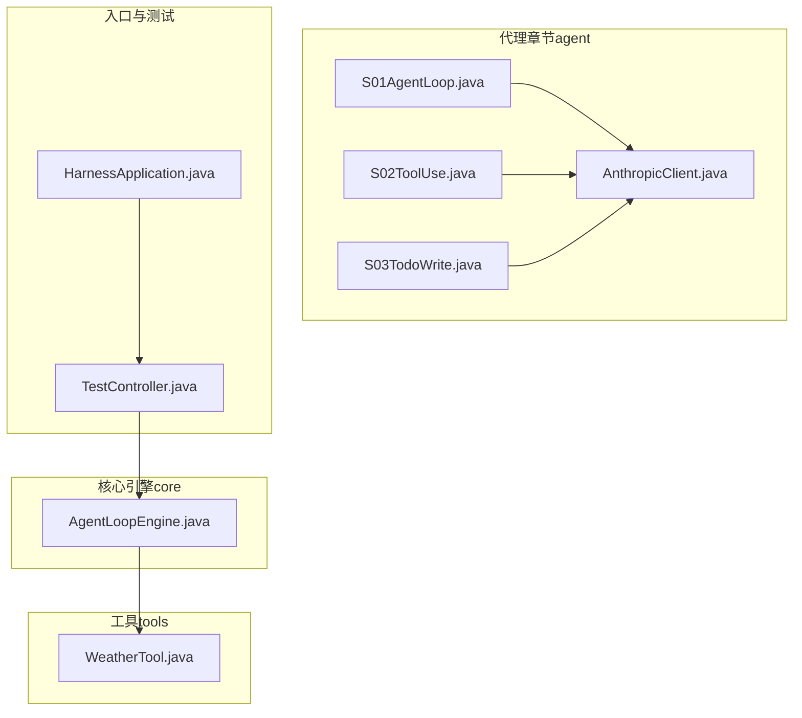
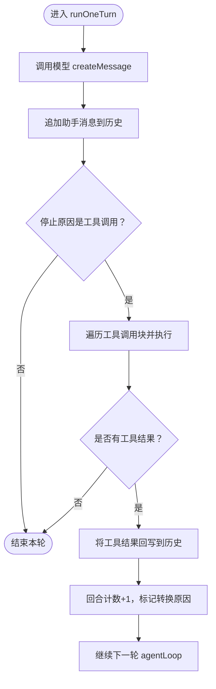
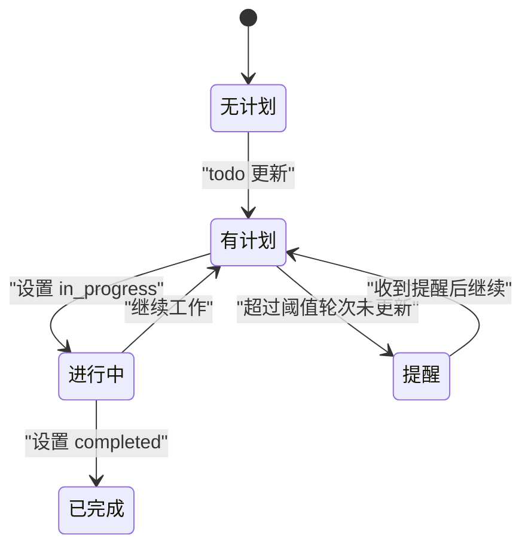
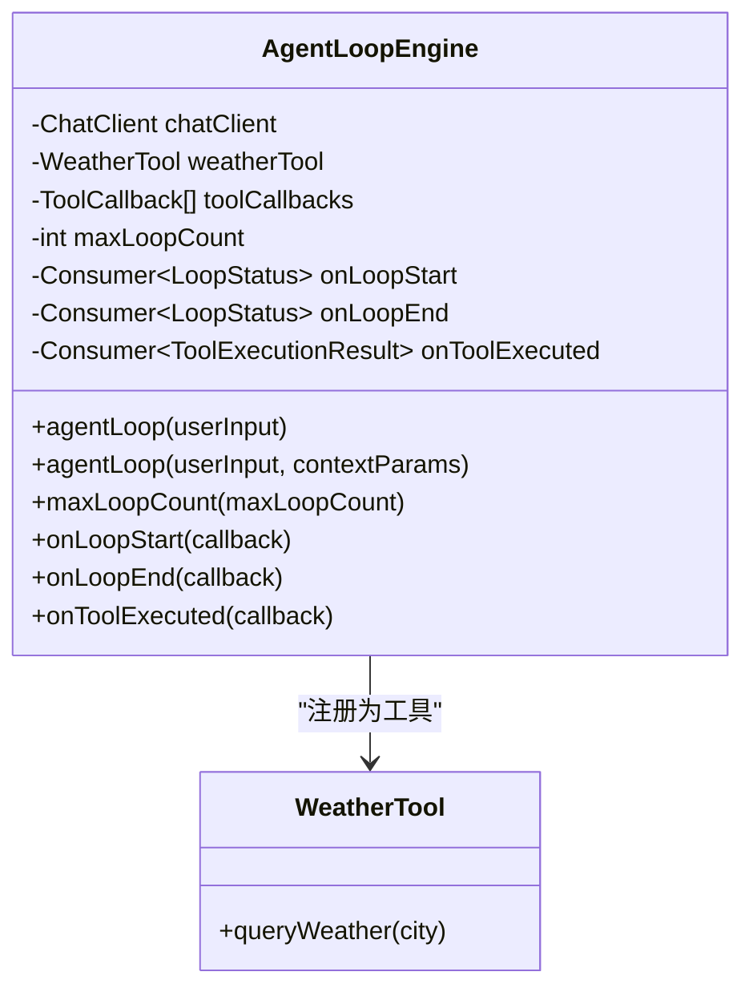
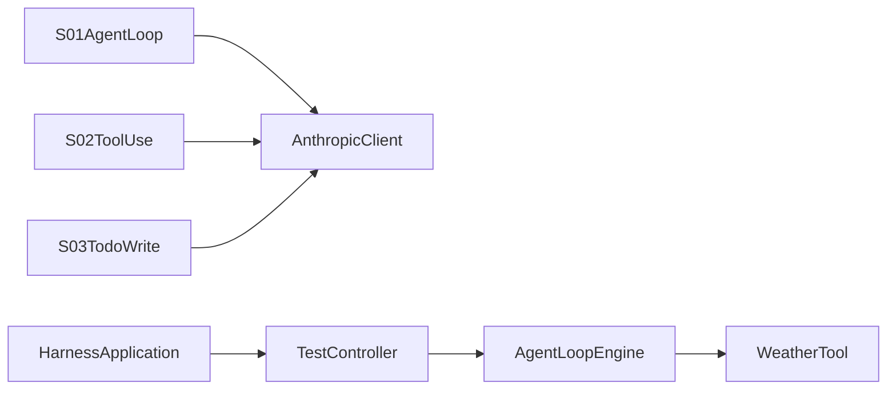

# 基础代理模块

<cite>
**本文引用的文件**
- [S01AgentLoop.java](file://src/main/java/com/learn/harness/agent/S01AgentLoop.java)
- [S02ToolUse.java](file://src/main/java/com/learn/harness/agent/S02ToolUse.java)
- [S03TodoWrite.java](file://src/main/java/com/learn/harness/agent/S03TodoWrite.java)
- [AnthropicClient.java](file://src/main/java/com/learn/harness/agent/AnthropicClient.java)
- [AgentLoopEngine.java](file://src/main/java/com/learn/harness/core/AgentLoopEngine.java)
- [WeatherTool.java](file://src/main/java/com/learn/harness/tools/WeatherTool.java)
- [TestController.java](file://src/main/java/com/learn/harness/TestController.java)
- [HarnessApplication.java](file://src/main/java/com/learn/harness/HarnessApplication.java)
- [BUILD.md](file://src/main/java/com/learn/harness/agent/BUILD.md)
- [pom.xml](file://pom.xml)
- [README.md](file://README.md)
</cite>

## 目录
1. [简介](#简介)
2. [项目结构](#项目结构)
3. [核心组件](#核心组件)
4. [架构总览](#架构总览)
5. [详细组件分析](#详细组件分析)
6. [依赖关系分析](#依赖关系分析)
7. [性能考虑](#性能考虑)
8. [故障排查指南](#故障排查指南)
9. [结论](#结论)
10. [附录](#附录)

## 简介
本文件面向初学者与进阶开发者，系统性讲解基础代理模块的设计与实现，重点覆盖以下三个最小可用代理章节：
- S01AgentLoop：最小代理循环模式，演示“用户消息 -> 模型回复 -> 工具调用 -> 回写工具结果 -> 继续”的消息循环。
- S02ToolUse：在 S01 基础上引入工具分发与消息规范化，展示“工具注册 + 分发 + 执行”的标准流程。
- S03TodoWrite：在 S02 基础上引入“待办事项计划”能力，支持多步任务的轻量规划与进度跟踪。

同时，文档还介绍基于 Spring AI 的现代 Agent 循环引擎 AgentLoopEngine，以及如何从基础模块逐步扩展到更复杂的代理系统。

## 项目结构
该项目采用按功能分层的组织方式：
- agent：基础代理章节（S01–S19），每个章节一个独立类，便于循序渐进学习。
- core：核心引擎与服务，如 AgentLoopEngine。
- tools：工具定义与实现，如 WeatherTool。
- config：配置类（如 SpringAIConfig）。
- resources：静态资源与应用配置文件。
- 测试与入口：HarnessApplication、TestController。

图表来源
- [S01AgentLoop.java:1-177](file://src/main/java/com/learn/harness/agent/S01AgentLoop.java#L1-L177)
- [S02ToolUse.java:1-152](file://src/main/java/com/learn/harness/agent/S02ToolUse.java#L1-L152)
- [S03TodoWrite.java:1-227](file://src/main/java/com/learn/harness/agent/S03TodoWrite.java#L1-L227)
- [AnthropicClient.java:1-127](file://src/main/java/com/learn/harness/agent/AnthropicClient.java#L1-L127)
- [AgentLoopEngine.java:1-353](file://src/main/java/com/learn/harness/core/AgentLoopEngine.java#L1-L353)
- [WeatherTool.java:1-66](file://src/main/java/com/learn/harness/tools/WeatherTool.java#L1-L66)
- [HarnessApplication.java:1-14](file://src/main/java/com/learn/harness/HarnessApplication.java#L1-L14)
- [TestController.java:1-45](file://src/main/java/com/learn/harness/TestController.java#L1-L45)

章节来源
- [pom.xml:1-89](file://pom.xml#L1-L89)
- [README.md:1-3](file://README.md#L1-L3)

## 核心组件
- S01AgentLoop：最小代理循环，负责单轮对话与工具调用的执行与回写。
- S02ToolUse：在 S01 基础上增加工具注册表与消息规范化，统一工具分发。
- S03TodoWrite：在 S02 基础上增加“待办事项计划”状态机，支持多步任务的规划与提醒。
- AnthropicClient：统一的 Anthropic Messages API 客户端，封装请求与响应解析。
- AgentLoopEngine：基于 Spring AI 的现代化 Agent 循环引擎，支持工具回调、循环控制与状态回调。
- WeatherTool：示例工具，演示如何通过注解声明工具并被 Agent 调用。
- TestController：提供 HTTP 接口用于测试 Agent 循环与工具调用。
- HarnessApplication：Spring Boot 应用入口。

章节来源
- [S01AgentLoop.java:1-177](file://src/main/java/com/learn/harness/agent/S01AgentLoop.java#L1-L177)
- [S02ToolUse.java:1-152](file://src/main/java/com/learn/harness/agent/S02ToolUse.java#L1-L152)
- [S03TodoWrite.java:1-227](file://src/main/java/com/learn/harness/agent/S03TodoWrite.java#L1-L227)
- [AnthropicClient.java:1-127](file://src/main/java/com/learn/harness/agent/AnthropicClient.java#L1-L127)
- [AgentLoopEngine.java:1-353](file://src/main/java/com/learn/harness/core/AgentLoopEngine.java#L1-L353)
- [WeatherTool.java:1-66](file://src/main/java/com/learn/harness/tools/WeatherTool.java#L1-L66)
- [TestController.java:1-45](file://src/main/java/com/learn/harness/TestController.java#L1-L45)
- [HarnessApplication.java:1-14](file://src/main/java/com/learn/harness/HarnessApplication.java#L1-L14)

## 架构总览
下面以序列图展示最小代理循环的典型调用链路，从用户输入到工具执行与结果回写。

图表来源
- [S01AgentLoop.java:99-131](file://src/main/java/com/learn/harness/agent/S01AgentLoop.java#L99-L131)
- [AnthropicClient.java:51-88](file://src/main/java/com/learn/harness/agent/AnthropicClient.java#L51-L88)

## 详细组件分析

### S01AgentLoop：最小代理循环
设计理念
- 保持循环极简但状态显式，便于后续章节在此基础上扩展。
- 明确“用户消息 -> 模型回复 -> 工具调用 -> 回写工具结果 -> 继续”的闭环。
- 内置 bash 工具，提供安全检查与超时控制。

关键机制
- LoopState：维护消息历史、回合计数与转换原因。
- runOneTurn：单轮执行，处理模型响应与工具调用。
- agentLoop：持续执行直到模型不再请求工具调用。
- main：REPL 主循环，支持退出指令与最终文本提取。

图表来源
- [S01AgentLoop.java:99-131](file://src/main/java/com/learn/harness/agent/S01AgentLoop.java#L99-L131)

章节来源
- [S01AgentLoop.java:1-177](file://src/main/java/com/learn/harness/agent/S01AgentLoop.java#L1-L177)

### S02ToolUse：工具分发与消息规范化
设计理念
- “循环本身不改变”，仅新增工具注册与消息规范化。
- 通过工具分发表统一调度，提升可扩展性。
- 保留与 S01 相同的循环结构，降低迁移成本。

关键机制
- TOOL_HANDLERS：将工具名映射到具体实现函数。
- TOOLS：工具定义列表，包含名称、描述与输入模式。
- normalizeMessages：消息规范化（教学版本直接透传）。
- agentLoop：统一处理工具调用与结果回写。

图表来源
- [S02ToolUse.java:87-137](file://src/main/java/com/learn/harness/agent/S02ToolUse.java#L87-L137)
- [AnthropicClient.java:51-121](file://src/main/java/com/learn/harness/agent/AnthropicClient.java#L51-L121)

章节来源
- [S02ToolUse.java:1-152](file://src/main/java/com/learn/harness/agent/S02ToolUse.java#L1-L152)

### S03TodoWrite：会话计划与待办事项
设计理念
- 轻量会话计划，非持久化任务图，强调“当前计划可被模型重写”。
- 严格的状态约束：最多一个“进行中”步骤；计划项数量上限；内容必填。
- 周期性提醒：若超过阈值轮次未更新计划，模型会被提示刷新计划。

关键机制
- PlanItem/PlanningState/TodoManager：维护计划项、状态与渲染逻辑。
- dispatchTool：工具分发器，新增 todo 工具用于更新计划。
- agentLoop：根据是否使用 todo 工具决定是否重置提醒计数，并在必要时插入提醒文本块。

图表来源
- [S03TodoWrite.java:28-99](file://src/main/java/com/learn/harness/agent/S03TodoWrite.java#L28-L99)
- [S03TodoWrite.java:177-212](file://src/main/java/com/learn/harness/agent/S03TodoWrite.java#L177-L212)

章节来源
- [S03TodoWrite.java:1-227](file://src/main/java/com/learn/harness/agent/S03TodoWrite.java#L1-L227)

### AnthropicClient：统一 API 客户端
职责
- 封装 Anthropic Messages API 请求与响应解析。
- 提供工具调用块提取、文本提取与停止原因判断等辅助方法。

章节来源
- [AnthropicClient.java:1-127](file://src/main/java/com/learn/harness/agent/AnthropicClient.java#L1-L127)

### AgentLoopEngine：现代化 Agent 循环引擎
职责
- 管理消息历史、工具回调、循环次数限制与状态回调。
- 通过 Spring AI 的 ChatClient 与 ToolCallbacks 实现工具自动发现与执行。
- 提供丰富的配置方法：最大循环次数、循环开始/结束回调、工具执行回调。

图表来源
- [AgentLoopEngine.java:34-353](file://src/main/java/com/learn/harness/core/AgentLoopEngine.java#L34-L353)
- [WeatherTool.java:17-66](file://src/main/java/com/learn/harness/tools/WeatherTool.java#L17-L66)

章节来源
- [AgentLoopEngine.java:1-353](file://src/main/java/com/learn/harness/core/AgentLoopEngine.java#L1-L353)

### TestController：HTTP 测试接口
职责
- 提供 /test/chat 与 /test/weather/agent 接口，便于快速验证 Agent 循环与工具调用。

章节来源
- [TestController.java:1-45](file://src/main/java/com/learn/harness/TestController.java#L1-L45)

## 依赖关系分析
- S01/S02/S03 依赖 AnthropicClient 进行模型调用。
- AgentLoopEngine 依赖 Spring AI 的 ChatClient 与 ToolCallbacks，自动注册 WeatherTool。
- TestController 注入 AgentLoopEngine，暴露 HTTP 接口。
- HarnessApplication 启动 Spring Boot 应用。

图表来源
- [S01AgentLoop.java:25](file://src/main/java/com/learn/harness/agent/S01AgentLoop.java#L25)
- [S02ToolUse.java:21](file://src/main/java/com/learn/harness/agent/S02ToolUse.java#L21)
- [S03TodoWrite.java:19](file://src/main/java/com/learn/harness/agent/S03TodoWrite.java#L19)
- [TestController.java:15-16](file://src/main/java/com/learn/harness/TestController.java#L15-L16)
- [AgentLoopEngine.java:44-48](file://src/main/java/com/learn/harness/core/AgentLoopEngine.java#L44-L48)
- [HarnessApplication.java:9-11](file://src/main/java/com/learn/harness/HarnessApplication.java#L9-L11)

章节来源
- [pom.xml:28-41](file://pom.xml#L28-L41)

## 性能考虑
- 超时与安全：S01/S02/S03 在工具执行处设置了超时与危险命令拦截，避免阻塞与误操作。
- 输出截断：对长输出进行长度限制，防止内存与网络压力过大。
- 循环上限：AgentLoopEngine 提供最大循环次数配置，防止无限循环导致资源耗尽。
- 工具并发：当前实现逐个执行工具调用，如需高吞吐可考虑异步执行与结果聚合。

## 故障排查指南
常见问题与定位建议
- API 调用失败：检查环境变量 MODEL_ID、ANTHROPIC_API_KEY 是否正确设置。
- 工具执行异常：查看工具实现中的异常日志与返回信息。
- 循环卡死：确认是否超过最大循环次数或工具返回格式不符合预期。
- 路径逃逸：S02/S03 的安全路径检查会抛出异常，确保传入路径位于工作目录内。

章节来源
- [AnthropicClient.java:28-40](file://src/main/java/com/learn/harness/agent/AnthropicClient.java#L28-L40)
- [S02ToolUse.java:26-33](file://src/main/java/com/learn/harness/agent/S02ToolUse.java#L26-L33)
- [S03TodoWrite.java:104-108](file://src/main/java/com/learn/harness/agent/S03TodoWrite.java#L104-L108)
- [AgentLoopEngine.java:121-126](file://src/main/java/com/learn/harness/core/AgentLoopEngine.java#L121-L126)

## 结论
S01/S02/S03 三章构成了“最小可用代理”的完整闭环：从最简循环到工具分发，再到计划与提醒。在此基础上，结合 Spring AI 的 AgentLoopEngine，可以快速扩展到更复杂的代理系统，包括权限控制、钩子系统、记忆与上下文压缩、团队协作等高级特性。

## 附录

### 从基础模块构建复杂代理系统的演进路径
- S01：理解最小循环与工具调用的基本范式。
- S02：引入工具注册与消息规范化，形成稳定的工具分发框架。
- S03：加入计划与提醒，支持多步任务的轻量管理。
- S04–S19：逐步引入子代理、技能加载、上下文压缩、权限系统、钩子系统、记忆系统、系统提示、错误恢复、任务系统、后台任务、定时调度、团队协议与自治代理等。

### 命令行交互示例与配置
- 环境变量
  - MODEL_ID：模型标识（必填）
  - ANTHROPIC_API_KEY：API 密钥（必填）
  - ANTHROPIC_BASE_URL：可选，自定义 API 基础地址
- 单文件编译与运行（参考章节）
  - 参考 [BUILD.md:9-28](file://src/main/java/com/learn/harness/agent/BUILD.md#L9-L28)
- REPL 使用
  - S01/S02/S03 提供交互式命令行，输入 q 或 exit 退出。

章节来源
- [BUILD.md:9-28](file://src/main/java/com/learn/harness/agent/BUILD.md#L9-L28)
- [S01AgentLoop.java:134-157](file://src/main/java/com/learn/harness/agent/S01AgentLoop.java#L134-L157)
- [S02ToolUse.java:139-150](file://src/main/java/com/learn/harness/agent/S02ToolUse.java#L139-L150)
- [S03TodoWrite.java:214-225](file://src/main/java/com/learn/harness/agent/S03TodoWrite.java#L214-L225)

### HTTP 接口示例
- GET /test/chat?userInput=...
- GET /test/weather/agent?query=...

章节来源
- [TestController.java:24-43](file://src/main/java/com/learn/harness/TestController.java#L24-L43)