# 高级代理模块

<cite>
**本文引用的文件**
- [S02ToolUse.java](file://src/main/java/com/learn/harness/agent/S02ToolUse.java)
- [S03TodoWrite.java](file://src/main/java/com/learn/harness/agent/S03TodoWrite.java)
- [S04Subagent.java](file://src/main/java/com/learn/harness/agent/S04Subagent.java)
- [S05SkillLoading.java](file://src/main/java/com/learn/harness/agent/S05SkillLoading.java)
- [S06ContextCompact.java](file://src/main/java/com/learn/harness/agent/S06ContextCompact.java)
- [S08HookSystem.java](file://src/main/java/com/learn/harness/agent/S08HookSystem.java)
- [S09MemorySystem.java](file://src/main/java/com/learn/harness/agent/S09MemorySystem.java)
- [S10SystemPrompt.java](file://src/main/java/com/learn/harness/agent/S10SystemPrompt.java)
- [S11ErrorRecovery.java](file://src/main/java/com/learn/harness/agent/S11ErrorRecovery.java)
- [S12TaskSystem.java](file://src/main/java/com/learn/harness/agent/S12TaskSystem.java)
- [S13BackgroundTasks.java](file://src/main/java/com/learn/harness/agent/S13BackgroundTasks.java)
- [S14CronScheduler.java](file://src/main/java/com/learn/harness/agent/S14CronScheduler.java)
- [S15AgentTeams.java](file://src/main/java/com/learn/harness/agent/S15AgentTeams.java)
- [S17AutonomousAgents.java](file://src/main/java/com/learn/harness/agent/S17AutonomousAgents.java)
- [S18WorktreeTaskIsolation.java](file://src/main/java/com/learn/harness/agent/S18WorktreeTaskIsolation.java)
- [S19McpPlugin.java](file://src/main/java/com/learn/harness/agent/S19McpPlugin.java)
- [SFull.java](file://src/main/java/com/learn/harness/agent/SFull.java)
- [CommonTools.java](file://src/main/java/com/learn/harness/agent/CommonTools.java)
- [DashScopeClient.java](file://src/main/java/com/learn/harness/agent/DashScopeClient.java)
- [application.yml](file://src/main/resources/application.yml)
</cite>

## 目录
1. [引言](#引言)
2. [项目结构](#项目结构)
3. [核心组件](#核心组件)
4. [架构总览](#架构总览)
5. [详细组件分析](#详细组件分析)
6. [依赖分析](#依赖分析)
7. [性能考虑](#性能考虑)
8. [故障排查指南](#故障排查指南)
9. [结论](#结论)
10. [附录](#附录)

## 引言
本文件面向"高级代理模块"的使用者与开发者，系统性梳理 S02 至 S19 的十八项关键能力：工具使用、计划管理、子代理系统、技能加载、上下文压缩、权限系统、钩子系统、记忆系统、系统提示构建、错误恢复、任务系统、后台任务、定时调度、Agent 团队、自治 Agent、Git Worktree 任务隔离、MCP 外部工具插件与完整集成。文档从概念到实现逐层展开，给出模块职责、数据流、处理逻辑、配置方法、使用场景、集成方式、协同机制与最佳实践，帮助读者在真实工程中正确选择与组合这些高级功能。

## 项目结构
该仓库以"章节化教学"方式组织，每个 Sxx 文件代表一个独立的可运行示例，共同围绕"代理循环 + 工具调用 + LLM 消息接口"的统一范式构建。DashScopeClient 提供统一的 HTTP 客户端封装，CommonTools 提供公共工具方法，S02–S19 在此基础上叠加高级特性。

```mermaid
graph TB
subgraph "基础工具与客户端"
A[CommonTools]
B[DashScopeClient]
end
subgraph "工具使用层"
C[S02ToolUse]
D[S03TodoWrite]
end
subgraph "高级功能层"
E[S04Subagent]
F[S05SkillLoading]
G[S06ContextCompact]
H[S08HookSystem]
I[S09MemorySystem]
J[S10SystemPrompt]
K[S11ErrorRecovery]
L[S12TaskSystem]
M[S13BackgroundTasks]
N[S14CronScheduler]
O[S15AgentTeams]
P[S17AutonomousAgents]
Q[S18WorktreeTaskIsolation]
R[S19McpPlugin]
S[SFull]
end
A --> C
A --> D
A --> E
A --> F
A --> G
A --> H
A --> I
A --> J
A --> K
A --> L
A --> M
A --> N
A --> O
A --> P
A --> Q
A --> R
B --> C
B --> D
B --> E
B --> F
B --> G
B --> H
B --> I
B --> J
B --> K
B --> L
B --> M
B --> N
B --> O
B --> P
B --> Q
B --> R
B --> S
```

**图示来源**
- [CommonTools.java:23-282](file://src/main/java/com/learn/harness/agent/CommonTools.java#L23-L282)
- [DashScopeClient.java:25-297](file://src/main/java/com/learn/harness/agent/DashScopeClient.java#L25-L297)
- [S02ToolUse.java:28-190](file://src/main/java/com/learn/harness/agent/S02ToolUse.java#L28-L190)
- [S03TodoWrite.java:31-293](file://src/main/java/com/learn/harness/agent/S03TodoWrite.java#L31-L293)
- [S04Subagent.java:17-164](file://src/main/java/com/learn/harness/agent/S04Subagent.java#L17-L164)
- [S05SkillLoading.java:17-144](file://src/main/java/com/learn/harness/agent/S05SkillLoading.java#L17-L144)
- [S06ContextCompact.java:18-135](file://src/main/java/com/learn/harness/agent/S06ContextCompact.java#L18-L135)
- [S08HookSystem.java:20-139](file://src/main/java/com/learn/harness/agent/S08HookSystem.java#L20-L139)
- [S09MemorySystem.java:21-295](file://src/main/java/com/learn/harness/agent/S09MemorySystem.java#L21-L295)
- [S10SystemPrompt.java:20-289](file://src/main/java/com/learn/harness/agent/S10SystemPrompt.java#L20-L289)
- [S11ErrorRecovery.java:20-239](file://src/main/java/com/learn/harness/agent/S11ErrorRecovery.java#L20-L239)
- [S12TaskSystem.java:34-285](file://src/main/java/com/learn/harness/agent/S12TaskSystem.java#L34-L285)
- [S13BackgroundTasks.java:32-221](file://src/main/java/com/learn/harness/agent/S13BackgroundTasks.java#L32-L221)
- [S14CronScheduler.java:34-290](file://src/main/java/com/learn/harness/agent/S14CronScheduler.java#L34-L290)
- [S15AgentTeams.java:35-330](file://src/main/java/com/learn/harness/agent/S15AgentTeams.java#L35-L330)
- [S17AutonomousAgents.java:31-259](file://src/main/java/com/learn/harness/agent/S17AutonomousAgents.java#L31-L259)
- [S18WorktreeTaskIsolation.java:33-527](file://src/main/java/com/learn/harness/agent/S18WorktreeTaskIsolation.java#L33-L527)
- [S19McpPlugin.java:39-449](file://src/main/java/com/learn/harness/agent/S19McpPlugin.java#L39-L449)
- [SFull.java:43-825](file://src/main/java/com/learn/harness/agent/SFull.java#L43-L825)

## 核心组件
- 统一消息客户端：DashScopeClient 封装模型请求、响应解析、工具块提取与文本抽取，所有高级模块共享。
- 公共工具库：CommonTools 提供安全路径检查、命令执行、文件读写、编辑等基础工具，所有模块复用。
- 基础循环与工具：S02–S03 定义最小可用代理循环与工具分发模式，S04–S19 在其上扩展高级能力。
- 配置与环境：通过环境变量 DASHSCOPE_API_KEY、DASHSCOPE_MODEL 等驱动模型调用；Spring 配置用于其他 AI 服务。

**章节来源**
- [DashScopeClient.java:25-297](file://src/main/java/com/learn/harness/agent/DashScopeClient.java#L25-L297)
- [CommonTools.java:23-282](file://src/main/java/com/learn/harness/agent/CommonTools.java#L23-L282)
- [S02ToolUse.java:28-190](file://src/main/java/com/learn/harness/agent/S02ToolUse.java#L28-L190)
- [S03TodoWrite.java:31-293](file://src/main/java/com/learn/harness/agent/S03TodoWrite.java#L31-L293)
- [application.yml:1-13](file://src/main/resources/application.yml#L1-L13)

## 架构总览
下图展示 S02–S19 各模块在代理循环中的协作位置与交互边界。它们均通过 DashScopeClient 发起请求，按需注入系统提示、工具集或执行前置/后置钩子，最终将工具结果回写消息历史，驱动下一步推理与工具调用。

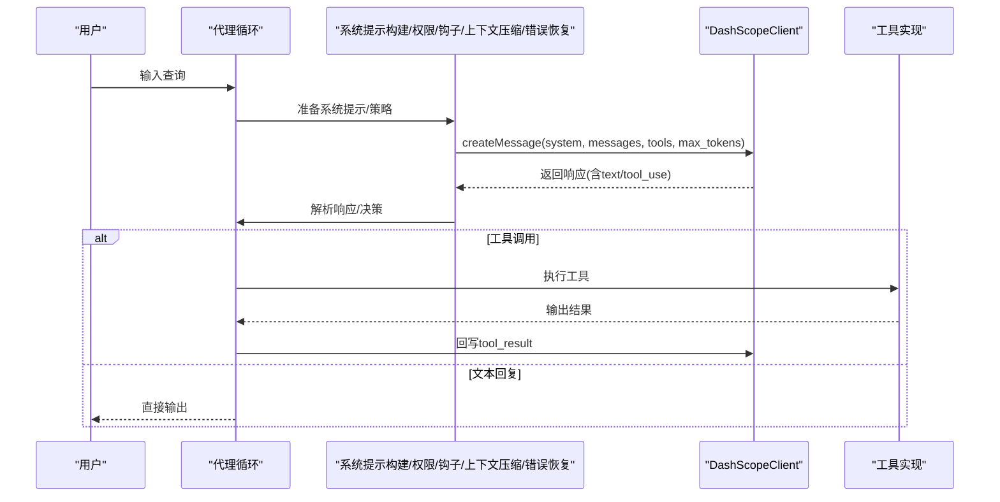

**图示来源**
- [DashScopeClient.java:74-127](file://src/main/java/com/learn/harness/agent/DashScopeClient.java#L74-L127)
- [S04Subagent.java:84-149](file://src/main/java/com/learn/harness/agent/S04Subagent.java#L84-L149)
- [S05SkillLoading.java:114-129](file://src/main/java/com/learn/harness/agent/S05SkillLoading.java#L114-L129)
- [S06ContextCompact.java:84-119](file://src/main/java/com/learn/harness/agent/S06ContextCompact.java#L84-L119)
- [S08HookSystem.java:98-122](file://src/main/java/com/learn/harness/agent/S08HookSystem.java#L98-L122)
- [S09MemorySystem.java:212-248](file://src/main/java/com/learn/harness/agent/S09MemorySystem.java#L212-L248)
- [S10SystemPrompt.java:222-255](file://src/main/java/com/learn/harness/agent/S10SystemPrompt.java#L222-L255)
- [S11ErrorRecovery.java:127-219](file://src/main/java/com/learn/harness/agent/S11ErrorRecovery.java#L127-L219)

## 详细组件分析

### 工具使用（S02）
- 职责：扩展基础工具集，从单一 bash 工具发展为完整的工具套件（bash + read_file + write_file + edit_file）。
- 关键点：
  - 使用 CommonTools.allBasicToolDefs() 统一工具定义
  - 引入工具分发机制：通过工具名映射到具体实现
  - 消息规范化处理，确保 API 调用的稳定性
- 使用场景：需要文件系统操作的自动化任务、代码编写与修改。
- 集成方式：在系统提示中明确工具用途，在工具列表中注册基础工具。
- 配置要点：DASHSCOPE_API_KEY 环境变量、工具调用超时设置。

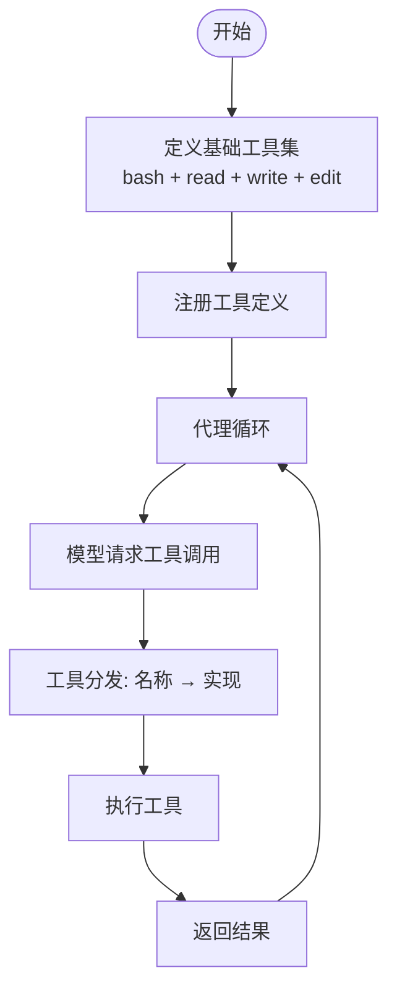

**图示来源**
- [S02ToolUse.java:34-51](file://src/main/java/com/learn/harness/agent/S02ToolUse.java#L34-L51)
- [S02ToolUse.java:108-121](file://src/main/java/com/learn/harness/agent/S02ToolUse.java#L108-L121)

**章节来源**
- [S02ToolUse.java:28-190](file://src/main/java/com/learn/harness/agent/S02ToolUse.java#L28-L190)

### 计划管理（S03）
- 职责：让模型管理自己的工作计划，维护任务状态流转（pending → in_progress → completed）。
- 关键点：
  - TodoManager 管理计划项状态，强制单任务进行模式
  - 提醒机制防止模型忘记更新计划
  - 支持主动更新和被动提醒两种模式
- 使用场景：复杂任务分解、多步骤项目管理、需要持续跟踪进度的场景。
- 集成方式：在工具列表中添加 todo 工具，通过 dispatchTool 处理计划更新。
- 配置要点：PLAN_REMINDER_INTERVAL 提醒间隔、任务数量限制。

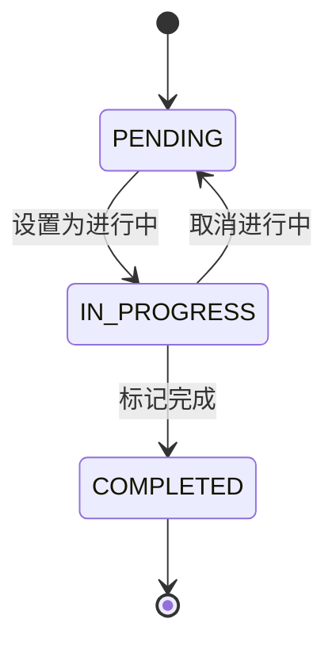

**图示来源**
- [S03TodoWrite.java:54-74](file://src/main/java/com/learn/harness/agent/S03TodoWrite.java#L54-L74)
- [S03TodoWrite.java:107-140](file://src/main/java/com/learn/harness/agent/S03TodoWrite.java#L107-L140)

**章节来源**
- [S03TodoWrite.java:31-293](file://src/main/java/com/learn/harness/agent/S03TodoWrite.java#L31-L293)

### 子代理系统（S04）
- 职责：派生"子代理"，在隔离上下文中工作，仅返回摘要给父代理。
- 关键点：
  - 子代理使用独立的消息列表，避免污染父代理历史
  - 通过受限工具集与安全路径校验，防止越权访问
  - 支持"task"工具委派子任务，子任务完成后汇总返回
- 使用场景：复杂探索、多阶段任务分解、需要严格上下文隔离的实验性操作。
- 集成方式：在父代理工具集中加入"task"工具定义，调用 runSubagent 执行子任务。
- 配置要点：WORKDIR 限制、危险命令拦截、超时控制、输出长度截断。


**图示来源**
- [S04Subagent.java:84-149](file://src/main/java/com/learn/harness/agent/S04Subagent.java#L84-L149)

**章节来源**
- [S04Subagent.java:17-164](file://src/main/java/com/learn/harness/agent/S04Subagent.java#L17-L164)

### 技能加载（S05）
- 职责：两层技能模型——系统提示中放置技能目录清单，按需加载技能全文。
- 关键点：
  - 技能目录扫描与 frontmatter 解析，生成技能清单
  - "load_skill"工具按名称加载技能正文，注入当前上下文
  - 保持与 S02/S03 相同的工具分发模式，便于复用
- 使用场景：知识密集型任务、需要领域专家指令的场景。
- 集成方式：在系统提示中列出可用技能；在工具集中添加"load_skill"。
- 配置要点：skills 目录结构、frontmatter 字段、正文截断与错误提示。

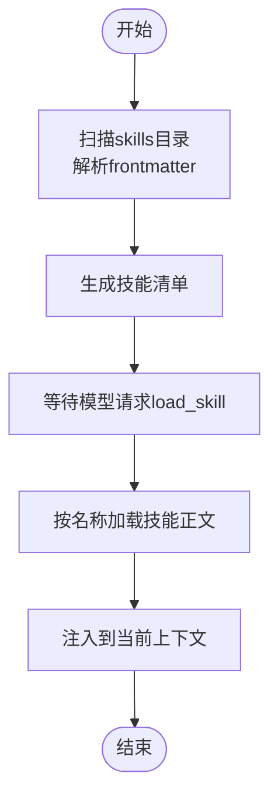

**图示来源**
- [S05SkillLoading.java:27-76](file://src/main/java/com/learn/harness/agent/S05SkillLoading.java#L27-L76)
- [S05SkillLoading.java:106-112](file://src/main/java/com/learn/harness/agent/S05SkillLoading.java#L106-L112)

**章节来源**
- [S05SkillLoading.java:17-144](file://src/main/java/com/learn/harness/agent/S05SkillLoading.java#L17-L144)

### 上下文压缩（S06）
- 职责：在对话过长时进行压缩，持久化大输出，微压缩旧工具结果。
- 关键点：
  - 自动阈值检测与手动触发(compact 工具)
  - 大输出持久化到 .task_outputs/tool-results，保留预览
  - 会话摘要注入，形成"压缩后继续"的闭环
- 使用场景：长时间探索、大量日志输出、高并发工具调用。
- 集成方式：在工具集中加入"compact"，在循环前检查上下文大小。
- 配置要点：TOKEN_THRESHOLD、KEEP_RECENT_TOOL_RESULTS、PERSIST_THRESHOLD。


**图示来源**
- [S06ContextCompact.java:84-119](file://src/main/java/com/learn/harness/agent/S06ContextCompact.java#L84-L119)

**章节来源**
- [S06ContextCompact.java:18-135](file://src/main/java/com/learn/harness/agent/S06ContextCompact.java#L18-L135)

### 权限系统（S07）
- 职责：工具调用的"管道式"安全控制，deny_rules → mode_check → allow_rules → ask_user。
- 关键点：
  - 三种模式：default、plan、auto；不同模式对读写工具的放行策略不同
  - 规则匹配支持通配符与内容关键字，拒绝计数用于策略提示
  - 用户可"总是允许"某规则，形成动态白名单
- 使用场景：生产环境、多人协作、敏感命令限制。
- 集成方式：在工具执行前调用 PermissionManager.check，必要时弹窗询问。
- 配置要点：规则集合、模式切换、危险命令黑名单。


**图示来源**
- [S07PermissionSystem.java:40-80](file://src/main/java/com/learn/harness/agent/S07PermissionSystem.java#L40-L80)
- [S07PermissionSystem.java:110-137](file://src/main/java/com/learn/harness/agent/S07PermissionSystem.java#L110-L137)

**章节来源**
- [S07PermissionSystem.java:18-159](file://src/main/java/com/learn/harness/agent/S07PermissionSystem.java#L18-L159)

### 钩子系统（S08）
- 职责：在代理循环的关键节点注入外部扩展（PreToolUse/PostToolUse/SessionStart）。
- 关键点：
  - 配置文件 .hooks.json 定义事件与命令
  - 退出码语义：0=继续、1=阻断、2=注入消息
  - 环境变量传递事件名与工具名，支持超时控制
- 使用场景：审计日志、合规检查、告警通知、自定义策略注入。
- 集成方式：在工具调用前后分别触发 PreToolUse/PostToolUse；启动时触发 SessionStart。
- 配置要点：事件类型、命令脚本、匹配器、超时设置。

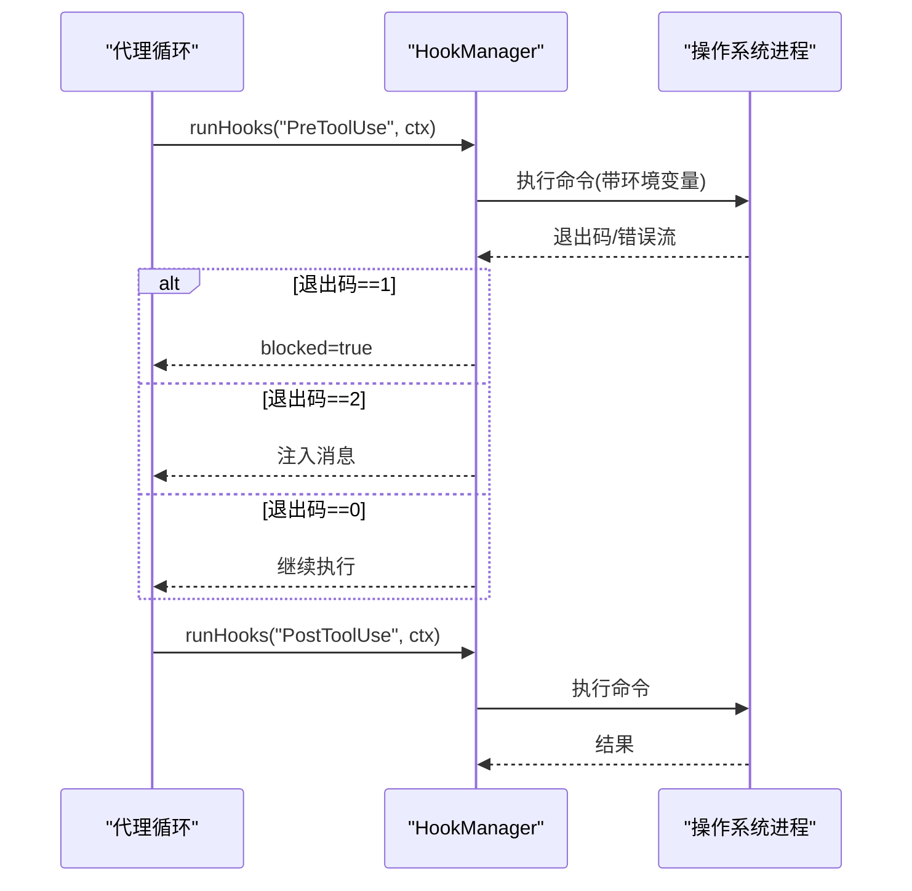

**图示来源**
- [S08HookSystem.java:53-78](file://src/main/java/com/learn/harness/agent/S08HookSystem.java#L53-L78)
- [S08HookSystem.java:98-122](file://src/main/java/com/learn/harness/agent/S08HookSystem.java#L98-L122)

**章节来源**
- [S08HookSystem.java:20-139](file://src/main/java/com/learn/harness/agent/S08HookSystem.java#L20-L139)

### 内存系统（S09）
- 职责：跨会话持久化记忆，以 Markdown frontmatter 存储元信息与正文。
- 关键点：
  - 记忆类型：user、feedback、project、reference；仅保存有价值且不易重推导的信息
  - save_memory 工具用于创建与更新记忆；系统提示自动拼接已加载的记忆
  - 支持"梦整合"占位（计划模式禁用），提升长期一致性
- 使用场景：用户偏好、反馈记录、项目事实、外部资源链接。
- 集成方式：在系统提示构建中加载 .memory/MEMORY.md；通过 save_memory 工具写入。
- 配置要点：记忆目录、frontmatter 字段、索引行数上限。


**图示来源**
- [S09MemorySystem.java:36-115](file://src/main/java/com/learn/harness/agent/S09MemorySystem.java#L36-L115)
- [S09MemorySystem.java:202-209](file://src/main/java/com/learn/harness/agent/S09MemorySystem.java#L202-L209)

**章节来源**
- [S09MemorySystem.java:21-295](file://src/main/java/com/learn/harness/agent/S09MemorySystem.java#L21-L295)

### 系统提示构建（S10）
- 职责：将"核心指令→工具→技能→记忆→CLAUDE.md→动态上下文"按边界组装为系统提示。
- 关键点：
  - 分节边界清晰，便于调试与定位问题
  - 动态边界之后注入时间、平台、模型等实时信息
  - 支持用户全局与项目根部 CLAUDE.md 叠加
- 使用场景：标准化提示工程、团队知识沉淀、动态上下文注入。
- 集成方式：在每次循环前调用 SystemPromptBuilder.build() 生成完整提示。
- 配置要点：各节构建函数、边界字符串、CLAUDE.md 路径。

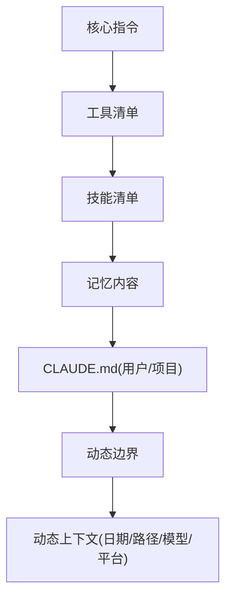

**图示来源**
- [S10SystemPrompt.java:154-165](file://src/main/java/com/learn/harness/agent/S10SystemPrompt.java#L154-L165)

**章节来源**
- [S10SystemPrompt.java:20-289](file://src/main/java/com/learn/harness/agent/S10SystemPrompt.java#L20-L289)

### 错误恢复（S11）
- 职责：三路恢复策略：max_tokens 连续注入、prompt_too_long 摘要压缩、连接/限流指数退避重试。
- 关键点：
  - max_tokens：连续注入"继续从此处开始"的提示，最多尝试 N 次
  - prompt_too_long：调用摘要模型生成会话摘要，清空历史继续
  - 连接错误：指数退避，最大延迟限制，失败后停止
- 使用场景：网络不稳定、长对话、输出受限。
- 集成方式：在主循环外层包裹错误恢复逻辑，按错误类型分流。
- 配置要点：最大尝试次数、基础/最大退避延迟、令牌阈值。


**图示来源**
- [S11ErrorRecovery.java:127-219](file://src/main/java/com/learn/harness/agent/S11ErrorRecovery.java#L127-L219)

**章节来源**
- [S11ErrorRecovery.java:20-239](file://src/main/java/com/learn/harness/agent/S11ErrorRecovery.java#L20-L239)

### 任务系统（S12）
- 职责：持久化任务管理，支持任务依赖关系与状态流转。
- 关键点：
  - 每个任务是一个 JSON 文件，状态：pending → in_progress → completed
  - 依赖关系：blockedBy/ blocks，完成任务时自动解除阻塞
  - 支持任务创建、更新、查询、列表等完整 CRUD
- 使用场景：项目管理、工作流编排、多任务协调。
- 集成方式：在工具集中添加 task_create/task_update/task_list/task_get 工具。
- 配置要点：任务存储目录、状态转换约束、依赖解析。

```mermaid
flowchart TD
Create["创建任务"] --> Pending["pending"]
Pending --> InProgress["in_progress"]
InProgress --> Completed["completed"]
InProgress --> Blocked["被其他任务阻塞"]
Blocked --> Pending
Completed --> [*]
```

**图示来源**
- [S12TaskSystem.java:74-91](file://src/main/java/com/learn/harness/agent/S12TaskSystem.java#L74-L91)
- [S12TaskSystem.java:169-187](file://src/main/java/com/learn/harness/agent/S12TaskSystem.java#L169-L187)

**章节来源**
- [S12TaskSystem.java:34-285](file://src/main/java/com/learn/harness/agent/S12TaskSystem.java#L34-L285)

### 后台任务（S13）
- 职责：并发执行耗时命令，主循环不被阻塞。
- 关键点：
  - background_run：异步执行命令，立即返回任务 ID
  - check_background：查询后台任务状态和结果
  - 每轮循环开始前自动检查完成的通知
- 使用场景：编译、测试、下载等耗时操作。
- 集成方式：在工具集中添加 background_run 和 check_background 工具。
- 配置要点：线程池配置、超时控制、通知队列。

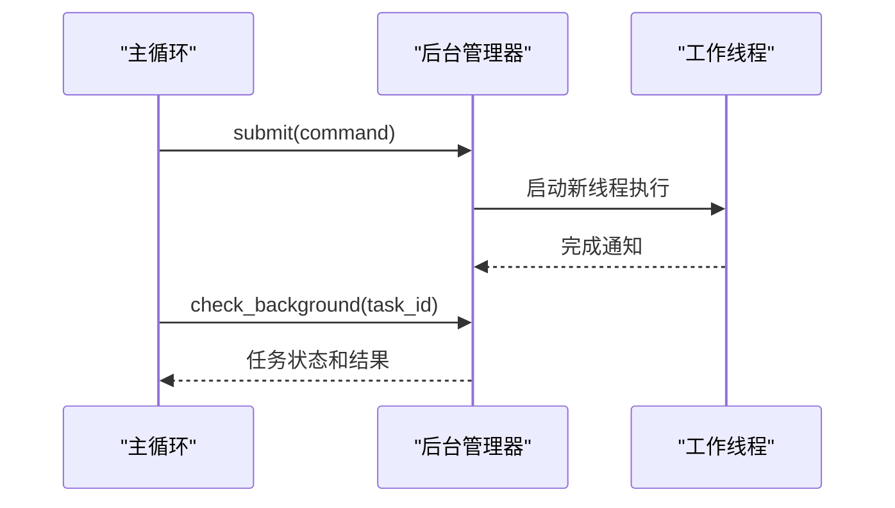

**图示来源**
- [S13BackgroundTasks.java:78-85](file://src/main/java/com/learn/harness/agent/S13BackgroundTasks.java#L78-L85)
- [S13BackgroundTasks.java:114-127](file://src/main/java/com/learn/harness/agent/S13BackgroundTasks.java#L114-L127)

**章节来源**
- [S13BackgroundTasks.java:32-221](file://src/main/java/com/learn/harness/agent/S13BackgroundTasks.java#L32-L221)

### 定时调度（S14）
- 职责：让 Agent 能"记住未来要做的事"——定时任务。
- 关键点：
  - Cron 表达式解析（分 时 日 月 周）
  - ScheduledExecutorService 做定时轮询
  - 到期时把任务 prompt 注入对话循环
- 使用场景：定期检查、定时备份、周期性报告。
- 集成方式：在工具集中添加 cron_create/cron_delete/cron_list 工具。
- 配置要点：Cron 表达式格式、调度精度、自动过期策略。

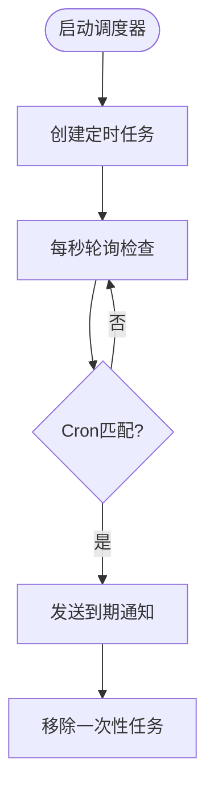

**图示来源**
- [S14CronScheduler.java:119-132](file://src/main/java/com/learn/harness/agent/S14CronScheduler.java#L119-L132)
- [S14CronScheduler.java:172-188](file://src/main/java/com/learn/harness/agent/S14CronScheduler.java#L172-L188)

**章节来源**
- [S14CronScheduler.java:34-290](file://src/main/java/com/learn/harness/agent/S14CronScheduler.java#L34-L290)

### Agent 团队（S15）
- 职责：多 Agent 协作，通过消息通信实现分布式智能。
- 关键点：
  - Lead 主 Agent：和用户对话，负责分配工作
  - Teammates 队员：每个队员是独立线程中的 Agent 循环
  - 通信方式：文件系统中的 JSONL 收件箱
- 使用场景：复杂项目分工、多角色协作、分布式问题求解。
- 集成方式：在 Lead 工具集中添加 spawn/list/send/broadcast 工具。
- 配置要点：团队目录结构、消息格式、并发控制。

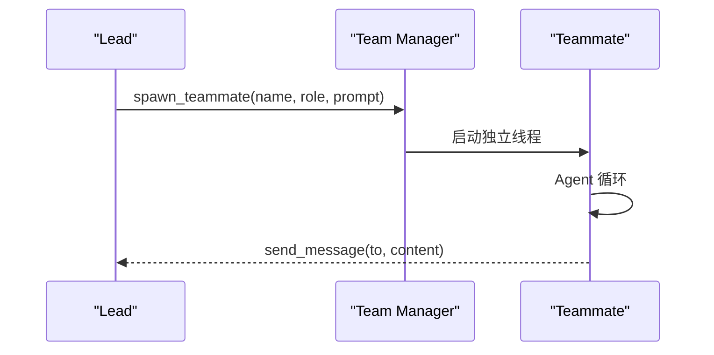

**图示来源**
- [S15AgentTeams.java:134-147](file://src/main/java/com/learn/harness/agent/S15AgentTeams.java#L134-L147)
- [S15AgentTeams.java:150-196](file://src/main/java/com/learn/harness/agent/S15AgentTeams.java#L150-L196)

**章节来源**
- [S15AgentTeams.java:35-330](file://src/main/java/com/learn/harness/agent/S15AgentTeams.java#L35-L330)

### 自治 Agent（S17）
- 职责：让队员变成"自治的"——不需要 Lead 持续指挥，能自己找任务做。
- 关键点：
  - 空闲轮询：定期检查收件箱和任务板，有活就干
  - 超时退出：空闲太久自动关机（节省资源）
  - 任务自动认领：从任务板上 claim 一个 pending 的任务
- 使用场景：无人值守的自动化系统、智能客服、任务驱动的代理。
- 集成方式：在 Lead 工具集中添加 spawn_autonomous/list/send/read_inbox 工具。
- 配置要点：轮询间隔、空闲超时、任务认领策略。

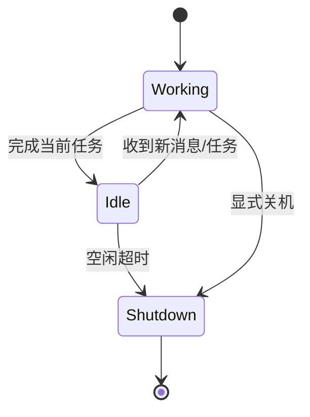

**图示来源**
- [S17AutonomousAgents.java:83-96](file://src/main/java/com/learn/harness/agent/S17AutonomousAgents.java#L83-L96)
- [S17AutonomousAgents.java:150-170](file://src/main/java/com/learn/harness/agent/S17AutonomousAgents.java#L150-L170)

**章节来源**
- [S17AutonomousAgents.java:31-259](file://src/main/java/com/learn/harness/agent/S17AutonomousAgents.java#L31-L259)

### Git Worktree 任务隔离（S18）
- 职责：用 git worktree 实现任务级别的代码隔离，每个任务在独立的 worktree 中执行。
- 关键点：
  - 任务（Task）= 控制面：什么要做、谁在做、什么状态
  - 工作树（Worktree）= 执行面：代码在哪改、分支是什么、命令在哪跑
  - 事件总线：记录所有操作历史，方便回溯和审计
- 使用场景：多任务并行开发、代码变更隔离、审计追踪。
- 集成方式：在工具集中添加 task_create/list/update/worktree_* 系列工具。
- 配置要点：Git 仓库检测、worktree 管理、事件记录。

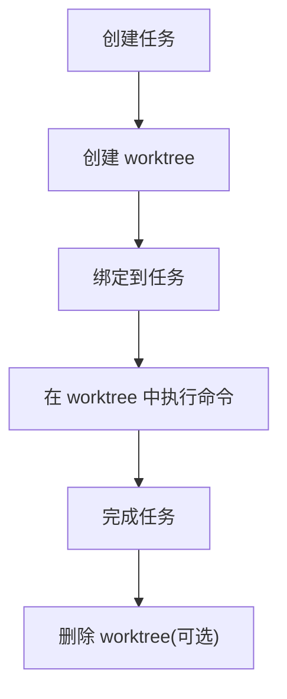

**图示来源**
- [S18WorktreeTaskIsolation.java:263-293](file://src/main/java/com/learn/harness/agent/S18WorktreeTaskIsolation.java#L263-L293)
- [S18WorktreeTaskIsolation.java:333-352](file://src/main/java/com/learn/harness/agent/S18WorktreeTaskIsolation.java#L333-L352)

**章节来源**
- [S18WorktreeTaskIsolation.java:33-527](file://src/main/java/com/learn/harness/agent/S18WorktreeTaskIsolation.java#L33-L527)

### MCP 外部工具插件（S19）
- 职责：通过 MCP（Model Context Protocol）协议加载外部工具，实现统一的工具管道。
- 关键点：
  - 通过 stdio 与外部进程通信（stdin/stdout）
  - 使用 JSON-RPC 2.0 格式（method + params → result/error）
  - 统一工具池：内置工具 + MCP 工具混合在一起给模型用
  - 权限模型：read/write/high 三级风险分级
- 使用场景：第三方服务集成、定制工具扩展、插件化架构。
- 集成方式：扫描 .mcp-plugin/plugin.json 发现 MCP 服务器，动态注册工具。
- 配置要点：插件发现机制、权限门控、路由策略。

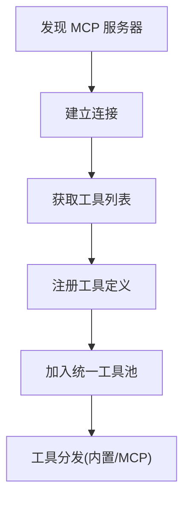

**图示来源**
- [S19McpPlugin.java:285-301](file://src/main/java/com/learn/harness/agent/S19McpPlugin.java#L285-L301)
- [S19McpPlugin.java:377-390](file://src/main/java/com/learn/harness/agent/S19McpPlugin.java#L377-L390)

**章节来源**
- [S19McpPlugin.java:39-449](file://src/main/java/com/learn/harness/agent/S19McpPlugin.java#L39-L449)

### 完整集成（SFull）
- 职责：将前面 18 章学到的所有机制整合到一个可运行的 Agent 中。
- 关键点：
  - 整合了 S01–S18 的所有核心功能
  - 提供统一的 REPL 命令接口
  - 实现了完整的错误处理和恢复机制
- 使用场景：学习完整架构、生产环境参考、功能演示。
- 集成方式：通过 buildTools() 构建完整工具池，agentLoop() 执行主循环。
- 配置要点：各种阈值参数、目录结构、工具定义。

**章节来源**
- [SFull.java:43-825](file://src/main/java/com/learn/harness/agent/SFull.java#L43-L825)

## 依赖分析
- 组件耦合：
  - 所有高级模块均依赖 DashScopeClient，保证统一的模型接口与响应解析
  - S02–S19 在工具层面与 CommonTools 保持一致，便于替换与组合
  - S10 作为系统提示构建器，被 S09、S11 等模块间接使用
  - S15/S17/S18 形成完整的团队协作架构
- 外部依赖：
  - 环境变量：DASHSCOPE_API_KEY（必需）、DASHSCOPE_MODEL、工作目录
  - 文件系统：WORKDIR 限制、skills 目录、.memory 目录、.tasks 目录、.team 目录
  - Git 仓库：S18 需要在 git 仓库环境中运行

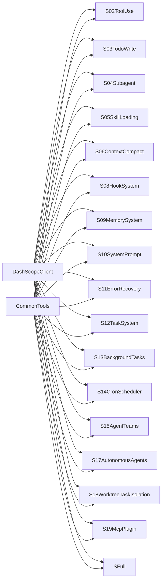

**图示来源**
- [DashScopeClient.java:25-297](file://src/main/java/com/learn/harness/agent/DashScopeClient.java#L25-L297)
- [CommonTools.java:23-282](file://src/main/java/com/learn/harness/agent/CommonTools.java#L23-L282)
- [SFull.java:47-583](file://src/main/java/com/learn/harness/agent/SFull.java#L47-L583)

**章节来源**
- [DashScopeClient.java:25-297](file://src/main/java/com/learn/harness/agent/DashScopeClient.java#L25-L297)
- [CommonTools.java:23-282](file://src/main/java/com/learn/harness/agent/CommonTools.java#L23-L282)
- [SFull.java:47-583](file://src/main/java/com/learn/harness/agent/SFull.java#L47-L583)

## 性能考虑
- 上下文控制：合理设置 TOKEN_THRESHOLD 与 KEEP_RECENT，避免频繁摘要压缩
- 输出截断：对大输出进行持久化与预览，减少 JSON 序列化体积
- 工具调用：对危险命令与越权路径进行快速拒绝，减少无效 IO
- 并发管理：后台任务使用线程池，避免资源耗尽
- 重试与退避：指数退避避免雪崩，最大延迟保护稳定性
- 提示工程：将技能与记忆按需注入，避免一次性塞入过多内容
- Git 操作：worktree 创建/删除需要时间，应避免频繁操作

## 故障排查指南
- API 调用失败：
  - 检查 DASHSCOPE_API_KEY 是否设置，确认模型配置正确
  - 查看 S11 的错误恢复日志，区分 max_tokens、prompt_too_long 与连接错误
- 工具执行异常：
  - 检查路径是否越权（safePath 校验），确认命令不在黑名单
  - 对于 bash 超时，适当提高超时阈值或拆分子任务
- 权限被拒：
  - 检查规则匹配与模式设置；必要时使用"总是允许"建立白名单
- 钩子未生效：
  - 确认 .hooks.json 语法正确、命令可执行、超时设置合理
- 记忆未加载：
  - 检查 .memory 目录结构与 frontmatter 格式，确认 MEMORY.md 重建成功
- 团队通信问题：
  - 检查 .team/inbox 目录权限，确认 JSONL 文件格式正确
- Git Worktree 问题：
  - 确认当前目录在 git 仓库中，检查 git 命令执行权限
- MCP 插件问题：
  - 检查 .mcp-plugin/plugin.json 格式，确认 MCP 服务器可执行文件路径

**章节来源**
- [S11ErrorRecovery.java:130-219](file://src/main/java/com/learn/harness/agent/S11ErrorRecovery.java#L130-L219)
- [S07PermissionSystem.java:110-137](file://src/main/java/com/learn/harness/agent/S07PermissionSystem.java#L110-L137)
- [S08HookSystem.java:33-51](file://src/main/java/com/learn/harness/agent/S08HookSystem.java#L33-L51)
- [S09MemorySystem.java:98-114](file://src/main/java/com/learn/harness/agent/S09MemorySystem.java#L98-L114)
- [S15AgentTeams.java:342-384](file://src/main/java/com/learn/harness/agent/S15AgentTeams.java#L342-L384)
- [S18WorktreeTaskIsolation.java:220-242](file://src/main/java/com/learn/harness/agent/S18WorktreeTaskIsolation.java#L220-L242)
- [S19McpPlugin.java:372-391](file://src/main/java/com/learn/harness/agent/S19McpPlugin.java#L372-L391)

## 结论
S02–S19 以"模块化 + 组合"的方式，将工具使用、计划管理、子代理、技能加载、上下文压缩、权限、钩子、记忆、系统提示、错误恢复、任务系统、后台任务、定时调度、Agent 团队、自治 Agent、Git Worktree 任务隔离、MCP 外部工具插件等能力融入统一的代理循环。通过 DashScopeClient 的抽象与 CommonTools 的基础工具库，这些高级模块既可独立使用，也可按需组合，满足从教学演示到生产级应用的多样化需求。

建议在实际项目中优先启用上下文压缩与错误恢复，再逐步引入权限与钩子，最后按需启用子代理、记忆、团队协作等功能，以平衡安全性与复杂度。SFull 作为完整集成示例，展示了如何将所有功能有机结合，为生产环境提供了完整的参考架构。

## 附录
- 环境变量
  - DASHSCOPE_API_KEY：DashScope API 密钥（必需）
  - DASHSCOPE_MODEL：模型标识，默认 qwen-plus
  - WORKDIR：工作目录（默认为当前目录）
- 目录约定
  - skills：技能目录，每个技能含 SKILL.md（frontmatter + 正文）
  - .memory：记忆目录，MEMORY.md 为索引
  - .task_outputs/tool-results：大输出持久化目录
  - .hooks.json：钩子配置文件
  - .team：Agent 团队通信目录
  - .tasks：任务持久化目录
  - .worktrees：Git worktree 隔离目录
  - .mcp-plugin：MCP 插件配置目录
- 工具集通用字段
  - name/description/input_schema/required：用于 DashScope Messages API 的工具定义
- 常用命令
  - /compact：手动压缩上下文
  - /tasks：查看任务列表
  - /team：查看团队状态
  - /inbox：查看收件箱
  - /tools：查看 MCP 工具列表
  - /mcp：查看 MCP 服务器状态