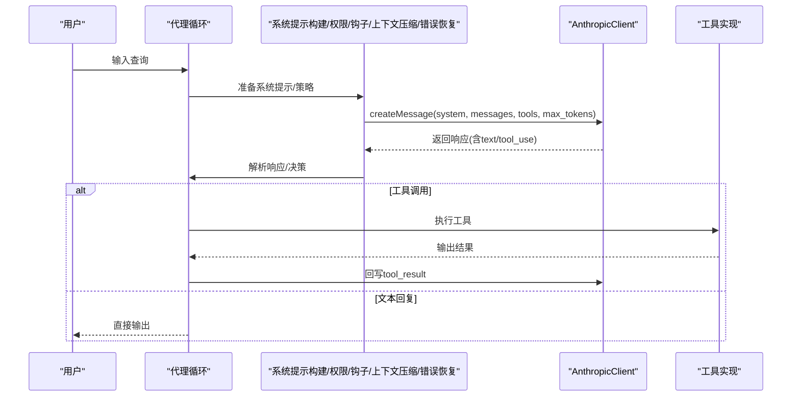
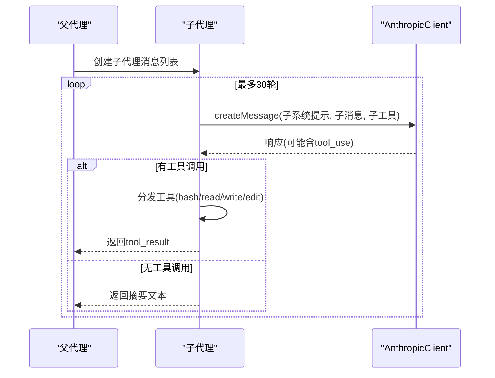
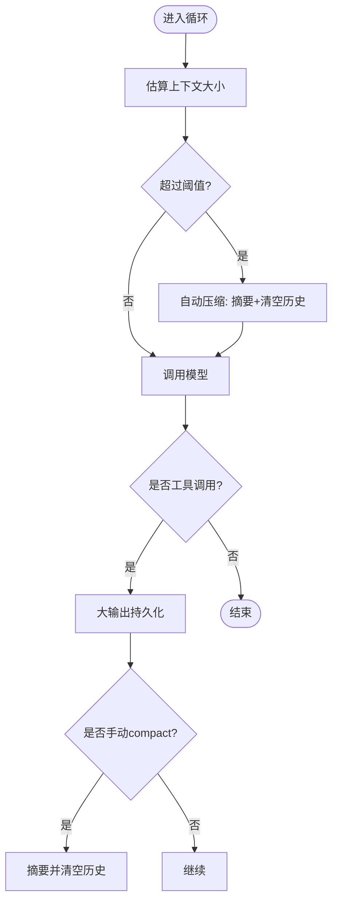
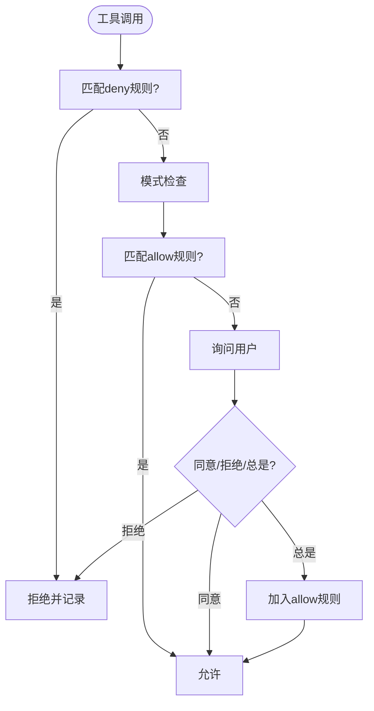
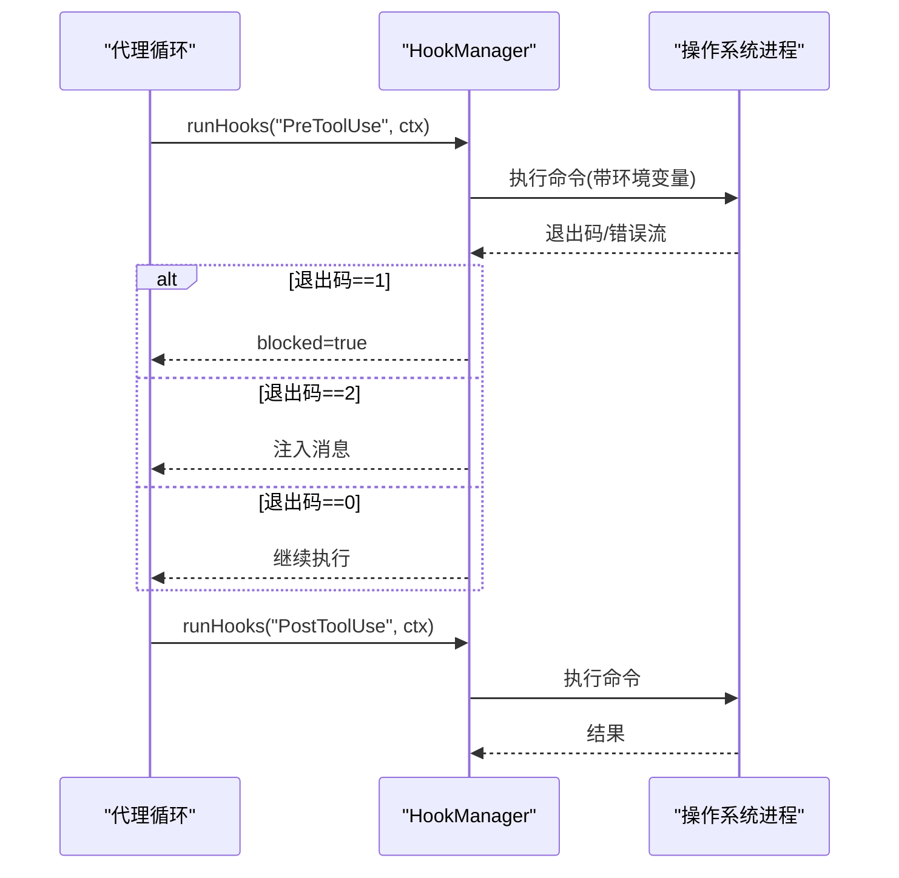
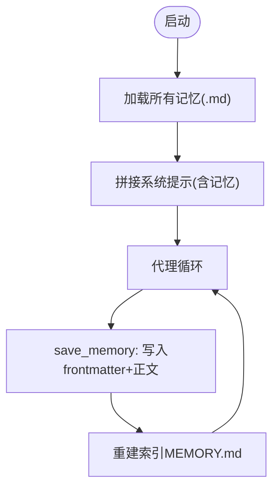
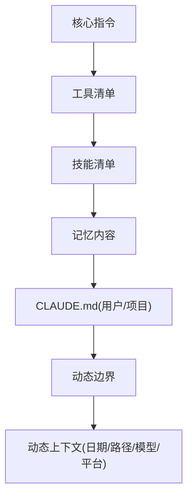
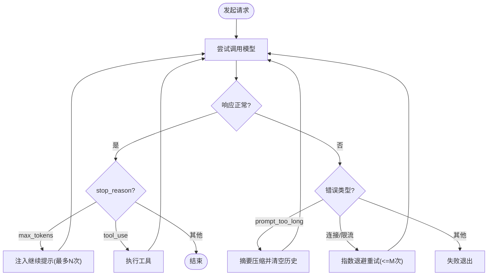
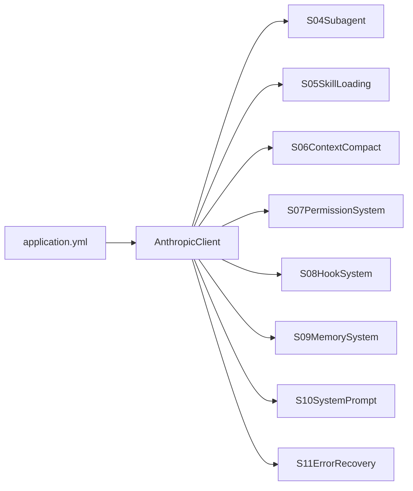

# 高级代理模块

<cite>
**本文引用的文件**
- [S04Subagent.java](file://src/main/java/com/learn/harness/agent/S04Subagent.java)
- [S05SkillLoading.java](file://src/main/java/com/learn/harness/agent/S05SkillLoading.java)
- [S06ContextCompact.java](file://src/main/java/com/learn/harness/agent/S06ContextCompact.java)
- [S07PermissionSystem.java](file://src/main/java/com/learn/harness/agent/S07PermissionSystem.java)
- [S08HookSystem.java](file://src/main/java/com/learn/harness/agent/S08HookSystem.java)
- [S09MemorySystem.java](file://src/main/java/com/learn/harness/agent/S09MemorySystem.java)
- [S10SystemPrompt.java](file://src/main/java/com/learn/harness/agent/S10SystemPrompt.java)
- [S11ErrorRecovery.java](file://src/main/java/com/learn/harness/agent/S11ErrorRecovery.java)
- [AnthropicClient.java](file://src/main/java/com/learn/harness/agent/AnthropicClient.java)
- [S01AgentLoop.java](file://src/main/java/com/learn/harness/agent/S01AgentLoop.java)
- [S02ToolUse.java](file://src/main/java/com/learn/harness/agent/S02ToolUse.java)
- [S03TodoWrite.java](file://src/main/java/com/learn/harness/agent/S03TodoWrite.java)
- [S12TaskSystem.java](file://src/main/java/com/learn/harness/agent/S12TaskSystem.java)
- [application.yml](file://src/main/resources/application.yml)
</cite>

## 目录
1. [引言](#引言)
2. [项目结构](#项目结构)
3. [核心组件](#核心组件)
4. [架构总览](#架构总览)
5. [详细组件分析](#详细组件分析)
6. [依赖分析](#依赖分析)
7. [性能考虑](#性能考虑)
8. [故障排查指南](#故障排查指南)
9. [结论](#结论)
10. [附录](#附录)

## 引言
本文件面向“高级代理模块”的使用者与开发者，系统性梳理 S04 至 S11 的八项关键能力：子代理系统、技能加载、上下文压缩、权限系统、钩子系统、内存系统、系统提示构建与错误恢复。文档从概念到实现逐层展开，给出模块职责、数据流、处理逻辑、配置方法、使用场景、集成方式、协同机制与最佳实践，帮助读者在真实工程中正确选择与组合这些高级功能。

## 项目结构
该仓库以“章节化教学”方式组织，每个 Sxx 文件代表一个独立的可运行示例，共同围绕“代理循环 + 工具调用 + LLM 消息接口”的统一范式构建。AnthropicClient 提供统一的 HTTP 客户端封装，S01–S03 展示了基础循环与工具分发模式，S04–S11 在此基础上叠加高级特性。

```mermaid
graph TB
subgraph "代理循环与工具"
A[S01AgentLoop]
B[S02ToolUse]
C[S03TodoWrite]
end
subgraph "高级模块"
D[S04Subagent]
E[S05SkillLoading]
F[S06ContextCompact]
G[S07PermissionSystem]
H[S08HookSystem]
I[S09MemorySystem]
J[S10SystemPrompt]
K[S11ErrorRecovery]
end
L[AnthropicClient]
M[应用配置(application.yml)]
A --> L
B --> L
C --> L
D --> L
E --> L
F --> L
G --> L
H --> L
I --> L
J --> L
K --> L
M --> L
```

图示来源
- [S01AgentLoop.java:23-177](file://src/main/java/com/learn/harness/agent/S01AgentLoop.java#L23-L177)
- [S02ToolUse.java:19-152](file://src/main/java/com/learn/harness/agent/S02ToolUse.java#L19-L152)
- [S03TodoWrite.java:17-227](file://src/main/java/com/learn/harness/agent/S03TodoWrite.java#L17-L227)
- [S04Subagent.java:17-164](file://src/main/java/com/learn/harness/agent/S04Subagent.java#L17-L164)
- [S05SkillLoading.java:17-144](file://src/main/java/com/learn/harness/agent/S05SkillLoading.java#L17-L144)
- [S06ContextCompact.java:18-135](file://src/main/java/com/learn/harness/agent/S06ContextCompact.java#L18-L135)
- [S07PermissionSystem.java:18-159](file://src/main/java/com/learn/harness/agent/S07PermissionSystem.java#L18-L159)
- [S08HookSystem.java:20-139](file://src/main/java/com/learn/harness/agent/S08HookSystem.java#L20-L139)
- [S09MemorySystem.java:21-295](file://src/main/java/com/learn/harness/agent/S09MemorySystem.java#L21-L295)
- [S10SystemPrompt.java:20-289](file://src/main/java/com/learn/harness/agent/S10SystemPrompt.java#L20-L289)
- [S11ErrorRecovery.java:20-239](file://src/main/java/com/learn/harness/agent/S11ErrorRecovery.java#L20-L239)
- [AnthropicClient.java:20-127](file://src/main/java/com/learn/harness/agent/AnthropicClient.java#L20-L127)
- [application.yml:1-13](file://src/main/resources/application.yml#L1-L13)

章节来源
- [S01AgentLoop.java:23-177](file://src/main/java/com/learn/harness/agent/S01AgentLoop.java#L23-L177)
- [S02ToolUse.java:19-152](file://src/main/java/com/learn/harness/agent/S02ToolUse.java#L19-L152)
- [S03TodoWrite.java:17-227](file://src/main/java/com/learn/harness/agent/S03TodoWrite.java#L17-L227)
- [AnthropicClient.java:20-127](file://src/main/java/com/learn/harness/agent/AnthropicClient.java#L20-L127)
- [application.yml:1-13](file://src/main/resources/application.yml#L1-L13)

## 核心组件
- 统一消息客户端：AnthropicClient 封装模型请求、响应解析、工具块提取与文本抽取，所有高级模块共享。
- 基础循环与工具：S01–S03 定义最小可用代理循环与工具分发模式，S04–S11 在其上扩展高级能力。
- 配置与环境：通过环境变量 MODEL_ID、ANTHROPIC_API_KEY、ANTHROPIC_BASE_URL 等驱动模型调用；Spring 配置用于其他 AI 服务（如 DashScope）。

章节来源
- [AnthropicClient.java:20-127](file://src/main/java/com/learn/harness/agent/AnthropicClient.java#L20-L127)
- [S01AgentLoop.java:23-177](file://src/main/java/com/learn/harness/agent/S01AgentLoop.java#L23-L177)
- [S02ToolUse.java:19-152](file://src/main/java/com/learn/harness/agent/S02ToolUse.java#L19-L152)
- [S03TodoWrite.java:17-227](file://src/main/java/com/learn/harness/agent/S03TodoWrite.java#L17-L227)
- [application.yml:1-13](file://src/main/resources/application.yml#L1-L13)

## 架构总览
下图展示 S04–S11 各模块在代理循环中的协作位置与交互边界。它们均通过 AnthropicClient 发起请求，按需注入系统提示、工具集或执行前置/后置钩子，最终将工具结果回写消息历史，驱动下一步推理与工具调用。



图示来源
- [AnthropicClient.java:51-88](file://src/main/java/com/learn/harness/agent/AnthropicClient.java#L51-L88)
- [S04Subagent.java:84-149](file://src/main/java/com/learn/harness/agent/S04Subagent.java#L84-L149)
- [S05SkillLoading.java:114-129](file://src/main/java/com/learn/harness/agent/S05SkillLoading.java#L114-L129)
- [S06ContextCompact.java:84-119](file://src/main/java/com/learn/harness/agent/S06ContextCompact.java#L84-L119)
- [S07PermissionSystem.java:110-137](file://src/main/java/com/learn/harness/agent/S07PermissionSystem.java#L110-L137)
- [S08HookSystem.java:98-122](file://src/main/java/com/learn/harness/agent/S08HookSystem.java#L98-L122)
- [S09MemorySystem.java:212-248](file://src/main/java/com/learn/harness/agent/S09MemorySystem.java#L212-L248)
- [S10SystemPrompt.java:222-255](file://src/main/java/com/learn/harness/agent/S10SystemPrompt.java#L222-L255)
- [S11ErrorRecovery.java:127-219](file://src/main/java/com/learn/harness/agent/S11ErrorRecovery.java#L127-L219)

## 详细组件分析

### 子代理系统（S04）
- 职责：派生“子代理”，在隔离上下文中工作，仅返回摘要给父代理，实现任务委派与上下文隔离。
- 关键点：
  - 子代理使用独立的消息列表，避免污染父代理历史。
  - 通过受限工具集（bash/read/write/edit）与安全路径校验，防止越权访问。
  - 支持“task”工具委派子任务，子任务完成后汇总返回。
- 使用场景：复杂探索、多阶段任务分解、需要严格上下文隔离的实验性操作。
- 集成方式：在父代理工具集中加入“task”工具定义，调用 runSubagent 执行子任务。
- 配置要点：WORKDIR 限制、危险命令拦截、超时控制、输出长度截断。



图示来源
- [S04Subagent.java:84-149](file://src/main/java/com/learn/harness/agent/S04Subagent.java#L84-L149)

章节来源
- [S04Subagent.java:17-164](file://src/main/java/com/learn/harness/agent/S04Subagent.java#L17-L164)

### 技能加载（S05）
- 职责：两层技能模型——系统提示中放置技能目录清单，按需加载技能全文，降低初始上下文开销。
- 关键点：
  - 技能目录扫描与 frontmatter 解析，生成技能清单。
  - “load_skill”工具按名称加载技能正文，注入当前上下文。
  - 保持与 S02/S03 相同的工具分发模式，便于复用。
- 使用场景：知识密集型任务、需要领域专家指令的场景。
- 集成方式：在系统提示中列出可用技能；在工具集中添加“load_skill”。
- 配置要点：skills 目录结构、frontmatter 字段、正文截断与错误提示。


图示来源
- [S05SkillLoading.java:27-76](file://src/main/java/com/learn/harness/agent/S05SkillLoading.java#L27-L76)
- [S05SkillLoading.java:106-112](file://src/main/java/com/learn/harness/agent/S05SkillLoading.java#L106-L112)

章节来源
- [S05SkillLoading.java:17-144](file://src/main/java/com/learn/harness/agent/S05SkillLoading.java#L17-L144)

### 上下文压缩（S06）
- 职责：在对话过长时进行压缩，持久化大输出，微压缩旧工具结果，必要时总结会话继续工作。
- 关键点：
  - 自动阈值检测与手动触发(compact 工具)。
  - 大输出持久化到 .task_outputs/tool-results，保留预览。
  - 会话摘要注入，形成“压缩后继续”的闭环。
- 使用场景：长时间探索、大量日志输出、高并发工具调用。
- 集成方式：在工具集中加入“compact”，在循环前检查上下文大小。
- 配置要点：CONTEXT_LIMIT、KEEP_RECENT_TOOL_RESULTS、PERSIST_THRESHOLD。



图示来源
- [S06ContextCompact.java:84-119](file://src/main/java/com/learn/harness/agent/S06ContextCompact.java#L84-L119)

章节来源
- [S06ContextCompact.java:18-135](file://src/main/java/com/learn/harness/agent/S06ContextCompact.java#L18-L135)

### 权限系统（S07）
- 职责：工具调用的“管道式”安全控制，deny_rules → mode_check → allow_rules → ask_user。
- 关键点：
  - 三种模式：default、plan、auto；不同模式对读写工具的放行策略不同。
  - 规则匹配支持通配符与内容关键字，拒绝计数用于策略提示。
  - 用户可“总是允许”某规则，形成动态白名单。
- 使用场景：生产环境、多人协作、敏感命令限制。
- 集成方式：在工具执行前调用 PermissionManager.check，必要时弹窗询问。
- 配置要点：规则集合、模式切换、危险命令黑名单。



图示来源
- [S07PermissionSystem.java:40-80](file://src/main/java/com/learn/harness/agent/S07PermissionSystem.java#L40-L80)
- [S07PermissionSystem.java:110-137](file://src/main/java/com/learn/harness/agent/S07PermissionSystem.java#L110-L137)

章节来源
- [S07PermissionSystem.java:18-159](file://src/main/java/com/learn/harness/agent/S07PermissionSystem.java#L18-L159)

### 钩子系统（S08）
- 职责：在代理循环的关键节点注入外部扩展（PreToolUse/PostToolUse/SessionStart），通过进程执行与退出码控制行为。
- 关键点：
  - 配置文件 .hooks.json 定义事件与命令。
  - 退出码语义：0=继续、1=阻断、2=注入消息。
  - 环境变量传递事件名与工具名，支持超时控制。
- 使用场景：审计日志、合规检查、告警通知、自定义策略注入。
- 集成方式：在工具调用前后分别触发 PreToolUse/PostToolUse；启动时触发 SessionStart。
- 配置要点：事件类型、命令脚本、匹配器、超时设置。



图示来源
- [S08HookSystem.java:53-78](file://src/main/java/com/learn/harness/agent/S08HookSystem.java#L53-L78)
- [S08HookSystem.java:98-122](file://src/main/java/com/learn/harness/agent/S08HookSystem.java#L98-L122)

章节来源
- [S08HookSystem.java:20-139](file://src/main/java/com/learn/harness/agent/S08HookSystem.java#L20-L139)

### 内存系统（S09）
- 职责：跨会话持久化记忆，以 Markdown frontmatter 存储元信息与正文，提供索引与检索。
- 关键点：
  - 记忆类型：user、feedback、project、reference；仅保存有价值且不易重推导的信息。
  - save_memory 工具用于创建与更新记忆；系统提示自动拼接已加载的记忆。
  - 支持“梦整合”占位（计划模式禁用），提升长期一致性。
- 使用场景：用户偏好、反馈记录、项目事实、外部资源链接。
- 集成方式：在系统提示构建中加载 .memory/MEMORY.md；通过 save_memory 工具写入。
- 配置要点：记忆目录、frontmatter 字段、索引行数上限。



图示来源
- [S09MemorySystem.java:36-115](file://src/main/java/com/learn/harness/agent/S09MemorySystem.java#L36-L115)
- [S09MemorySystem.java:202-209](file://src/main/java/com/learn/harness/agent/S09MemorySystem.java#L202-L209)

章节来源
- [S09MemorySystem.java:21-295](file://src/main/java/com/learn/harness/agent/S09MemorySystem.java#L21-L295)

### 系统提示构建（S10）
- 职责：将“核心指令→工具→技能→记忆→CLAUDE.md→动态上下文”按边界组装为系统提示。
- 关键点：
  - 分节边界清晰，便于调试与定位问题。
  - 动态边界之后注入时间、平台、模型等实时信息。
  - 支持用户全局与项目根部 CLAUDE.md 叠加。
- 使用场景：标准化提示工程、团队知识沉淀、动态上下文注入。
- 集成方式：在每次循环前调用 SystemPromptBuilder.build() 生成完整提示。
- 配置要点：各节构建函数、边界字符串、CLAUDE.md 路径。



图示来源
- [S10SystemPrompt.java:154-165](file://src/main/java/com/learn/harness/agent/S10SystemPrompt.java#L154-L165)

章节来源
- [S10SystemPrompt.java:20-289](file://src/main/java/com/learn/harness/agent/S10SystemPrompt.java#L20-L289)

### 错误恢复（S11）
- 职责：三路恢复策略：max_tokens 连续注入、prompt_too_long 摘要压缩、连接/限流指数退避重试。
- 关键点：
  - max_tokens：连续注入“继续从此处开始”的提示，最多尝试 N 次。
  - prompt_too_long：调用摘要模型生成会话摘要，清空历史继续。
  - 连接错误：指数退避，最大延迟限制，失败后停止。
- 使用场景：网络不稳定、长对话、输出受限。
- 集成方式：在主循环外层包裹错误恢复逻辑，按错误类型分流。
- 配置要点：最大尝试次数、基础/最大退避延迟、令牌阈值。



图示来源
- [S11ErrorRecovery.java:127-219](file://src/main/java/com/learn/harness/agent/S11ErrorRecovery.java#L127-L219)

章节来源
- [S11ErrorRecovery.java:20-239](file://src/main/java/com/learn/harness/agent/S11ErrorRecovery.java#L20-L239)

## 依赖分析
- 组件耦合：
  - 所有高级模块均依赖 AnthropicClient，保证统一的模型接口与响应解析。
  - S04–S09 在工具层面与 S02/S03 保持一致，便于替换与组合。
  - S10 作为系统提示构建器，被 S09、S11 等模块间接使用。
- 外部依赖：
  - 环境变量：MODEL_ID（必需）、ANTHROPIC_API_KEY、ANTHROPIC_BASE_URL。
  - 文件系统：WORKDIR 限制、skills 目录、.memory 目录、.task_outputs 目录、.hooks.json。
  - Spring 配置：DashScope API Key 与模型参数（非 LLM 调用）。



图示来源
- [AnthropicClient.java:20-127](file://src/main/java/com/learn/harness/agent/AnthropicClient.java#L20-L127)
- [application.yml:1-13](file://src/main/resources/application.yml#L1-L13)

章节来源
- [AnthropicClient.java:20-127](file://src/main/java/com/learn/harness/agent/AnthropicClient.java#L20-L127)
- [application.yml:1-13](file://src/main/resources/application.yml#L1-L13)

## 性能考虑
- 上下文控制：合理设置 CONTEXT_LIMIT 与 TOKEN_THRESHOLD，避免频繁摘要压缩。
- 输出截断：对大输出进行持久化与预览，减少 JSON 序列化体积。
- 工具调用：对危险命令与越权路径进行快速拒绝，减少无效 IO。
- 重试与退避：指数退避避免雪崩，最大延迟保护稳定性。
- 提示工程：将技能与记忆按需注入，避免一次性塞入过多内容。

## 故障排查指南
- API 调用失败：
  - 检查 MODEL_ID 是否设置，确认 ANTHROPIC_API_KEY 与 ANTHROPIC_BASE_URL。
  - 查看 S11 的错误恢复日志，区分 max_tokens、prompt_too_long 与连接错误。
- 工具执行异常：
  - 检查路径是否越权（safePath 校验），确认命令不在黑名单。
  - 对于 bash 超时，适当提高超时阈值或拆分子任务。
- 权限被拒：
  - 检查规则匹配与模式设置；必要时使用“总是允许”建立白名单。
- 钩子未生效：
  - 确认 .hooks.json 语法正确、命令可执行、超时设置合理。
- 记忆未加载：
  - 检查 .memory 目录结构与 frontmatter 格式，确认 MEMORY.md 重建成功。

章节来源
- [S11ErrorRecovery.java:130-219](file://src/main/java/com/learn/harness/agent/S11ErrorRecovery.java#L130-L219)
- [S07PermissionSystem.java:110-137](file://src/main/java/com/learn/harness/agent/S07PermissionSystem.java#L110-L137)
- [S08HookSystem.java:33-51](file://src/main/java/com/learn/harness/agent/S08HookSystem.java#L33-L51)
- [S09MemorySystem.java:98-114](file://src/main/java/com/learn/harness/agent/S09MemorySystem.java#L98-L114)

## 结论
S04–S11 以“模块化 + 组合”的方式，将子代理、技能加载、上下文压缩、权限、钩子、记忆、系统提示与错误恢复等能力融入统一的代理循环。通过 AnthropicClient 的抽象与 S01–S03 的基础范式，这些高级模块既可独立使用，也可按需组合，满足从教学演示到生产级应用的多样化需求。建议在实际项目中优先启用上下文压缩与错误恢复，再逐步引入权限与钩子，最后按需启用子代理与记忆，以平衡安全性与复杂度。

## 附录
- 环境变量
  - MODEL_ID：模型标识（必需）
  - ANTHROPIC_API_KEY：API 密钥（可选，取决于部署）
  - ANTHROPIC_BASE_URL：API 基础地址（可选）
- 目录约定
  - skills：技能目录，每个技能含 SKILL.md（frontmatter + 正文）
  - .memory：记忆目录，MEMORY.md 为索引
  - .task_outputs/tool-results：大输出持久化目录
  - .hooks.json：钩子配置文件
- 工具集通用字段
  - name/description/input_schema/required：用于 Anthropic Messages API 的工具定义