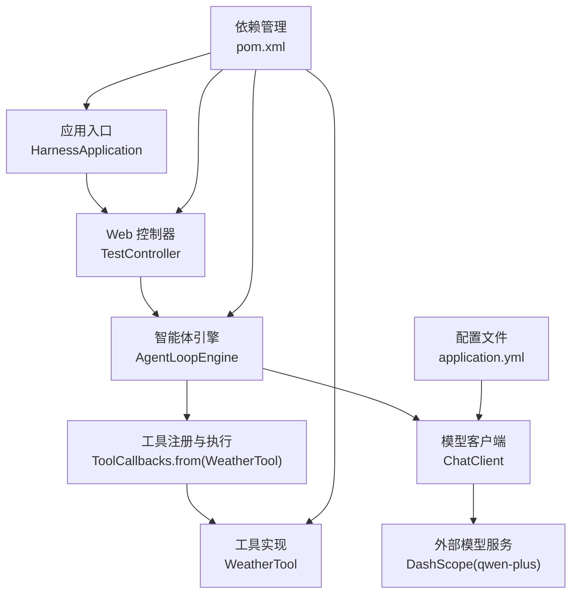
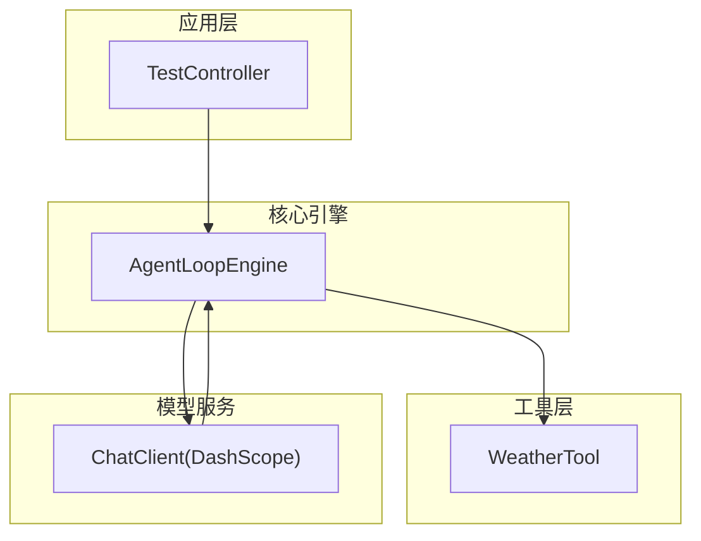
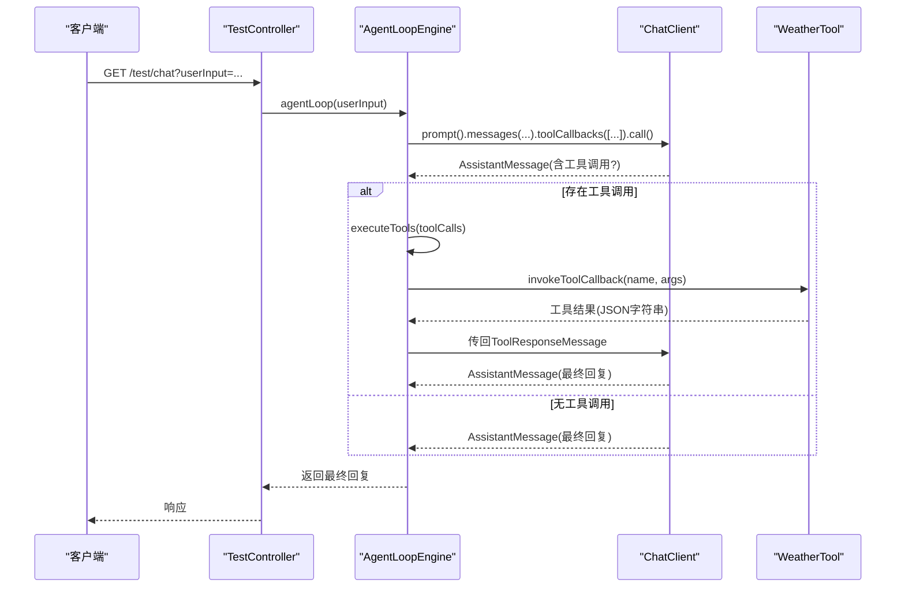
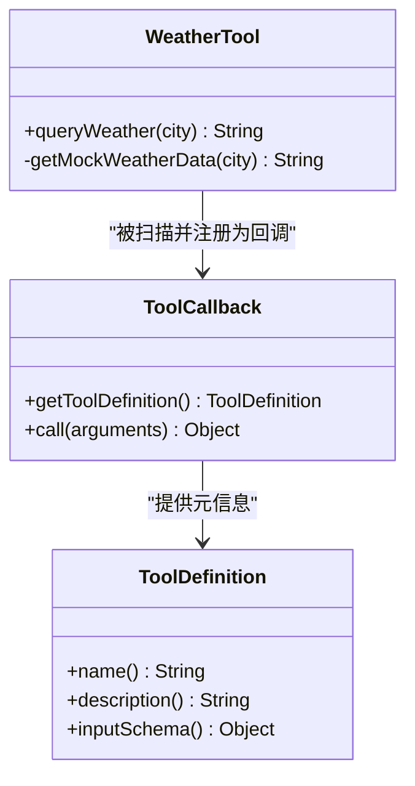
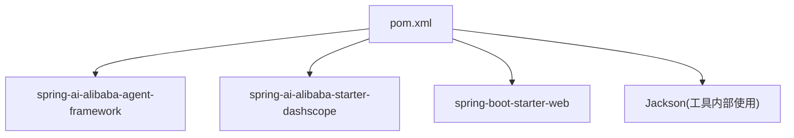

# 工具系统

<cite>
**本文引用的文件**
- [HarnessApplication.java](file://src/main/java/com/learn/harness/HarnessApplication.java)
- [TestController.java](file://src/main/java/com/learn/harness/TestController.java)
- [AgentLoopEngine.java](file://src/main/java/com/learn/harness/core/AgentLoopEngine.java)
- [WeatherTool.java](file://src/main/java/com/learn/harness/tools/WeatherTool.java)
- [application.yml](file://src/main/resources/application.yml)
- [pom.xml](file://pom.xml)
- [README.md](file://README.md)
</cite>

## 目录
1. [简介](#简介)
2. [项目结构](#项目结构)
3. [核心组件](#核心组件)
4. [架构总览](#架构总览)
5. [详细组件分析](#详细组件分析)
6. [依赖分析](#依赖分析)
7. [性能考虑](#性能考虑)
8. [故障排查指南](#故障排查指南)
9. [结论](#结论)
10. [附录](#附录)

## 简介
本项目围绕一个基于 Spring AI 的工具系统展开，重点演示了“基于注解的工具注册机制”与“工具在智能体循环中的执行流程”。系统通过注解驱动的方式将工具方法暴露给模型，模型根据用户输入决定是否调用工具，并由引擎负责解析工具调用、执行工具、回传结果并继续对话，直至得到最终回复。本文将从架构设计、组件职责、数据流、生命周期、错误处理、最佳实践、扩展方式以及调试与性能优化等方面进行系统化阐述。

## 项目结构
项目采用标准 Spring Boot 结构，核心模块集中在 core 与 tools 包中，配合 Spring MVC 控制器对外提供测试接口；配置文件位于 resources 下，依赖通过 Maven 管理。

图表来源
- [HarnessApplication.java:1-14](file://src/main/java/com/learn/harness/HarnessApplication.java#L1-L14)
- [TestController.java:1-45](file://src/main/java/com/learn/harness/TestController.java#L1-L45)
- [AgentLoopEngine.java:1-353](file://src/main/java/com/learn/harness/core/AgentLoopEngine.java#L1-L353)
- [WeatherTool.java:1-66](file://src/main/java/com/learn/harness/tools/WeatherTool.java#L1-L66)
- [application.yml:1-13](file://src/main/resources/application.yml#L1-L13)
- [pom.xml:1-89](file://pom.xml#L1-L89)

章节来源
- [HarnessApplication.java:1-14](file://src/main/java/com/learn/harness/HarnessApplication.java#L1-L14)
- [TestController.java:1-45](file://src/main/java/com/learn/harness/TestController.java#L1-L45)
- [application.yml:1-13](file://src/main/resources/application.yml#L1-L13)
- [pom.xml:1-89](file://pom.xml#L1-L89)

## 核心组件
- 应用入口与启动
  - 应用入口类负责启动 Spring Boot 应用，作为整个系统运行的起点。
- Web 控制器
  - 提供测试接口，将用户输入交由智能体引擎处理，支持通用对话与天气工具触发两种场景。
- 智能体引擎
  - 负责管理消息历史、调用模型、解析工具调用、执行工具、回传工具结果并继续对话，直到得到最终回复。
- 工具实现
  - 基于注解声明工具方法，向模型暴露能力；工具内部封装输入校验、业务逻辑与错误处理。
- 配置与依赖
  - 通过配置文件设置模型服务密钥与模型选项；通过 Maven 引入 Spring AI 与 DashScope Starter。

章节来源
- [HarnessApplication.java:1-14](file://src/main/java/com/learn/harness/HarnessApplication.java#L1-L14)
- [TestController.java:1-45](file://src/main/java/com/learn/harness/TestController.java#L1-L45)
- [AgentLoopEngine.java:1-353](file://src/main/java/com/learn/harness/core/AgentLoopEngine.java#L1-L353)
- [WeatherTool.java:1-66](file://src/main/java/com/learn/harness/tools/WeatherTool.java#L1-L66)
- [application.yml:1-13](file://src/main/resources/application.yml#L1-L13)
- [pom.xml:1-89](file://pom.xml#L1-L89)

## 架构总览
系统采用“控制器-引擎-工具-模型”的分层架构。控制器接收请求，引擎负责对话循环与工具调度，工具实现具体业务逻辑，模型通过 ChatClient 与外部服务交互。

图表来源
- [TestController.java:1-45](file://src/main/java/com/learn/harness/TestController.java#L1-L45)
- [AgentLoopEngine.java:1-353](file://src/main/java/com/learn/harness/core/AgentLoopEngine.java#L1-L353)
- [WeatherTool.java:1-66](file://src/main/java/com/learn/harness/tools/WeatherTool.java#L1-L66)
- [application.yml:1-13](file://src/main/resources/application.yml#L1-L13)

## 详细组件分析

### 智能体引擎（AgentLoopEngine）
- 职责
  - 维护消息历史与上下文参数
  - 调用模型生成回复并判断是否存在工具调用
  - 解析工具调用、执行工具、组装工具结果并回传给模型
  - 提供循环次数上限、回调钩子与日志记录
- 关键流程
  - 初始化工具回调：扫描工具实例上的注解方法，构建工具回调集合
  - 循环执行：调用模型、判断工具调用、执行工具、回传结果、继续循环或返回最终回复
  - 工具执行：按名称匹配工具回调并调用其方法，捕获异常并返回统一格式的结果
- 生命周期
  - 启动时初始化工具回调
  - 每次 agentLoop 调用建立新消息列表与上下文参数
  - 循环结束时触发回调并清理
- 错误处理
  - 模型调用异常、工具执行异常、工具未找到均被记录并返回可读错误信息
  - 循环次数超限时主动终止并提示用户

图表来源
- [TestController.java:24-27](file://src/main/java/com/learn/harness/TestController.java#L24-L27)
- [AgentLoopEngine.java:96-182](file://src/main/java/com/learn/harness/core/AgentLoopEngine.java#L96-L182)
- [AgentLoopEngine.java:187-199](file://src/main/java/com/learn/harness/core/AgentLoopEngine.java#L187-L199)
- [AgentLoopEngine.java:212-248](file://src/main/java/com/learn/harness/core/AgentLoopEngine.java#L212-L248)
- [AgentLoopEngine.java:253-266](file://src/main/java/com/learn/harness/core/AgentLoopEngine.java#L253-L266)
- [WeatherTool.java:30-42](file://src/main/java/com/learn/harness/tools/WeatherTool.java#L30-L42)

章节来源
- [AgentLoopEngine.java:1-353](file://src/main/java/com/learn/harness/core/AgentLoopEngine.java#L1-L353)

### 工具实现（WeatherTool）
- 注解与注册
  - 使用注解声明工具方法，引擎通过扫描工具实例自动提取工具回调
- 输入输出
  - 输入：字符串参数（如城市名）
  - 输出：JSON 字符串（包含天气信息或错误信息）
- 逻辑与错误处理
  - 工具内部进行日志记录、异常捕获与统一错误返回
  - 模拟天气数据生成，便于演示与测试

图表来源
- [WeatherTool.java:1-66](file://src/main/java/com/learn/harness/tools/WeatherTool.java#L1-L66)
- [AgentLoopEngine.java:58-68](file://src/main/java/com/learn/harness/core/AgentLoopEngine.java#L58-L68)

章节来源
- [WeatherTool.java:1-66](file://src/main/java/com/learn/harness/tools/WeatherTool.java#L1-L66)

### 控制器与入口
- 入口类负责启动应用
- 控制器提供两个测试端点：
  - 通用对话：直接进入智能体循环
  - 天气工具触发：同样进入智能体循环，但预期模型会调用天气工具

章节来源
- [HarnessApplication.java:1-14](file://src/main/java/com/learn/harness/HarnessApplication.java#L1-L14)
- [TestController.java:1-45](file://src/main/java/com/learn/harness/TestController.java#L1-L45)

## 依赖分析
- 外部依赖
  - Spring AI Alibaba Agent Framework：提供工具回调、模型客户端等能力
  - DashScope Starter：提供 DashScope 模型接入
- 运行时依赖
  - Spring Boot Web：提供 Web 控制器与应用启动
  - Jackson：用于 JSON 序列化/反序列化（工具内部）

图表来源
- [pom.xml:16-43](file://pom.xml#L16-L43)

章节来源
- [pom.xml:1-89](file://pom.xml#L1-L89)

## 性能考虑
- 循环次数限制
  - 引擎内置最大循环次数，避免模型与工具之间的反复调用导致资源耗尽
- 工具执行开销
  - 工具内部建议缓存稳定资源（如配置、连接），避免重复初始化
- 模型调用成本
  - 合理组织消息历史长度，避免过长上下文影响性能与成本
- 日志级别
  - 在生产环境适当降低日志级别，减少 I/O 开销

## 故障排查指南
- 工具未注册
  - 确认工具类被 Spring 管理（如使用服务注解），且引擎在启动时扫描该实例
- 工具未找到
  - 检查工具名称是否与注解声明一致；查看引擎日志中工具注册数量
- 工具执行异常
  - 查看工具内部异常日志；确认输入参数格式正确
- 模型无响应
  - 检查配置文件中的模型密钥与模型选项；确认网络连通性
- 循环终止
  - 若出现“达到最大循环次数限制”，检查模型是否持续要求工具调用或存在逻辑问题

章节来源
- [AgentLoopEngine.java:58-68](file://src/main/java/com/learn/harness/core/AgentLoopEngine.java#L58-L68)
- [AgentLoopEngine.java:253-266](file://src/main/java/com/learn/harness/core/AgentLoopEngine.java#L253-L266)
- [application.yml:8-13](file://src/main/resources/application.yml#L8-L13)

## 结论
本工具系统通过注解驱动的工具注册机制与智能体引擎的循环执行流程，实现了从用户输入到工具调用再到最终回复的完整闭环。系统具备清晰的职责划分、完善的错误处理与可观测性，适合在此基础上扩展更多工具类型与复杂业务场景。

## 附录

### 工具开发最佳实践与规范
- 工具接口定义
  - 使用注解声明工具方法，明确工具名称与描述
  - 输入参数尽量简单明确，必要时在描述中给出示例
- 工具实现
  - 明确输入校验与边界条件处理
  - 统一输出格式（推荐 JSON 字符串），便于引擎解析
  - 完善日志记录，区分 info/warn/error 等级别
  - 将异常转换为可读的错误信息返回
- 生命周期管理
  - 工具类应由 Spring 管理，确保引擎可扫描并注册
  - 避免在工具内维护长生命周期状态，保持幂等性
- 执行流程
  - 引擎负责工具调用与结果回传，工具仅关注业务逻辑
  - 工具不应直接与模型交互，避免耦合
- 错误处理
  - 工具内部异常需被捕获并返回统一格式
  - 对外部依赖（如 API）增加超时与重试策略（视业务需要）

### 如何扩展工具系统以支持新的工具类型
- 新增工具类
  - 创建新的工具类，使用注解声明工具方法
  - 确保工具类被 Spring 管理并参与组件扫描
- 注册与发现
  - 引擎在启动时扫描工具实例并注册工具回调，无需手动添加
- 与模型集成
  - 模型侧需具备工具描述与输入模式，以便正确调用
- 权限与安全
  - 对高风险工具增加权限校验与访问控制（可参考其他模块中的权限门控思路）
- 测试与验证
  - 提供单元测试与集成测试，覆盖正常路径与异常路径

### 调试技巧
- 启用详细日志
  - 关注引擎与工具的日志输出，定位工具未注册、工具未找到、执行异常等问题
- 使用控制器端点
  - 通过控制器提供的测试端点快速验证工具调用链路
- 分步验证
  - 先验证模型是否能返回工具调用，再验证工具执行是否成功
- 配置核对
  - 确认模型密钥、模型选项与网络连通性