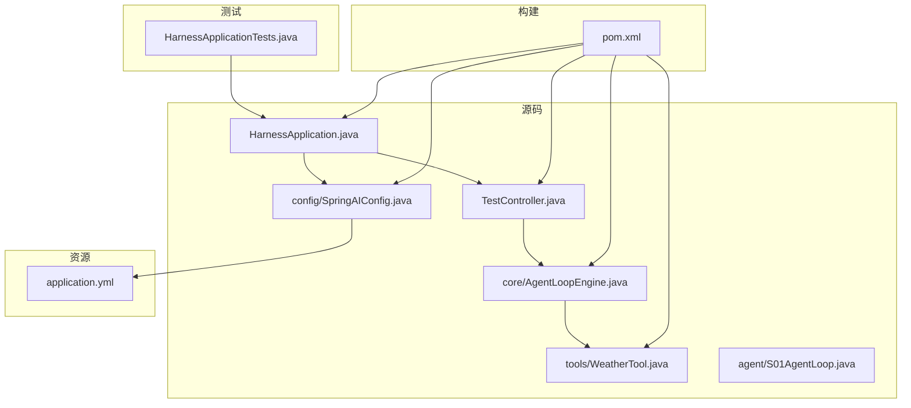
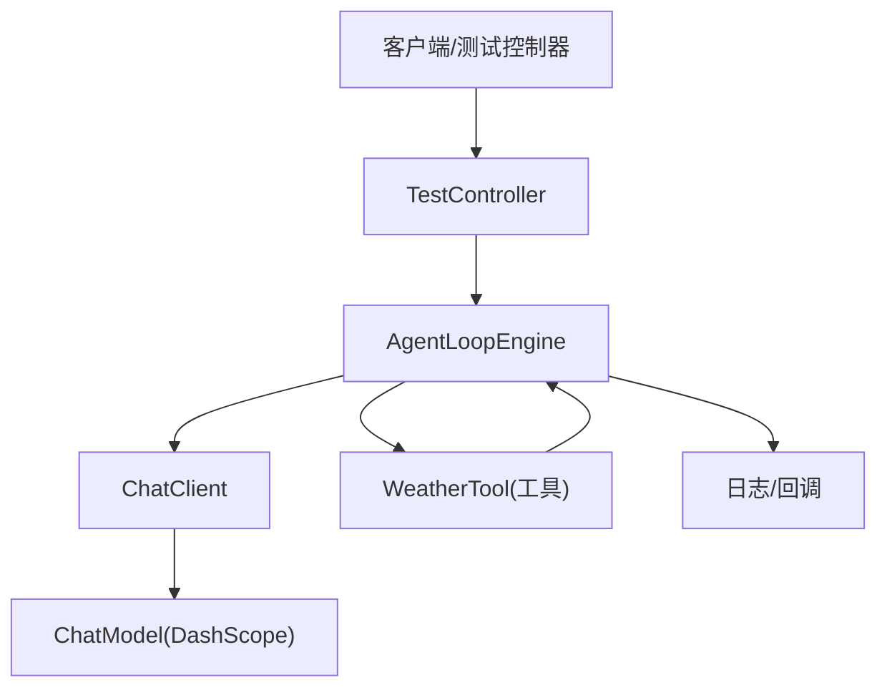
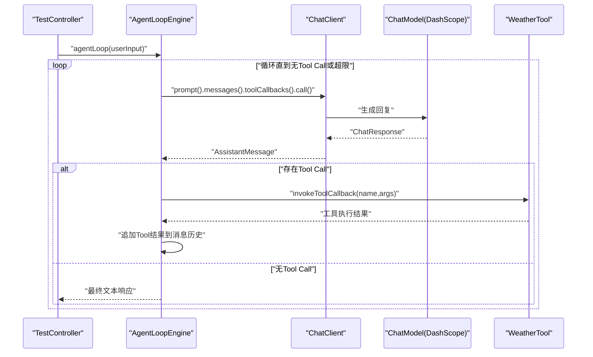
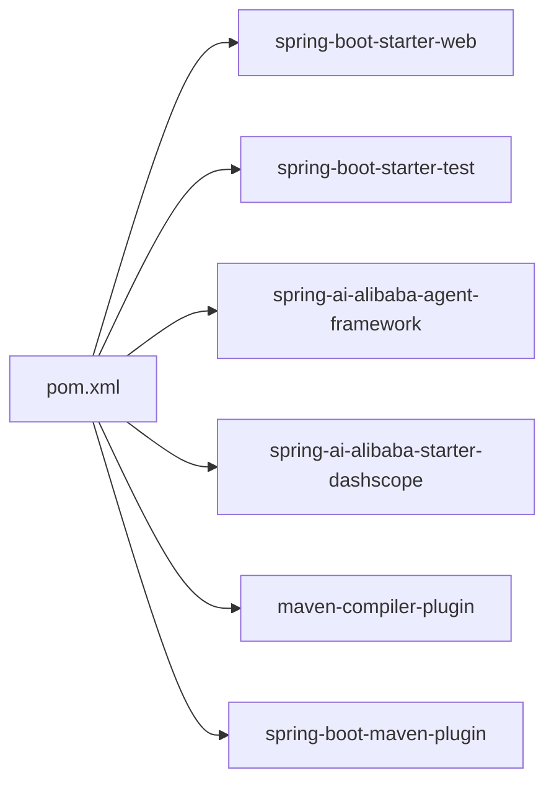

# 开发指南

<cite>
**本文引用的文件**
- [pom.xml](file://pom.xml)
- [README.md](file://README.md)
- [HELP.md](file://HELP.md)
- [HarnessApplication.java](file://src/main/java/com/learn/harness/HarnessApplication.java)
- [application.yml](file://src/main/resources/application.yml)
- [SpringAIConfig.java](file://src/main/java/com/learn/harness/config/SpringAIConfig.java)
- [AgentLoopEngine.java](file://src/main/java/com/learn/harness/core/AgentLoopEngine.java)
- [TestController.java](file://src/main/java/com/learn/harness/TestController.java)
- [WeatherTool.java](file://src/main/java/com/learn/harness/tools/WeatherTool.java)
- [S01AgentLoop.java](file://src/main/java/com/learn/harness/agent/S01AgentLoop.java)
- [BUILD.md](file://src/main/java/com/learn/harness/agent/BUILD.md)
- [HarnessApplicationTests.java](file://src/test/java/com/learn/harness/HarnessApplicationTests.java)
</cite>

## 目录
1. [简介](#简介)
2. [项目结构](#项目结构)
3. [核心组件](#核心组件)
4. [架构总览](#架构总览)
5. [详细组件分析](#详细组件分析)
6. [依赖分析](#依赖分析)
7. [性能考虑](#性能考虑)
8. [故障排查指南](#故障排查指南)
9. [结论](#结论)
10. [附录](#附录)

## 简介
本开发指南面向新贡献者与维护者，帮助你快速搭建开发环境、理解项目架构、掌握代码贡献流程、测试策略与调试技巧，并提供新增代理模块与工具的实践步骤。项目基于 Spring Boot 3 与 Spring AI Alibaba Agent Framework，结合 DashScope ChatModel 提供智能体循环与工具调用能力。

## 项目结构
项目采用标准 Maven 多模块风格（尽管当前仓库为单模块），主要目录与职责如下：
- src/main/java/com/learn/harness
  - agent：示例性 Java Agent 实现与构建说明
  - config：Spring AI 配置（ChatClient Bean）
  - core：核心 Agent 循环引擎（AgentLoopEngine）
  - tool/tools：工具定义（示例：WeatherTool）
  - HarnessApplication.java：应用入口
  - TestController.java：HTTP 测试接口
- src/main/resources：应用配置（application.yml）
- src/test/java/com/learn/harness：Spring Boot 应用上下文测试
- pom.xml：Maven 构建与依赖管理
- HELP.md、README.md：参考与入门文档
- agent/BUILD.md：Java Agent 示例的构建与运行说明

图表来源
- [HarnessApplication.java:1-14](file://src/main/java/com/learn/harness/HarnessApplication.java#L1-L14)
- [SpringAIConfig.java:1-26](file://src/main/java/com/learn/harness/config/SpringAIConfig.java#L1-L26)
- [AgentLoopEngine.java:1-353](file://src/main/java/com/learn/harness/core/AgentLoopEngine.java#L1-L353)
- [WeatherTool.java:1-66](file://src/main/java/com/learn/harness/tools/WeatherTool.java#L1-L66)
- [TestController.java:1-45](file://src/main/java/com/learn/harness/TestController.java#L1-L45)
- [application.yml:1-13](file://src/main/resources/application.yml#L1-L13)
- [HarnessApplicationTests.java:1-14](file://src/test/java/com/learn/harness/HarnessApplicationTests.java#L1-L14)
- [pom.xml:1-89](file://pom.xml#L1-L89)

章节来源
- [pom.xml:1-89](file://pom.xml#L1-L89)
- [README.md:1-3](file://README.md#L1-L3)
- [HELP.md:1-20](file://HELP.md#L1-L20)

## 核心组件
- 应用入口与启动
  - [HarnessApplication.java:1-14](file://src/main/java/com/learn/harness/HarnessApplication.java#L1-L14)：标准 Spring Boot 启动类，负责引导应用上下文。
- 配置层
  - [SpringAIConfig.java:1-26](file://src/main/java/com/learn/harness/config/SpringAIConfig.java#L1-L26)：声明 ChatClient Bean，依赖 ChatModel（DashScope Starter 自动装配）。
  - [application.yml:1-13](file://src/main/resources/application.yml#L1-L13)：服务端口、应用名与 DashScope API Key、模型配置。
- 核心引擎
  - [AgentLoopEngine.java:1-353](file://src/main/java/com/learn/harness/core/AgentLoopEngine.java#L1-L353)：实现“用户输入 → 模型回复 → 工具调用 → 追加结果 → 继续循环”的闭环；支持最大循环次数、回调钩子、工具注册与执行。
- 工具层
  - [WeatherTool.java:1-66](file://src/main/java/com/learn/harness/tools/WeatherTool.java#L1-L66)：示例工具，标注 @Tool 并由引擎自动扫描注册。
- 控制器与测试
  - [TestController.java:1-45](file://src/main/java/com/learn/harness/TestController.java#L1-L45)：提供 /test/chat 与 /test/weather/agent 接口，便于快速验证 Agent 行为。
  - [HarnessApplicationTests.java:1-14](file://src/test/java/com/learn/harness/HarnessApplicationTests.java#L1-L14)：基础上下文加载测试。

章节来源
- [HarnessApplication.java:1-14](file://src/main/java/com/learn/harness/HarnessApplication.java#L1-L14)
- [SpringAIConfig.java:1-26](file://src/main/java/com/learn/harness/config/SpringAIConfig.java#L1-L26)
- [application.yml:1-13](file://src/main/resources/application.yml#L1-L13)
- [AgentLoopEngine.java:1-353](file://src/main/java/com/learn/harness/core/AgentLoopEngine.java#L1-L353)
- [WeatherTool.java:1-66](file://src/main/java/com/learn/harness/tools/WeatherTool.java#L1-L66)
- [TestController.java:1-45](file://src/main/java/com/learn/harness/TestController.java#L1-L45)
- [HarnessApplicationTests.java:1-14](file://src/test/java/com/learn/harness/HarnessApplicationTests.java#L1-L14)

## 架构总览
系统围绕“请求进入 → ChatClient 调用模型 → 判定是否需要工具 → 执行工具 → 回写上下文 → 继续循环或返回最终结果”的主循环展开。Spring AI Alibaba Agent Framework 提供工具回调与模型调用能力，DashScope Starter 提供 ChatModel 实现。

图表来源
- [TestController.java:1-45](file://src/main/java/com/learn/harness/TestController.java#L1-L45)
- [AgentLoopEngine.java:1-353](file://src/main/java/com/learn/harness/core/AgentLoopEngine.java#L1-L353)
- [SpringAIConfig.java:1-26](file://src/main/java/com/learn/harness/config/SpringAIConfig.java#L1-L26)
- [WeatherTool.java:1-66](file://src/main/java/com/learn/harness/tools/WeatherTool.java#L1-L66)

## 详细组件分析

### AgentLoopEngine 分析
- 设计要点
  - 通过 @PostConstruct 初始化工具回调集合，自动扫描 @Tool 注解的方法并注册。
  - 维护消息历史与最大循环次数，防止无限循环。
  - 支持 onLoopStart/onLoopEnd/onToolExecuted 三类回调，便于观测与扩展。
  - 调用 ChatClient.prompt().messages(...).toolCallbacks(...).call() 获取模型响应，并处理 Tool Call。
- 关键流程（序列图）

图表来源
- [AgentLoopEngine.java:96-182](file://src/main/java/com/learn/harness/core/AgentLoopEngine.java#L96-L182)
- [WeatherTool.java:30-42](file://src/main/java/com/learn/harness/tools/WeatherTool.java#L30-L42)
- [TestController.java:24-27](file://src/main/java/com/learn/harness/TestController.java#L24-L27)

- 数据结构与复杂度
  - 消息列表与工具回调列表在每轮循环中线性增长，整体时间复杂度近似 O(N轮 × (工具数 + 消息长度))。
  - 工具查找采用线性遍历，复杂度 O(工具数)，可通过映射表优化（建议项）。

- 错误处理与边界
  - 最大循环次数保护与异常捕获，保证稳定性。
  - 工具执行异常会被包装为 ToolResponse 返回，避免中断循环。

章节来源
- [AgentLoopEngine.java:1-353](file://src/main/java/com/learn/harness/core/AgentLoopEngine.java#L1-L353)

### WeatherTool 分析
- 设计要点
  - 使用 @Tool 注解声明工具，名称与描述用于模型识别与调用。
  - queryWeather(city) 返回 JSON 字符串，内部通过 ObjectMapper 构造天气对象。
  - 提供 getMockWeatherData(city) 作为占位实现，便于本地测试。
- 扩展建议
  - 将 mock 数据替换为真实天气 API 调用，增加容错与缓存策略。

章节来源
- [WeatherTool.java:1-66](file://src/main/java/com/learn/harness/tools/WeatherTool.java#L1-L66)

### TestController 分析
- 设计要点
  - /test/chat：直接调用 AgentLoopEngine 执行对话。
  - /test/weather/agent：演示工具触发与天气查询。
- 使用方式
  - 启动应用后访问 http://localhost:8080/test/chat?userInput=... 或 /test/weather/agent?query=...

章节来源
- [TestController.java:1-45](file://src/main/java/com/learn/harness/TestController.java#L1-L45)

### SpringAIConfig 与 application.yml
- SpringAIConfig
  - 通过 @Bean 创建 ChatClient，并注入 ChatModel（DashScope Starter 自动装配）。
- application.yml
  - server.port：服务端口
  - spring.application.name：应用名
  - spring.ai.dashscope.api-key：DashScope API Key
  - spring.ai.dashscope.chat.options.model：默认模型名

章节来源
- [SpringAIConfig.java:1-26](file://src/main/java/com/learn/harness/config/SpringAIConfig.java#L1-L26)
- [application.yml:1-13](file://src/main/resources/application.yml#L1-L13)

### 示例 Java Agent（S01AgentLoop）
- 用途
  - 展示最小可用的“用户输入 → 模型回复 → 工具调用 → 写回 → 继续”的循环模式。
- 依赖与运行
  - 依赖 Gson，提供单文件编译与运行示例。
  - 需要设置 MODEL_ID 与 ANTHROPIC_API_KEY 等环境变量（针对 Anthropic 客户端）。
- 适用场景
  - 快速验证工具链路与工作流，或作为学习样例。

章节来源
- [S01AgentLoop.java:1-177](file://src/main/java/com/learn/harness/agent/S01AgentLoop.java#L1-L177)
- [BUILD.md:1-29](file://src/main/java/com/learn/harness/agent/BUILD.md#L1-L29)

## 依赖分析
- Maven 依赖
  - spring-boot-starter-web：Web 入口与控制器
  - spring-boot-starter-test：测试支撑
  - spring-ai-alibaba-agent-framework：智能体框架
  - spring-ai-alibaba-starter-dashscope：DashScope ChatModel Starter
- 版本与属性
  - Java 19
  - Spring Boot 3.2.0
  - 依赖管理通过 dependencyManagement 导入 spring-boot-dependencies
- 插件
  - maven-compiler-plugin：编译配置
  - spring-boot-maven-plugin：打包与启动（当前配置为跳过 repackage）

图表来源
- [pom.xml:16-54](file://pom.xml#L16-L54)
- [pom.xml:56-86](file://pom.xml#L56-L86)

章节来源
- [pom.xml:1-89](file://pom.xml#L1-L89)

## 性能考虑
- 循环次数上限
  - 通过 DEFAULT_MAX_LOOPS 与 maxLoopCount 配置限制，避免长轮询或工具调用风暴。
- 工具执行
  - 当前工具查找为线性遍历，建议引入按名称的映射表以降低查找成本。
- 日志与回调
  - 在高频场景下，注意回调与日志输出对性能的影响，必要时降采样或异步化。
- 模型调用
  - 合理设置消息历史长度与上下文窗口，避免超限导致的失败与重试开销。

## 故障排查指南
- 启动失败
  - 检查 application.yml 中的 DashScope API Key 与模型名是否正确。
  - 确认 Java 版本与 Maven 编译插件配置一致（Java 19）。
- 工具未生效
  - 确认工具类已标注 @Tool 且被 Spring 扫描（@Service 或 @Component）。
  - 检查 AgentLoopEngine 是否正确初始化工具回调集合。
- 无限循环
  - 检查 maxLoopCount 配置与业务逻辑是否导致持续产生 Tool Call。
- 工具执行异常
  - 查看工具方法内部异常日志，确认参数解析与外部依赖可用性。
- 示例 Agent 运行
  - 若运行 agent/S01AgentLoop，需安装 Gson 并设置 MODEL_ID 与 ANTHROPIC_API_KEY 环境变量。

章节来源
- [application.yml:8-13](file://src/main/resources/application.yml#L8-L13)
- [AgentLoopEngine.java:58-68](file://src/main/java/com/learn/harness/core/AgentLoopEngine.java#L58-L68)
- [WeatherTool.java:30-42](file://src/main/java/com/learn/harness/tools/WeatherTool.java#L30-L42)
- [BUILD.md:22-28](file://src/main/java/com/learn/harness/agent/BUILD.md#L22-L28)

## 结论
本项目提供了从 Spring Boot 入门到智能体循环与工具调用的完整示例。通过统一的 ChatClient 与 DashScope 集成，开发者可以快速扩展新的工具与代理模块。建议在新增模块时遵循本文的贡献流程、测试策略与性能优化建议，确保代码质量与可维护性。

## 附录

### 开发环境搭建
- 环境要求
  - JDK 19
  - Maven 3.6+
  - Git
- 步骤
  - 克隆仓库并导入 IDE
  - 配置 application.yml 中的 DashScope API Key 与模型名
  - 运行 HarnessApplication 启动应用
  - 访问 http://localhost:8080/test/chat?userInput=... 进行测试

章节来源
- [application.yml:1-13](file://src/main/resources/application.yml#L1-L13)
- [HarnessApplication.java:1-14](file://src/main/java/com/learn/harness/HarnessApplication.java#L1-L14)

### 代码贡献流程
- 分支策略
  - 建议基于 main 新建 feature/<模块名> 分支进行开发
- 提交规范
  - 提交信息清晰描述变更内容与影响范围
- 代码审查
  - 提交 PR 并至少一名维护者审核
- 测试要求
  - 新增功能需配套单元测试与集成测试

### 测试策略
- 单元测试
  - 针对工具类（如 WeatherTool）编写断言，覆盖正常路径与异常路径
  - 参考现有 [HarnessApplicationTests.java:1-14](file://src/test/java/com/learn/harness/HarnessApplicationTests.java#L1-L14)
- 集成测试
  - 使用 TestController 的 /test 接口进行端到端验证
  - 可选：使用 REST Assured 或 MockMvc 扩展自动化测试

章节来源
- [HarnessApplicationTests.java:1-14](file://src/test/java/com/learn/harness/HarnessApplicationTests.java#L1-L14)
- [TestController.java:1-45](file://src/main/java/com/learn/harness/TestController.java#L1-L45)

### 添加新的代理模块与工具
- 新增工具
  - 在 tools 包下创建工具类，标注 @Tool 与 @Service
  - 在 AgentLoopEngine 初始化阶段自动扫描注册（无需手动绑定）
- 新增代理模块
  - 如需独立运行的 Java Agent，可参考 agent/S01AgentLoop 与 agent/BUILD.md
  - 确保依赖 Gson 并按示例编译与运行

章节来源
- [AgentLoopEngine.java:58-68](file://src/main/java/com/learn/harness/core/AgentLoopEngine.java#L58-L68)
- [WeatherTool.java:30-42](file://src/main/java/com/learn/harness/tools/WeatherTool.java#L30-L42)
- [S01AgentLoop.java:1-177](file://src/main/java/com/learn/harness/agent/S01AgentLoop.java#L1-L177)
- [BUILD.md:1-29](file://src/main/java/com/learn/harness/agent/BUILD.md#L1-L29)

### 调试技巧与性能分析
- 调试
  - 在 AgentLoopEngine 的回调钩子中打印状态，定位卡顿或异常点
  - 使用 IDE 断点逐步跟踪工具执行与消息历史变化
- 性能分析
  - 使用 JProfiler/Async Profiler 等工具分析热点方法
  - 关注工具执行耗时与模型调用延迟

### 持续集成与部署建议
- CI/CD
  - 使用 GitHub Actions/Maven 插件执行编译、测试与打包
  - 在 CI 中校验依赖版本与安全漏洞（如使用 OWASP Dependency-Check）
- 部署
  - 使用 spring-boot-maven-plugin 生成可执行 jar，或构建 OCI 镜像
  - 生产环境建议分离配置文件与密钥管理

章节来源
- [pom.xml:56-86](file://pom.xml#L56-L86)
- [HELP.md:1-20](file://HELP.md#L1-L20)

### 参与开源社区与报告问题
- 提交 Issue
  - 说明环境、复现步骤与期望行为
- 提交 PR
  - 保持小步提交、清晰描述与充分测试
- 社区交流
  - 关注 Spring AI Alibaba 相关文档与讨论区

章节来源
- [HELP.md:1-20](file://HELP.md#L1-L20)