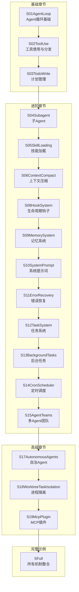
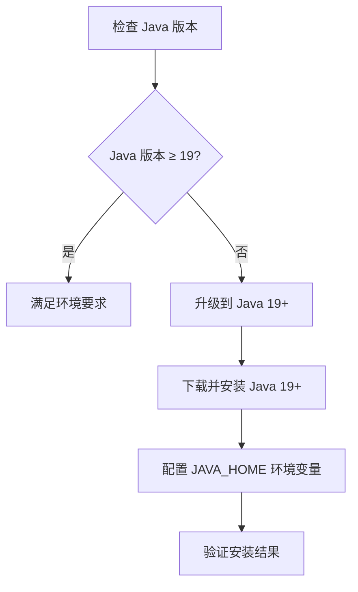
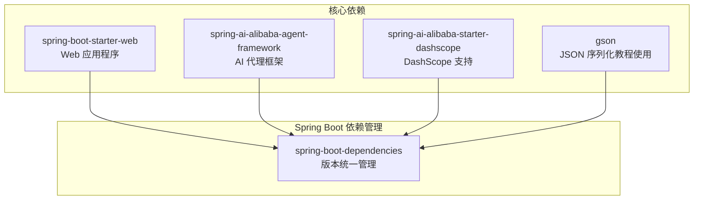
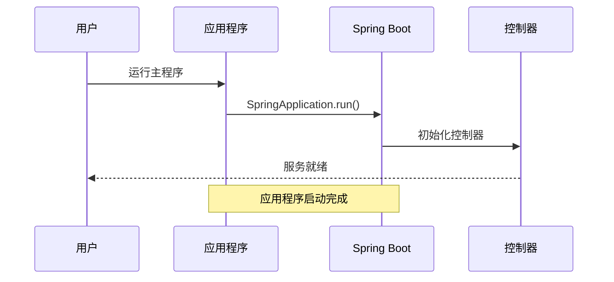
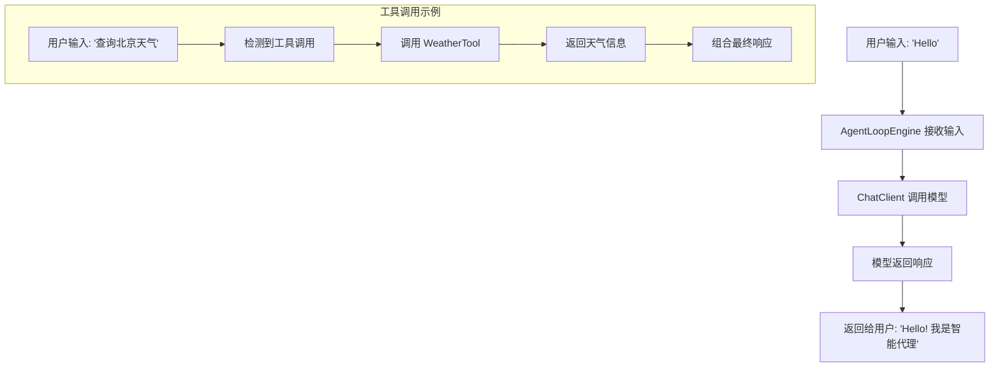
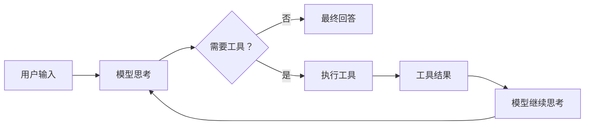
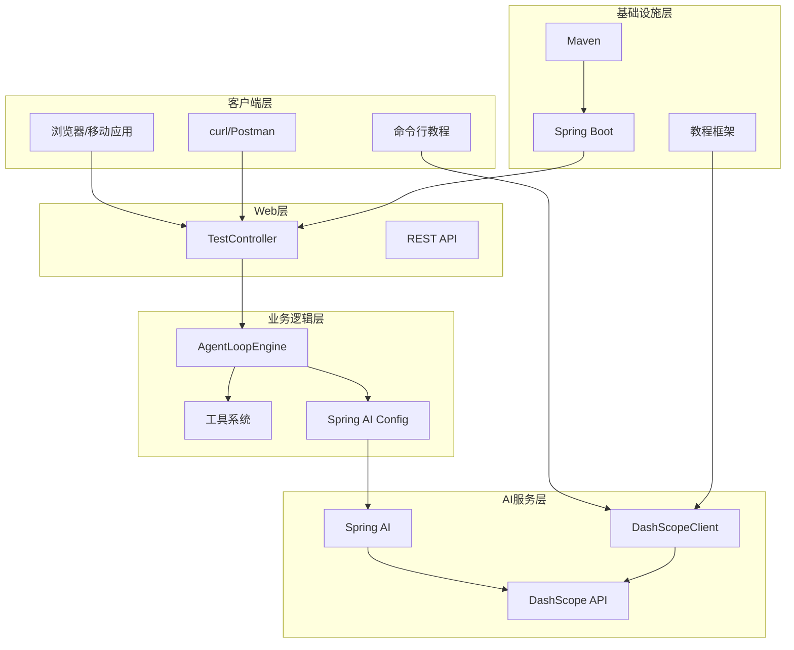
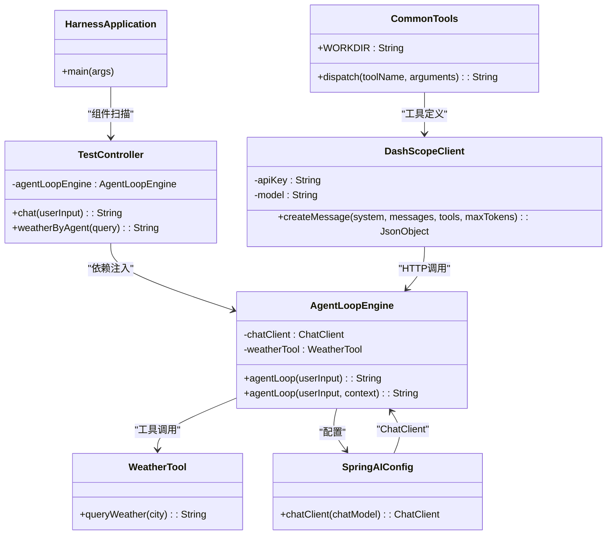
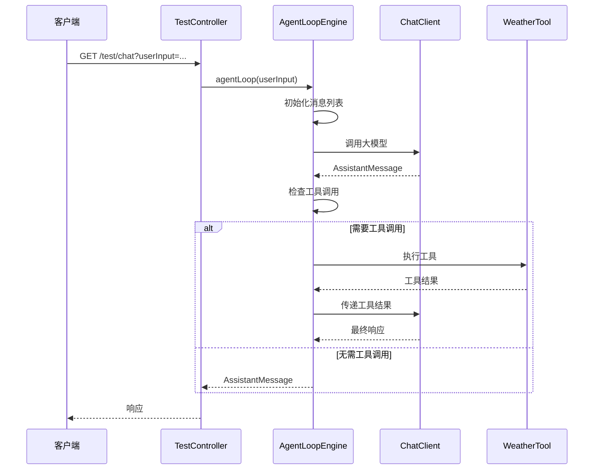

# 快速开始

<cite>
**本文档引用的文件**
- [pom.xml](file://pom.xml)
- [application.yml](file://src/main/resources/application.yml)
- [HarnessApplication.java](file://src/main/java/com/learn/harness/HarnessApplication.java)
- [TestController.java](file://src/main/java/com/learn/harness/TestController.java)
- [AgentLoopEngine.java](file://src/main/java/com/learn/harness/core/AgentLoopEngine.java)
- [SpringAIConfig.java](file://src/main/java/com/learn/harness/config/SpringAIConfig.java)
- [WeatherTool.java](file://src/main/java/com/learn/harness/tools/WeatherTool.java)
- [HELP.md](file://HELP.md)
- [BUILD.md](file://src/main/java/com/learn/harness/agent/BUILD.md)
- [S01AgentLoop.java](file://src/main/java/com/learn/harness/agent/S01AgentLoop.java)
- [S02ToolUse.java](file://src/main/java/com/learn/harness/agent/S02ToolUse.java)
- [S03TodoWrite.java](file://src/main/java/com/learn/harness/agent/S03TodoWrite.java)
- [CommonTools.java](file://src/main/java/com/learn/harness/agent/CommonTools.java)
- [DashScopeClient.java](file://src/main/java/com/learn/harness/agent/DashScopeClient.java)
</cite>

## 更新摘要
**所做更改**
- 新增完整的Java AI代理学习框架介绍
- 添加19个教程章节的详细说明（S01到S19）
- 更新构建指南和运行说明
- 增强Hello World示例和学习路径指导
- 完善架构概览和故障排除指南

## 目录
1. [简介](#简介)
2. [Java AI代理学习框架](#java-ai代理学习框架)
3. [环境要求](#环境要求)
4. [项目克隆与构建](#项目克隆与构建)
5. [配置说明](#配置说明)
6. [运行示例](#运行示例)
7. [Hello World 示例](#hello-world-示例)
8. [19个教程章节详解](#19个教程章节详解)
9. [常见问题与解决方案](#常见问题与解决方案)
10. [架构概览](#架构概览)
11. [故障排除指南](#故障排除指南)
12. [总结](#总结)

## 简介

learn-harness 是一个基于 Spring Boot 和 Spring AI Alibaba 的智能代理学习框架。该项目不仅展示了如何构建具备工具调用能力的智能代理系统，还提供了完整的19个教程章节，涵盖了从基础Agent循环到高级MCP插件的完整学习路径。

**核心特性**：
- 基于 Spring Boot 3.2.0 构建
- 集成 Spring AI Alibaba Agent Framework
- 支持 DashScope 大模型服务
- 提供工具调用机制（如天气查询）
- 包含完整的 REST API 接口
- **新增**：19个循序渐进的AI代理教程章节
- **新增**：独立的命令行教程运行方式

## Java AI代理学习框架

### 教程体系结构

learn-harness 提供了完整的AI代理学习路径，从基础概念到高级应用：



**图表来源**
- [BUILD.md:26-57](file://src/main/java/com/learn/harness/agent/BUILD.md#L26-L57)

### 学习路径建议

**推荐学习顺序**：
1. **S01AgentLoop** - 理解Agent循环的基本原理
2. **S02ToolUse** - 掌握工具分发机制
3. **S03TodoWrite** - 学习计划管理系统
4. **S04-S19** - 逐步学习高级功能
5. **SFull** - 综合应用所有学到的知识

**章节特色**：
- 每个章节在前一章基础上增加一个新机制
- 提供独立的命令行运行方式
- 包含详细的代码注释和示例

**章节来源**
- [BUILD.md:54-57](file://src/main/java/com/learn/harness/agent/BUILD.md#L54-L57)

## 环境要求

### Java 版本要求

项目要求使用 Java 19 或更高版本：



**图表来源**
- [pom.xml:10-15](file://pom.xml#L10-L15)

### Maven 要求

- Maven 3.6.0 或更高版本
- 支持 Maven 4.x

### 开发工具建议

- IntelliJ IDEA 或 Eclipse
- Git 版本控制工具
- Postman 或 curl 进行 API 测试

**章节来源**
- [pom.xml:10-15](file://pom.xml#L10-L15)
- [HELP.md:7-8](file://HELP.md#L7-L8)

## 项目克隆与构建

### 克隆项目

```bash
git clone <repository-url>
cd learn-harness
```

### 依赖管理

项目使用 Maven 作为依赖管理工具，核心依赖包括：



**图表来源**
- [pom.xml:16-47](file://pom.xml#L16-L47)

### 构建步骤

#### 主项目构建

1. **清理并编译项目**：
   ```bash
   mvn clean compile
   ```

2. **完整构建**：
   ```bash
   mvn clean package
   ```

3. **跳过测试构建**：
   ```bash
   mvn clean package -DskipTests
   ```

4. **验证构建结果**：
   ```bash
   mvn dependency:tree
   ```

#### 教程章节构建

**独立运行教程文件**：
```bash
# 设置环境变量（DashScope API Key）
export DASHSCOPE_API_KEY="sk-xxx"

# 可选：指定模型（默认 qwen-plus）
export DASHSCOPE_MODEL="qwen-plus"

# 编译
mvn compile

# 运行任意章节（示例：S01）
mvn exec:java -Dexec.mainClass="com.learn.harness.agent.S01AgentLoop"
```

**章节来源**
- [pom.xml:56-86](file://pom.xml#L56-L86)
- [BUILD.md:10-24](file://src/main/java/com/learn/harness/agent/BUILD.md#L10-L24)

## 配置说明

### 应用程序配置

应用程序配置位于 `src/main/resources/application.yml`，主要包含以下配置项：

```yaml
server:
  port: 8080

spring:
  application:
    name: learn-harness

  ai:
    dashscope:
      api-key: sk-a0486c756be34625a31787aa32ca37bb
      chat:
        options:
          model: qwen-plus
```

### 配置项详解

| 配置项 | 类型 | 默认值 | 描述 |
|--------|------|--------|------|
| server.port | Integer | 8080 | 应用程序监听端口 |
| spring.application.name | String | learn-harness | 应用程序名称 |
| spring.ai.dashscope.api-key | String | sk-a0486c756be34625a31787aa32ca37bb | DashScope API 密钥 |
| spring.ai.dashscope.chat.options.model | String | qwen-plus | 使用的模型名称 |

### DashScope API 密钥配置

要配置有效的 DashScope API 密钥：

1. **获取 API 密钥**：
   - 访问 DashScope 控制台
   - 创建新的 API 密钥
   - 复制密钥字符串

2. **更新配置文件**：
   ```yaml
   spring:
     ai:
       dashscope:
         api-key: YOUR_ACTUAL_API_KEY_HERE
   ```

3. **验证配置**：
   - 启动应用程序
   - 查看控制台输出
   - 确认连接成功

### 教程章节配置

**独立运行教程时的环境变量设置**：
```bash
# 设置 DashScope API Key
export DASHSCOPE_API_KEY="sk-你的实际API密钥"

# 可选：设置模型名称
export DASHSCOPE_MODEL="qwen-plus"

# 可选：设置工作目录
export WORKDIR="/path/to/working/directory"
```

**章节来源**
- [application.yml:1-13](file://src/main/resources/application.yml#L1-L13)

## 运行示例

### 启动应用程序

应用程序入口类为 `HarnessApplication`：



**图表来源**
- [HarnessApplication.java:9-11](file://src/main/java/com/learn/harness/HarnessApplication.java#L9-L11)

### 访问测试端点

项目提供了两个主要的测试端点：

#### 通用聊天端点

- **URL**: `GET /test/chat`
- **参数**: `userInput` (必需)
- **用途**: 通用的代理对话测试

**请求示例**：
```bash
curl "http://localhost:8080/test/chat?userInput=你好"
```

#### 天气查询端点

- **URL**: `GET /test/weather/agent`
- **参数**: `query` (必需)
- **用途**: 通过代理查询天气信息

**请求示例**：
```bash
curl "http://localhost:8080/test/weather/agent?query=北京今天天气怎么样？"
```

### 响应格式

所有端点都返回字符串格式的响应，包含代理的最终回复。

### 教程章节运行示例

**独立运行特定教程章节**：
```bash
# 运行S01章节（Agent循环）
mvn exec:java -Dexec.mainClass="com.learn.harness.agent.S01AgentLoop"

# 运行S02章节（工具使用）
mvn exec:java -Dexec.mainClass="com.learn.harness.agent.S02ToolUse"

# 运行S03章节（计划管理）
mvn exec:java -Dexec.mainClass="com.learn.harness.agent.S03TodoWrite"
```

**章节来源**
- [TestController.java:24-43](file://src/main/java/com/learn/harness/TestController.java#L24-L43)

## Hello World 示例

为了帮助开发者快速理解代理的工作原理，这里提供一个简单的 Hello World 示例：

### 基础交互流程



### 实际运行示例

1. **启动应用程序**：
   ```bash
   mvn spring-boot:run
   ```

2. **测试简单问候**：
   ```bash
   curl "http://localhost:8080/test/chat?userInput=你好"
   ```

3. **测试工具调用**：
   ```bash
   curl "http://localhost:8080/test/weather/agent?query=查询上海天气"
   ```

### 教程章节Hello World

**S01AgentLoop 章节的Hello World**：
```bash
# 设置API密钥
export DASHSCOPE_API_KEY="sk-你的密钥"

# 运行S01章节
mvn exec:java -Dexec.mainClass="com.learn.harness.agent.S01AgentLoop"

# 在命令行中输入任务，如："显示当前目录"
```

这个示例展示了代理的核心工作流程：接收用户输入 → 调用大模型 → 处理工具调用（如有） → 返回最终响应。

**章节来源**
- [AgentLoopEngine.java:96-182](file://src/main/java/com/learn/harness/core/AgentLoopEngine.java#L96-L182)
- [S01AgentLoop.java:136-165](file://src/main/java/com/learn/harness/agent/S01AgentLoop.java#L136-L165)

## 19个教程章节详解

### S01AgentLoop - Agent循环基础

**核心概念**：理解AI代理的基本循环模式



**学习要点**：
- Agent循环的基本结构
- 工具调用的必要性
- 循环终止条件

**章节来源**
- [S01AgentLoop.java:1-187](file://src/main/java/com/learn/harness/agent/S01AgentLoop.java#L1-L187)

### S02ToolUse - 工具使用与分发

**核心概念**：掌握工具分发机制

**工具类型**：
- `bash` - 执行Shell命令
- `read_file` - 读取文件内容
- `write_file` - 写入文件内容
- `edit_file` - 精确编辑文件

**学习要点**：
- 工具分发的switch映射
- 消息规范化处理
- 工具调用的安全检查

**章节来源**
- [S02ToolUse.java:1-190](file://src/main/java/com/learn/harness/agent/S02ToolUse.java#L1-L190)
- [CommonTools.java:262-280](file://src/main/java/com/learn/harness/agent/CommonTools.java#L262-L280)

### S03TodoWrite - 计划管理系统

**核心概念**：让模型管理自己的工作计划

**Todo状态管理**：
- `pending` - 待执行
- `in_progress` - 执行中  
- `completed` - 已完成

**学习要点**：
- 计划状态的强制聚焦
- 提醒机制的设计
- 计划项的数量限制

**章节来源**
- [S03TodoWrite.java:1-293](file://src/main/java/com/learn/harness/agent/S03TodoWrite.java#L1-L293)

### S04Subagent - 子Agent

**核心概念**：实现多Agent协作

**学习要点**：
- 子Agent的创建和管理
- Agent间的通信机制
- 任务分解和协调

### S05SkillLoading - 技能加载

**核心概念**：动态加载和管理Agent技能

**学习要点**：
- 技能的动态注册
- 技能的生命周期管理
- 技能间的依赖关系

### S06ContextCompact - 上下文压缩

**核心概念**：优化长对话的上下文管理

**学习要点**：
- 上下文窗口的限制
- 重要信息的保留策略
- 上下文压缩算法

### S08HookSystem - 生命周期钩子

**核心概念**：扩展Agent的生命周期事件

**学习要点**：
- 钩子函数的注册和执行
- 事件驱动的扩展机制
- 性能监控和日志记录

### S09MemorySystem - 记忆系统

**核心概念**：实现长期记忆和短期记忆

**学习要点**：
- 记忆的分类和存储
- 记忆检索和更新
- 记忆的持久化

### S10SystemPrompt - 系统提示词

**核心概念**：优化系统提示词的设计和管理

**学习要点**：
- 系统提示词的作用机制
- 提示词的模板化设计
- 动态提示词的生成

### S11ErrorRecovery - 错误恢复

**核心概念**：实现健壮的错误处理和恢复

**学习要点**：
- 错误类型的分类和处理
- 自动恢复机制的设计
- 错误日志和监控

### S12TaskSystem - 任务系统

**核心概念**：管理复杂的任务执行流程

**学习要点**：
- 任务的定义和分解
- 任务状态的跟踪
- 任务间的依赖关系

### S13BackgroundTasks - 后台任务

**核心概念**：实现异步和定时任务处理

**学习要点**：
- 后台任务的调度机制
- 任务的并发控制
- 任务的优先级管理

### S14CronScheduler - 定时调度

**核心概念**：实现精确的定时任务调度

**学习要点**：
- Cron表达式的解析和执行
- 任务的重复和取消
- 调度器的性能优化

### S15AgentTeams - 多Agent团队

**核心概念**：构建多Agent协作系统

**学习要点**：
- 团队成员的角色分工
- 团队协作的协议设计
- 冲突解决和决策机制

### S17AutonomousAgents - 自治Agent

**核心概念**：实现高度自治的Agent行为

**学习要点**：
- 自主决策的算法
- 目标导向的行为
- 学习和适应能力

### S18WorktreeTaskIsolation - 进程隔离

**核心概念**：实现任务执行的进程隔离

**学习要点**：
- 进程隔离的安全机制
- 资源的限制和监控
- 任务的沙箱执行

### S19McpPlugin - MCP插件

**核心概念**：实现MCP（Model Context Protocol）插件系统

**学习要点**：
- MCP协议的实现
- 插件的注册和发现
- 插件间的通信机制

### SFull - 完整机制整合

**核心概念**：综合应用所有学到的机制

**学习要点**：
- 各机制间的协调配合
- 系统的整体架构设计
- 性能优化和扩展性考虑

**章节来源**
- [BUILD.md:26-57](file://src/main/java/com/learn/harness/agent/BUILD.md#L26-L57)

## 常见问题与解决方案

### 环境问题

#### Java 版本不兼容

**问题症状**：
```
ERROR: Unknown VM option 'UseG1GC'
Error: Could not create the Java Virtual Machine.
Error: A fatal exception occurred. The Java Virtual Machine could not be created.
```

**解决方案**：
1. 检查 Java 版本：
   ```bash
   java -version
   ```
2. 升级到 Java 19+ 或使用兼容的版本
3. 更新 `JAVA_HOME` 环境变量

#### Maven 版本问题

**问题症状**：
```
[ERROR] The build could not read 1 project -> [Help 1]
...
[ERROR] The project uses an unsupported or unknown Maven version.
```

**解决方案**：
1. 检查 Maven 版本：
   ```bash
   mvn -v
   ```
2. 升级到 Maven 3.6.0+

### 配置问题

#### API 密钥无效

**问题症状**：
```
HTTP 401 Unauthorized
{
  "timestamp": "...",
  "status": 401,
  "error": "Unauthorized"
}
```

**解决方案**：
1. 在 `application.yml` 中更新有效的 API 密钥
2. 确保网络连接正常
3. 验证 DashScope 账户状态

#### 端口冲突

**问题症状**：
```
[ERROR] Port 8080 is already in use
```

**解决方案**：
1. 修改 `application.yml` 中的端口号
2. 关闭占用端口的其他应用程序
3. 使用随机端口分配

#### 环境变量未设置

**问题症状**：
```
RuntimeException: 请设置环境变量 DASHSCOPE_API_KEY
```

**解决方案**：
1. 设置 DashScope API Key：
   ```bash
   export DASHSCOPE_API_KEY="sk-你的实际API密钥"
   ```
2. 设置模型名称（可选）：
   ```bash
   export DASHSCOPE_MODEL="qwen-plus"
   ```

### 运行时问题

#### 依赖缺失

**问题症状**：
```
[ERROR] Failed to execute goal org.apache.maven.plugins:maven-compiler-plugin:3.8.1:compile
```

**解决方案**：
1. 清理并重新构建：
   ```bash
   mvn clean install
   ```
2. 检查网络连接以下载依赖
3. 配置代理（如需要）

#### 工具调用失败

**问题症状**：
```
Tool execution failed: ...
```

**解决方案**：
1. 检查工具实现
2. 验证工具参数格式
3. 查看详细的错误日志

#### 教程章节运行失败

**问题症状**：
```
Error: Could not find or load main class com.learn.harness.agent.S01AgentLoop
```

**解决方案**：
1. 确保已编译项目：
   ```bash
   mvn compile
   ```
2. 检查环境变量设置
3. 验证API密钥的有效性

**章节来源**
- [application.yml:1-13](file://src/main/resources/application.yml#L1-L13)
- [pom.xml:10-15](file://pom.xml#L10-L15)

## 架构概览

### 整体架构设计



**图表来源**
- [HarnessApplication.java:6-11](file://src/main/java/com/learn/harness/HarnessApplication.java#L6-L11)
- [TestController.java:11-16](file://src/main/java/com/learn/harness/TestController.java#L11-L16)
- [AgentLoopEngine.java:35-68](file://src/main/java/com/learn/harness/core/AgentLoopEngine.java#L35-L68)
- [DashScopeClient.java:25-60](file://src/main/java/com/learn/harness/agent/DashScopeClient.java#L25-L60)

### 核心组件关系



**图表来源**
- [HarnessApplication.java:7](file://src/main/java/com/learn/harness/HarnessApplication.java#L7)
- [TestController.java:15-16](file://src/main/java/com/learn/harness/TestController.java#L15-L16)
- [AgentLoopEngine.java:44-48](file://src/main/java/com/learn/harness/core/AgentLoopEngine.java#L44-L48)
- [SpringAIConfig.java:22](file://src/main/java/com/learn/harness/config/SpringAIConfig.java#L22)
- [DashScopeClient.java:49-60](file://src/main/java/com/learn/harness/agent/DashScopeClient.java#L49-L60)
- [CommonTools.java:23-27](file://src/main/java/com/learn/harness/agent/CommonTools.java#L23-L27)

### 数据流处理



**图表来源**
- [TestController.java:24-27](file://src/main/java/com/learn/harness/TestController.java#L24-L27)
- [AgentLoopEngine.java:96-182](file://src/main/java/com/learn/harness/core/AgentLoopEngine.java#L96-L182)

**章节来源**
- [AgentLoopEngine.java:187-199](file://src/main/java/com/learn/harness/core/AgentLoopEngine.java#L187-L199)
- [WeatherTool.java:30-42](file://src/main/java/com/learn/harness/tools/WeatherTool.java#L30-L42)

## 故障排除指南

### 启动问题诊断

#### 应用程序无法启动

**排查步骤**：
1. 检查端口占用：
   ```bash
   lsof -i :8080
   ```

2. 验证配置文件：
   ```bash
   cat src/main/resources/application.yml
   ```

3. 查看详细日志：
   ```bash
   mvn spring-boot:run -Dlogging.level.root=DEBUG
   ```

#### 依赖注入失败

**错误信息**：
```
Parameter 0 of constructor in ... requires a bean of type ... that could not be found
```

**解决方案**：
1. 确保组件被正确注解：
   ```java
   @Service
   @RestController
   @Configuration
   ```

2. 检查包扫描路径
3. 验证 Bean 生命周期

### 运行时问题诊断

#### API 调用超时

**解决方案**：
1. 检查网络连接
2. 增加重试机制
3. 调整超时配置

#### 工具调用异常

**调试方法**：
1. 启用详细日志：
   ```yaml
   logging:
     level:
       com.learn.harness: DEBUG
   ```

2. 检查工具实现
3. 验证参数格式

#### 教程章节运行问题

**调试方法**：
1. 检查环境变量：
   ```bash
   echo $DASHSCOPE_API_KEY
   echo $DASHSCOPE_MODEL
   ```

2. 验证API密钥有效性
3. 检查工作目录权限

### 性能优化建议

#### 内存管理

- 合理设置 JVM 参数
- 监控内存使用情况
- 及时释放资源

#### 并发处理

- 配置合适的线程池大小
- 使用异步处理
- 实现请求限流

**章节来源**
- [AgentLoopEngine.java:170-174](file://src/main/java/com/learn/harness/core/AgentLoopEngine.java#L170-L174)
- [WeatherTool.java:38-41](file://src/main/java/com/learn/harness/tools/WeatherTool.java#L38-L41)

## 总结

learn-harness 项目为开发者提供了一个完整的智能代理系统学习平台，具有以下特点：

### 主要优势

1. **完整的开发环境**：预配置的 Maven 项目结构
2. **清晰的架构设计**：分层架构便于理解和扩展
3. **实用的功能演示**：包含工具调用和天气查询示例
4. **详细的配置说明**：涵盖所有必要的配置项
5. ****新增**：19个循序渐进的教程章节，覆盖从基础到高级的完整学习路径
6. ****新增**：独立的命令行运行方式，便于学习和测试

### 学习价值

- 理解 Spring AI Alibaba 的集成方式
- 掌握工具调用机制的实现
- 学习代理循环的设计模式
- 了解 DashScope API 的使用方法
- **掌握19个AI代理核心概念和实现技巧**
- **学会独立运行和调试AI代理教程**

### 扩展方向

开发者可以在此基础上进行以下扩展：
- 添加更多工具实现
- 集成其他大模型服务
- 实现持久化存储
- 添加认证和授权机制
- 集成监控和日志系统
- **基于教程框架开发自定义AI代理功能**

通过本快速开始指南，您应该能够成功搭建和运行 learn-harness 项目，并理解其核心工作机制。建议在理解基础概念后，按照推荐的学习顺序逐步探索各个教程章节，深入学习AI代理系统的实现细节和最佳实践。

**章节来源**
- [BUILD.md:54-57](file://src/main/java/com/learn/harness/agent/BUILD.md#L54-L57)
- [S01AgentLoop.java:136-165](file://src/main/java/com/learn/harness/agent/S01AgentLoop.java#L136-L165)