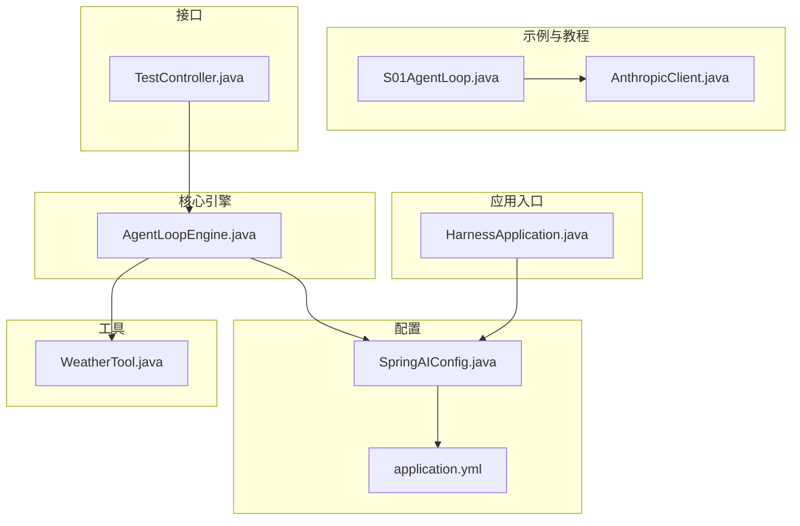
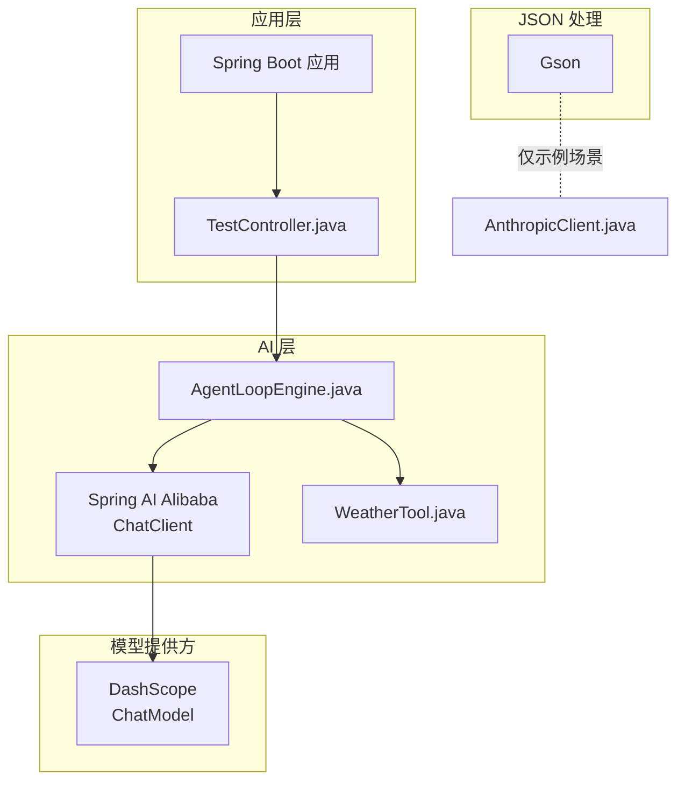
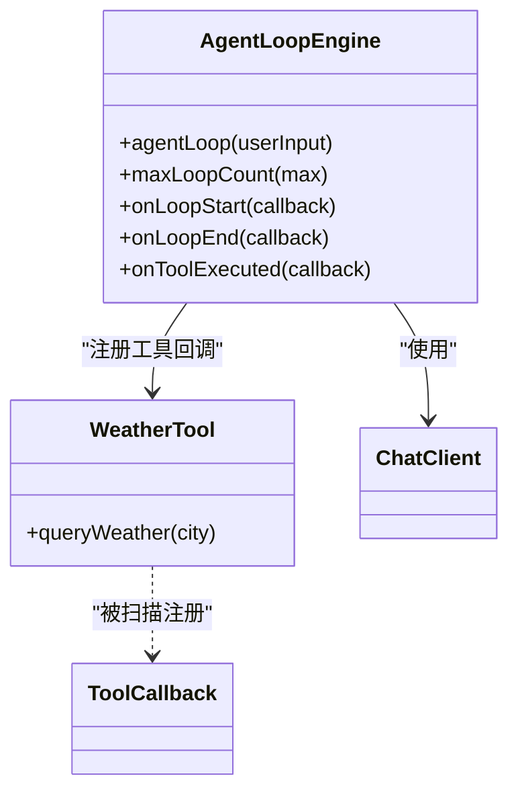
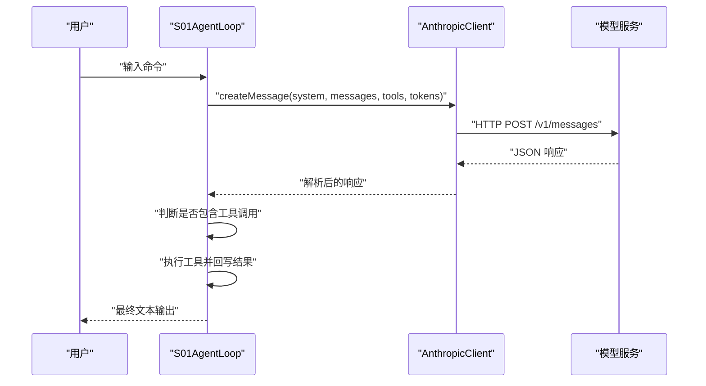
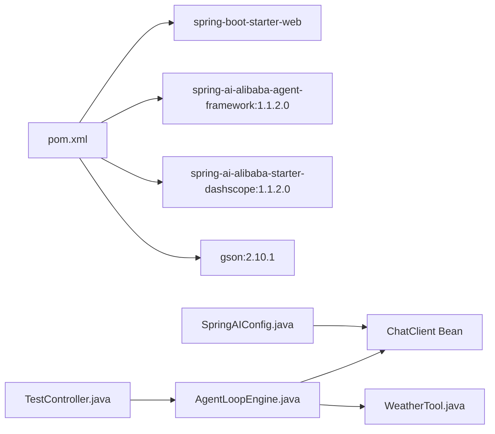

# 技术选型

<cite>
**本文引用的文件**
- [pom.xml](file://pom.xml)
- [HarnessApplication.java](file://src/main/java/com/learn/harness/HarnessApplication.java)
- [SpringAIConfig.java](file://src/main/java/com/learn/harness/config/SpringAIConfig.java)
- [AgentLoopEngine.java](file://src/main/java/com/learn/harness/core/AgentLoopEngine.java)
- [TestController.java](file://src/main/java/com/learn/harness/TestController.java)
- [AnthropicClient.java](file://src/main/java/com/learn/harness/agent/AnthropicClient.java)
- [S01AgentLoop.java](file://src/main/java/com/learn/harness/agent/S01AgentLoop.java)
- [WeatherTool.java](file://src/main/java/com/learn/harness/tools/WeatherTool.java)
- [application.yml](file://src/main/resources/application.yml)
- [BUILD.md](file://src/main/java/com/learn/harness/agent/BUILD.md)
- [HarnessApplicationTests.java](file://src/test/java/com/learn/harness/HarnessApplicationTests.java)
</cite>

## 目录
1. [引言](#引言)
2. [项目结构](#项目结构)
3. [核心组件](#核心组件)
4. [架构总览](#架构总览)
5. [详细组件分析](#详细组件分析)
6. [依赖分析](#依赖分析)
7. [性能考量](#性能考量)
8. [故障排查指南](#故障排查指南)
9. [结论](#结论)
10. [附录](#附录)

## 引言
本技术选型文档围绕 learn-harness 项目的技术栈选择进行系统化说明，重点包括：
- Spring Boot 3.2.0 作为应用框架
- Spring AI Alibaba 1.1.2.0 作为 AI 代理框架
- DashScope 作为模型提供商
- Gson 作为 JSON 处理库

文档将解释每个技术选择的原因、优势与限制，对比替代方案，并给出版本兼容性与升级路径建议，同时提供依赖关系图与技术栈架构图，最后给出技术选型变更与扩展的指导原则。

## 项目结构
项目采用基于模块的分层组织方式，核心目录与职责如下：
- src/main/java/com/learn/harness
  - agent：示例与教程类（S01~S19），包含基础代理循环与工具使用演示
  - config：Spring AI 配置（ChatClient Bean）
  - core：核心引擎（AgentLoopEngine）与工具回调机制
  - tools：工具定义（示例：WeatherTool）
  - 测试控制器（TestController）提供 REST 接口
- src/main/resources：应用配置（application.yml）

图表来源
- [HarnessApplication.java:1-14](file://src/main/java/com/learn/harness/HarnessApplication.java#L1-L14)
- [SpringAIConfig.java:1-26](file://src/main/java/com/learn/harness/config/SpringAIConfig.java#L1-L26)
- [application.yml:1-13](file://src/main/resources/application.yml#L1-L13)
- [AgentLoopEngine.java:1-353](file://src/main/java/com/learn/harness/core/AgentLoopEngine.java#L1-L353)
- [WeatherTool.java:1-66](file://src/main/java/com/learn/harness/tools/WeatherTool.java#L1-L66)
- [TestController.java:1-45](file://src/main/java/com/learn/harness/TestController.java#L1-L45)
- [S01AgentLoop.java:1-177](file://src/main/java/com/learn/harness/agent/S01AgentLoop.java#L1-L177)
- [AnthropicClient.java:1-127](file://src/main/java/com/learn/harness/agent/AnthropicClient.java#L1-L127)

章节来源
- [pom.xml:1-95](file://pom.xml#L1-L95)
- [HarnessApplication.java:1-14](file://src/main/java/com/learn/harness/HarnessApplication.java#L1-L14)
- [application.yml:1-13](file://src/main/resources/application.yml#L1-L13)

## 核心组件
- Spring Boot 3.2.0：提供 Web 启动能力与自动装配，简化配置与部署
- Spring AI Alibaba 1.1.2.0：提供 ChatClient 与工具回调机制，支持多模型适配
- DashScope：作为 ChatModel 提供商，通过 starter-dashscope 自动装配
- Gson：用于 AnthropicClient 的 JSON 序列化与解析

章节来源
- [pom.xml:14-47](file://pom.xml#L14-L47)
- [SpringAIConfig.java:16-24](file://src/main/java/com/learn/harness/config/SpringAIConfig.java#L16-L24)
- [application.yml:8-13](file://src/main/resources/application.yml#L8-L13)
- [AnthropicClient.java:26-26](file://src/main/java/com/learn/harness/agent/AnthropicClient.java#L26-L26)

## 架构总览
整体架构以 Spring Boot 为核心，结合 Spring AI Alibaba 的 ChatClient 与工具回调，实现“对话—工具调用—结果回写”的代理循环；DashScope 作为模型提供方，通过 starter 自动注入 ChatModel；Gson 用于特定场景下的 JSON 处理。

图表来源
- [TestController.java:11-45](file://src/main/java/com/learn/harness/TestController.java#L11-L45)
- [AgentLoopEngine.java:34-68](file://src/main/java/com/learn/harness/core/AgentLoopEngine.java#L34-L68)
- [SpringAIConfig.java:14-25](file://src/main/java/com/learn/harness/config/SpringAIConfig.java#L14-L25)
- [application.yml:8-13](file://src/main/resources/application.yml#L8-L13)
- [AnthropicClient.java:20-40](file://src/main/java/com/learn/harness/agent/AnthropicClient.java#L20-L40)

## 详细组件分析

### Spring Boot 3.2.0
- 选择原因
  - 现代化 Java 版本支持（Java 19）与生产就绪特性
  - 与 Spring 生态无缝集成，简化 Web 与测试配置
- 优势
  - 快速启动、自动装配、内嵌服务器
  - 与 Spring AI Alibaba 协同良好
- 限制
  - 需要较高的 JDK 版本要求
  - 与旧版依赖可能存在兼容问题
- 替代方案
  - Spring Boot 2.x：兼容性更好但缺少新特性
  - Quarkus/Micronaut：更轻量但学习曲线更高
- 升级路径
  - 保持 JDK 与 Spring Boot 主版本一致
  - 逐步迁移测试与依赖至新版本

章节来源
- [pom.xml:10-15](file://pom.xml#L10-L15)
- [HarnessApplication.java:6-11](file://src/main/java/com/learn/harness/HarnessApplication.java#L6-L11)
- [HarnessApplicationTests.java:6-11](file://src/test/java/com/learn/harness/HarnessApplicationTests.java#L6-L11)

### Spring AI Alibaba 1.1.2.0
- 选择原因
  - 提供统一的 ChatClient 与工具回调抽象，便于扩展
  - 与 DashScope 等模型提供商集成度高
- 优势
  - 易于接入不同模型提供商
  - 工具回调机制简化了工具编排
- 限制
  - 仍处于较新版本，生态与文档相对有限
  - 对复杂场景可能需要自定义扩展
- 替代方案
  - Spring AI 官方 Starter：社区更成熟但适配器较少
  - 自研 HTTP 客户端：灵活性高但开发成本大
- 升级路径
  - 关注官方发布节奏，优先升级补丁版本
  - 在本地充分测试后再升级

章节来源
- [pom.xml:28-40](file://pom.xml#L28-L40)
- [SpringAIConfig.java:14-25](file://src/main/java/com/learn/harness/config/SpringAIConfig.java#L14-L25)
- [AgentLoopEngine.java:44-48](file://src/main/java/com/learn/harness/core/AgentLoopEngine.java#L44-L48)

### DashScope 作为模型提供商
- 选择原因
  - 国内可用性与稳定性较好，适配国内开发者需求
  - starter-dashscope 提供开箱即用的 ChatModel 自动装配
- 优势
  - 配置简单、易于切换模型
  - 与 Spring AI Alibaba 协同良好
- 限制
  - 受网络与配额影响
  - 国外部署需额外考虑合规与访问策略
- 替代方案
  - OpenAI/Anthropic：生态成熟但接入成本较高
  - 本地模型：可控性强但资源与训练成本高
- 升级路径
  - 通过 application.yml 动态切换模型
  - 保留抽象层以便后续替换

章节来源
- [pom.xml:35-40](file://pom.xml#L35-L40)
- [application.yml:8-13](file://src/main/resources/application.yml#L8-L13)

### Gson 作为 JSON 处理库
- 选择原因
  - 在示例与教程类（如 AnthropicClient）中用于 JSON 序列化与解析
  - 轻量、易用、与 Java 类型映射友好
- 优势
  - API 简洁，适合快速原型与教学示例
- 限制
  - 不如 Jackson 功能丰富，不适合复杂场景
  - 性能与内存占用略逊于 Jackson
- 替代方案
  - Jackson：功能强大、性能优异，适合生产环境
  - Moshi/MapX：轻量或特定场景优化
- 升级路径
  - 生产环境建议迁移到 Jackson
  - 示例与教程可继续使用 Gson

章节来源
- [pom.xml:42-47](file://pom.xml#L42-L47)
- [AnthropicClient.java:26-26](file://src/main/java/com/learn/harness/agent/AnthropicClient.java#L26-L26)
- [S01AgentLoop.java:21-21](file://src/main/java/com/learn/harness/agent/S01AgentLoop.java#L21-L21)

### 核心引擎与工具回调机制
- AgentLoopEngine 负责：
  - 维护消息历史与最大循环次数
  - 调用 ChatClient 并处理工具调用
  - 执行工具回调并将结果回写到上下文
- WeatherTool 展示了如何通过 @Tool 注解声明工具

图表来源
- [AgentLoopEngine.java:34-68](file://src/main/java/com/learn/harness/core/AgentLoopEngine.java#L34-L68)
- [WeatherTool.java:17-42](file://src/main/java/com/learn/harness/tools/WeatherTool.java#L17-L42)

章节来源
- [AgentLoopEngine.java:96-182](file://src/main/java/com/learn/harness/core/AgentLoopEngine.java#L96-L182)
- [WeatherTool.java:30-42](file://src/main/java/com/learn/harness/tools/WeatherTool.java#L30-L42)

### 示例与教程流程（S01AgentLoop 与 AnthropicClient）
- S01AgentLoop 展示最小可用代理循环：用户消息 → 模型回复 → 工具调用 → 追加工具结果 → 继续
- AnthropicClient 提供 HTTP 请求与 JSON 解析，演示了 Gson 的使用

图表来源
- [S01AgentLoop.java:100-131](file://src/main/java/com/learn/harness/agent/S01AgentLoop.java#L100-L131)
- [AnthropicClient.java:51-88](file://src/main/java/com/learn/harness/agent/AnthropicClient.java#L51-L88)

章节来源
- [S01AgentLoop.java:1-177](file://src/main/java/com/learn/harness/agent/S01AgentLoop.java#L1-L177)
- [AnthropicClient.java:1-127](file://src/main/java/com/learn/harness/agent/AnthropicClient.java#L1-L127)

## 依赖分析
- Maven 依赖管理
  - Spring Boot 3.2.0：集中管理所有 Spring 生态依赖
  - Spring AI Alibaba Agent Framework 1.1.2.0：提供代理框架能力
  - spring-ai-alibaba-starter-dashscope 1.1.2.0：自动装配 DashScope ChatModel
  - Gson 2.10.1：JSON 序列化与反序列化
- 运行时依赖关系
  - ChatClient 由 Spring AI 配置创建
  - AgentLoopEngine 注入 ChatClient 与工具回调
  - TestController 通过 REST 接口调用 AgentLoopEngine

图表来源
- [pom.xml:16-47](file://pom.xml#L16-L47)
- [SpringAIConfig.java:21-24](file://src/main/java/com/learn/harness/config/SpringAIConfig.java#L21-L24)
- [AgentLoopEngine.java:44-48](file://src/main/java/com/learn/harness/core/AgentLoopEngine.java#L44-L48)
- [TestController.java:15-27](file://src/main/java/com/learn/harness/TestController.java#L15-L27)

章节来源
- [pom.xml:16-60](file://pom.xml#L16-L60)
- [SpringAIConfig.java:14-25](file://src/main/java/com/learn/harness/config/SpringAIConfig.java#L14-L25)
- [AgentLoopEngine.java:34-68](file://src/main/java/com/learn/harness/core/AgentLoopEngine.java#L34-L68)

## 性能考量
- 模型调用延迟与并发
  - DashScope ChatModel 的请求延迟与并发数直接影响用户体验
  - 建议在生产环境引入连接池与超时控制
- 工具执行开销
  - 工具回调执行可能带来额外开销，建议对工具结果进行缓存与去重
- JSON 处理
  - Gson 轻量但不如 Jackson 高效，生产环境建议迁移到 Jackson
- JVM 与容器化
  - 使用 Java 19 的新特性提升性能，结合容器资源限制与 GC 调优

## 故障排查指南
- 模型提供商配置
  - 检查 application.yml 中的 api-key 与 model 名称
  - 确认网络可达性与配额限制
- ChatClient 与 Bean 注入
  - 确保 Spring AI 配置类正确创建 ChatClient Bean
  - 核对 ChatModel 是否由 starter 正确自动装配
- 工具回调
  - 确认工具类被扫描并注册为 ToolCallback
  - 检查工具参数解析与返回值格式
- 示例与教程
  - S01AgentLoop 依赖 AnthropicClient，确保环境变量设置正确
  - 如需 DashScope，可参考 Spring AI Alibaba 文档切换 ChatModel

章节来源
- [application.yml:8-13](file://src/main/resources/application.yml#L8-L13)
- [SpringAIConfig.java:21-24](file://src/main/java/com/learn/harness/config/SpringAIConfig.java#L21-L24)
- [AgentLoopEngine.java:58-68](file://src/main/java/com/learn/harness/core/AgentLoopEngine.java#L58-L68)
- [AnthropicClient.java:28-40](file://src/main/java/com/learn/harness/agent/AnthropicClient.java#L28-L40)
- [BUILD.md:22-28](file://src/main/java/com/learn/harness/agent/BUILD.md#L22-L28)

## 结论
本项目的技术选型以 Spring Boot 3.2.0 为基础，结合 Spring AI Alibaba 1.1.2.0 与 DashScope，构建了简洁高效的 AI 代理框架；Gson 在示例场景中提供了便利的 JSON 处理能力。该组合在教学与原型阶段具备高可读性与易用性，同时为后续扩展与迁移预留了空间。生产化落地时建议关注性能优化与依赖替换（如 Jackson），并完善监控与容错机制。

## 附录

### 版本兼容性与升级路径
- Spring Boot 3.2.0
  - JDK 19+，与 Spring AI Alibaba 1.1.2.0 兼容
  - 升级时优先检查依赖冲突与自动装配行为变化
- Spring AI Alibaba 1.1.2.0
  - 与 DashScope starter 1.1.2.0 保持版本一致
  - 关注工具回调与 ChatClient API 的演进
- DashScope
  - 通过 application.yml 切换模型，注意不同模型的参数差异
- Gson 2.10.1
  - 生产环境建议迁移到 Jackson 以获得更好的性能与功能

章节来源
- [pom.xml:14-47](file://pom.xml#L14-L47)
- [application.yml:8-13](file://src/main/resources/application.yml#L8-L13)

### 技术选型变更与扩展指导原则
- 保持“配置可插拔”：通过配置文件与自动装配隔离具体实现
- 优先使用 Spring AI Alibaba 的抽象层，避免直接绑定特定模型提供商
- 工具扩展遵循“声明式注册”，通过注解与回调机制统一管理
- 生产化改造建议
  - 将 Gson 替换为 Jackson
  - 引入限流、熔断与重试机制
  - 增加链路追踪与指标采集
  - 完善异常处理与可观测性