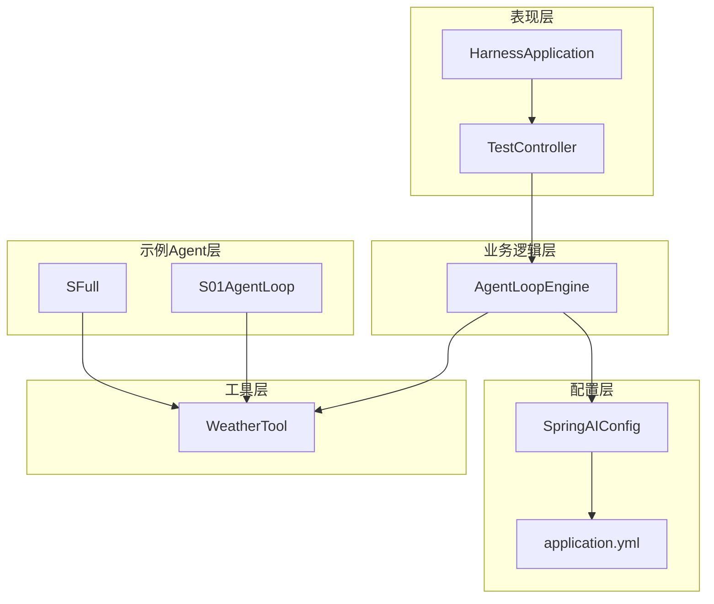
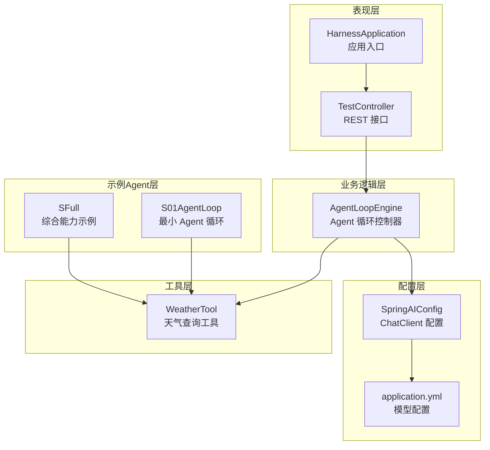
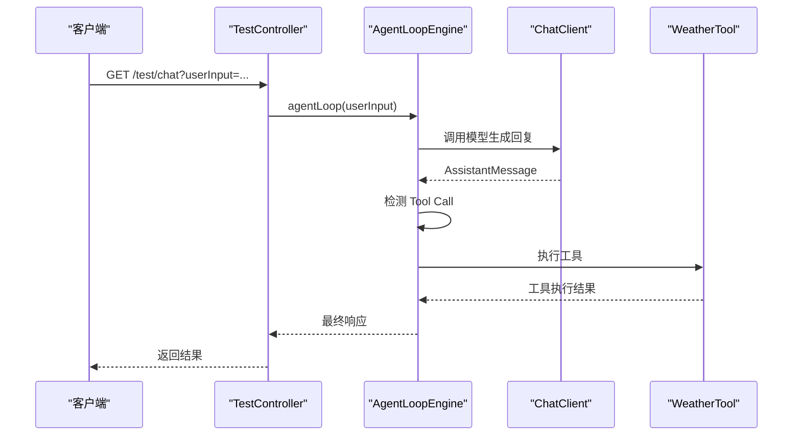
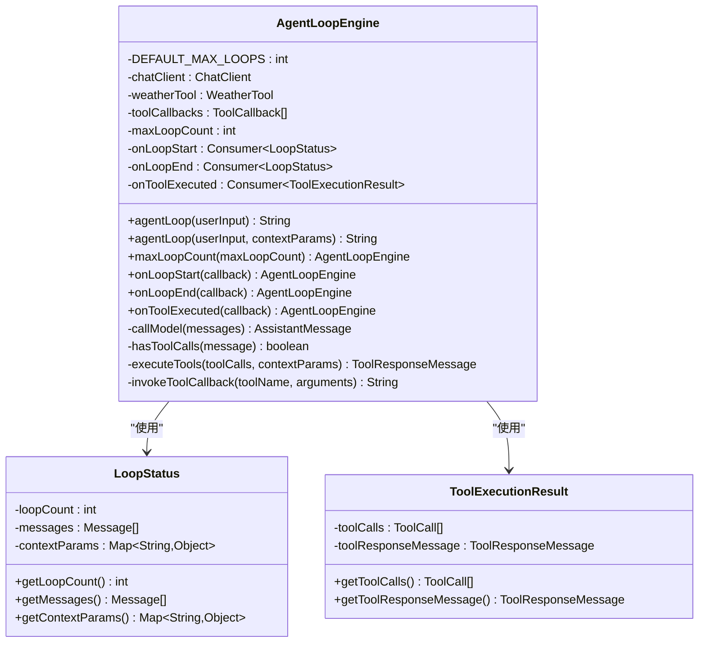
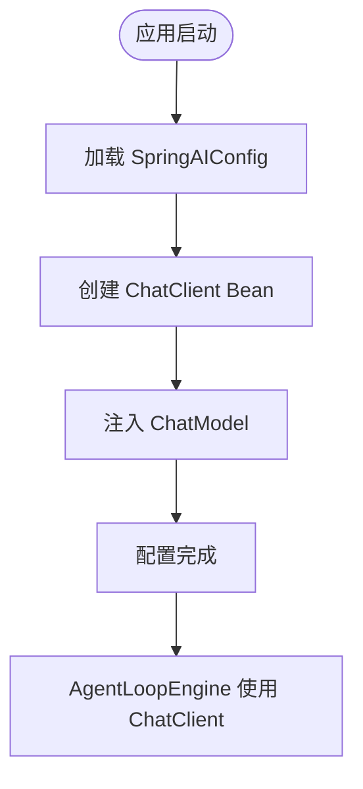
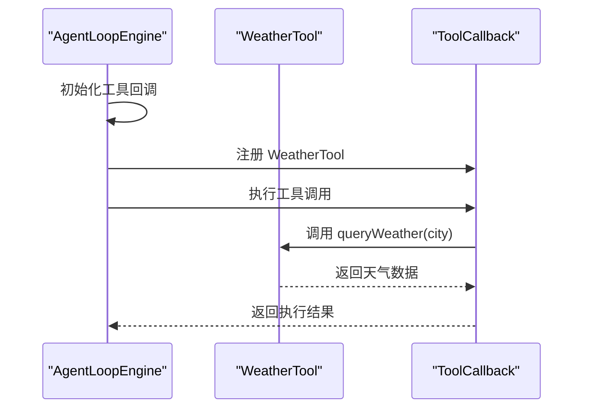
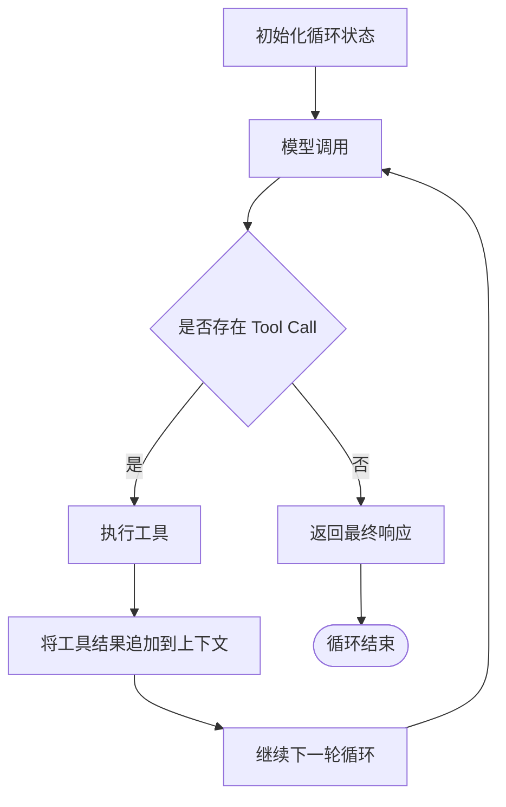
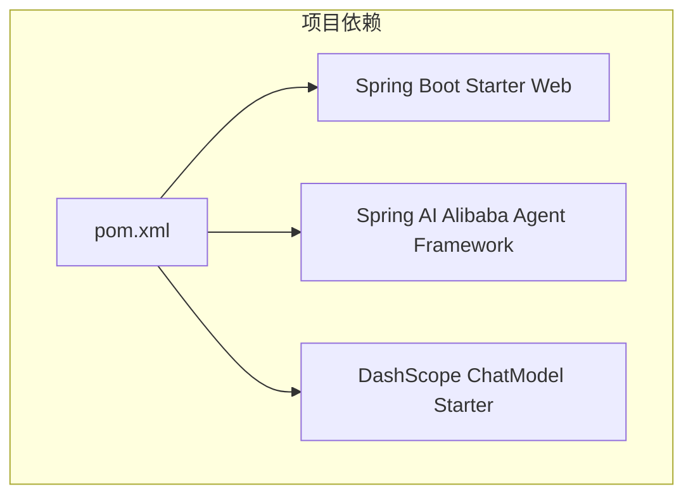

# 整体架构

<cite>
**本文档引用的文件**
- [HarnessApplication.java](file://src/main/java/com/learn/harness/HarnessApplication.java)
- [TestController.java](file://src/main/java/com/learn/harness/TestController.java)
- [SpringAIConfig.java](file://src/main/java/com/learn/harness/config/SpringAIConfig.java)
- [AgentLoopEngine.java](file://src/main/java/com/learn/harness/core/AgentLoopEngine.java)
- [WeatherTool.java](file://src/main/java/com/learn/harness/tools/WeatherTool.java)
- [S01AgentLoop.java](file://src/main/java/com/learn/harness/agent/S01AgentLoop.java)
- [SFull.java](file://src/main/java/com/learn/harness/agent/SFull.java)
- [application.yml](file://src/main/resources/application.yml)
- [pom.xml](file://pom.xml)
- [README.md](file://README.md)
</cite>

## 目录
1. [简介](#简介)
2. [项目结构](#项目结构)
3. [核心组件](#核心组件)
4. [架构总览](#架构总览)
5. [详细组件分析](#详细组件分析)
6. [依赖关系分析](#依赖关系分析)
7. [性能考虑](#性能考虑)
8. [故障排除指南](#故障排除指南)
9. [结论](#结论)

## 简介
本项目是一个基于 Spring Boot 和 Spring AI 的渐进式学习框架，旨在通过模块化的分层架构展示智能体（Agent）系统的构建方式。项目采用表现层（REST API）、业务逻辑层（AgentLoopEngine）、配置层（SpringAIConfig）的清晰职责划分，并通过 agent、config、core、tool 等包实现模块化设计，支持逐步扩展和功能迭代。

## 项目结构
项目采用基于包的模块化组织方式，遵循“表现层-业务层-配置层”的分层设计原则，同时在业务层内部进一步细分为核心引擎与工具系统，便于功能扩展和维护。

**图表来源**
- [TestController.java:1-45](file://src/main/java/com/learn/harness/TestController.java#L1-L45)
- [HarnessApplication.java:1-14](file://src/main/java/com/learn/harness/HarnessApplication.java#L1-L14)
- [AgentLoopEngine.java:1-353](file://src/main/java/com/learn/harness/core/AgentLoopEngine.java#L1-L353)
- [SpringAIConfig.java:1-26](file://src/main/java/com/learn/harness/config/SpringAIConfig.java#L1-L26)
- [application.yml:1-13](file://src/main/resources/application.yml#L1-L13)
- [WeatherTool.java:1-66](file://src/main/java/com/learn/harness/tools/WeatherTool.java#L1-L66)
- [S01AgentLoop.java:1-177](file://src/main/java/com/learn/harness/agent/S01AgentLoop.java#L1-L177)
- [SFull.java:1-640](file://src/main/java/com/learn/harness/agent/SFull.java#L1-L640)

**章节来源**
- [HarnessApplication.java:1-14](file://src/main/java/com/learn/harness/HarnessApplication.java#L1-L14)
- [TestController.java:1-45](file://src/main/java/com/learn/harness/TestController.java#L1-L45)
- [SpringAIConfig.java:1-26](file://src/main/java/com/learn/harness/config/SpringAIConfig.java#L1-L26)
- [AgentLoopEngine.java:1-353](file://src/main/java/com/learn/harness/core/AgentLoopEngine.java#L1-L353)
- [WeatherTool.java:1-66](file://src/main/java/com/learn/harness/tools/WeatherTool.java#L1-L66)
- [S01AgentLoop.java:1-177](file://src/main/java/com/learn/harness/agent/S01AgentLoop.java#L1-L177)
- [SFull.java:1-640](file://src/main/java/com/learn/harness/agent/SFull.java#L1-L640)
- [application.yml:1-13](file://src/main/resources/application.yml#L1-L13)
- [pom.xml:1-89](file://pom.xml#L1-L89)
- [README.md:1-3](file://README.md#L1-L3)

## 核心组件
本节深入分析项目的核心组件及其职责边界，重点解释分层架构的设计理念与模块化实现方式。

- 表现层（REST API）
  - TestController：提供 REST 接口，将用户输入传递给 AgentLoopEngine 并返回响应；支持通用对话与天气查询两种场景。
  - HarnessApplication：Spring Boot 应用入口，负责启动 Web 服务。
- 业务逻辑层（AgentLoopEngine）
  - 核心职责：管理多轮对话消息历史、处理 Tool Call 执行循环、支持最大循环次数控制、提供状态回调与日志记录。
  - 关键机制：通过 ChatClient 调用模型，自动注册工具回调，执行工具并回写结果，形成闭环。
- 配置层（SpringAIConfig）
  - 职责：定义 ChatClient Bean，集成 DashScope ChatModel，为业务层提供统一的模型访问接口。
- 工具层（WeatherTool）
  - 职责：提供天气查询工具，通过 @Tool 注解声明工具能力，支持 JSON 格式的参数与返回值。

**章节来源**
- [TestController.java:18-44](file://src/main/java/com/learn/harness/TestController.java#L18-L44)
- [HarnessApplication.java:9-11](file://src/main/java/com/learn/harness/HarnessApplication.java#L9-L11)
- [AgentLoopEngine.java:25-353](file://src/main/java/com/learn/harness/core/AgentLoopEngine.java#L25-L353)
- [SpringAIConfig.java:8-25](file://src/main/java/com/learn/harness/config/SpringAIConfig.java#L8-L25)
- [WeatherTool.java:12-66](file://src/main/java/com/learn/harness/tools/WeatherTool.java#L12-L66)

## 架构总览
本项目采用三层架构与模块化设计相结合的方式，通过清晰的职责划分与依赖关系，实现渐进式学习与功能扩展。

**图表来源**
- [TestController.java:11-44](file://src/main/java/com/learn/harness/TestController.java#L11-L44)
- [HarnessApplication.java:6-11](file://src/main/java/com/learn/harness/HarnessApplication.java#L6-L11)
- [AgentLoopEngine.java:34-68](file://src/main/java/com/learn/harness/core/AgentLoopEngine.java#L34-L68)
- [SpringAIConfig.java:13-25](file://src/main/java/com/learn/harness/config/SpringAIConfig.java#L13-L25)
- [application.yml:8-13](file://src/main/resources/application.yml#L8-L13)
- [WeatherTool.java:17-42](file://src/main/java/com/learn/harness/tools/WeatherTool.java#L17-L42)
- [S01AgentLoop.java:23-131](file://src/main/java/com/learn/harness/agent/S01AgentLoop.java#L23-L131)
- [SFull.java:36-506](file://src/main/java/com/learn/harness/agent/SFull.java#L36-L506)

## 详细组件分析

### 表现层组件分析
表现层通过 TestController 提供 REST 接口，将用户输入传递给 AgentLoopEngine 并返回响应。该设计使得业务逻辑与表现层解耦，便于后续扩展新的接口或适配不同的前端。

**图表来源**
- [TestController.java:24-27](file://src/main/java/com/learn/harness/TestController.java#L24-L27)
- [AgentLoopEngine.java:96-182](file://src/main/java/com/learn/harness/core/AgentLoopEngine.java#L96-L182)
- [WeatherTool.java:30-42](file://src/main/java/com/learn/harness/tools/WeatherTool.java#L30-L42)

**章节来源**
- [TestController.java:18-44](file://src/main/java/com/learn/harness/TestController.java#L18-L44)
- [HarnessApplication.java:9-11](file://src/main/java/com/learn/harness/HarnessApplication.java#L9-L11)

### 业务逻辑层组件分析
AgentLoopEngine 是系统的核心，负责管理多轮对话、处理 Tool Call 循环、控制最大循环次数并提供回调机制。其设计体现了高内聚低耦合的原则，通过依赖注入与回调机制实现灵活扩展。

**图表来源**
- [AgentLoopEngine.java:34-353](file://src/main/java/com/learn/harness/core/AgentLoopEngine.java#L34-L353)

**章节来源**
- [AgentLoopEngine.java:25-353](file://src/main/java/com/learn/harness/core/AgentLoopEngine.java#L25-L353)

### 配置层组件分析
SpringAIConfig 通过 @Configuration 定义 ChatClient Bean，集成 DashScope ChatModel，为业务层提供统一的模型访问接口。application.yml 提供模型配置参数，确保配置与代码分离。

**图表来源**
- [SpringAIConfig.java:13-25](file://src/main/java/com/learn/harness/config/SpringAIConfig.java#L13-L25)
- [application.yml:8-13](file://src/main/resources/application.yml#L8-L13)

**章节来源**
- [SpringAIConfig.java:8-25](file://src/main/java/com/learn/harness/config/SpringAIConfig.java#L8-L25)
- [application.yml:8-13](file://src/main/resources/application.yml#L8-L13)

### 工具层组件分析
WeatherTool 通过 @Tool 注解声明工具能力，支持 JSON 格式的参数与返回值。AgentLoopEngine 通过 ToolCallbacks 自动注册工具回调，实现工具的动态发现与执行。

**图表来源**
- [AgentLoopEngine.java:58-68](file://src/main/java/com/learn/harness/core/AgentLoopEngine.java#L58-L68)
- [WeatherTool.java:30-42](file://src/main/java/com/learn/harness/tools/WeatherTool.java#L30-L42)

**章节来源**
- [WeatherTool.java:12-66](file://src/main/java/com/learn/harness/tools/WeatherTool.java#L12-L66)
- [AgentLoopEngine.java:58-68](file://src/main/java/com/learn/harness/core/AgentLoopEngine.java#L58-L68)

### 示例Agent层组件分析
S01AgentLoop 展示了最小可用的 Agent 循环模式，强调循环状态的显式管理，为后续章节提供可扩展的基础结构。SFull 将所有核心机制（s01-s18）整合为一个可运行的 Agent，体现模块化设计的渐进式学习特性。

**图表来源**
- [S01AgentLoop.java:127-131](file://src/main/java/com/learn/harness/agent/S01AgentLoop.java#L127-L131)
- [SFull.java:569-618](file://src/main/java/com/learn/harness/agent/SFull.java#L569-L618)

**章节来源**
- [S01AgentLoop.java:1-177](file://src/main/java/com/learn/harness/agent/S01AgentLoop.java#L1-L177)
- [SFull.java:1-640](file://src/main/java/com/learn/harness/agent/SFull.java#L1-L640)

## 依赖关系分析
项目通过 Maven 管理依赖，主要依赖包括 Spring Boot Web 启动器和 Spring AI Alibaba Agent Framework，确保系统具备 Web 服务能力和智能体框架支持。

**图表来源**
- [pom.xml:16-43](file://pom.xml#L16-L43)

**章节来源**
- [pom.xml:1-89](file://pom.xml#L1-L89)

## 性能考虑
- 循环次数限制：AgentLoopEngine 通过 DEFAULT_MAX_LOOPS 防止无限循环，避免资源耗尽。
- 工具执行回调：提供 onToolExecuted 回调，便于监控工具执行状态与性能。
- 日志记录：使用 SLF4J 记录关键事件，便于问题排查与性能分析。
- 配置分离：application.yml 将模型配置与代码分离，便于在不同环境调整参数。

## 故障排除指南
- 模型调用失败：检查 application.yml 中的 API Key 与模型配置，确认网络连通性。
- 工具执行异常：查看 WeatherTool 的日志输出，确认参数格式与工具实现。
- 循环超时：调整 AgentLoopEngine 的 maxLoopCount，避免过长的执行时间。
- 依赖缺失：确认 pom.xml 中的依赖版本与配置，确保 Spring AI 相关依赖正确引入。

**章节来源**
- [AgentLoopEngine.java:170-174](file://src/main/java/com/learn/harness/core/AgentLoopEngine.java#L170-L174)
- [WeatherTool.java:38-41](file://src/main/java/com/learn/harness/tools/WeatherTool.java#L38-L41)
- [application.yml:8-13](file://src/main/resources/application.yml#L8-L13)
- [pom.xml:28-40](file://pom.xml#L28-L40)

## 结论
本项目通过清晰的分层架构与模块化设计，展示了智能体系统的构建方式。表现层、业务逻辑层、配置层的职责划分使得系统易于扩展与维护；agent、config、core、tool 等包的组织结构体现了渐进式学习的理念，支持从基础功能逐步扩展到复杂能力。结合 Spring AI 框架与 DashScope 模型，项目为后续的功能扩展与集成提供了坚实的基础。