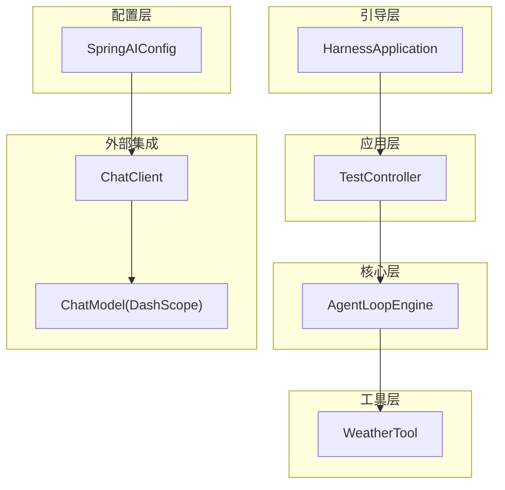
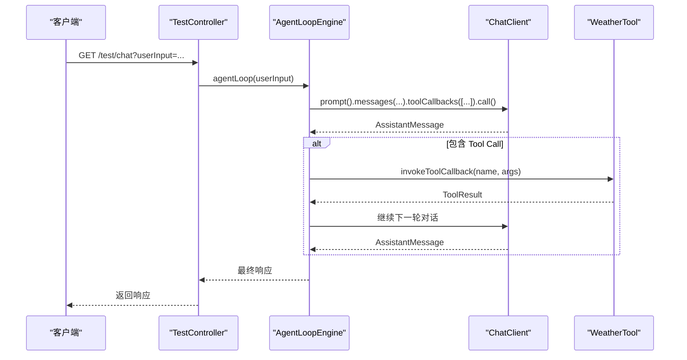
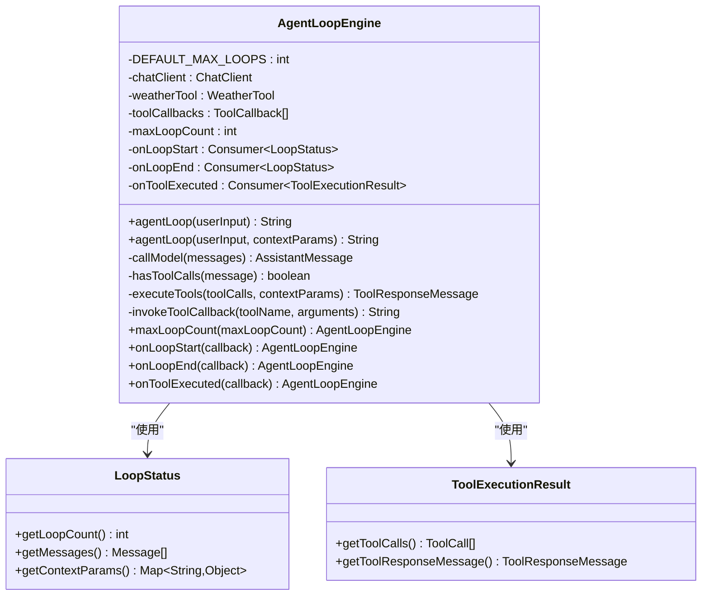
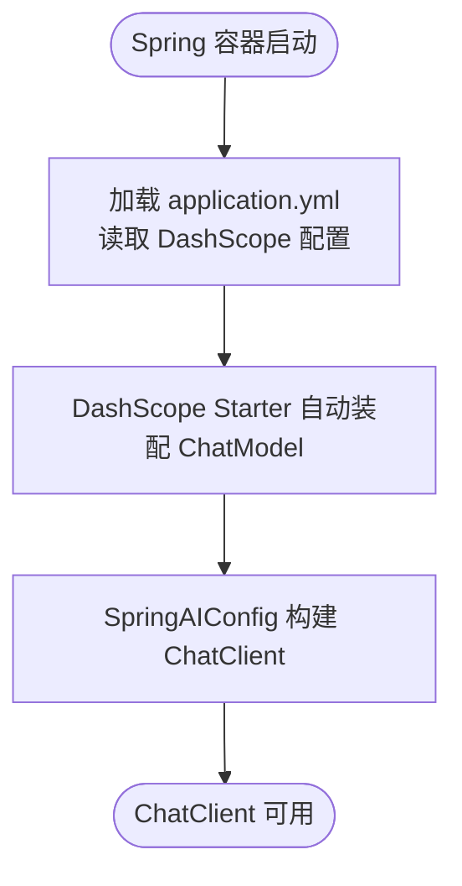
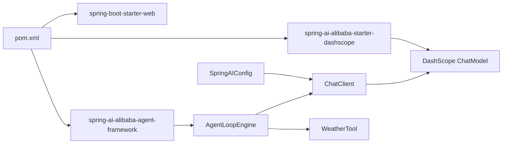

# 架构设计

<cite>
**本文引用的文件**
- [HarnessApplication.java](file://src/main/java/com/learn/harness/HarnessApplication.java)
- [AgentLoopEngine.java](file://src/main/java/com/learn/harness/core/AgentLoopEngine.java)
- [SpringAIConfig.java](file://src/main/java/com/learn/harness/config/SpringAIConfig.java)
- [WeatherTool.java](file://src/main/java/com/learn/harness/tools/WeatherTool.java)
- [TestController.java](file://src/main/java/com/learn/harness/TestController.java)
- [application.yml](file://src/main/resources/application.yml)
- [pom.xml](file://pom.xml)
- [S01AgentLoop.java](file://src/main/java/com/learn/harness/agent/S01AgentLoop.java)
- [S02ToolUse.java](file://src/main/java/com/learn/harness/agent/S02ToolUse.java)
- [HarnessApplicationTests.java](file://src/test/java/com/learn/harness/HarnessApplicationTests.java)
</cite>

## 目录
1. [引言](#引言)
2. [项目结构](#项目结构)
3. [核心组件](#核心组件)
4. [架构总览](#架构总览)
5. [详细组件分析](#详细组件分析)
6. [依赖分析](#依赖分析)
7. [性能考量](#性能考量)
8. [故障排查指南](#故障排查指南)
9. [结论](#结论)
10. [附录](#附录)

## 引言
本项目以 Spring Boot 为基础，结合 Spring AI Alibaba Agent Framework，构建了一个“智能体循环引擎”（Agent Loop Engine），支持多轮对话、工具调用与回调机制，并通过 REST 接口对外提供服务。项目采用分层架构与模块化设计，围绕 HarnessApplication 启动入口、AgentLoopEngine 核心引擎与 SpringAIConfig 配置系统展开，形成清晰的系统边界与职责划分。同时，项目展示了事件驱动模式在工具执行与循环状态中的应用，并体现了可扩展性与可维护性的工程实践。

## 项目结构
项目采用基于包的模块化组织方式，核心目录与职责如下：
- com.learn.harness
  - core：核心引擎与运行时逻辑（AgentLoopEngine）
  - config：Spring AI 配置（SpringAIConfig）
  - tools：工具实现（WeatherTool）
  - agent：教学示例与模式演示（S01AgentLoop、S02ToolUse 等）
  - 测试与启动：HarnessApplication、TestController、HarnessApplicationTests
- resources：配置文件 application.yml
- pom.xml：Maven 依赖与构建配置

图表来源
- [HarnessApplication.java:1-14](file://src/main/java/com/learn/harness/HarnessApplication.java#L1-L14)
- [TestController.java:1-45](file://src/main/java/com/learn/harness/TestController.java#L1-L45)
- [AgentLoopEngine.java:1-353](file://src/main/java/com/learn/harness/core/AgentLoopEngine.java#L1-L353)
- [SpringAIConfig.java:1-26](file://src/main/java/com/learn/harness/config/SpringAIConfig.java#L1-L26)
- [WeatherTool.java:1-66](file://src/main/java/com/learn/harness/tools/WeatherTool.java#L1-L66)

章节来源
- [pom.xml:1-89](file://pom.xml#L1-L89)
- [application.yml:1-13](file://src/main/resources/application.yml#L1-L13)

## 核心组件
- HarnessApplication：Spring Boot 应用入口，负责启动容器与加载配置。
- AgentLoopEngine：核心引擎，负责管理消息历史、模型调用、工具执行循环、最大循环次数控制与回调通知。
- SpringAIConfig：配置 ChatClient，绑定 DashScope ChatModel，作为统一的对话客户端。
- WeatherTool：示例工具，通过注解声明工具能力，供引擎动态发现与执行。
- TestController：REST 控制器，提供 /test/chat 与 /test/weather/agent 接口，直接委托给 AgentLoopEngine。
- application.yml：定义服务器端口、应用名以及 DashScope 的 API Key 与模型选项。
- pom.xml：引入 Spring Boot Web、Spring AI Alibaba Agent Framework 与 DashScope Starter。

章节来源
- [HarnessApplication.java:1-14](file://src/main/java/com/learn/harness/HarnessApplication.java#L1-L14)
- [AgentLoopEngine.java:1-353](file://src/main/java/com/learn/harness/core/AgentLoopEngine.java#L1-L353)
- [SpringAIConfig.java:1-26](file://src/main/java/com/learn/harness/config/SpringAIConfig.java#L1-L26)
- [WeatherTool.java:1-66](file://src/main/java/com/learn/harness/tools/WeatherTool.java#L1-L66)
- [TestController.java:1-45](file://src/main/java/com/learn/harness/TestController.java#L1-L45)
- [application.yml:1-13](file://src/main/resources/application.yml#L1-L13)
- [pom.xml:1-89](file://pom.xml#L1-L89)

## 架构总览
系统采用分层架构与模块化设计：
- 分层架构
  - 表现层：TestController 提供 REST 接口，接收用户输入并返回 Agent 响应。
  - 核心层：AgentLoopEngine 封装循环控制、消息管理、工具调度与回调。
  - 配置层：SpringAIConfig 统一装配 ChatClient 与 ChatModel。
  - 工具层：WeatherTool 等工具通过注解声明能力，由引擎自动发现与执行。
- 模块化设计
  - 按功能域拆分包：core、config、tools、agent，职责清晰、便于扩展。
  - 依赖注入：通过 @Resource 与 Spring 容器管理对象生命周期与依赖关系。
- 事件驱动模式
  - 回调机制：onLoopStart/onLoopEnd/onToolExecuted 在循环开始、结束与工具执行后触发，形成事件驱动的可观测性与可扩展性。
  - 工具执行：当模型返回 Tool Call 时，引擎进入工具执行分支，完成后继续下一轮循环，形成“请求-响应-工具-反馈”的事件流。

图表来源
- [TestController.java:1-45](file://src/main/java/com/learn/harness/TestController.java#L1-L45)
- [AgentLoopEngine.java:96-182](file://src/main/java/com/learn/harness/core/AgentLoopEngine.java#L96-L182)
- [WeatherTool.java:30-42](file://src/main/java/com/learn/harness/tools/WeatherTool.java#L30-L42)

## 详细组件分析

### HarnessApplication 启动入口
- 职责：标注 @SpringBootApplication 并启动 Spring 容器，加载配置与组件。
- 关键点：作为应用唯一入口，确保后续组件扫描与依赖注入生效。

章节来源
- [HarnessApplication.java:1-14](file://src/main/java/com/learn/harness/HarnessApplication.java#L1-L14)

### AgentLoopEngine 核心引擎
- 职责
  - 管理消息历史与多轮对话上下文
  - 调用 ChatClient 与 ChatModel，处理 AssistantMessage
  - 解析 Tool Call 并执行工具回调，将 ToolResponseMessage 追加回上下文
  - 限制最大循环次数，防止无限循环
  - 提供 onLoopStart/onLoopEnd/onToolExecuted 回调，支持事件驱动观测
- 设计模式
  - 流水线模式：消息收集 -> 模型调用 -> 工具判断 -> 工具执行 -> 继续循环或返回
  - 回调模式：通过 Consumer 接口暴露事件钩子，便于扩展与监控
  - 简单工厂模式：initTools 中通过 ToolCallbacks.from(...) 动态注册工具回调
- 数据结构与复杂度
  - 消息列表按轮次增长，工具执行为 O(N)（N 为 Tool Call 数量）
  - 最大循环次数为常数上限，避免无限循环
- 错误处理
  - 捕获模型调用与工具执行异常，记录日志并返回兜底响应
  - 未找到工具时返回提示信息
- 性能特性
  - 单次循环内仅一次模型调用与若干工具调用，I/O 受限于工具执行与网络模型调用

图表来源
- [AgentLoopEngine.java:35-353](file://src/main/java/com/learn/harness/core/AgentLoopEngine.java#L35-L353)

章节来源
- [AgentLoopEngine.java:1-353](file://src/main/java/com/learn/harness/core/AgentLoopEngine.java#L1-L353)

### SpringAIConfig 配置系统
- 职责：装配 ChatClient，绑定 ChatModel（DashScope），作为统一的对话客户端。
- 技术选型：Spring AI Alibaba Agent Framework + DashScope Starter，简化模型接入与工具回调集成。
- 配置项：application.yml 中的 api-key 与 model 名称，影响模型行为与成本。

图表来源
- [SpringAIConfig.java:13-25](file://src/main/java/com/learn/harness/config/SpringAIConfig.java#L13-L25)
- [application.yml:8-13](file://src/main/resources/application.yml#L8-L13)

章节来源
- [SpringAIConfig.java:1-26](file://src/main/java/com/learn/harness/config/SpringAIConfig.java#L1-L26)
- [application.yml:1-13](file://src/main/resources/application.yml#L1-L13)

### WeatherTool 工具实现
- 职责：通过 @Tool 注解声明工具能力，返回天气信息（示例数据）。
- 设计要点：工具方法参数解析由框架自动处理；异常时返回结构化错误信息，便于引擎捕获与记录。

章节来源
- [WeatherTool.java:1-66](file://src/main/java/com/learn/harness/tools/WeatherTool.java#L1-L66)

### TestController REST 接口
- 职责：提供 /test/chat 与 /test/weather/agent 接口，直接委托 AgentLoopEngine 执行对话。
- 适用场景：快速验证 AgentLoopEngine 的循环与工具执行流程。

章节来源
- [TestController.java:1-45](file://src/main/java/com/learn/harness/TestController.java#L1-L45)

### 教学示例：S01AgentLoop 与 S02ToolUse
- S01AgentLoop：展示最小可用的 Agent 循环模式，强调“用户消息 -> 模型回复 -> 工具调用 -> 写回工具结果 -> 继续”的闭环。
- S02ToolUse：在 S01 基础上增加工具分发与消息规范化，保持循环结构不变，体现“循环不改，只加工具”的设计思想。

章节来源
- [S01AgentLoop.java:1-177](file://src/main/java/com/learn/harness/agent/S01AgentLoop.java#L1-L177)
- [S02ToolUse.java:1-152](file://src/main/java/com/learn/harness/agent/S02ToolUse.java#L1-L152)

## 依赖分析
- Maven 依赖
  - spring-boot-starter-web：提供 Web 服务与嵌入式容器
  - spring-ai-alibaba-agent-framework：提供 Agent 模式与工具回调能力
  - spring-ai-alibaba-starter-dashscope：提供 DashScope ChatModel 自动装配
- 运行时依赖链
  - SpringAIConfig -> ChatClient -> ChatModel(DashScope)
  - AgentLoopEngine -> ChatClient -> ChatModel
  - AgentLoopEngine -> WeatherTool（通过 ToolCallbacks 动态注册）

图表来源
- [pom.xml:16-43](file://pom.xml#L16-L43)
- [SpringAIConfig.java:21-24](file://src/main/java/com/learn/harness/config/SpringAIConfig.java#L21-L24)
- [AgentLoopEngine.java:44-48](file://src/main/java/com/learn/harness/core/AgentLoopEngine.java#L44-L48)

章节来源
- [pom.xml:1-89](file://pom.xml#L1-L89)

## 性能考量
- 循环次数限制：默认最大循环次数为常数，避免长轮询导致的资源占用。
- 工具执行开销：工具执行为同步阻塞，建议在工具内部进行超时与限流控制。
- 模型调用延迟：模型调用为网络 I/O，建议在上层增加缓存与重试策略。
- 日志与回调：回调与日志会带来额外开销，建议在生产环境按需启用。

## 故障排查指南
- 模型未返回有效响应
  - 现象：引擎返回兜底文本
  - 排查：检查 DashScope API Key 与模型名称配置
- 工具未找到
  - 现象：工具执行返回“工具未找到”
  - 排查：确认工具名称与 @Tool 注解一致，且工具被正确注册
- 工具执行异常
  - 现象：工具执行返回异常信息
  - 排查：查看工具内部日志，定位异常原因
- 循环次数超限
  - 现象：引擎返回“达到最大循环次数限制”
  - 排查：检查对话内容是否陷入无效循环，适当调整最大循环次数

章节来源
- [AgentLoopEngine.java:170-174](file://src/main/java/com/learn/harness/core/AgentLoopEngine.java#L170-L174)
- [AgentLoopEngine.java:264-266](file://src/main/java/com/learn/harness/core/AgentLoopEngine.java#L264-L266)
- [application.yml:8-13](file://src/main/resources/application.yml#L8-L13)

## 结论
本项目以 Spring Boot 与 Spring AI Alibaba 为核心，构建了具备事件驱动与模块化的智能体循环引擎。通过清晰的分层与职责划分，实现了从 REST 入口到核心引擎再到工具层的完整链路。设计强调可扩展性（工具注册、回调扩展）、可观测性（循环状态与工具执行回调）与稳定性（最大循环次数与异常兜底）。未来可在工具执行并发化、模型调用缓存与重试、以及更丰富的协议与团队协作方面进一步演进。

## 附录
- 部署拓扑建议
  - 单实例部署：适用于开发与小规模测试
  - 多实例部署：通过负载均衡与共享配置中心扩展
  - 模型侧：根据 DashScope 配额与延迟要求，合理设置并发与缓存策略
- 开发最佳实践
  - 工具实现：严格参数校验与异常处理，避免敏感命令与路径逃逸
  - 回调使用：在回调中避免重 IO 操作，必要时异步化
  - 配置管理：将 API Key 与模型参数集中管理，避免硬编码