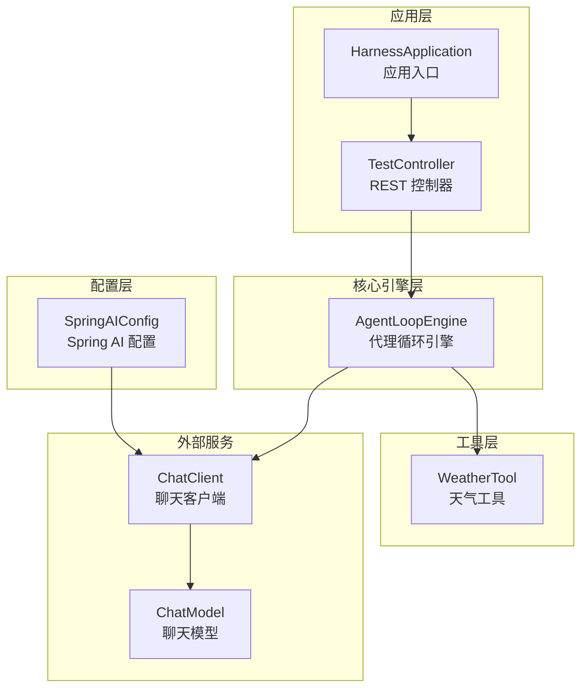
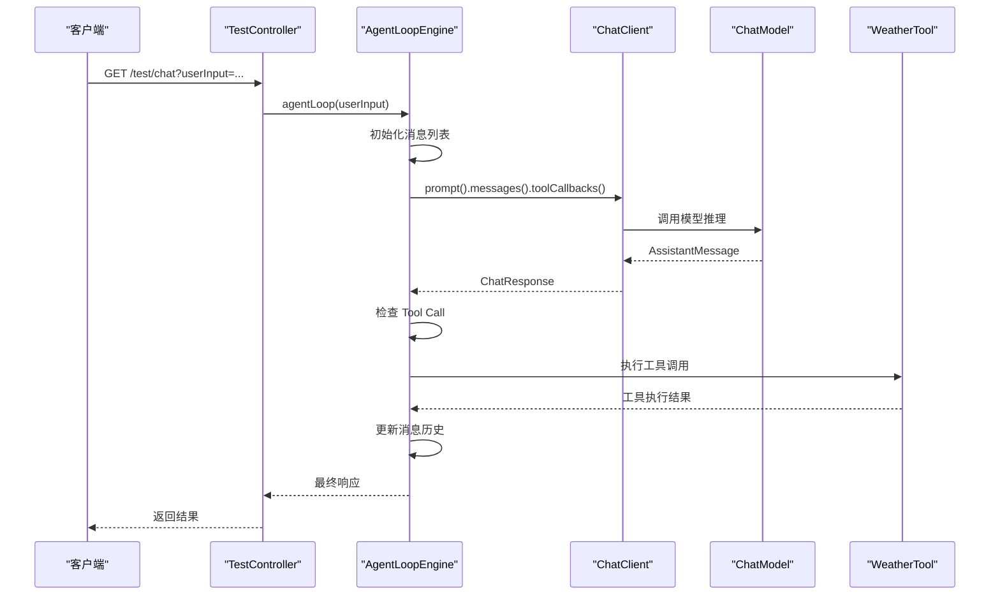
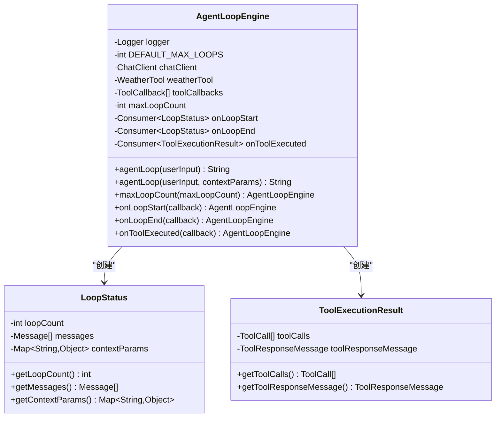
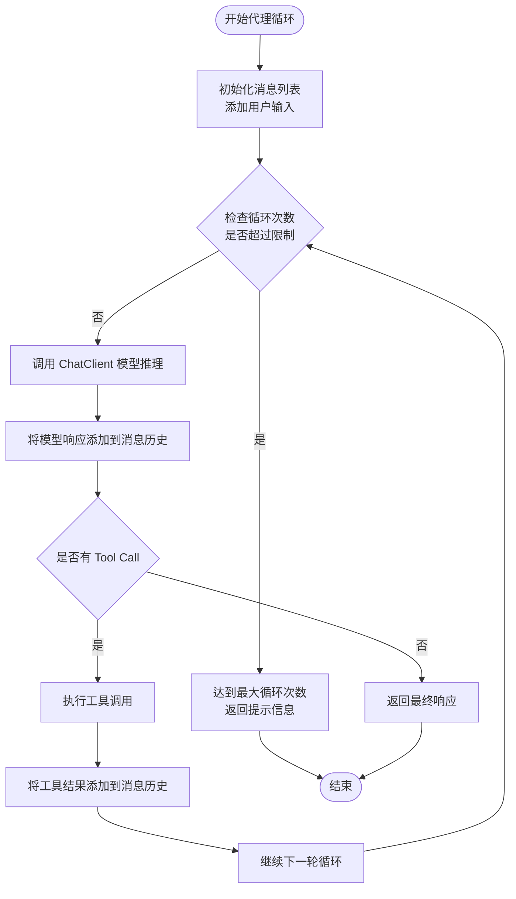
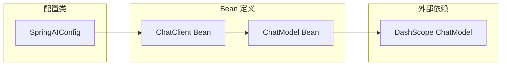
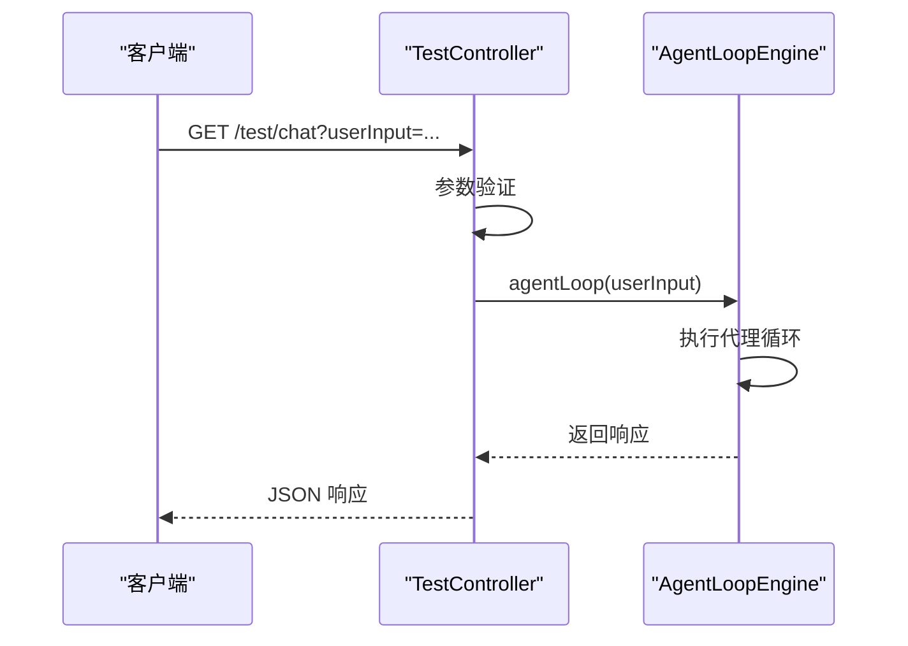
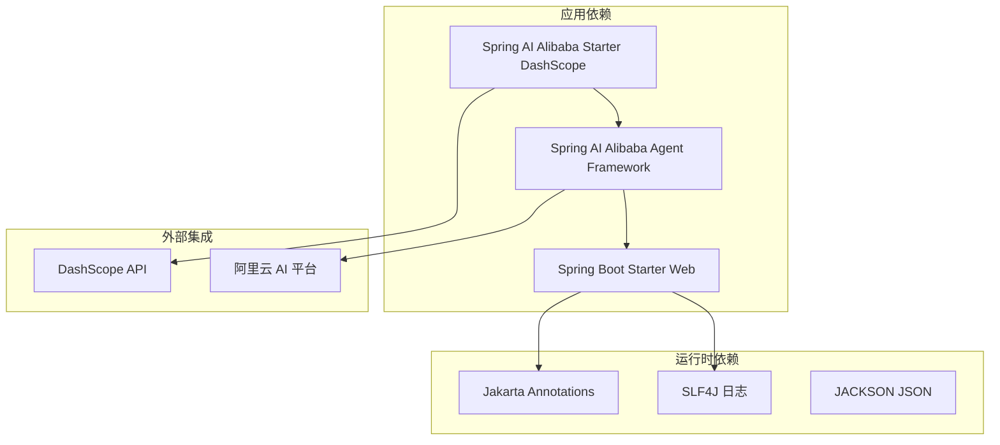
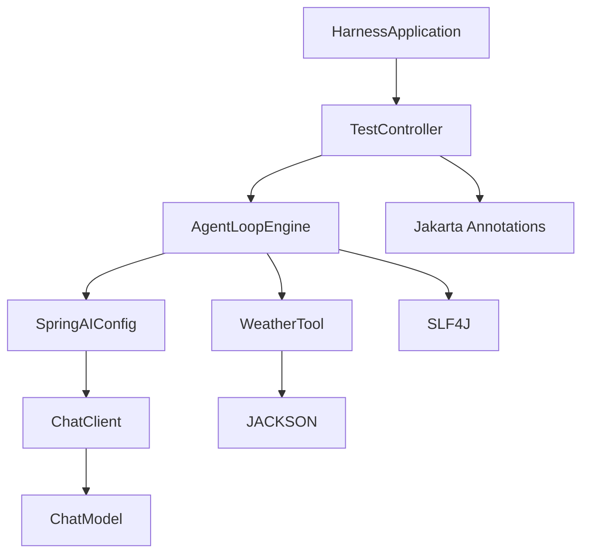

# 核心组件

<cite>
**本文引用的文件**
- [HarnessApplication.java](file://src/main/java/com/learn/harness/HarnessApplication.java)
- [AgentLoopEngine.java](file://src/main/java/com/learn/harness/core/AgentLoopEngine.java)
- [SpringAIConfig.java](file://src/main/java/com/learn/harness/config/SpringAIConfig.java)
- [TestController.java](file://src/main/java/com/learn/harness/TestController.java)
- [WeatherTool.java](file://src/main/java/com/learn/harness/tools/WeatherTool.java)
- [application.yml](file://src/main/resources/application.yml)
- [pom.xml](file://pom.xml)
- [SFull.java](file://src/main/java/com/learn/harness/agent/SFull.java)
</cite>

## 目录
1. [简介](#简介)
2. [项目结构](#项目结构)
3. [核心组件](#核心组件)
4. [架构总览](#架构总览)
5. [详细组件分析](#详细组件分析)
6. [依赖关系分析](#依赖关系分析)
7. [性能考虑](#性能考虑)
8. [故障排除指南](#故障排除指南)
9. [结论](#结论)

## 简介
本项目是一个基于 Spring Boot 和 Spring AI 的智能体代理框架，围绕三个核心组件构建：
- HarnessApplication：Spring Boot 应用入口，负责应用启动与上下文初始化
- AgentLoopEngine：核心引擎，负责代理循环控制、消息处理与工具调用
- SpringAIConfig：配置中心，负责 ChatClient Bean 的创建与管理

这些组件协同工作，实现从用户输入到模型推理再到工具执行的完整闭环，支持最大循环次数控制、状态回调、错误恢复等高级特性。

## 项目结构
项目采用标准的 Spring Boot 目录结构，主要模块包括：
- com.learn.harness：应用主包，包含入口类和控制器
- com.learn.harness.core：核心引擎模块，包含 AgentLoopEngine
- com.learn.harness.config：配置模块，包含 SpringAIConfig
- com.learn.harness.tools：工具模块，包含内置工具如 WeatherTool
- com.learn.harness.agent：高级代理实现，包含完整的 SFull 代理系统
- resources：配置资源，包含 application.yml

**图表来源**
- [HarnessApplication.java:1-14](file://src/main/java/com/learn/harness/HarnessApplication.java#L1-L14)
- [TestController.java:1-45](file://src/main/java/com/learn/harness/TestController.java#L1-L45)
- [AgentLoopEngine.java:1-353](file://src/main/java/com/learn/harness/core/AgentLoopEngine.java#L1-L353)
- [SpringAIConfig.java:1-26](file://src/main/java/com/learn/harness/config/SpringAIConfig.java#L1-L26)
- [WeatherTool.java:1-66](file://src/main/java/com/learn/harness/tools/WeatherTool.java#L1-L66)

**章节来源**
- [pom.xml:1-89](file://pom.xml#L1-L89)
- [application.yml:1-13](file://src/main/resources/application.yml#L1-L13)

## 核心组件
本节详细介绍三个关键组件的职责、接口定义、生命周期和相互依赖关系。

### HarnessApplication - 应用入口组件
HarnessApplication 是 Spring Boot 应用的启动入口，采用标准的@SpringBootApplication 注解，负责：
- 应用程序上下文初始化
- 自动扫描和加载配置类
- 启动嵌入式 Web 服务器

该组件采用最小化设计，仅包含一个 main 方法，确保应用启动的简洁性和可靠性。

**章节来源**
- [HarnessApplication.java:1-14](file://src/main/java/com/learn/harness/HarnessApplication.java#L1-L14)

### AgentLoopEngine - 核心引擎组件
AgentLoopEngine 是整个系统的核心，负责代理循环的完整生命周期管理。其主要职责包括：

#### 核心功能
- **消息历史管理**：维护多轮对话的历史记录
- **工具调用执行**：处理 Tool Call 的执行循环
- **循环控制**：支持最大循环次数控制，防止无限循环
- **状态回调**：提供循环开始、结束和工具执行的回调机制
- **错误处理**：包含完善的异常捕获和错误恢复机制

#### 关键接口
- `agentLoop(String userInput)`：执行基础代理循环
- `agentLoop(String userInput, Map<String,Object> contextParams)`：带上下文参数的代理循环
- `maxLoopCount(int)`：设置最大循环次数
- `onLoopStart(Consumer)`：设置循环开始回调
- `onLoopEnd(Consumer)`：设置循环结束回调
- `onToolExecuted(Consumer)`：设置工具执行回调

#### 生命周期管理
组件采用 @Service 注解，通过 @PostConstruct 初始化工具回调，确保在依赖注入完成后进行必要的准备工作。

#### 内部类设计
- `LoopStatus`：封装循环状态信息
- `ToolExecutionResult`：封装工具执行结果

**章节来源**
- [AgentLoopEngine.java:1-353](file://src/main/java/com/learn/harness/core/AgentLoopEngine.java#L1-L353)

### SpringAIConfig - 配置中心组件
SpringAIConfig 作为配置中心，负责 Spring AI 相关 Bean 的创建和管理。其核心职责：
- 创建 ChatClient Bean
- 配置 DashScope ChatModel
- 提供 Spring AI 集成的基础配置

该组件采用 @Configuration 注解，通过 @Bean 方法创建和管理 ChatClient 实例。

**章节来源**
- [SpringAIConfig.java:1-26](file://src/main/java/com/learn/harness/config/SpringAIConfig.java#L1-L26)

## 架构总览
系统采用分层架构设计，各组件职责清晰，耦合度低，便于扩展和维护。

**图表来源**
- [TestController.java:24-27](file://src/main/java/com/learn/harness/TestController.java#L24-L27)
- [AgentLoopEngine.java:96-182](file://src/main/java/com/learn/harness/core/AgentLoopEngine.java#L96-L182)
- [WeatherTool.java:30-42](file://src/main/java/com/learn/harness/tools/WeatherTool.java#L30-L42)

## 详细组件分析

### AgentLoopEngine 详细分析

#### 类结构设计

**图表来源**
- [AgentLoopEngine.java:35-353](file://src/main/java/com/learn/harness/core/AgentLoopEngine.java#L35-L353)

#### 核心算法流程
代理循环的核心算法采用 while 循环实现，包含以下关键步骤：

**图表来源**
- [AgentLoopEngine.java:107-182](file://src/main/java/com/learn/harness/core/AgentLoopEngine.java#L107-L182)

#### 设计模式应用
- **策略模式**：通过回调函数实现灵活的状态管理和工具执行
- **模板方法模式**：标准化代理循环流程，允许子类扩展特定行为
- **观察者模式**：通过回调机制实现事件通知和状态监听

**章节来源**
- [AgentLoopEngine.java:58-68](file://src/main/java/com/learn/harness/core/AgentLoopEngine.java#L58-L68)
- [AgentLoopEngine.java:273-300](file://src/main/java/com/learn/harness/core/AgentLoopEngine.java#L273-L300)

### SpringAIConfig 详细分析

#### 配置体系
SpringAIConfig 采用基于注解的配置方式，通过 @Configuration 和 @Bean 注解实现：

**图表来源**
- [SpringAIConfig.java:13-25](file://src/main/java/com/learn/harness/config/SpringAIConfig.java#L13-L25)

#### 集成配置
配置文件 application.yml 提供了完整的 DashScope 集成配置：
- API 密钥管理
- 模型选择（qwen-plus）
- 服务器端口配置

**章节来源**
- [SpringAIConfig.java:16-24](file://src/main/java/com/learn/harness/config/SpringAIConfig.java#L16-L24)
- [application.yml:8-13](file://src/main/resources/application.yml#L8-L13)

### TestController 详细分析

#### REST 接口设计
TestController 提供两个核心测试接口：
- `/test/chat`：通用 Agent 对话测试
- `/test/weather/agent`：通过 Agent 查询天气

**图表来源**
- [TestController.java:24-43](file://src/main/java/com/learn/harness/TestController.java#L24-L43)

**章节来源**
- [TestController.java:11-44](file://src/main/java/com/learn/harness/TestController.java#L11-L44)

## 依赖关系分析

### Maven 依赖结构
项目采用 Maven 构建，核心依赖包括：

**图表来源**
- [pom.xml:16-43](file://pom.xml#L16-L43)

### 组件间依赖关系
系统组件间的依赖关系清晰明确：

**图表来源**
- [HarnessApplication.java:3-4](file://src/main/java/com/learn/harness/HarnessApplication.java#L3-L4)
- [TestController.java:3-4](file://src/main/java/com/learn/harness/TestController.java#L3-L4)
- [AgentLoopEngine.java:5-17](file://src/main/java/com/learn/harness/core/AgentLoopEngine.java#L5-L17)

**章节来源**
- [pom.xml:16-43](file://pom.xml#L16-L43)

## 性能考虑
系统在设计时充分考虑了性能优化和资源管理：

### 循环控制优化
- **最大循环次数限制**：默认 10 次，防止无限循环消耗资源
- **消息历史压缩**：定期清理和压缩历史消息，控制内存使用
- **工具执行缓存**：工具结果的合理缓存策略

### 异步处理能力
- **后台任务管理**：支持长时间运行的任务异步执行
- **并发控制**：通过线程池和队列管理并发请求
- **资源隔离**：不同类型的请求采用不同的处理策略

### 错误恢复机制
- **异常捕获**：完整的异常处理和错误恢复
- **状态回滚**：在错误情况下保持系统状态一致性
- **降级策略**：在服务不可用时提供降级响应

## 故障排除指南

### 常见问题诊断
1. **ChatClient 初始化失败**
   - 检查 DashScope API 密钥配置
   - 验证网络连接和代理设置
   - 确认模型名称和版本兼容性

2. **工具调用异常**
   - 检查工具类的 @Tool 注解配置
   - 验证工具参数的 JSON 序列化
   - 确认工具方法的可见性和签名

3. **代理循环卡死**
   - 检查最大循环次数设置
   - 验证消息历史的数据完整性
   - 分析回调函数的执行逻辑

### 调试建议
- 启用详细的日志记录
- 使用断点调试工具调用链
- 监控系统资源使用情况
- 实施性能基准测试

**章节来源**
- [AgentLoopEngine.java:170-174](file://src/main/java/com/learn/harness/core/AgentLoopEngine.java#L170-L174)
- [WeatherTool.java:38-41](file://src/main/java/com/learn/harness/tools/WeatherTool.java#L38-L41)

## 结论
learn-harness 项目通过精心设计的三个核心组件，构建了一个功能完整、扩展性强的智能体代理框架。各组件职责明确，接口清晰，具有良好的可维护性和可扩展性。

### 主要优势
- **模块化设计**：组件职责分离，便于独立开发和测试
- **配置灵活**：通过 Spring 配置实现高度可定制化
- **扩展性强**：支持新的工具和代理阶段的添加
- **稳定性高**：完善的错误处理和恢复机制

### 设计原则
- **单一职责原则**：每个组件专注于特定的功能领域
- **开闭原则**：对扩展开放，对修改封闭
- **依赖倒置原则**：依赖抽象而非具体实现
- **接口隔离原则**：提供细粒度的接口定义

### 扩展建议
- **插件化架构**：进一步抽象工具接口，支持动态加载
- **监控集成**：添加性能监控和指标收集
- **安全增强**：实现更严格的安全控制和权限管理
- **分布式支持**：支持多实例部署和负载均衡

该框架为开发者提供了一个坚实的基础，可以在此基础上构建更复杂的智能体应用。