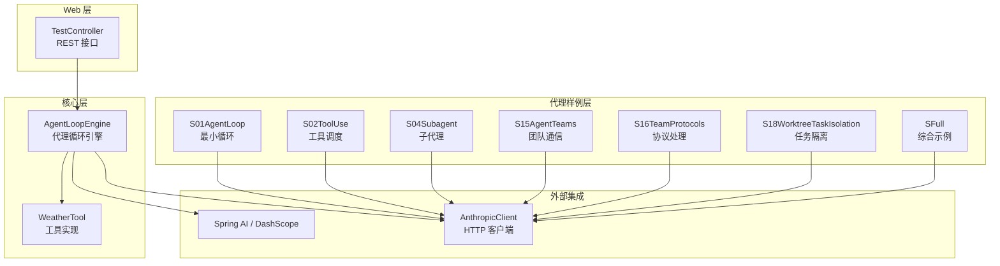
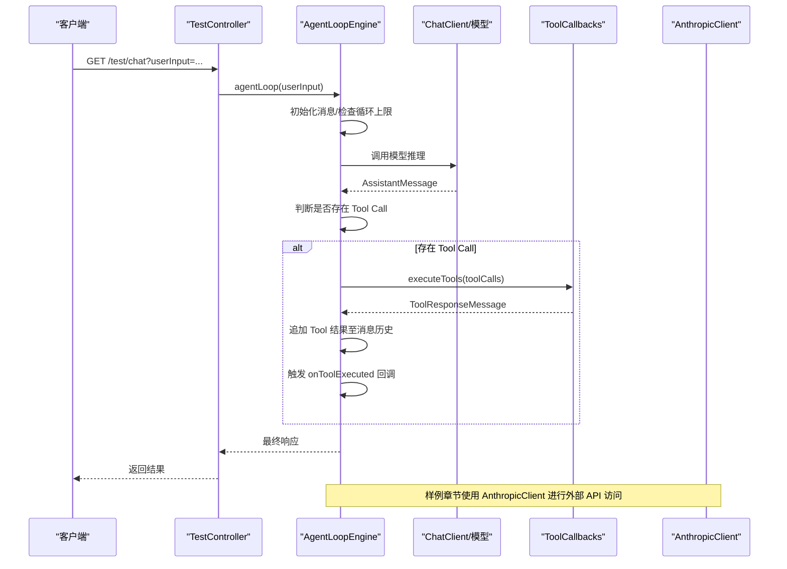
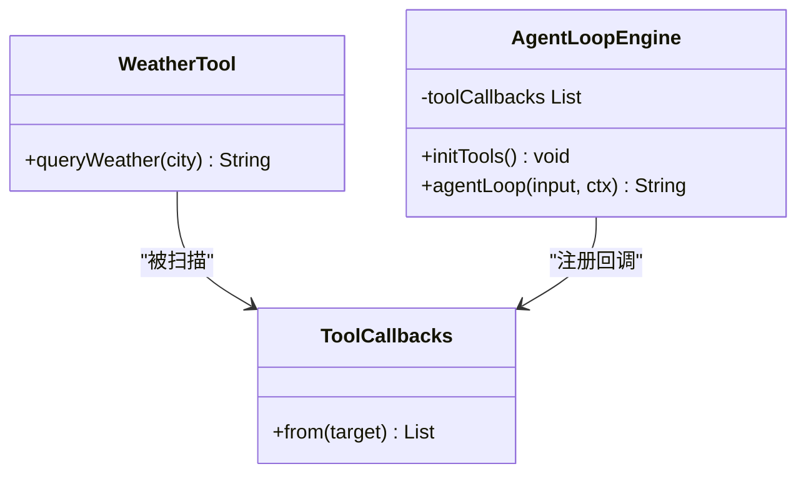
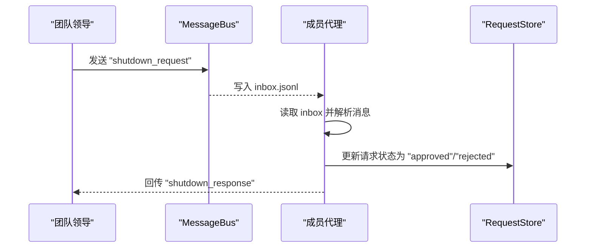
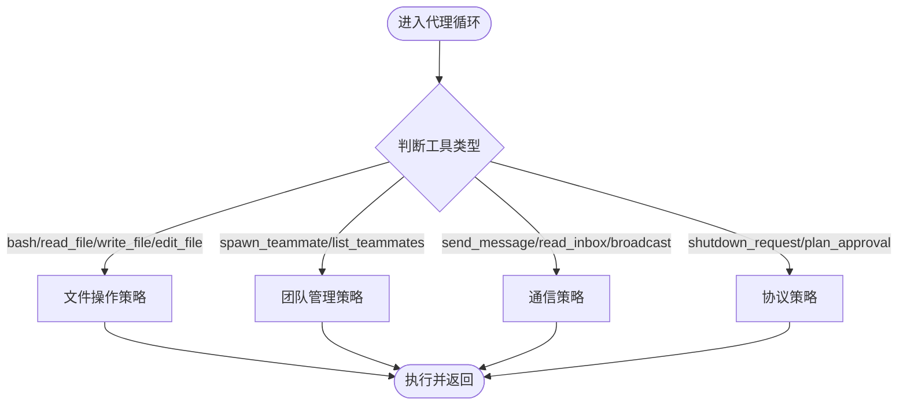
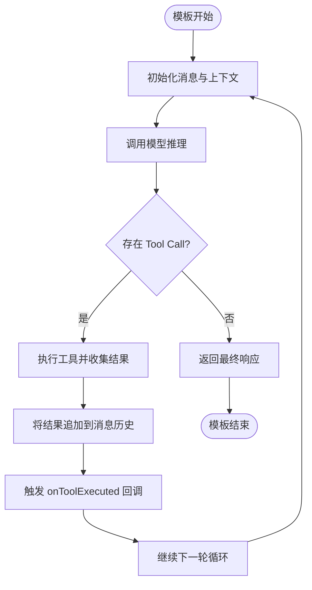
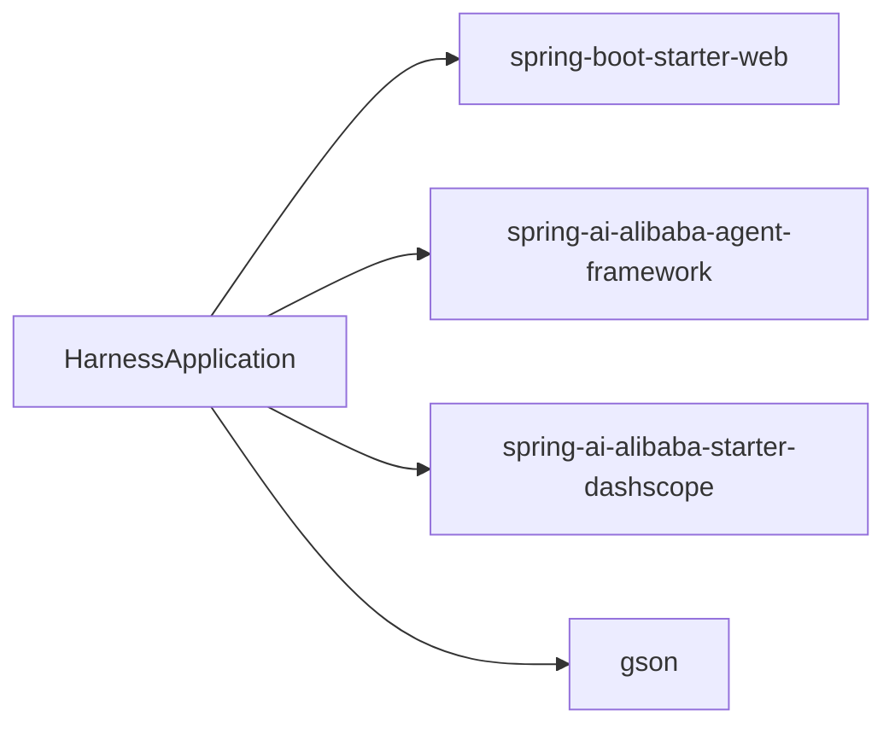

# 设计模式

<cite>
**本文引用的文件**
- [HarnessApplication.java](file://src/main/java/com/learn/harness/HarnessApplication.java)
- [TestController.java](file://src/main/java/com/learn/harness/TestController.java)
- [AgentLoopEngine.java](file://src/main/java/com/learn/harness/core/AgentLoopEngine.java)
- [WeatherTool.java](file://src/main/java/com/learn/harness/tools/WeatherTool.java)
- [AnthropicClient.java](file://src/main/java/com/learn/harness/agent/AnthropicClient.java)
- [S01AgentLoop.java](file://src/main/java/com/learn/harness/agent/S01AgentLoop.java)
- [S02ToolUse.java](file://src/main/java/com/learn/harness/agent/S02ToolUse.java)
- [S04Subagent.java](file://src/main/java/com/learn/harness/agent/S04Subagent.java)
- [S15AgentTeams.java](file://src/main/java/com/learn/harness/agent/S15AgentTeams.java)
- [S16TeamProtocols.java](file://src/main/java/com/learn/harness/agent/S16TeamProtocols.java)
- [S18WorktreeTaskIsolation.java](file://src/main/java/com/learn/harness/agent/S18WorktreeTaskIsolation.java)
- [SFull.java](file://src/main/java/com/learn/harness/agent/SFull.java)
- [pom.xml](file://pom.xml)
- [application.yml](file://src/main/resources/application.yml)
</cite>

## 目录
1. [引言](#引言)
2. [项目结构](#项目结构)
3. [核心组件](#核心组件)
4. [架构总览](#架构总览)
5. [详细组件分析](#详细组件分析)
6. [依赖分析](#依赖分析)
7. [性能考虑](#性能考虑)
8. [故障排查指南](#故障排查指南)
9. [结论](#结论)
10. [附录](#附录)

## 引言
本设计模式文档聚焦于 learn-harness 项目中的四大核心设计模式：工厂模式、观察者模式、策略模式与模板方法模式。通过对代理循环、工具系统、团队通信与协议处理等模块的深入分析，帮助不同经验水平的开发者理解这些模式在真实工程中的落地方式、带来的收益以及潜在权衡。

## 项目结构
项目采用按功能域分层的组织方式：
- core 层：核心引擎与基础设施（如 AgentLoopEngine、工具回调注册）
- agent 层：教学章节样例与扩展能力（S01–S19），覆盖代理循环、工具调度、子代理、团队通信、协议与隔离执行等
- tools 层：具体工具实现（如 WeatherTool）
- config 层：Spring AI 配置与外部模型服务集成
- web 层：REST 控制器对外暴露测试接口

**图示来源**
- [TestController.java:11-44](file://src/main/java/com/learn/harness/TestController.java#L11-L44)
- [AgentLoopEngine.java:34-68](file://src/main/java/com/learn/harness/core/AgentLoopEngine.java#L34-L68)
- [AnthropicClient.java:20-40](file://src/main/java/com/learn/harness/agent/AnthropicClient.java#L20-L40)
- [S01AgentLoop.java:23-31](file://src/main/java/com/learn/harness/agent/S01AgentLoop.java#L23-L31)
- [S02ToolUse.java:19-105](file://src/main/java/com/learn/harness/agent/S02ToolUse.java#L19-L105)
- [S04Subagent.java:17-82](file://src/main/java/com/learn/harness/agent/S04Subagent.java#L17-L82)
- [S15AgentTeams.java:19-183](file://src/main/java/com/learn/harness/agent/S15AgentTeams.java#L19-L183)
- [S16TeamProtocols.java:18-76](file://src/main/java/com/learn/harness/agent/S16TeamProtocols.java#L18-L76)
- [S18WorktreeTaskIsolation.java:15-33](file://src/main/java/com/learn/harness/agent/S18WorktreeTaskIsolation.java#L15-L33)
- [SFull.java:1-36](file://src/main/java/com/learn/harness/agent/SFull.java#L1-L36)

**章节来源**
- [HarnessApplication.java:6-13](file://src/main/java/com/learn/harness/HarnessApplication.java#L6-L13)
- [pom.xml:16-47](file://pom.xml#L16-L47)
- [application.yml:8-13](file://src/main/resources/application.yml#L8-L13)

## 核心组件
- 代理循环引擎（AgentLoopEngine）：统一管理消息历史、模型调用、工具执行与回调钩子，提供可配置的最大循环次数与状态回调
- 工具系统（WeatherTool + ToolCallbacks）：通过注解与回调机制实现工具的自动发现与执行
- 代理样例（S01–S19）：以教学章节形式逐步引入工具调度、子代理、团队通信、协议与隔离执行等能力
- 团队通信（MessageBus、TeamProtocol）：基于文件系统的事件总线与协议处理，实现代理间异步通信与状态流转
- 外部客户端（AnthropicClient）：封装 HTTP 请求与 JSON 解析，为样例章节提供统一的外部服务访问入口

**章节来源**
- [AgentLoopEngine.java:34-68](file://src/main/java/com/learn/harness/core/AgentLoopEngine.java#L34-L68)
- [WeatherTool.java:17-42](file://src/main/java/com/learn/harness/tools/WeatherTool.java#L17-L42)
- [AnthropicClient.java:20-40](file://src/main/java/com/learn/harness/agent/AnthropicClient.java#L20-L40)
- [S15AgentTeams.java:26-61](file://src/main/java/com/learn/harness/agent/S15AgentTeams.java#L26-L61)
- [S16TeamProtocols.java:32-76](file://src/main/java/com/learn/harness/agent/S16TeamProtocols.java#L32-L76)

## 架构总览
下图展示了“请求进入 → 代理循环 → 模型推理 → 工具执行 → 结果回写”的标准流程，以及回调钩子与外部客户端的交互位置。

**图示来源**
- [TestController.java:24-27](file://src/main/java/com/learn/harness/TestController.java#L24-L27)
- [AgentLoopEngine.java:96-182](file://src/main/java/com/learn/harness/core/AgentLoopEngine.java#L96-L182)
- [AnthropicClient.java:51-88](file://src/main/java/com/learn/harness/agent/AnthropicClient.java#L51-L88)

## 详细组件分析

### 工厂模式：工具与代理实例的创建
- 目标与问题
  - 如何动态注册与发现工具回调，避免硬编码的工具映射
  - 如何在不同样例章节中复用统一的代理循环与工具执行框架
- 实现要点
  - 工具工厂：通过注解扫描与回调工厂批量注册工具回调，形成工具集合
  - 代理工厂：样例章节（S01–S19）内部通过静态客户端与工具定义构建代理实例，保持循环结构一致
- 好处
  - 降低耦合：工具实现与调用解耦
  - 可扩展：新增工具只需添加注解与实现
- 权衡
  - 注解扫描与反射带来轻微开销
  - 工具命名冲突需谨慎管理

**图示来源**
- [WeatherTool.java:17-42](file://src/main/java/com/learn/harness/tools/WeatherTool.java#L17-L42)
- [AgentLoopEngine.java:58-68](file://src/main/java/com/learn/harness/core/AgentLoopEngine.java#L58-L68)

**章节来源**
- [AgentLoopEngine.java:58-68](file://src/main/java/com/learn/harness/core/AgentLoopEngine.java#L58-L68)
- [WeatherTool.java:30-42](file://src/main/java/com/learn/harness/tools/WeatherTool.java#L30-L42)
- [S02ToolUse.java:86-105](file://src/main/java/com/learn/harness/agent/S02ToolUse.java#L86-L105)
- [S04Subagent.java:67-82](file://src/main/java/com/learn/harness/agent/S04Subagent.java#L67-L82)

### 观察者模式：代理间通信与事件通知
- 目标与问题
  - 如何在多代理场景下实现松耦合的事件传递与状态同步
  - 如何保证跨进程/线程的可靠通信与顺序一致性
- 实现要点
  - 事件总线（EventBus）：基于 JSONL 文件的事件发布与订阅，支持事件类型、时间戳与附加字段
  - 消息总线（MessageBus）：基于 JSONL 文件的点对点消息传递，支持广播与收件箱读取
  - 协议处理（TeamProtocols）：定义“关闭请求”“计划审批”等协议的状态机与持久化记录
- 好处
  - 异步解耦：发送方无需关心接收方状态
  - 可观测性：事件与消息持久化便于审计与调试
- 权衡
  - 文件 IO 延迟与锁竞争
  - 需要约定事件格式与处理幂等性

**图示来源**
- [S15AgentTeams.java:26-61](file://src/main/java/com/learn/harness/agent/S15AgentTeams.java#L26-L61)
- [S16TeamProtocols.java:32-76](file://src/main/java/com/learn/harness/agent/S16TeamProtocols.java#L32-L76)
- [S16TeamProtocols.java:275-308](file://src/main/java/com/learn/harness/agent/S16TeamProtocols.java#L275-L308)

**章节来源**
- [S15AgentTeams.java:26-61](file://src/main/java/com/learn/harness/agent/S15AgentTeams.java#L26-L61)
- [S16TeamProtocols.java:32-76](file://src/main/java/com/learn/harness/agent/S16TeamProtocols.java#L32-L76)
- [S18WorktreeTaskIsolation.java:35-58](file://src/main/java/com/learn/harness/agent/S18WorktreeTaskIsolation.java#L35-L58)

### 策略模式：不同的代理执行策略
- 目标与问题
  - 如何在不改变循环骨架的前提下，灵活切换代理的工具集与行为策略
  - 如何在团队场景中为不同角色（领导/成员）提供差异化工具与系统提示
- 实现要点
  - 工具策略：通过工具定义列表与工具处理器映射，动态决定可用工具集
  - 角色策略：团队领导与成员拥有不同的系统提示、工具集与状态机
  - 协议策略：关闭请求与计划审批协议定义了明确的状态转换规则
- 好处
  - 行为可插拔：通过更换工具集或系统提示即可切换策略
  - 易于扩展：新增角色或协议只需扩展工具与状态机
- 权衡
  - 策略切换需确保工具名与输入 schema 的一致性
  - 协议状态机复杂度随角色与流程增加而上升

**图示来源**
- [S15AgentTeams.java:212-225](file://src/main/java/com/learn/harness/agent/S15AgentTeams.java#L212-L225)
- [S16TeamProtocols.java:364-380](file://src/main/java/com/learn/harness/agent/S16TeamProtocols.java#L364-L380)
- [S16TeamProtocols.java:343-362](file://src/main/java/com/learn/harness/agent/S16TeamProtocols.java#L343-L362)

**章节来源**
- [S15AgentTeams.java:212-225](file://src/main/java/com/learn/harness/agent/S15AgentTeams.java#L212-L225)
- [S16TeamProtocols.java:343-362](file://src/main/java/com/learn/harness/agent/S16TeamProtocols.java#L343-L362)
- [S16TeamProtocols.java:275-308](file://src/main/java/com/learn/harness/agent/S16TeamProtocols.java#L275-L308)

### 模板方法模式：标准化的代理循环流程
- 目标与问题
  - 如何在多个样例章节中保持一致的循环骨架，同时允许子类自定义部分步骤
- 实现要点
  - AgentLoopEngine 提供统一的 agentLoop 模板：初始化消息 → 调用模型 → 判断 Tool Call → 执行工具 → 追加结果 → 循环或结束
  - 样例章节（S01–S19）仅变更工具定义与系统提示，循环骨架保持不变
- 好处
  - 降低重复代码：公共逻辑集中在模板方法中
  - 易于维护：修改循环行为只需调整模板
- 权衡
  - 模板方法的扩展点需设计合理，避免过度复杂化

**图示来源**
- [AgentLoopEngine.java:107-182](file://src/main/java/com/learn/harness/core/AgentLoopEngine.java#L107-L182)
- [S01AgentLoop.java:127-131](file://src/main/java/com/learn/harness/agent/S01AgentLoop.java#L127-L131)
- [S02ToolUse.java:113-137](file://src/main/java/com/learn/harness/agent/S02ToolUse.java#L113-L137)

**章节来源**
- [AgentLoopEngine.java:96-182](file://src/main/java/com/learn/harness/core/AgentLoopEngine.java#L96-L182)
- [S01AgentLoop.java:127-131](file://src/main/java/com/learn/harness/agent/S01AgentLoop.java#L127-L131)
- [S02ToolUse.java:113-137](file://src/main/java/com/learn/harness/agent/S02ToolUse.java#L113-L137)

## 依赖分析
- Spring Boot Web：提供 REST 接口与依赖注入
- Spring AI Alibaba Agent Framework + DashScope Starter：提供大模型推理能力与工具回调支持
- Gson：用于样例章节的 JSON 序列化与解析

**图示来源**
- [pom.xml:16-47](file://pom.xml#L16-L47)

**章节来源**
- [pom.xml:16-47](file://pom.xml#L16-L47)
- [application.yml:8-13](file://src/main/resources/application.yml#L8-L13)

## 性能考虑
- 工具执行与回调
  - 工具执行在循环内进行，建议控制工具数量与复杂度，避免阻塞主循环
  - 回调链路尽量轻量，避免在回调中执行耗时操作
- 文件 IO 与并发
  - 事件总线与消息总线基于文件系统，注意锁竞争与磁盘 IO 延迟
  - 在高并发场景下，建议引入缓冲与批处理策略
- 模型调用
  - 合理设置最大循环次数与超时，避免长时间等待
  - 对外部模型调用进行限流与重试策略

[本节为通用性能建议，不直接分析具体文件]

## 故障排查指南
- 工具未找到或执行异常
  - 检查工具注册是否成功（注解扫描与回调工厂）
  - 查看工具执行回调的日志输出，定位具体异常
- 循环卡死或无限循环
  - 检查最大循环次数配置与 stop_reason 判定逻辑
  - 确认工具执行是否正确返回结果并追加到消息历史
- 团队通信异常
  - 检查 inbox 文件是否存在与权限
  - 确认协议状态机更新是否成功写入持久化存储
- 外部 API 错误
  - 检查环境变量与模型配置
  - 关注 HTTP 客户端的错误码与响应体

**章节来源**
- [AgentLoopEngine.java:121-126](file://src/main/java/com/learn/harness/core/AgentLoopEngine.java#L121-L126)
- [AgentLoopEngine.java:170-174](file://src/main/java/com/learn/harness/core/AgentLoopEngine.java#L170-L174)
- [S15AgentTeams.java:44-54](file://src/main/java/com/learn/harness/agent/S15AgentTeams.java#L44-L54)
- [S16TeamProtocols.java:84-112](file://src/main/java/com/learn/harness/agent/S16TeamProtocols.java#L84-L112)
- [AnthropicClient.java:80-87](file://src/main/java/com/learn/harness/agent/AnthropicClient.java#L80-L87)

## 结论
learn-harness 通过工厂、观察者、策略与模板方法四种设计模式，实现了工具的可插拔、代理间的异步通信、策略化的执行路径以及标准化的循环骨架。这些模式共同提升了系统的可扩展性、可维护性与可观测性，适合不同经验层次的开发者循序渐进地学习与实践。

[本节为总结性内容，不直接分析具体文件]

## 附录
- 快速上手
  - 启动应用后，访问 REST 接口进行代理测试
  - 在样例章节中选择合适的代理循环与工具集进行实验
- 建议阅读顺序
  - S01 → S02 → S04 → S15 → S16 → S18 → SFull

**章节来源**
- [HarnessApplication.java:6-13](file://src/main/java/com/learn/harness/HarnessApplication.java#L6-L13)
- [TestController.java:24-43](file://src/main/java/com/learn/harness/TestController.java#L24-L43)
- [SFull.java:1-36](file://src/main/java/com/learn/harness/agent/SFull.java#L1-L36)