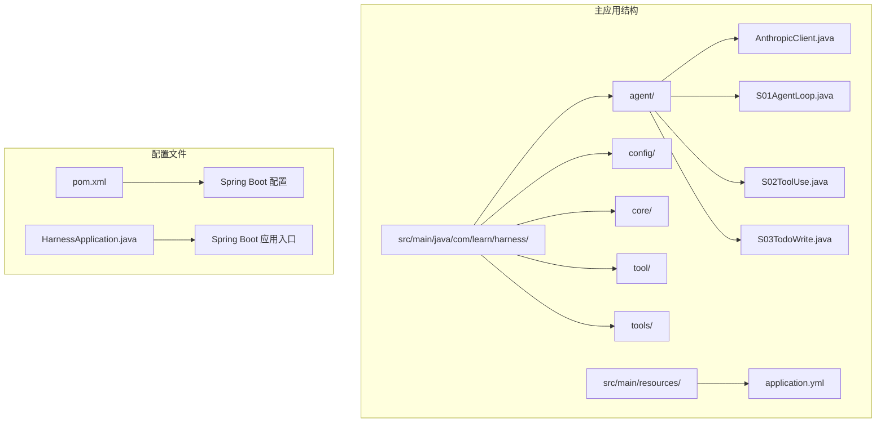
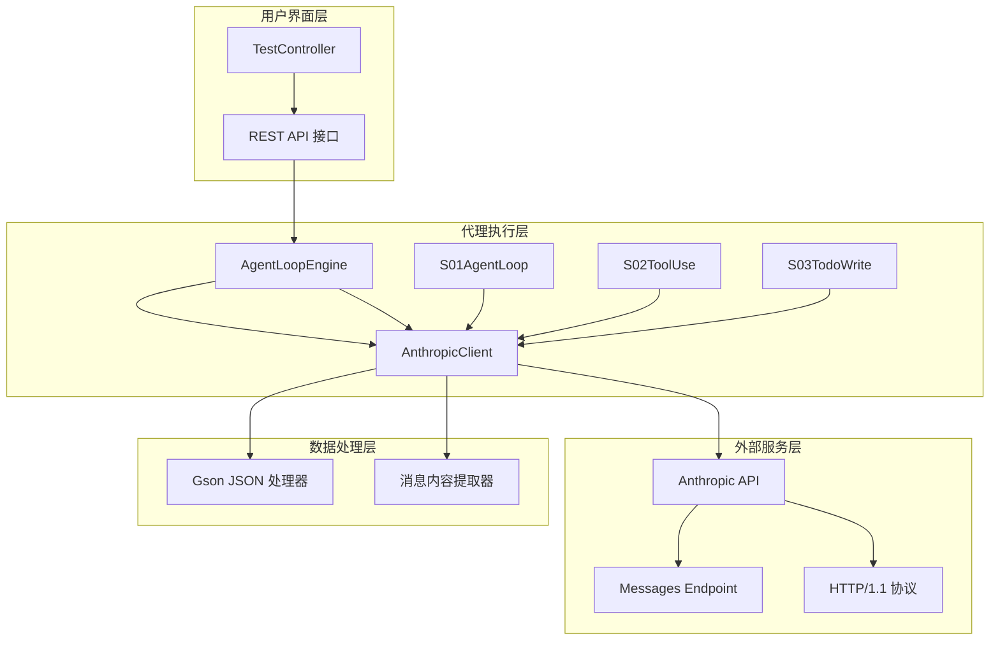
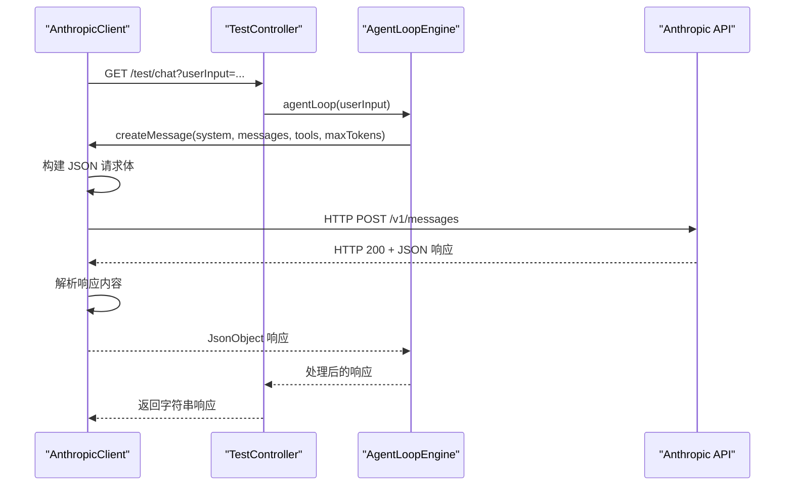
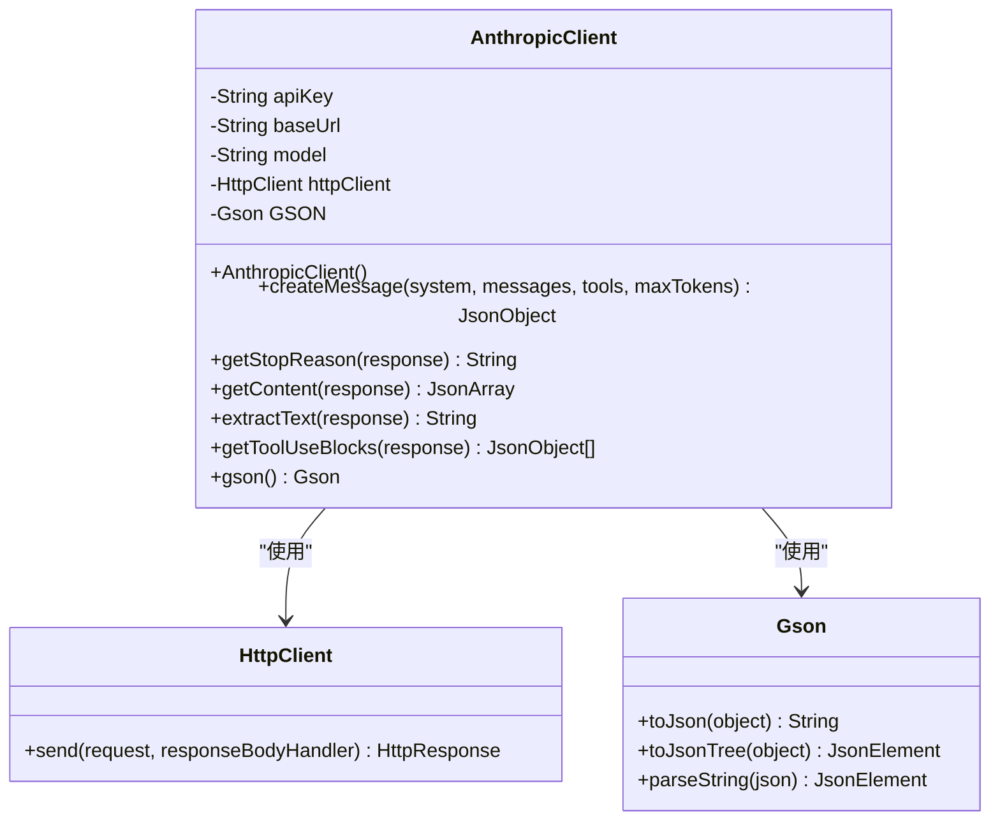
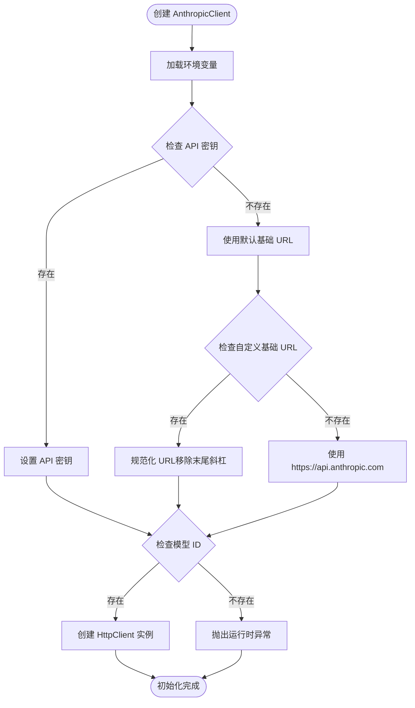
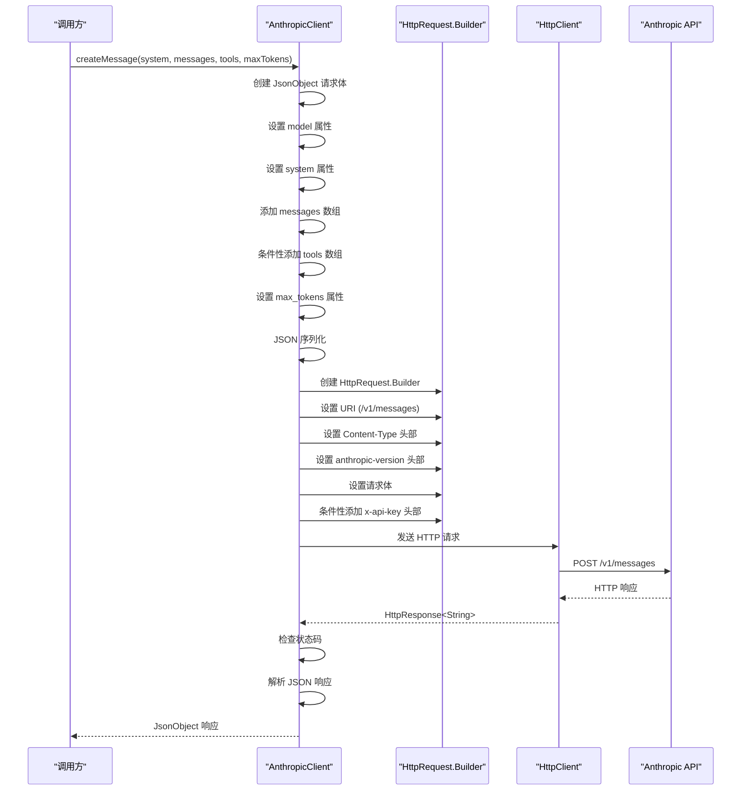
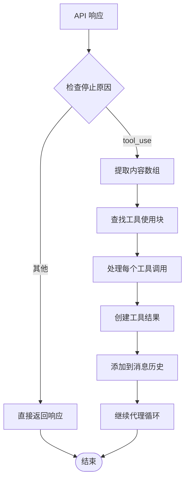
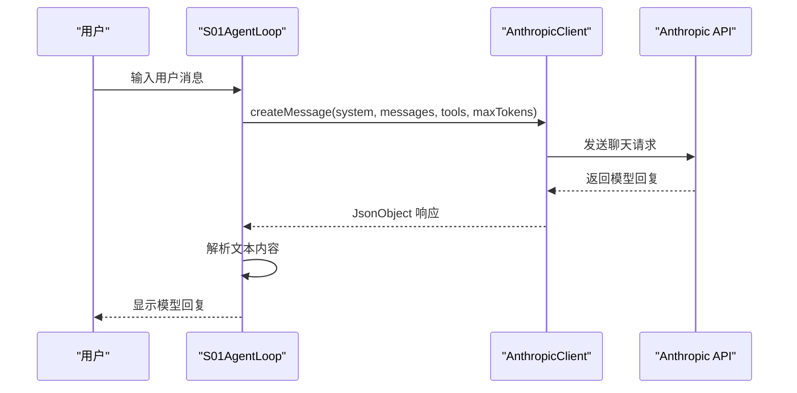
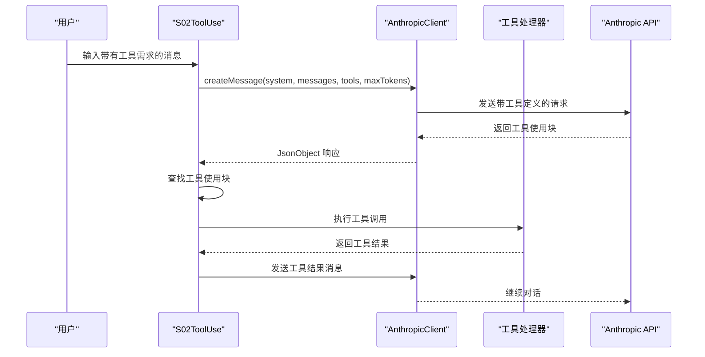
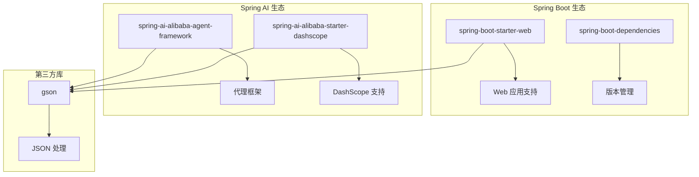

# Anthropic 客户端

<cite>
**本文档引用的文件**
- [AnthropicClient.java](file://src/main/java/com/learn/harness/agent/AnthropicClient.java)
- [S01AgentLoop.java](file://src/main/java/com/learn/harness/agent/S01AgentLoop.java)
- [S02ToolUse.java](file://src/main/java/com/learn/harness/agent/S02ToolUse.java)
- [S03TodoWrite.java](file://src/main/java/com/learn/harness/agent/S03TodoWrite.java)
- [HarnessApplication.java](file://src/main/java/com/learn/harness/HarnessApplication.java)
- [TestController.java](file://src/main/java/com/learn/harness/TestController.java)
- [application.yml](file://src/main/resources/application.yml)
- [pom.xml](file://pom.xml)
</cite>

## 目录
1. [简介](#简介)
2. [项目结构](#项目结构)
3. [核心组件](#核心组件)
4. [架构概览](#架构概览)
5. [详细组件分析](#详细组件分析)
6. [依赖关系分析](#依赖关系分析)
7. [性能考虑](#性能考虑)
8. [故障排除指南](#故障排除指南)
9. [结论](#结论)

## 简介

AnthropicClient 是一个专门为 Anthropic Messages API 设计的 HTTP 客户端，用于在学习代理系统中进行对话和工具调用。该客户端实现了统一的 HTTP 请求处理、JSON 序列化/反序列化、工具使用和工具结果消息处理功能。

该客户端在整个学习代理系统（从 S01 到 S19 章节）中被广泛使用，为每个章节提供了标准化的 Anthropic API 交互接口。它支持环境变量配置、请求构建、认证处理和响应解析等功能。

## 项目结构

该项目采用分层架构设计，主要包含以下关键目录和文件：



**图表来源**
- [AnthropicClient.java:1-127](file://src/main/java/com/learn/harness/agent/AnthropicClient.java#L1-L127)
- [S01AgentLoop.java:1-177](file://src/main/java/com/learn/harness/agent/S01AgentLoop.java#L1-L177)

**章节来源**
- [pom.xml:1-89](file://pom.xml#L1-L89)
- [HarnessApplication.java:1-14](file://src/main/java/com/learn/harness/HarnessApplication.java#L1-L14)

## 核心组件

### AnthropicClient 类概述

AnthropicClient 是整个系统的核心组件，负责与 Anthropic API 进行所有 HTTP 通信。该类具有以下关键特性：

- **单一职责原则**：专注于 Anthropic API 的 HTTP 通信
- **环境变量驱动**：通过环境变量配置 API 密钥、基础 URL 和模型 ID
- **JSON 处理**：使用 Gson 进行请求和响应的 JSON 序列化
- **工具支持**：内置工具使用和工具结果处理功能

### 主要配置参数

| 参数名称 | 环境变量 | 默认值 | 描述 |
|---------|----------|--------|------|
| API 密钥 | ANTHROPIC_API_KEY | 无 | Anthropic API 认证密钥 |
| 基础 URL | ANTHROPIC_BASE_URL | https://api.anthropic.com | API 基础访问地址 |
| 模型 ID | MODEL_ID | 必需 | 要使用的 AI 模型标识符 |

**章节来源**
- [AnthropicClient.java:28-40](file://src/main/java/com/learn/harness/agent/AnthropicClient.java#L28-L40)

## 架构概览

### 系统架构图



**图表来源**
- [TestController.java:11-45](file://src/main/java/com/learn/harness/TestController.java#L11-L45)
- [AnthropicClient.java:20-127](file://src/main/java/com/learn/harness/agent/AnthropicClient.java#L20-L127)

### 数据流架构



**图表来源**
- [TestController.java:24-27](file://src/main/java/com/learn/harness/TestController.java#L24-L27)
- [AnthropicClient.java:51-88](file://src/main/java/com/learn/harness/agent/AnthropicClient.java#L51-L88)

## 详细组件分析

### AnthropicClient 实现详解

#### 类结构设计



**图表来源**
- [AnthropicClient.java:20-127](file://src/main/java/com/learn/harness/agent/AnthropicClient.java#L20-L127)

#### 初始化流程



**图表来源**
- [AnthropicClient.java:28-40](file://src/main/java/com/learn/harness/agent/AnthropicClient.java#L28-L40)

#### 请求构建流程



**图表来源**
- [AnthropicClient.java:51-88](file://src/main/java/com/learn/harness/agent/AnthropicClient.java#L51-L88)

### 响应处理机制

#### 内容提取功能

AnthropicClient 提供了多种响应内容提取方法：

| 方法名 | 功能描述 | 返回类型 | 使用场景 |
|-------|----------|----------|----------|
| getStopReason | 获取停止原因 | String | 判断是否需要工具调用 |
| getContent | 获取内容数组 | JsonArray | 提取文本和工具块 |
| extractText | 提取纯文本内容 | String | 获取可读的文本输出 |
| getToolUseBlocks | 获取工具使用块 | List<JsonObject> | 处理工具调用 |

#### 工具使用处理流程



**图表来源**
- [AnthropicClient.java:92-121](file://src/main/java/com/learn/harness/agent/AnthropicClient.java#L92-L121)

**章节来源**
- [AnthropicClient.java:42-127](file://src/main/java/com/learn/harness/agent/AnthropicClient.java#L42-L127)

### 使用示例

#### 基本聊天示例

以下示例展示了如何使用 AnthropicClient 进行基本的聊天交互：



**图表来源**
- [S01AgentLoop.java:100-124](file://src/main/java/com/learn/harness/agent/S01AgentLoop.java#L100-L124)

#### 工具使用示例



**图表来源**
- [S02ToolUse.java:114-137](file://src/main/java/com/learn/harness/agent/S02ToolUse.java#L114-L137)

**章节来源**
- [S01AgentLoop.java:100-124](file://src/main/java/com/learn/harness/agent/S01AgentLoop.java#L100-L124)
- [S02ToolUse.java:114-137](file://src/main/java/com/learn/harness/agent/S02ToolUse.java#L114-L137)

## 依赖关系分析

### Maven 依赖配置

项目使用 Maven 管理依赖，主要依赖包括：



**图表来源**
- [pom.xml:16-43](file://pom.xml#L16-L43)

### 外部依赖关系

| 依赖项 | 版本 | 用途 | 重要性 |
|--------|------|------|--------|
| spring-boot-starter-web | 3.2.0 | Web 应用框架 | 高 |
| spring-ai-alibaba-agent-framework | 1.1.2.0 | 代理框架支持 | 高 |
| spring-ai-alibaba-starter-dashscope | 1.1.2.0 | DashScope 模型支持 | 中 |
| gson | 2.x | JSON 序列化 | 高 |

**章节来源**
- [pom.xml:16-43](file://pom.xml#L16-L43)

## 性能考虑

### HTTP 客户端优化

AnthropicClient 使用 Java 19 的 HttpClient，具有以下性能特点：

- **连接复用**：HttpClient 实例可以复用底层连接
- **异步支持**：支持异步请求处理（虽然当前实现为同步）
- **内存效率**：使用 UTF-8 编码减少内存占用
- **超时控制**：可通过扩展添加超时配置

### JSON 处理优化

- **Gson 配置**：使用 GsonBuilder 进行 JSON 处理
- **对象池化**：静态 Gson 实例避免重复创建
- **流式处理**：对于大响应可考虑流式处理

### 缓存策略

建议实现以下缓存机制：

1. **模型响应缓存**：对相同输入的重复请求进行缓存
2. **工具调用缓存**：对工具调用结果进行缓存
3. **API 密钥缓存**：避免频繁读取环境变量

## 故障排除指南

### 常见错误及解决方案

#### 环境变量配置错误

**问题症状**：
- 启动时抛出运行时异常
- API 请求失败

**解决方案**：
1. 检查 ANTHROPIC_API_KEY 是否正确设置
2. 验证 MODEL_ID 是否有效
3. 确认 ANTHROPIC_BASE_URL 格式正确

#### HTTP 请求失败

**问题症状**：
- IOException 异常
- 请求超时

**解决方案**：
1. 检查网络连接
2. 验证 API 基础 URL 可访问性
3. 添加重试机制

#### JSON 解析错误

**问题症状**：
- JsonSyntaxException
- 响应格式不匹配

**解决方案**：
1. 检查 API 响应格式
2. 验证 JSON 结构完整性
3. 添加响应验证逻辑

### 调试技巧

#### 日志记录

建议添加以下级别的日志记录：

```java
// 请求日志
logger.info("发送请求到: {}", url);
logger.debug("请求体: {}", requestBody);

// 响应日志  
logger.info("响应状态: {}", statusCode);
logger.debug("响应体: {}", responseBody);

// 错误日志
logger.error("API 调用失败: {}", errorMessage, exception);
```

#### 性能监控

```java
long startTime = System.currentTimeMillis();
// 执行 API 调用
long endTime = System.currentTimeMillis();
logger.info("API 调用耗时: {}ms", endTime - startTime);
```

**章节来源**
- [AnthropicClient.java:84-87](file://src/main/java/com/learn/harness/agent/AnthropicClient.java#L84-L87)

## 结论

AnthropicClient 作为学习代理系统的核心组件，成功实现了以下目标：

### 设计优势

1. **简洁性**：单一职责，专注于 HTTP 通信
2. **可扩展性**：易于添加新功能和工具支持
3. **可维护性**：清晰的代码结构和注释
4. **环境友好**：通过环境变量配置，便于部署

### 技术特点

- **标准化接口**：为所有代理章节提供统一的 API 访问方式
- **灵活配置**：支持多种环境变量配置
- **健壮错误处理**：完善的异常处理机制
- **工具集成**：原生支持工具使用和结果处理

### 改进建议

1. **添加超时配置**：允许自定义请求超时时间
2. **实现重试机制**：添加指数退避重试策略
3. **增强日志记录**：添加更详细的请求/响应日志
4. **支持异步调用**：利用 HttpClient 的异步能力
5. **添加缓存机制**：提高重复请求的性能

该客户端为整个学习代理系统奠定了坚实的基础，通过其标准化的实现，使得后续的章节能够专注于代理逻辑的实现，而无需关心底层的 API 交互细节。