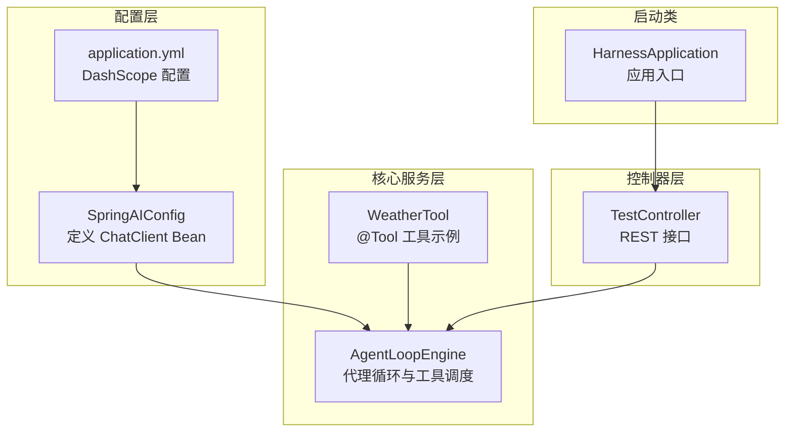
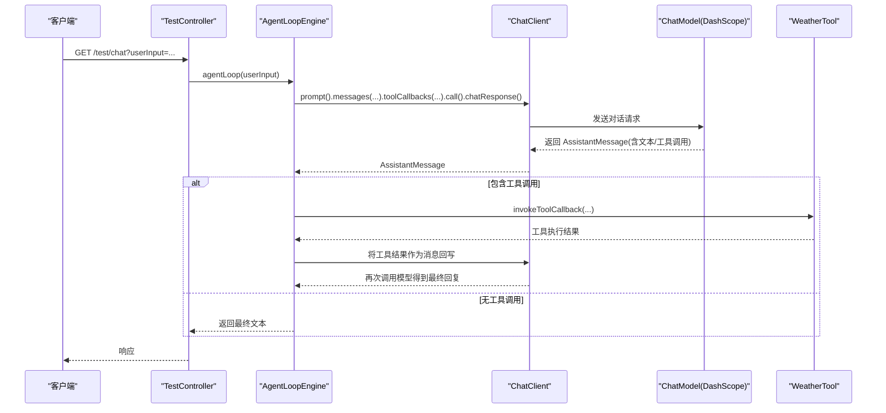
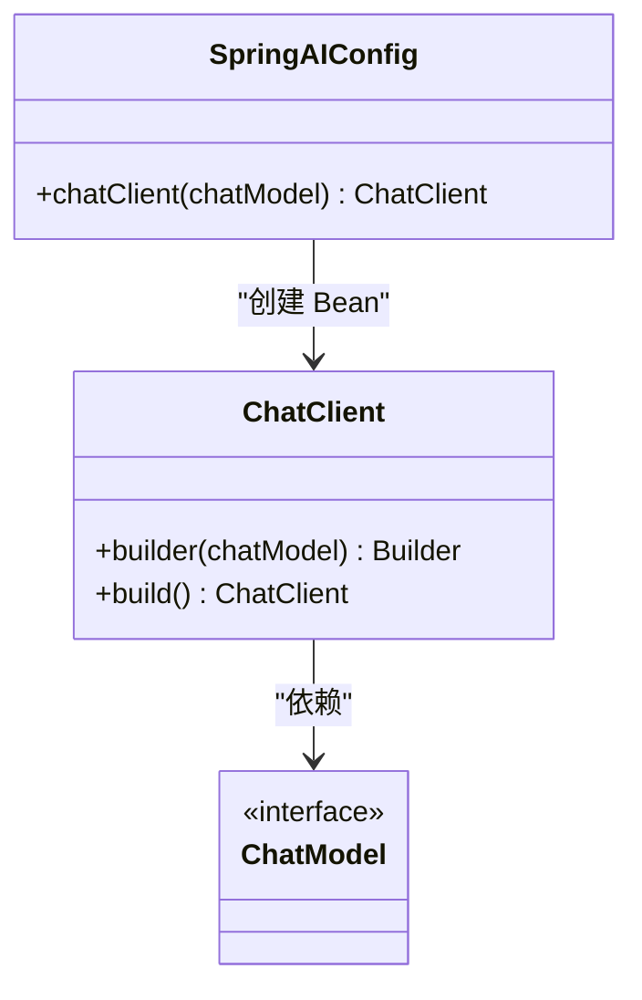
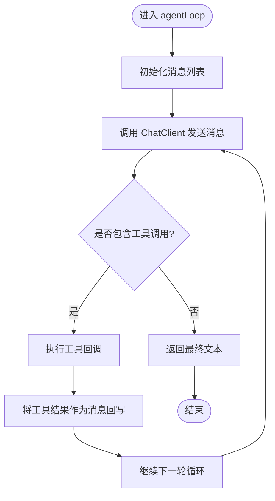
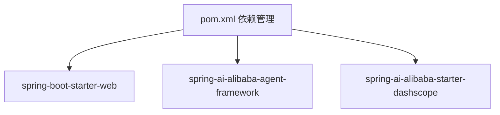

# ChatClient 配置

<cite>
**本文引用的文件**
- [SpringAIConfig.java](file://src/main/java/com/learn/harness/config/SpringAIConfig.java)
- [application.yml](file://src/main/resources/application.yml)
- [pom.xml](file://pom.xml)
- [AgentLoopEngine.java](file://src/main/java/com/learn/harness/core/AgentLoopEngine.java)
- [TestController.java](file://src/main/java/com/learn/harness/TestController.java)
- [WeatherTool.java](file://src/main/java/com/learn/harness/tools/WeatherTool.java)
- [HarnessApplication.java](file://src/main/java/com/learn/harness/HarnessApplication.java)
</cite>

## 目录
1. [简介](#简介)
2. [项目结构](#项目结构)
3. [核心组件](#核心组件)
4. [架构总览](#架构总览)
5. [详细组件分析](#详细组件分析)
6. [依赖分析](#依赖分析)
7. [性能考虑](#性能考虑)
8. [故障排除指南](#故障排除指南)
9. [结论](#结论)
10. [附录](#附录)

## 简介
本文件围绕 ChatClient 的配置与使用展开，重点解释 SpringAIConfig 中 ChatClient Bean 的创建与初始化流程，以及其在代理循环中的关键作用：消息发送、响应接收与工具调用处理。文档同时说明 ChatClient 与 Spring AI Alibaba 框架的集成方式，并提供在 Spring Boot 应用中的配置示例、参数说明、最佳实践与故障排除建议。

## 项目结构
该仓库采用基于功能分层的组织方式，核心与配置集中在以下模块：
- 配置层：SpringAIConfig 定义 ChatClient Bean；application.yml 提供 DashScope 相关配置
- 核心服务层：AgentLoopEngine 封装代理循环逻辑，负责消息管理、工具调用与循环控制
- 控制器层：TestController 暴露 REST 接口，触发代理循环
- 工具层：WeatherTool 展示如何通过 @Tool 注解声明工具，供 ChatClient 在对话中调用
- 启动类：HarnessApplication 作为 Spring Boot 应用入口

**图表来源**
- [SpringAIConfig.java:1-26](file://src/main/java/com/learn/harness/config/SpringAIConfig.java#L1-L26)
- [application.yml:1-13](file://src/main/resources/application.yml#L1-L13)
- [AgentLoopEngine.java:1-353](file://src/main/java/com/learn/harness/core/AgentLoopEngine.java#L1-L353)
- [WeatherTool.java:1-66](file://src/main/java/com/learn/harness/tools/WeatherTool.java#L1-L66)
- [TestController.java:1-45](file://src/main/java/com/learn/harness/TestController.java#L1-L45)
- [HarnessApplication.java:1-14](file://src/main/java/com/learn/harness/HarnessApplication.java#L1-L14)

**章节来源**
- [SpringAIConfig.java:1-26](file://src/main/java/com/learn/harness/config/SpringAIConfig.java#L1-L26)
- [application.yml:1-13](file://src/main/resources/application.yml#L1-L13)
- [pom.xml:1-89](file://pom.xml#L1-L89)
- [HarnessApplication.java:1-14](file://src/main/java/com/learn/harness/HarnessApplication.java#L1-L14)

## 核心组件
- ChatClient Bean：由 SpringAIConfig 创建，基于 ChatModel 构建，用于发起对话请求、传递消息与工具回调
- AgentLoopEngine：封装代理循环，负责消息历史维护、模型调用、工具识别与执行、循环次数控制与回调
- WeatherTool：示例工具，通过 @Tool 注解声明，被 AgentLoopEngine 动态注册为工具回调
- TestController：对外提供 /test/chat 与 /test/weather/agent 接口，触发代理循环并返回最终响应

**章节来源**
- [SpringAIConfig.java:21-24](file://src/main/java/com/learn/harness/config/SpringAIConfig.java#L21-L24)
- [AgentLoopEngine.java:44-68](file://src/main/java/com/learn/harness/core/AgentLoopEngine.java#L44-L68)
- [WeatherTool.java:30-42](file://src/main/java/com/learn/harness/tools/WeatherTool.java#L30-L42)
- [TestController.java:24-43](file://src/main/java/com/learn/harness/TestController.java#L24-L43)

## 架构总览
ChatClient 在 Spring AI Alibaba 框架中扮演“客户端”角色，通过 ChatModel 进行底层模型调用。AgentLoopEngine 作为业务编排者，将用户消息、工具定义与工具回调注入 ChatClient，实现“消息发送 → 模型响应 → 工具调用 → 结果回写”的闭环。

**图表来源**
- [TestController.java:24-27](file://src/main/java/com/learn/harness/TestController.java#L24-L27)
- [AgentLoopEngine.java:187-199](file://src/main/java/com/learn/harness/core/AgentLoopEngine.java#L187-L199)
- [AgentLoopEngine.java:212-248](file://src/main/java/com/learn/harness/core/AgentLoopEngine.java#L212-L248)
- [WeatherTool.java:30-42](file://src/main/java/com/learn/harness/tools/WeatherTool.java#L30-L42)

## 详细组件分析

### SpringAIConfig：ChatClient Bean 的配置与初始化
- Bean 名称：chatClient
- 构造方式：通过 ChatClient.builder(chatModel).build() 创建
- 依赖来源：ChatModel 由 spring-ai-alibaba-starter-dashscope 自动配置提供
- 关键点：
  - ChatModel 的具体实现由 DashScopeChatModel 提供，对应 application.yml 中的 dashscope 配置
  - ChatClient 仅负责高层 API 调用，不直接管理模型细节

**图表来源**
- [SpringAIConfig.java:21-24](file://src/main/java/com/learn/harness/config/SpringAIConfig.java#L21-L24)

**章节来源**
- [SpringAIConfig.java:16-24](file://src/main/java/com/learn/harness/config/SpringAIConfig.java#L16-L24)

### application.yml：DashScope 与模型配置
- 位置：src/main/resources/application.yml
- 关键配置项：
  - spring.ai.dashscope.api-key：DashScope API 密钥
  - spring.ai.dashscope.chat.options.model：模型名称（如 qwen-plus）
- 影响范围：
  - 为 DashScopeChatModel 提供认证与模型选择参数
  - ChatClient 通过 ChatModel 间接使用这些配置

**章节来源**
- [application.yml:8-13](file://src/main/resources/application.yml#L8-L13)

### AgentLoopEngine：代理循环与工具调用处理
- 职责：
  - 维护消息历史（UserMessage → AssistantMessage → ToolResponseMessage）
  - 调用 ChatClient 发起对话请求，传入工具回调集合
  - 识别 AssistantMessage 中的工具调用，执行对应工具并回写结果
  - 限制最大循环次数，避免无限调用
- 关键流程：
  - callModel：通过 ChatClient.prompt().messages(...).toolCallbacks(...).call().chatResponse() 获取模型响应
  - hasToolCalls：判断是否存在工具调用
  - executeTools：遍历工具调用，调用 ToolCallback 并组装 ToolResponseMessage
  - invokeToolCallback：根据工具名匹配 ToolCallback 并执行

**图表来源**
- [AgentLoopEngine.java:96-182](file://src/main/java/com/learn/harness/core/AgentLoopEngine.java#L96-L182)
- [AgentLoopEngine.java:187-199](file://src/main/java/com/learn/harness/core/AgentLoopEngine.java#L187-L199)
- [AgentLoopEngine.java:212-248](file://src/main/java/com/learn/harness/core/AgentLoopEngine.java#L212-L248)

**章节来源**
- [AgentLoopEngine.java:96-182](file://src/main/java/com/learn/harness/core/AgentLoopEngine.java#L96-L182)
- [AgentLoopEngine.java:187-199](file://src/main/java/com/learn/harness/core/AgentLoopEngine.java#L187-L199)
- [AgentLoopEngine.java:212-248](file://src/main/java/com/learn/harness/core/AgentLoopEngine.java#L212-L248)

### WeatherTool：工具定义与注册
- 通过 @Tool(name, description) 声明工具方法
- AgentLoopEngine 在初始化阶段通过 ToolCallbacks.from(...) 自动扫描并注册工具回调
- 工具执行结果以字符串形式回写至消息历史，供模型二次推理

**章节来源**
- [WeatherTool.java:30-42](file://src/main/java/com/learn/harness/tools/WeatherTool.java#L30-L42)
- [AgentLoopEngine.java:58-68](file://src/main/java/com/learn/harness/core/AgentLoopEngine.java#L58-L68)

### TestController：接口与调用链
- /test/chat：通用对话接口，直接委托 AgentLoopEngine
- /test/weather/agent：带工具能力的对话接口，可触发 WeatherTool

**章节来源**
- [TestController.java:24-43](file://src/main/java/com/learn/harness/TestController.java#L24-L43)

## 依赖分析
- Spring Boot 版本：3.2.0
- Spring AI Alibaba：
  - spring-ai-alibaba-agent-framework：代理框架支持
  - spring-ai-alibaba-starter-dashscope：DashScope ChatModel 自动配置
- Maven 插件：spring-boot-maven-plugin 指定主类为 HarnessApplication

**图表来源**
- [pom.xml:16-43](file://pom.xml#L16-L43)

**章节来源**
- [pom.xml:14-15](file://pom.xml#L14-L15)
- [pom.xml:28-40](file://pom.xml#L28-L40)

## 性能考虑
- 循环次数限制：默认最大循环次数为 10，可通过 AgentLoopEngine.maxLoopCount(...) 调整，避免长时间运行导致资源耗尽
- 工具执行开销：工具方法可能涉及外部 IO 或网络请求，建议在工具内部进行超时与限流控制
- 消息长度与上下文：随着工具结果回写，消息历史增长，建议对历史消息进行截断或摘要策略
- 模型调用成本：合理设置模型参数（如 max tokens），避免不必要的长输出

**章节来源**
- [AgentLoopEngine.java:72-73](file://src/main/java/com/learn/harness/core/AgentLoopEngine.java#L72-L73)
- [AgentLoopEngine.java:273-275](file://src/main/java/com/learn/harness/core/AgentLoopEngine.java#L273-L275)

## 故障排除指南
- ChatModel 未注入
  - 现象：ChatClient 构造时报错或空指针
  - 排查：确认 spring-ai-alibaba-starter-dashscope 已引入，且 application.yml 中 dashscope.api-key 与 model 正确
- API 密钥无效或过期
  - 现象：模型调用返回鉴权错误
  - 排查：检查 spring.ai.dashscope.api-key 是否正确，必要时更换密钥
- 模型名称不匹配
  - 现象：模型调用失败或返回空结果
  - 排查：核对 spring.ai.dashscope.chat.options.model 是否为可用模型名称
- 工具未注册或未执行
  - 现象：模型发出工具调用但 AgentLoopEngine 无法执行
  - 排查：确认 @Tool 注解正确，且工具类被 Spring 扫描；检查 ToolCallback 注册逻辑
- 无限循环
  - 现象：代理循环卡死
  - 排查：调整 maxLoopCount，确保工具执行能产生可终止的响应
- 网络或超时问题
  - 现象：模型调用抛出异常
  - 排查：检查网络连通性，必要时增加超时配置（若框架支持）

**章节来源**
- [application.yml:8-13](file://src/main/resources/application.yml#L8-L13)
- [AgentLoopEngine.java:58-68](file://src/main/java/com/learn/harness/core/AgentLoopEngine.java#L58-L68)
- [AgentLoopEngine.java:121-126](file://src/main/java/com/learn/harness/core/AgentLoopEngine.java#L121-L126)

## 结论
本项目通过 SpringAIConfig 将 ChatClient 与 DashScope ChatModel 解耦，配合 AgentLoopEngine 实现了“消息发送 → 模型响应 → 工具调用 → 结果回写”的完整代理循环。通过合理的配置与工具注册，ChatClient 能稳定地在 Spring Boot 应用中提供智能对话与工具调用能力。建议在生产环境中关注循环次数限制、工具执行健壮性与模型参数优化。

## 附录

### 配置清单与含义
- spring.ai.dashscope.api-key
  - 含义：DashScope 平台的 API 密钥
  - 影响：决定模型调用的鉴权与配额
- spring.ai.dashscope.chat.options.model
  - 含义：使用的模型名称（如 qwen-plus）
  - 影响：决定推理能力与成本
- ChatClient 构建参数
  - 含义：通过 ChatModel 提供底层实现
  - 影响：ChatClient 不直接管理模型，而是委托 ChatModel 执行

**章节来源**
- [application.yml:8-13](file://src/main/resources/application.yml#L8-L13)
- [SpringAIConfig.java:21-24](file://src/main/java/com/learn/harness/config/SpringAIConfig.java#L21-L24)

### 典型调用路径
- /test/chat → AgentLoopEngine.agentLoop → ChatClient.prompt().messages(...).toolCallbacks(...).call().chatResponse()
- /test/weather/agent → AgentLoopEngine.agentLoop → ChatClient 调用 → WeatherTool 执行 → 结果回写

**章节来源**
- [TestController.java:24-43](file://src/main/java/com/learn/harness/TestController.java#L24-L43)
- [AgentLoopEngine.java:187-199](file://src/main/java/com/learn/harness/core/AgentLoopEngine.java#L187-L199)