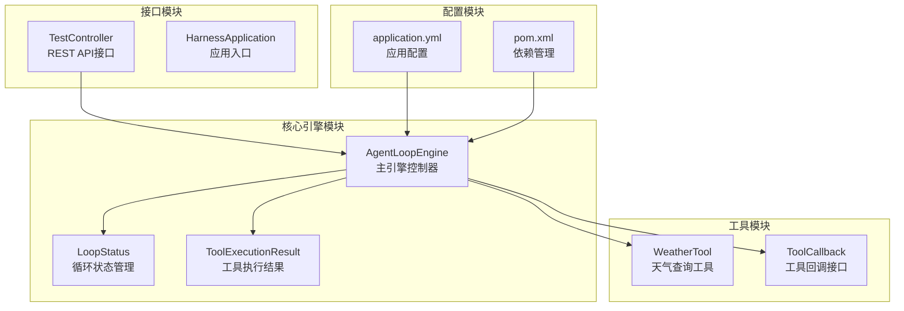
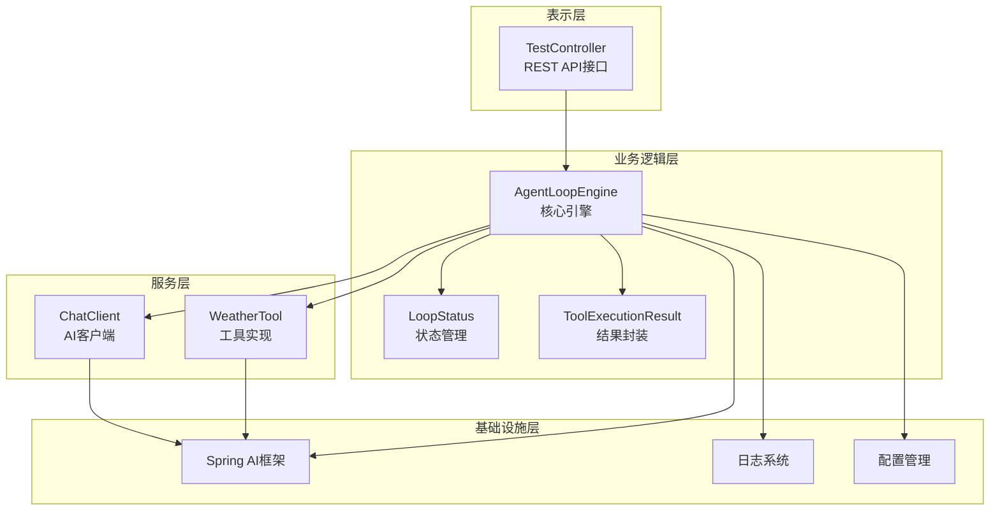
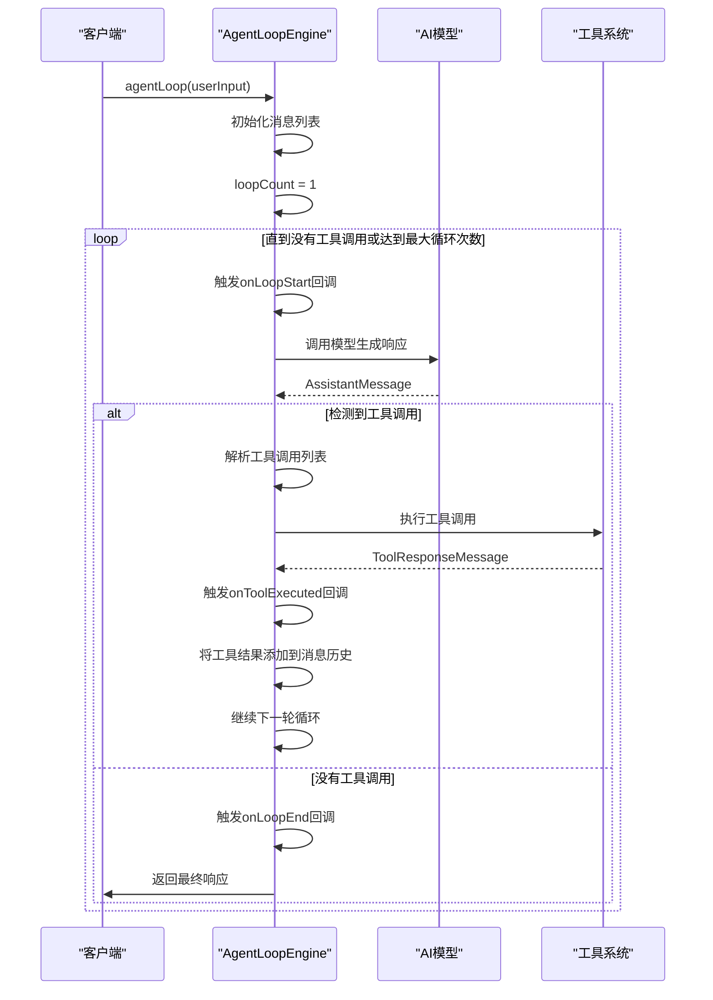
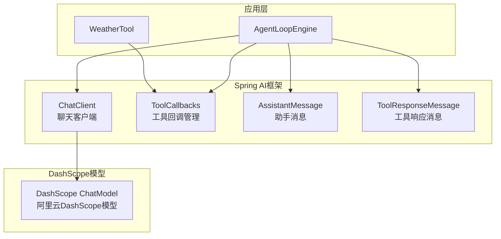
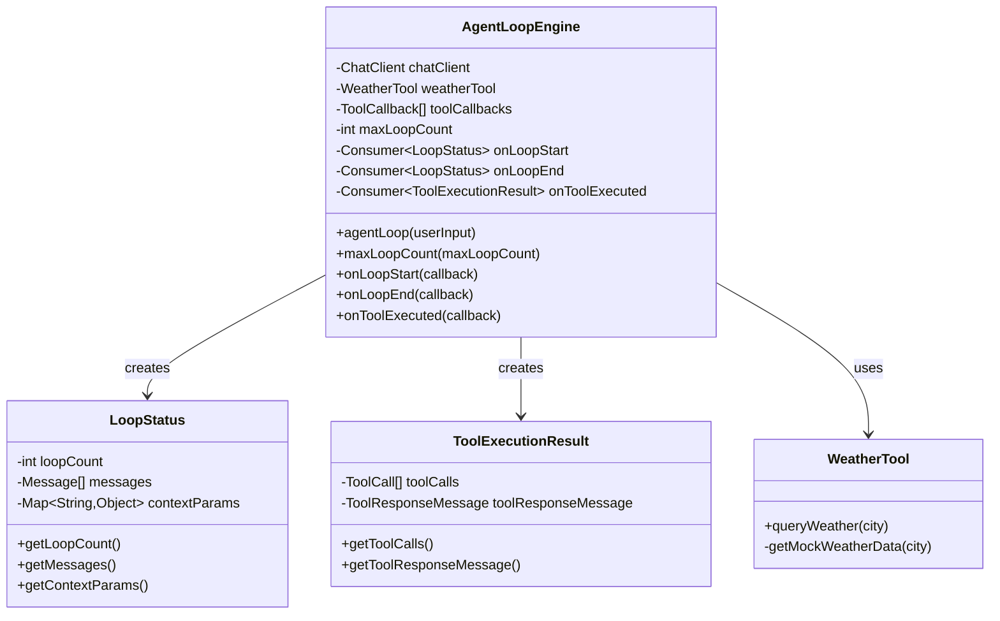

# 代理循环引擎

<cite>
**本文档引用的文件**
- [AgentLoopEngine.java](file://src/main/java/com/learn/harness/core/AgentLoopEngine.java)
- [WeatherTool.java](file://src/main/java/com/learn/harness/tools/WeatherTool.java)
- [TestController.java](file://src/main/java/com/learn/harness/TestController.java)
- [HarnessApplication.java](file://src/main/java/com/learn/harness/HarnessApplication.java)
- [S01AgentLoop.java](file://src/main/java/com/learn/harness/agent/S01AgentLoop.java)
- [S02ToolUse.java](file://src/main/java/com/learn/harness/agent/S02ToolUse.java)
- [application.yml](file://src/main/resources/application.yml)
- [pom.xml](file://pom.xml)
</cite>

## 目录
1. [简介](#简介)
2. [项目结构](#项目结构)
3. [核心组件](#核心组件)
4. [架构概览](#架构概览)
5. [详细组件分析](#详细组件分析)
6. [依赖关系分析](#依赖关系分析)
7. [性能考虑](#性能考虑)
8. [故障排除指南](#故障排除指南)
9. [结论](#结论)

## 简介

代理循环引擎是一个基于Spring AI框架构建的智能代理系统，专门设计用于处理多轮对话和工具调用的循环执行。该引擎实现了完整的消息循环机制，能够自动检测和执行工具调用，管理消息历史，并提供灵活的状态回调系统。

该引擎的核心特性包括：
- **消息循环机制**：维护多轮对话的历史记录，支持连续的交互式对话
- **工具调用执行**：自动检测模型响应中的工具调用并执行相应的工具
- **最大循环次数控制**：防止无限循环，确保系统的稳定性
- **状态回调系统**：提供丰富的回调钩子，便于监控和调试
- **异常处理策略**：完善的错误处理和恢复机制

## 项目结构

该项目采用模块化的架构设计，主要包含以下核心模块：



**图表来源**
- [AgentLoopEngine.java:1-353](file://src/main/java/com/learn/harness/core/AgentLoopEngine.java#L1-L353)
- [WeatherTool.java:1-66](file://src/main/java/com/learn/harness/tools/WeatherTool.java#L1-L66)
- [TestController.java:1-45](file://src/main/java/com/learn/harness/TestController.java#L1-L45)

**章节来源**
- [pom.xml:1-89](file://pom.xml#L1-L89)
- [application.yml:1-13](file://src/main/resources/application.yml#L1-L13)

## 核心组件

### AgentLoopEngine 主引擎

AgentLoopEngine是整个系统的核心控制器，负责管理消息循环、工具调用执行和状态管理。其主要职责包括：

- **消息管理**：维护对话历史，处理用户输入和模型响应
- **工具调度**：检测工具调用并执行相应的工具回调
- **循环控制**：管理循环次数，防止无限循环
- **回调系统**：提供多种回调钩子，支持监控和调试

### 工具系统

系统内置了一个天气查询工具作为示例，展示了如何创建和注册自定义工具：

- **@Tool注解**：标记可被模型调用的工具方法
- **ToolCallback接口**：定义工具执行的标准接口
- **自动注册机制**：通过ToolCallbacks.from()自动发现和注册工具

### 回调系统

引擎提供了三个层次的回调系统：

- **onLoopStart**：每轮循环开始时触发
- **onLoopEnd**：每轮循环结束时触发  
- **onToolExecuted**：工具执行完成后触发

**章节来源**
- [AgentLoopEngine.java:25-353](file://src/main/java/com/learn/harness/core/AgentLoopEngine.java#L25-L353)
- [WeatherTool.java:12-66](file://src/main/java/com/learn/harness/tools/WeatherTool.java#L12-L66)

## 架构概览

代理循环引擎采用了分层架构设计，确保了良好的可扩展性和可维护性：



**图表来源**
- [AgentLoopEngine.java:35-48](file://src/main/java/com/learn/harness/core/AgentLoopEngine.java#L35-L48)
- [TestController.java:15-16](file://src/main/java/com/learn/harness/TestController.java#L15-L16)

## 详细组件分析

### AgentLoopEngine 核心实现

#### agentLoop 方法工作原理

agentLoop方法是引擎的核心执行逻辑，实现了完整的消息循环机制：



**图表来源**
- [AgentLoopEngine.java:96-182](file://src/main/java/com/learn/harness/core/AgentLoopEngine.java#L96-L182)

#### 消息初始化和循环控制

引擎在每次循环开始时进行消息初始化和循环控制：

1. **消息初始化**：创建新的消息列表，添加用户输入
2. **循环计数**：跟踪当前循环次数，检查是否超过最大限制
3. **回调触发**：在循环开始和结束时触发相应的回调
4. **异常处理**：捕获执行过程中的异常并进行处理

#### 工具调用检测和执行

引擎通过以下步骤处理工具调用：

1. **工具调用检测**：检查AssistantMessage中的toolCalls字段
2. **工具执行**：遍历所有工具调用并执行相应的工具回调
3. **结果收集**：将工具执行结果收集到ToolResponseMessage中
4. **消息更新**：将工具结果添加到消息历史中

**章节来源**
- [AgentLoopEngine.java:107-182](file://src/main/java/com/learn/harness/core/AgentLoopEngine.java#L107-L182)
- [AgentLoopEngine.java:144-163](file://src/main/java/com/learn/harness/core/AgentLoopEngine.java#L144-L163)

### 工具回调注册机制

#### 自动工具发现

引擎使用Spring AI框架的ToolCallbacks机制自动发现和注册工具：

```mermaid
flowchart TD
A[启动应用] --> B[PostConstruct初始化]
B --> C[扫描@Tool注解]
C --> D[创建ToolCallback实例]
D --> E[添加到toolCallbacks列表]
E --> F[日志记录注册数量]
G[工具调用] --> H[查找匹配的ToolCallback]
H --> I[执行工具方法]
I --> J[返回执行结果]
```

**图表来源**
- [AgentLoopEngine.java:58-68](file://src/main/java/com/learn/harness/core/AgentLoopEngine.java#L58-L68)
- [WeatherTool.java:30](file://src/main/java/com/learn/harness/tools/WeatherTool.java#L30)

#### 工具执行流程

工具执行采用直接回调调用的方式：

1. **工具查找**：根据工具名称在toolCallbacks中查找匹配的回调
2. **参数解析**：解析工具调用的参数字符串
3. **执行调用**：调用ToolCallback的call方法执行工具
4. **结果处理**：将执行结果包装为ToolResponseMessage

**章节来源**
- [AgentLoopEngine.java:253-266](file://src/main/java/com/learn/harness/core/AgentLoopEngine.java#L253-L266)

### 状态回调系统

#### 回调类型和用途

引擎提供了三种类型的回调，每种都有特定的用途：

1. **onLoopStart**：在每轮循环开始时触发，可用于监控循环状态
2. **onLoopEnd**：在每轮循环结束时触发，可用于清理资源
3. **onToolExecuted**：在工具执行完成后触发，可用于记录工具调用历史

#### LoopStatus 和 ToolExecutionResult

引擎定义了两个内部类来封装回调数据：

- **LoopStatus**：包含循环次数、消息历史和上下文参数
- **ToolExecutionResult**：包含原始工具调用和工具执行结果

**章节来源**
- [AgentLoopEngine.java:307-351](file://src/main/java/com/learn/harness/core/AgentLoopEngine.java#L307-L351)

### 异常处理策略

#### 错误处理层次

引擎采用了多层次的异常处理策略：

1. **工具执行异常**：捕获单个工具执行过程中的异常
2. **循环异常**：捕获整个循环过程中的异常
3. **工具未找到**：处理找不到匹配工具的情况

#### 异常恢复机制

当发生异常时，引擎会：
- 记录详细的错误信息
- 返回友好的错误消息给用户
- 继续执行后续的循环
- 在必要时终止循环

**章节来源**
- [AgentLoopEngine.java:170-174](file://src/main/java/com/learn/harness/core/AgentLoopEngine.java#L170-L174)
- [AgentLoopEngine.java:235-242](file://src/main/java/com/learn/harness/core/AgentLoopEngine.java#L235-L242)

## 依赖关系分析

### 外部依赖

项目使用了Spring AI框架来实现AI模型集成：



**图表来源**
- [pom.xml:28-41](file://pom.xml#L28-L41)
- [AgentLoopEngine.java:44-48](file://src/main/java/com/learn/harness/core/AgentLoopEngine.java#L44-L48)

### 内部依赖关系

引擎内部各组件之间的依赖关系：



**图表来源**
- [AgentLoopEngine.java:35-351](file://src/main/java/com/learn/harness/core/AgentLoopEngine.java#L35-L351)

**章节来源**
- [pom.xml:16-43](file://pom.xml#L16-L43)

## 性能考虑

### 循环次数限制

引擎默认设置最大循环次数为10次，这是为了防止无限循环而设计的安全措施。开发者可以根据具体需求调整这个值：

- **默认值**：10次循环
- **配置方式**：通过maxLoopCount()方法设置
- **应用场景**：复杂任务可能需要更多的循环次数

### 工具执行优化

为了提高工具执行的效率，建议：

1. **异步工具执行**：对于耗时较长的工具，考虑使用异步执行
2. **缓存机制**：对频繁使用的工具结果进行缓存
3. **批量处理**：合并多个小工具调用为批量操作

### 内存管理

引擎在处理大量消息时需要注意内存管理：

- **消息历史清理**：定期清理不需要的历史消息
- **响应大小限制**：对工具返回结果进行大小限制
- **资源释放**：确保工具执行后的资源得到正确释放

## 故障排除指南

### 常见问题及解决方案

#### 工具未找到错误

**问题描述**：当模型尝试调用工具但引擎无法找到对应工具时

**解决方案**：
1. 检查工具是否正确标注了@Tool注解
2. 确认工具类已被Spring容器管理
3. 验证工具名称与模型调用的名称一致

#### 循环次数超限

**问题描述**：达到最大循环次数限制导致循环提前终止

**解决方案**：
1. 增加maxLoopCount的值
2. 优化工具调用逻辑，减少不必要的循环
3. 检查工具执行是否正常完成

#### 模型响应为空

**问题描述**：模型未返回有效的响应消息

**解决方案**：
1. 检查API密钥配置
2. 验证模型参数设置
3. 确认网络连接正常

### 调试技巧

#### 启用详细日志

引擎提供了丰富的日志信息，可以通过以下方式启用更详细的日志：

1. **修改日志级别**：在application.yml中调整日志级别
2. **监听回调事件**：使用onLoopStart和onToolExecuted回调
3. **检查消息历史**：通过LoopStatus查看当前消息状态

#### 性能监控

建议使用以下方法监控引擎性能：

1. **循环时间统计**：记录每轮循环的执行时间
2. **工具执行时间**：监控各个工具的执行耗时
3. **内存使用情况**：监控消息历史的增长情况

**章节来源**
- [AgentLoopEngine.java:122-126](file://src/main/java/com/learn/harness/core/AgentLoopEngine.java#L122-L126)
- [AgentLoopEngine.java:264-266](file://src/main/java/com/learn/harness/core/AgentLoopEngine.java#L264-L266)

## 结论

代理循环引擎是一个功能完整、设计合理的智能代理系统。它成功地实现了以下关键目标：

1. **完整的消息循环机制**：支持多轮对话和工具调用的无缝集成
2. **灵活的工具系统**：通过注解驱动的方式轻松扩展新工具
3. **强大的回调系统**：提供丰富的监控和调试能力
4. **稳健的异常处理**：确保系统在各种异常情况下都能稳定运行

该引擎的设计充分体现了现代软件工程的最佳实践，包括：
- 清晰的分层架构
- 良好的扩展性设计
- 完善的错误处理机制
- 丰富的监控和调试支持

对于需要构建智能代理应用的开发者来说，这是一个非常有价值的参考实现，可以作为基础框架进行进一步的定制和扩展。