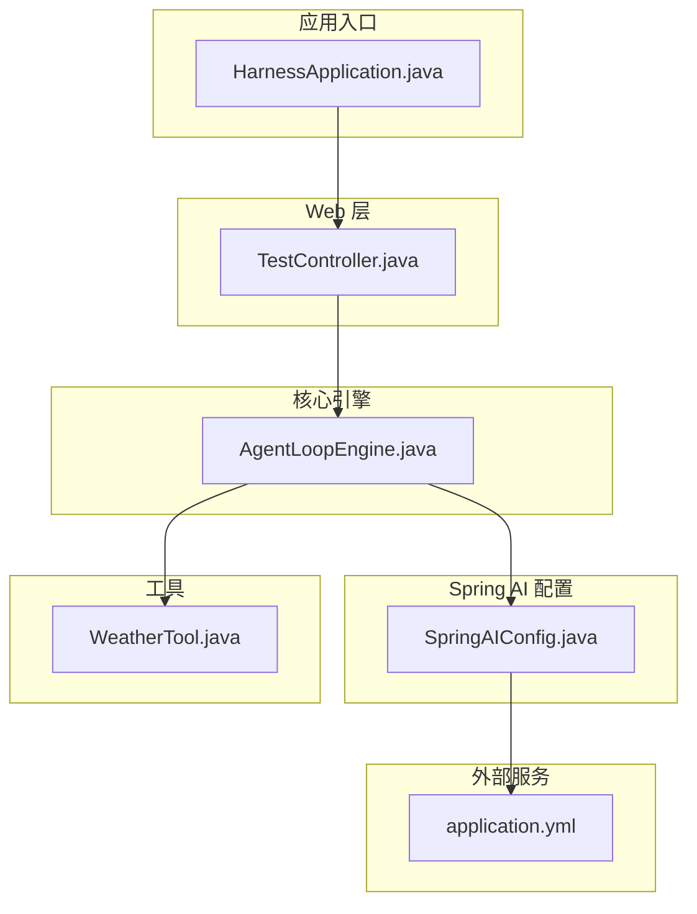
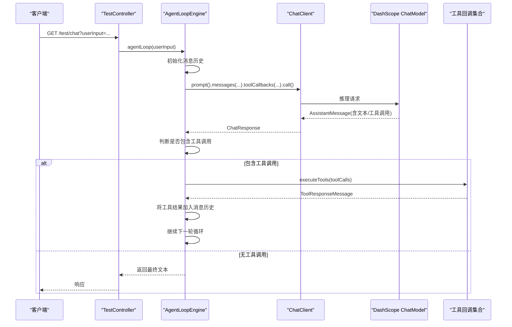
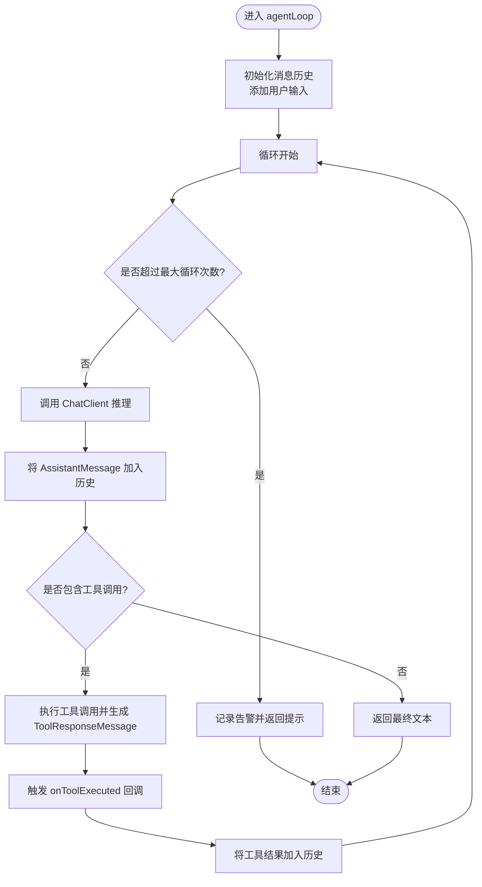
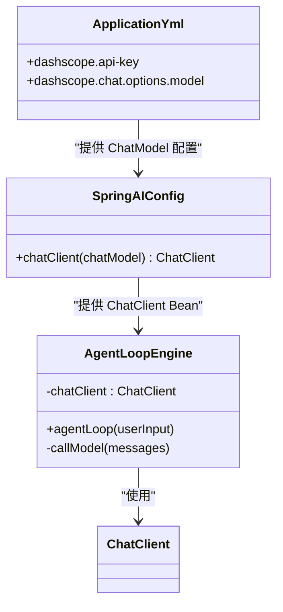
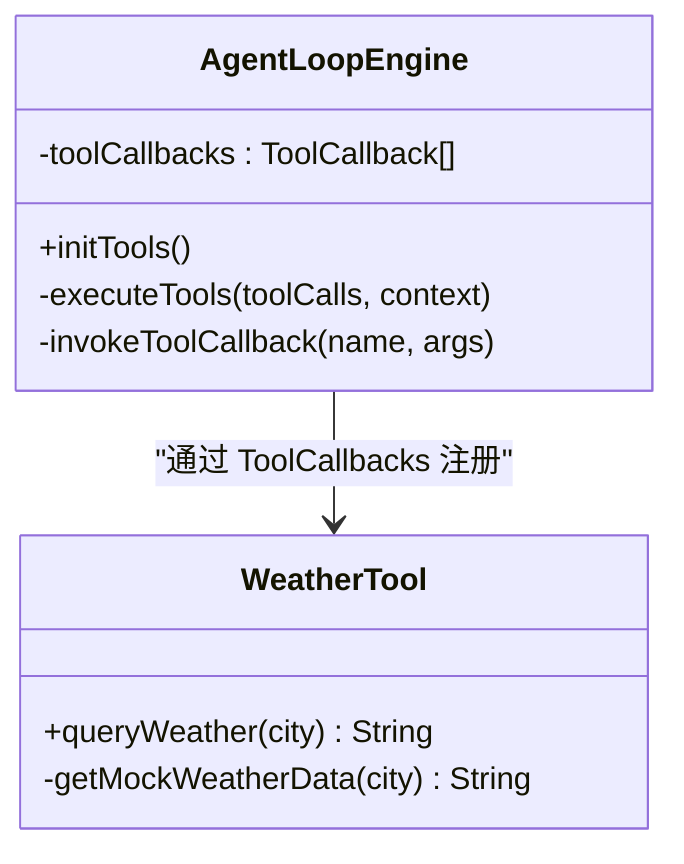
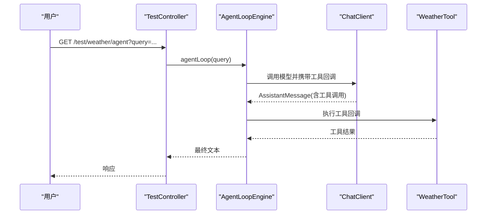
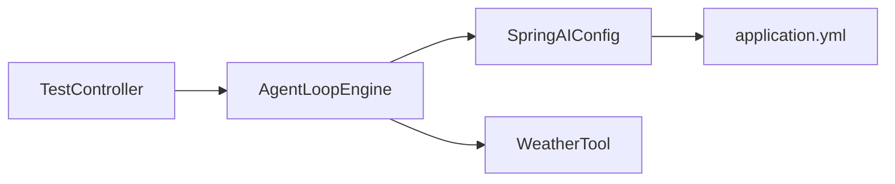

# 核心引擎

<cite>
**本文引用的文件**
- [AgentLoopEngine.java](file://src/main/java/com/learn/harness/core/AgentLoopEngine.java)
- [TestController.java](file://src/main/java/com/learn/harness/TestController.java)
- [WeatherTool.java](file://src/main/java/com/learn/harness/tools/WeatherTool.java)
- [SpringAIConfig.java](file://src/main/java/com/learn/harness/config/SpringAIConfig.java)
- [application.yml](file://src/main/resources/application.yml)
- [HarnessApplication.java](file://src/main/java/com/learn/harness/HarnessApplication.java)
- [S01AgentLoop.java](file://src/main/java/com/learn/harness/agent/S01AgentLoop.java)
</cite>

## 更新摘要
**变更内容**
- 新增 AgentLoopEngine 核心组件的详细文档说明
- 更新架构总览图以反映 AgentLoopEngine 作为项目对外"大脑"的核心地位
- 增强消息循环机制、工具调用执行流程的技术细节
- 补充状态回调机制、错误处理策略的完整说明
- 添加链式配置方法和扩展点的使用指南
- 更新性能优化建议和故障排查指南

## 目录
1. [简介](#简介)
2. [项目结构](#项目结构)
3. [核心组件](#核心组件)
4. [架构总览](#架构总览)
5. [详细组件分析](#详细组件分析)
6. [依赖分析](#依赖分析)
7. [性能考虑](#性能考虑)
8. [故障排查指南](#故障排查指南)
9. [结论](#结论)
10. [附录](#附录)

## 简介
本文件围绕核心引擎模块进行系统化技术文档编写，重点覆盖以下方面：
- AgentLoopEngine 作为项目对外"大脑"的核心职责与设计理念
- 消息循环机制、工具调用执行流程与最大循环次数控制
- ChatClient 配置与 DashScope ChatModel 的集成
- 消息历史管理、状态回调机制与错误处理策略
- 具体使用示例（通过 REST 接口触发引擎）与扩展点说明
- 性能优化建议与常见问题解决方案

该仓库采用 Spring Boot + Spring AI 架构，结合 DashScope ChatModel 作为推理后端，并通过工具回调机制实现工具调用闭环。AgentLoopEngine 作为整个项目的统一入口，负责管理多轮对话消息历史、驱动工具调用执行循环、控制最大循环次数、提供状态回调机制，以及后续 RAG、提示词工程、长短期记忆等能力的插件化接入。

## 项目结构
项目采用按功能域分层的组织方式：
- core：核心引擎与运行时控制逻辑（AgentLoopEngine 位于此处）
- agent：教学样例与工具实现（S01–S19）
- tools：工具定义与实现
- config：Spring AI 配置
- resources：应用配置
- rest：对外接口控制器

**图表来源**
- [HarnessApplication.java:1-27](file://src/main/java/com/learn/harness/HarnessApplication.java#L1-L27)
- [TestController.java:1-59](file://src/main/java/com/learn/harness/TestController.java#L1-L59)
- [AgentLoopEngine.java:1-399](file://src/main/java/com/learn/harness/core/AgentLoopEngine.java#L1-L399)
- [SpringAIConfig.java:1-35](file://src/main/java/com/learn/harness/config/SpringAIConfig.java#L1-L35)
- [WeatherTool.java:1-73](file://src/main/java/com/learn/harness/tools/WeatherTool.java#L1-L73)
- [application.yml:1-13](file://src/main/resources/application.yml#L1-L13)

**章节来源**
- [HarnessApplication.java:1-27](file://src/main/java/com/learn/harness/HarnessApplication.java#L1-L27)
- [TestController.java:1-59](file://src/main/java/com/learn/harness/TestController.java#L1-L59)
- [application.yml:1-13](file://src/main/resources/application.yml#L1-L13)

## 核心组件
- **AgentLoopEngine**：项目对外的"大脑"，负责消息历史管理、模型调用、工具调用循环、最大循环次数控制、状态回调与错误处理
- **WeatherTool**：示例工具，演示如何通过注解声明工具并被引擎自动发现与调用
- **SpringAIConfig**：装配 ChatClient Bean，绑定 DashScope ChatModel
- **TestController**：对外暴露 REST 接口，驱动 AgentLoopEngine 执行

**章节来源**
- [AgentLoopEngine.java:24-37](file://src/main/java/com/learn/harness/core/AgentLoopEngine.java#L24-L37)
- [WeatherTool.java:10-17](file://src/main/java/com/learn/harness/tools/WeatherTool.java#L10-L17)
- [SpringAIConfig.java:8-16](file://src/main/java/com/learn/harness/config/SpringAIConfig.java#L8-L16)
- [TestController.java:10-22](file://src/main/java/com/learn/harness/TestController.java#L10-L22)

## 架构总览
核心引擎以"消息历史 + 模型推理 + 工具调用"三段式循环为核心，通过 ChatClient 发起请求，利用工具回调机制执行工具，再将工具结果回写消息历史，形成闭环。AgentLoopEngine 作为整个项目的统一入口，承担着对外"大脑"的角色。

**图表来源**
- [TestController.java:39-42](file://src/main/java/com/learn/harness/TestController.java#L39-L42)
- [AgentLoopEngine.java:113-188](file://src/main/java/com/learn/harness/core/AgentLoopEngine.java#L113-L188)
- [AgentLoopEngine.java:199-211](file://src/main/java/com/learn/harness/core/AgentLoopEngine.java#L199-L211)
- [AgentLoopEngine.java:233-269](file://src/main/java/com/learn/harness/core/AgentLoopEngine.java#L233-L269)
- [SpringAIConfig.java:30-33](file://src/main/java/com/learn/harness/config/SpringAIConfig.java#L30-L33)

## 详细组件分析

### AgentLoopEngine：消息循环与工具调用
AgentLoopEngine 作为项目对外的"大脑"，承担着以下核心职责：
- **消息历史管理**：每次循环开始前初始化消息列表，并将用户输入作为第一条消息；模型返回的 AssistantMessage 与工具执行结果 ToolResponseMessage 均追加至历史，保证上下文连续性
- **工具调用执行流程**：通过 ChatClient 的 toolCallbacks 注入工具回调集合；若 AssistantMessage 含工具调用，则遍历工具调用并逐一执行，收集 ToolResponseMessage；将工具结果回写消息历史，继续下一轮循环
- **最大循环次数控制**：默认最大循环次数为10次，可通过 maxLoopCount() 链式方法动态设置；当超过上限时，记录告警并返回提示语句，避免无限循环
- **状态回调机制**：onLoopStart/onLoopEnd：在每轮循环开始与结束时触发，传入 LoopStatus（包含轮次、消息历史、上下文参数）；onToolExecuted：在工具执行完成后触发，传入 ToolExecutionResult（包含原始工具调用与工具响应）
- **错误处理策略**：模型调用异常捕获并返回错误提示；工具执行异常捕获并包装为 ToolResponseMessage 的错误结果；未找到工具时返回"工具未找到"提示
- **可扩展点**：通过链式配置方法注入自定义回调；通过 @PostConstruct 注册工具回调，支持自动扫描工具注解

**图表来源**
- [AgentLoopEngine.java:113-188](file://src/main/java/com/learn/harness/core/AgentLoopEngine.java#L113-L188)
- [AgentLoopEngine.java:199-211](file://src/main/java/com/learn/harness/core/AgentLoopEngine.java#L199-L211)
- [AgentLoopEngine.java:233-269](file://src/main/java/com/learn/harness/core/AgentLoopEngine.java#L233-L269)
- [AgentLoopEngine.java:350-397](file://src/main/java/com/learn/harness/core/AgentLoopEngine.java#L350-L397)

**章节来源**
- [AgentLoopEngine.java:24-37](file://src/main/java/com/learn/harness/core/AgentLoopEngine.java#L24-L37)
- [AgentLoopEngine.java:76-86](file://src/main/java/com/learn/harness/core/AgentLoopEngine.java#L76-L86)
- [AgentLoopEngine.java:113-188](file://src/main/java/com/learn/harness/core/AgentLoopEngine.java#L113-L188)

### ChatClient 配置与 DashScope 后端
ChatClient Bean 由 SpringAIConfig 提供，基于 ChatModel 构建。application.yml 中配置了 DashScope API Key 与模型名，确保 ChatClient 能正确路由到 DashScope。AgentLoopEngine 通过 @Resource 注入 ChatClient，直接使用其 prompt().messages(...).toolCallbacks(...).call() 流程。

**图表来源**
- [SpringAIConfig.java:30-33](file://src/main/java/com/learn/harness/config/SpringAIConfig.java#L30-L33)
- [application.yml:8-13](file://src/main/resources/application.yml#L8-L13)
- [AgentLoopEngine.java:46-48](file://src/main/java/com/learn/harness/core/AgentLoopEngine.java#L46-L48)

**章节来源**
- [SpringAIConfig.java:1-35](file://src/main/java/com/learn/harness/config/SpringAIConfig.java#L1-L35)
- [application.yml:1-13](file://src/main/resources/application.yml#L1-L13)

### 工具系统：WeatherTool 与工具回调
WeatherTool 通过 @Tool 注解声明工具，引擎启动时通过 ToolCallbacks.from(...) 自动注册。AgentLoopEngine 在执行工具阶段，遍历工具回调集合，根据工具名匹配并调用对应回调。工具执行结果统一包装为 ToolResponseMessage 并回写消息历史。

**图表来源**
- [WeatherTool.java:35-46](file://src/main/java/com/learn/harness/tools/WeatherTool.java#L35-L46)
- [AgentLoopEngine.java:64-74](file://src/main/java/com/learn/harness/core/AgentLoopEngine.java#L64-L74)
- [AgentLoopEngine.java:233-269](file://src/main/java/com/learn/harness/core/AgentLoopEngine.java#L233-L269)

**章节来源**
- [WeatherTool.java:1-73](file://src/main/java/com/learn/harness/tools/WeatherTool.java#L1-L73)
- [AgentLoopEngine.java:1-399](file://src/main/java/com/learn/harness/core/AgentLoopEngine.java#L1-L399)

### REST 接口与使用示例
TestController 暴露 /test/chat 与 /test/weather/agent 两个接口。调用流程：客户端 -> TestController -> AgentLoopEngine -> ChatClient/DashScope -> 工具回调 -> 返回最终文本。示例场景：用户输入"北京今天天气怎么样？"时，引擎识别工具调用并返回天气信息。

**图表来源**
- [TestController.java:54-57](file://src/main/java/com/learn/harness/TestController.java#L54-L57)
- [AgentLoopEngine.java:113-188](file://src/main/java/com/learn/harness/core/AgentLoopEngine.java#L113-L188)
- [WeatherTool.java:35-46](file://src/main/java/com/learn/harness/tools/WeatherTool.java#L35-L46)

**章节来源**
- [TestController.java:1-59](file://src/main/java/com/learn/harness/TestController.java#L1-L59)

### 状态回调机制详解
AgentLoopEngine 提供了三个层次的状态回调机制：
- **onLoopStart**：每轮循环开始时触发，传入 LoopStatus 对象，包含当前轮次、消息历史和上下文参数
- **onLoopEnd**：每轮循环结束时触发（包括异常情况），传入相同的 LoopStatus 对象
- **onToolExecuted**：每次工具执行完成后触发，传入 ToolExecutionResult 对象，包含本轮请求的所有 ToolCall 和工具执行后的统一响应消息

这些回调机制为上层观察、埋点、扩展提供了便利，便于实现监控、日志记录、性能统计等功能。

**章节来源**
- [AgentLoopEngine.java:79-86](file://src/main/java/com/learn/harness/core/AgentLoopEngine.java#L79-L86)
- [AgentLoopEngine.java:350-397](file://src/main/java/com/learn/harness/core/AgentLoopEngine.java#L350-L397)

### 链式配置方法
AgentLoopEngine 提供了完整的链式配置方法，允许在运行时动态调整引擎行为：
- **maxLoopCount(int)**：设置最大循环次数
- **onLoopStart(Consumer)**：设置循环开始回调
- **onLoopEnd(Consumer)**：设置循环结束回调
- **onToolExecuted(Consumer)**：设置工具执行回调

这些方法返回当前实例，支持链式调用，便于在业务代码中灵活配置。

**章节来源**
- [AgentLoopEngine.java:296-340](file://src/main/java/com/learn/harness/core/AgentLoopEngine.java#L296-L340)

## 依赖分析
组件耦合关系：
- **AgentLoopEngine** 依赖 ChatClient（Spring AI）、WeatherTool（工具回调）、日志框架
- **SpringAIConfig** 依赖 ChatModel（DashScope），并提供 ChatClient Bean
- **TestController** 依赖 AgentLoopEngine

外部依赖：
- **DashScope ChatModel**（由 application.yml 配置）
- **Spring AI 框架**（提供 ChatClient、ToolCallbacks 等核心组件）

**图表来源**
- [TestController.java:26-28](file://src/main/java/com/learn/harness/TestController.java#L26-L28)
- [AgentLoopEngine.java:46-52](file://src/main/java/com/learn/harness/core/AgentLoopEngine.java#L46-L52)
- [SpringAIConfig.java:30-33](file://src/main/java/com/learn/harness/config/SpringAIConfig.java#L30-L33)
- [application.yml:8-13](file://src/main/resources/application.yml#L8-L13)
- [WeatherTool.java:18-19](file://src/main/java/com/learn/harness/tools/WeatherTool.java#L18-L19)

**章节来源**
- [TestController.java:1-59](file://src/main/java/com/learn/harness/TestController.java#L1-L59)
- [AgentLoopEngine.java:1-399](file://src/main/java/com/learn/harness/core/AgentLoopEngine.java#L1-L399)
- [SpringAIConfig.java:1-35](file://src/main/java/com/learn/harness/config/SpringAIConfig.java#L1-L35)
- [application.yml:1-13](file://src/main/resources/application.yml#L1-L13)
- [WeatherTool.java:1-73](file://src/main/java/com/learn/harness/tools/WeatherTool.java#L1-L73)

## 性能考虑
- **循环上限控制**：通过 maxLoopCount 防止无限循环，建议根据任务复杂度合理设置
- **工具执行开销**：工具回调执行可能涉及 IO 或外部 API 调用，建议：
  - 缓存热点工具结果
  - 异步执行耗时工具（需评估消息历史一致性）
- **消息历史长度**：长历史会增加上下文开销，建议在合适节点裁剪或压缩历史
- **模型调用频率**：合理合并多轮对话，减少不必要的模型调用
- **日志级别**：生产环境建议降低日志级别，避免频繁 I/O 影响吞吐
- **内存管理**：对于长时间运行的对话，定期清理历史消息以控制内存使用

## 故障排查指南
- **模型未返回有效响应**
  - 现象：返回"模型未返回有效响应"提示
  - 排查：检查 DashScope 配置、网络连通性、API Key 有效性
- **工具未找到**
  - 现象：工具调用返回"工具未找到: 工具名"
  - 排查：确认工具名与 @Tool 注解一致，确保工具被正确注册
- **工具执行异常**
  - 现象：工具结果包含"Tool执行异常: 错误信息"
  - 排查：查看工具内部异常栈，修复工具实现或输入参数
- **循环提前终止**
  - 现象：达到最大循环次数限制
  - 排查：调整 maxLoopCount，检查工具调用是否陷入死循环
- **HTTP 请求失败**
  - 现象：执行过程中发生错误: 异常信息
  - 排查：检查网络连接、API Key、超时设置

**章节来源**
- [AgentLoopEngine.java:127-132](file://src/main/java/com/learn/harness/core/AgentLoopEngine.java#L127-L132)
- [AgentLoopEngine.java:176-180](file://src/main/java/com/learn/harness/core/AgentLoopEngine.java#L176-L180)
- [AgentLoopEngine.java:292-294](file://src/main/java/com/learn/harness/core/AgentLoopEngine.java#L292-L294)

## 结论
AgentLoopEngine 以简洁而稳健的方式实现了"消息历史 + 模型推理 + 工具调用"的闭环，具备完善的错误处理与可扩展的回调机制。作为项目对外的"大脑"，它不仅承担着当前的功能实现，更为后续的 RAG、提示词工程、长短期记忆等能力提供了插件化接入的基础。通过 Spring AI 与 DashScope 的集成，引擎能够稳定地处理多轮对话与工具调用。建议在生产环境中结合业务需求合理设置循环上限、优化消息历史与工具执行策略，并完善监控与日志体系。

## 附录
- **关键配置项**
  - DashScope API Key：application.yml 中 dashscope.api-key
  - 模型名：application.yml 中 dashscope.chat.options.model
  - ChatClient Bean：SpringAIConfig 中 chatClient(chatModel)
- **常用接口**
  - /test/chat?userInput=...：通用对话
  - /test/weather/agent?query=...：带天气工具的对话
- **扩展开发指南**
  - 新增工具：通过 @Tool 注解声明，AgentLoopEngine 会自动注册
  - 自定义回调：使用链式配置方法设置状态回调
  - 性能调优：根据业务场景调整 maxLoopCount 和消息历史策略

**章节来源**
- [application.yml:8-13](file://src/main/resources/application.yml#L8-L13)
- [SpringAIConfig.java:30-33](file://src/main/java/com/learn/harness/config/SpringAIConfig.java#L30-L33)
- [TestController.java:39-57](file://src/main/java/com/learn/harness/TestController.java#L39-L57)