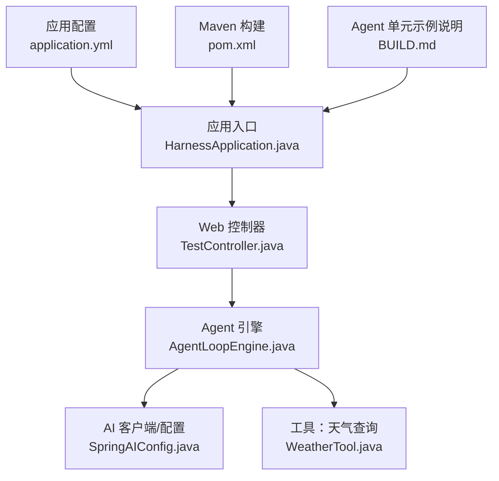
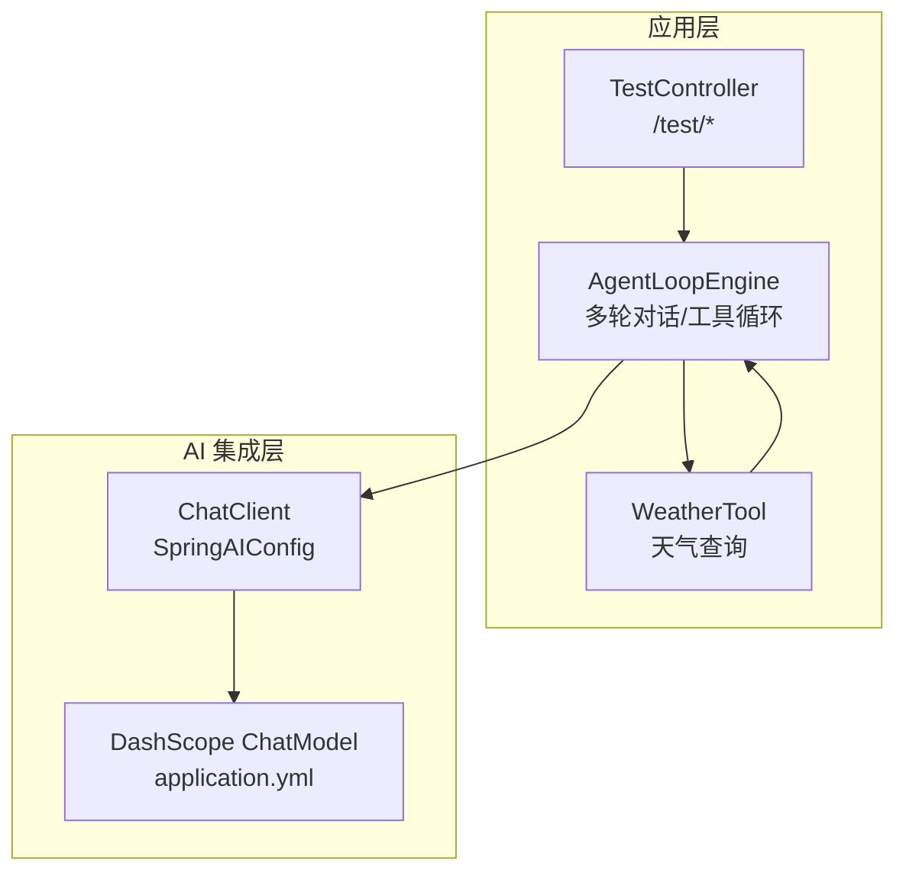
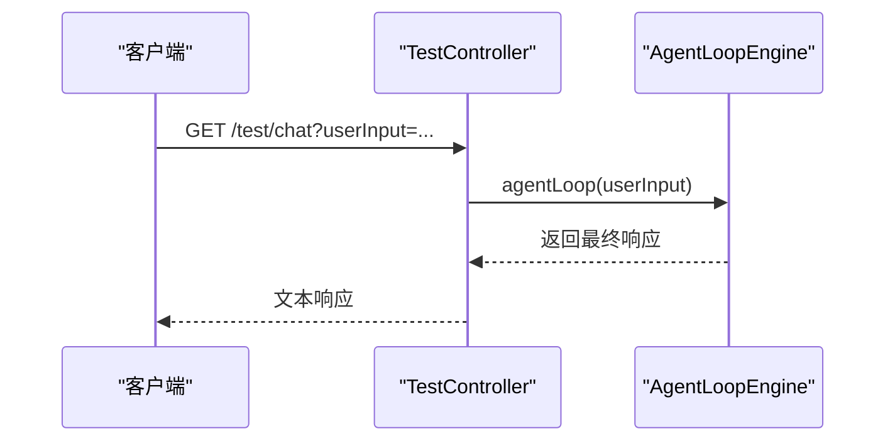
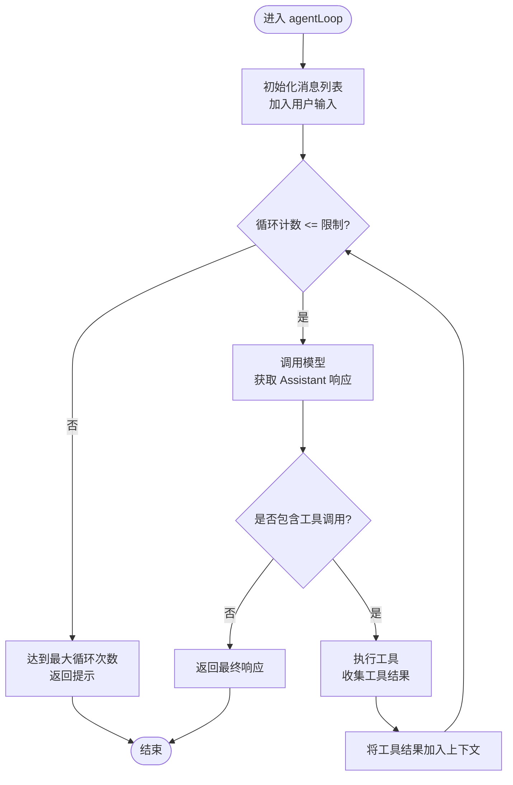
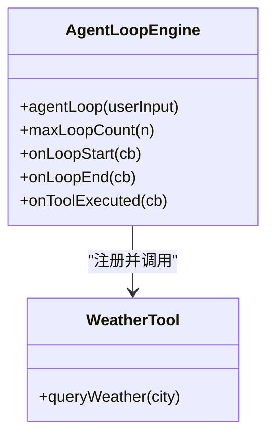
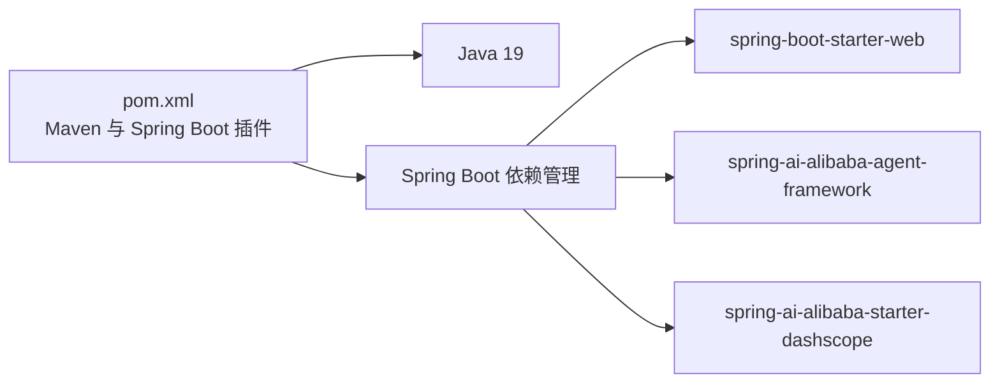

# 部署运维

<cite>
**本文引用的文件**
- [pom.xml](file://pom.xml)
- [application.yml](file://src/main/resources/application.yml)
- [HarnessApplication.java](file://src/main/java/com/learn/harness/HarnessApplication.java)
- [TestController.java](file://src/main/java/com/learn/harness/TestController.java)
- [AgentLoopEngine.java](file://src/main/java/com/learn/harness/core/AgentLoopEngine.java)
- [WeatherTool.java](file://src/main/java/com/learn/harness/tools/WeatherTool.java)
- [SpringAIConfig.java](file://src/main/java/com/learn/harness/config/SpringAIConfig.java)
- [BUILD.md](file://src/main/java/com/learn/harness/agent/BUILD.md)
- [HELP.md](file://HELP.md)
- [README.md](file://README.md)
</cite>

## 目录
1. [简介](#简介)
2. [项目结构](#项目结构)
3. [核心组件](#核心组件)
4. [架构总览](#架构总览)
5. [详细组件分析](#详细组件分析)
6. [依赖分析](#依赖分析)
7. [性能考虑](#性能考虑)
8. [故障排除指南](#故障排除指南)
9. [结论](#结论)
10. [附录](#附录)

## 简介
本运维文档面向 learn-harness 应用，目标是帮助运维团队稳定、可靠地完成构建、打包、部署与日常运维工作。内容覆盖：
- 构建配置与打包流程（Maven 参数、插件、依赖管理）
- 不同部署环境的配置要点（容器化、编排与云平台）
- 性能监控与日志管理策略
- 版本升级与回滚流程
- 故障排除与应急响应
- 容量规划与扩展性建议
- 安全加固与合规要求

## 项目结构
该仓库采用 Spring Boot 标准目录结构，核心模块如下：
- 应用入口与配置：入口类、Spring Boot 配置文件
- 控制器与业务引擎：REST 接口与 Agent 循环引擎
- 工具与 AI 集成：工具定义与 Spring AI 配置
- 构建与依赖：Maven POM 与相关帮助文档

图表来源
- [HarnessApplication.java:1-14](file://src/main/java/com/learn/harness/HarnessApplication.java#L1-L14)
- [TestController.java:1-45](file://src/main/java/com/learn/harness/TestController.java#L1-L45)
- [AgentLoopEngine.java:1-353](file://src/main/java/com/learn/harness/core/AgentLoopEngine.java#L1-L353)
- [SpringAIConfig.java:1-26](file://src/main/java/com/learn/harness/config/SpringAIConfig.java#L1-L26)
- [WeatherTool.java:1-66](file://src/main/java/com/learn/harness/tools/WeatherTool.java#L1-L66)
- [application.yml:1-13](file://src/main/resources/application.yml#L1-L13)
- [pom.xml:1-89](file://pom.xml#L1-L89)
- [BUILD.md:1-29](file://src/main/java/com/learn/harness/agent/BUILD.md#L1-L29)

章节来源
- [HarnessApplication.java:1-14](file://src/main/java/com/learn/harness/HarnessApplication.java#L1-L14)
- [TestController.java:1-45](file://src/main/java/com/learn/harness/TestController.java#L1-L45)
- [AgentLoopEngine.java:1-353](file://src/main/java/com/learn/harness/core/AgentLoopEngine.java#L1-L353)
- [SpringAIConfig.java:1-26](file://src/main/java/com/learn/harness/config/SpringAIConfig.java#L1-L26)
- [WeatherTool.java:1-66](file://src/main/java/com/learn/harness/tools/WeatherTool.java#L1-L66)
- [application.yml:1-13](file://src/main/resources/application.yml#L1-L13)
- [pom.xml:1-89](file://pom.xml#L1-L89)
- [BUILD.md:1-29](file://src/main/java/com/learn/harness/agent/BUILD.md#L1-L29)

## 核心组件
- 应用入口与启动：负责加载 Spring Boot 上下文并启动服务
- Web 控制器：提供 /test/chat 与 /test/weather/agent 接口，委托 Agent 引擎执行
- Agent 引擎：封装多轮对话、工具调用循环、最大循环次数保护与回调机制
- 工具：天气查询工具，作为示例工具展示工具注册与调用
- AI 配置：装配 ChatClient，基于 DashScope ChatModel 进行对话与工具调用
- 应用配置：端口、应用名、DashScope API Key 与模型配置

章节来源
- [HarnessApplication.java:1-14](file://src/main/java/com/learn/harness/HarnessApplication.java#L1-L14)
- [TestController.java:1-45](file://src/main/java/com/learn/harness/TestController.java#L1-L45)
- [AgentLoopEngine.java:1-353](file://src/main/java/com/learn/harness/core/AgentLoopEngine.java#L1-L353)
- [WeatherTool.java:1-66](file://src/main/java/com/learn/harness/tools/WeatherTool.java#L1-L66)
- [SpringAIConfig.java:1-26](file://src/main/java/com/learn/harness/config/SpringAIConfig.java#L1-L26)
- [application.yml:1-13](file://src/main/resources/application.yml#L1-L13)

## 架构总览
应用采用“控制器-引擎-工具-AI 客户端”的分层架构。控制器接收请求，引擎负责对话与工具循环，工具提供外部能力，AI 客户端负责与模型交互。

图表来源
- [TestController.java:1-45](file://src/main/java/com/learn/harness/TestController.java#L1-L45)
- [AgentLoopEngine.java:1-353](file://src/main/java/com/learn/harness/core/AgentLoopEngine.java#L1-L353)
- [WeatherTool.java:1-66](file://src/main/java/com/learn/harness/tools/WeatherTool.java#L1-L66)
- [SpringAIConfig.java:1-26](file://src/main/java/com/learn/harness/config/SpringAIConfig.java#L1-L26)
- [application.yml:1-13](file://src/main/resources/application.yml#L1-L13)

## 详细组件分析

### 控制器与接口
- /test/chat：通用 Agent 对话测试，将用户输入交由 Agent 引擎处理
- /test/weather/agent：通过 Agent 查询天气，内部同样走 Agent 引擎

图表来源
- [TestController.java:24-27](file://src/main/java/com/learn/harness/TestController.java#L24-L27)
- [AgentLoopEngine.java:96-182](file://src/main/java/com/learn/harness/core/AgentLoopEngine.java#L96-L182)

章节来源
- [TestController.java:1-45](file://src/main/java/com/learn/harness/TestController.java#L1-L45)

### Agent 循环引擎
- 功能要点
  - 维护消息历史，支持多轮对话
  - 检测模型返回的工具调用并执行
  - 最大循环次数保护，防止无限循环
  - 回调钩子：循环开始/结束、工具执行结果
- 关键流程

图表来源
- [AgentLoopEngine.java:107-182](file://src/main/java/com/learn/harness/core/AgentLoopEngine.java#L107-L182)

章节来源
- [AgentLoopEngine.java:1-353](file://src/main/java/com/learn/harness/core/AgentLoopEngine.java#L1-L353)

### 工具系统
- 工具注册：引擎在初始化时扫描并注册工具回调
- 工具调用：根据模型返回的工具调用名称匹配并执行
- 错误处理：工具执行异常会被捕获并返回错误信息

图表来源
- [AgentLoopEngine.java:58-68](file://src/main/java/com/learn/harness/core/AgentLoopEngine.java#L58-L68)
- [AgentLoopEngine.java:253-266](file://src/main/java/com/learn/harness/core/AgentLoopEngine.java#L253-L266)
- [WeatherTool.java:30-42](file://src/main/java/com/learn/harness/tools/WeatherTool.java#L30-L42)

章节来源
- [AgentLoopEngine.java:1-353](file://src/main/java/com/learn/harness/core/AgentLoopEngine.java#L1-L353)
- [WeatherTool.java:1-66](file://src/main/java/com/learn/harness/tools/WeatherTool.java#L1-L66)

### AI 客户端与配置
- ChatClient：由 Spring AI 配置装配，基于 ChatModel 进行对话
- DashScope 配置：在应用配置中声明 API Key 与模型，用于模型访问

章节来源
- [SpringAIConfig.java:1-26](file://src/main/java/com/learn/harness/config/SpringAIConfig.java#L1-L26)
- [application.yml:8-13](file://src/main/resources/application.yml#L8-L13)

## 依赖分析
- 构建与打包
  - Maven 编译插件：Java 19，编码 UTF-8
  - Spring Boot 插件：主类为应用入口类，默认 repackage 目标
  - 依赖管理：导入 Spring Boot 依赖聚合，统一版本
- 运行时依赖
  - Spring Web Starter
  - Spring AI 阿里巴巴 Agent Framework 与 DashScope Starter
  - 测试依赖：JUnit 与 Spring Boot Test

图表来源
- [pom.xml:56-86](file://pom.xml#L56-L86)
- [pom.xml:44-54](file://pom.xml#L44-L54)

章节来源
- [pom.xml:1-89](file://pom.xml#L1-L89)

## 性能考虑
- 并发与线程
  - Spring Web 默认基于反应式或阻塞模型；如需高并发，建议评估异步与连接池配置
- 资源限制
  - JVM 堆大小与 GC 参数需结合负载与模型调用频率进行调优
- 模型调用成本
  - DashScope 模型调用存在请求延迟与配额限制，建议在网关层做限流与熔断
- 日志与追踪
  - 建议开启采样日志与链路追踪，避免高频日志影响性能
- 缓存与预热
  - 工具调用与模型初始化可做缓存与预热，减少首请求延迟

## 故障排除指南
- 启动失败
  - 检查主类与打包产物是否正确
  - 端口占用：确认 server.port 配置未被占用
- 模型调用异常
  - 核对 DashScope API Key 与模型名称配置
  - 检查网络连通性与代理设置
- 工具执行失败
  - 查看工具日志与异常栈，确认工具实现与参数解析
- Agent 循环卡住
  - 检查最大循环次数配置与回调逻辑
  - 关注工具调用返回值格式是否符合预期

章节来源
- [HarnessApplication.java:9-11](file://src/main/java/com/learn/harness/HarnessApplication.java#L9-L11)
- [application.yml:1-13](file://src/main/resources/application.yml#L1-L13)
- [AgentLoopEngine.java:122-126](file://src/main/java/com/learn/harness/core/AgentLoopEngine.java#L122-L126)
- [WeatherTool.java:38-41](file://src/main/java/com/learn/harness/tools/WeatherTool.java#L38-L41)

## 结论
本运维文档提供了 learn-harness 的构建、部署与运维全景视图。通过规范的构建参数、清晰的配置与可观测性策略，可确保应用在不同环境中稳定运行。建议在生产环境进一步完善监控、日志与安全加固，并制定标准化的发布与回滚流程。

## 附录

### A. 构建与打包流程
- Maven 构建参数
  - Java 版本：19
  - 源码与输出编码：UTF-8
  - Spring Boot 版本：3.2.0
- 关键插件
  - maven-compiler-plugin：编译与编码
  - spring-boot-maven-plugin：打包与主类配置
- 依赖管理
  - 导入 spring-boot-dependencies，统一版本
- 典型命令
  - 清理并打包：mvn clean package
  - 生成可执行 JAR：mvn spring-boot:build-image（参考帮助文档）

章节来源
- [pom.xml:10-15](file://pom.xml#L10-L15)
- [pom.xml:58-84](file://pom.xml#L58-L84)
- [HELP.md:7-10](file://HELP.md#L7-L10)

### B. 部署环境配置指南

- Docker 镜像
  - 使用 Spring Boot Maven 插件生成镜像（参考帮助文档），或基于官方 JRE 镜像手动打包
  - 环境变量
    - DashScope：DASHSCOPE_API_KEY、DASHSCOPE_MODEL
    - 应用端口：SERVER_PORT（默认 8080）
- Kubernetes
  - Deployment：副本数、资源请求/限制、探针
  - Service：ClusterIP/LoadBalancer 类型
  - ConfigMap：存放非敏感配置
  - Secret：存放 API Key 等敏感信息
- 云平台
  - 容器服务：ECS/Kubernetes 服务
  - 网络与安全组：开放 8080，限制入站访问
  - 监控与日志：对接云监控与日志服务

章节来源
- [HELP.md:9-10](file://HELP.md#L9-L10)
- [application.yml:1-13](file://src/main/resources/application.yml#L1-L13)

### C. 性能监控与日志管理
- 指标采集
  - HTTP 请求延迟、QPS、错误率
  - 模型调用耗时与成功率
- 日志策略
  - 分级别输出：INFO/ERROR/WARN
  - 结构化日志：JSON 格式便于检索
  - 日志轮转与保留周期
- 链路追踪
  - 为关键路径打点，定位慢调用

### D. 版本升级与回滚
- 升级流程
  - 在测试环境验证新版本
  - 采用蓝绿/滚动发布降低风险
- 回滚流程
  - 快速回退至上一稳定版本
  - 回滚前备份配置与数据

### E. 容量规划与扩展性
- 计算资源
  - CPU/内存：按 QPS 与模型调用时延估算
- 存储与网络
  - 日志与指标存储容量规划
- 扩展方式
  - 垂直扩展：提升实例规格
  - 水平扩展：多副本与负载均衡

### F. 安全加固与合规
- 凭据管理
  - API Key 使用 Secret 管理，避免硬编码
- 网络安全
  - 仅暴露必要端口，启用 TLS
- 数据保护
  - 日志脱敏，传输加密
- 合规审计
  - 审计日志与变更记录

### G. 相关文件索引
- 应用入口与启动
  - [HarnessApplication.java:1-14](file://src/main/java/com/learn/harness/HarnessApplication.java#L1-L14)
- Web 控制器
  - [TestController.java:1-45](file://src/main/java/com/learn/harness/TestController.java#L1-L45)
- Agent 引擎
  - [AgentLoopEngine.java:1-353](file://src/main/java/com/learn/harness/core/AgentLoopEngine.java#L1-L353)
- 工具
  - [WeatherTool.java:1-66](file://src/main/java/com/learn/harness/tools/WeatherTool.java#L1-L66)
- AI 配置
  - [SpringAIConfig.java:1-26](file://src/main/java/com/learn/harness/config/SpringAIConfig.java#L1-L26)
- 应用配置
  - [application.yml:1-13](file://src/main/resources/application.yml#L1-L13)
- 构建与帮助
  - [pom.xml:1-89](file://pom.xml#L1-L89)
  - [HELP.md:1-20](file://HELP.md#L1-L20)
  - [README.md:1-3](file://README.md#L1-L3)
- Agent 示例说明
  - [BUILD.md:1-29](file://src/main/java/com/learn/harness/agent/BUILD.md#L1-L29)