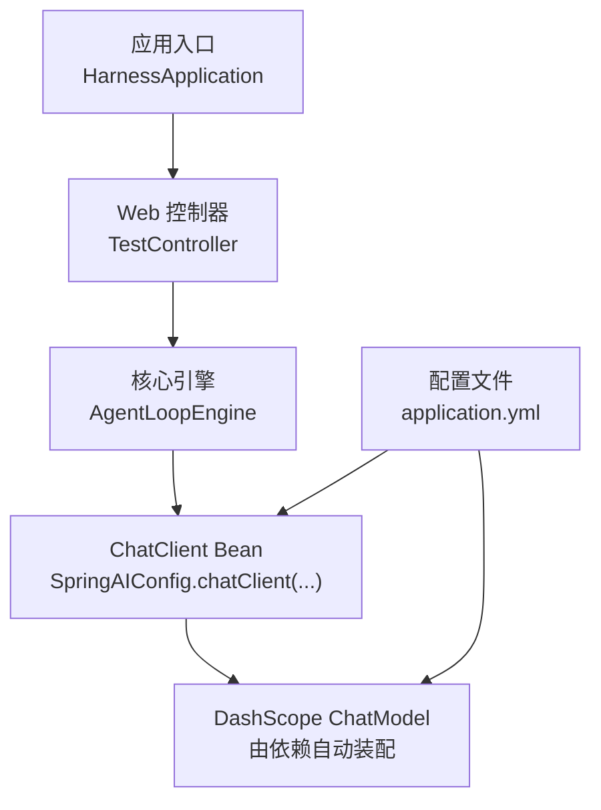
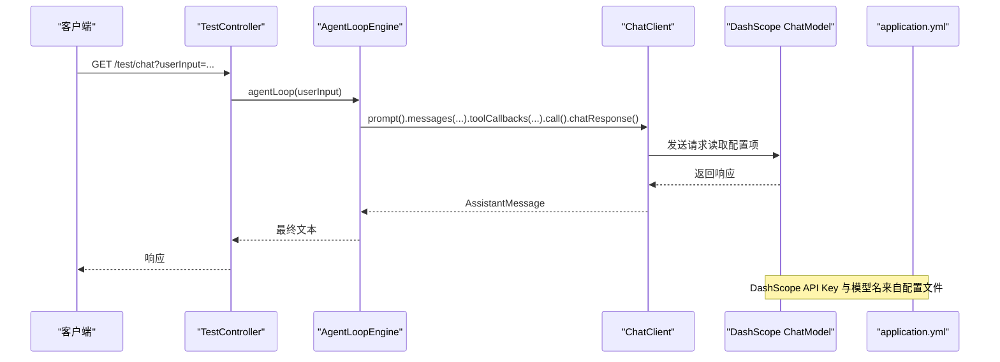
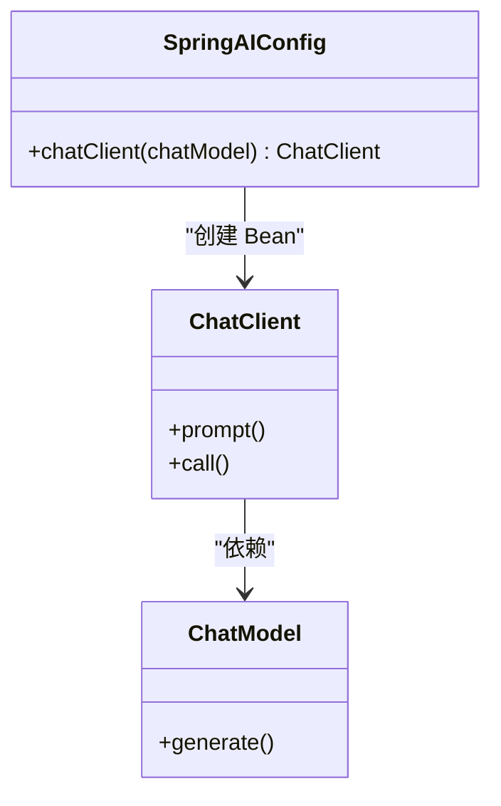
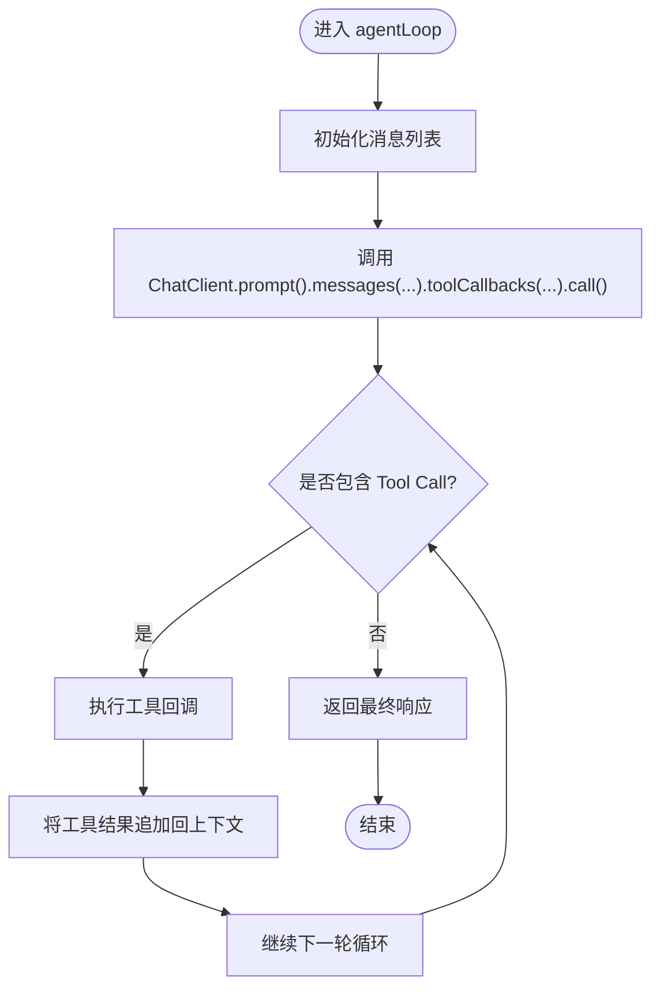
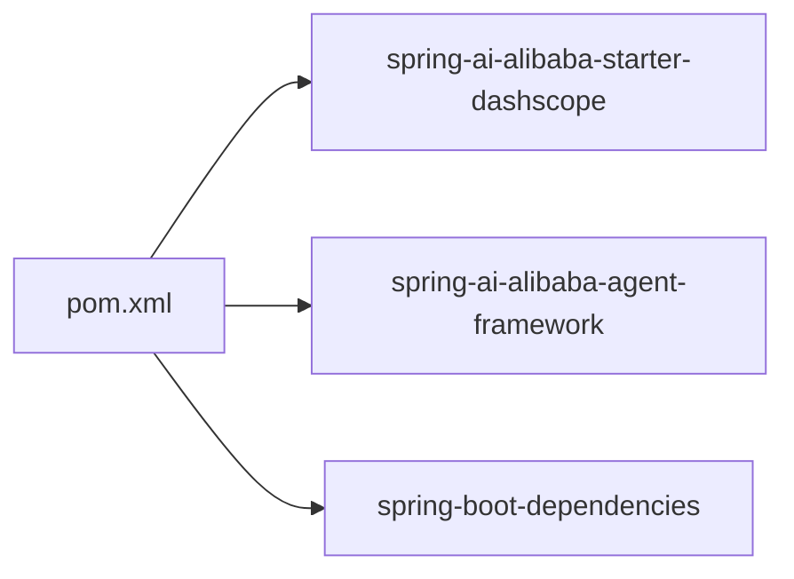

# 配置指南

<cite>
**本文引用的文件**
- [application.yml](file://src/main/resources/application.yml)
- [SpringAIConfig.java](file://src/main/java/com/learn/harness/config/SpringAIConfig.java)
- [HarnessApplication.java](file://src/main/java/com/learn/harness/HarnessApplication.java)
- [AgentLoopEngine.java](file://src/main/java/com/learn/harness/core/AgentLoopEngine.java)
- [TestController.java](file://src/main/java/com/learn/harness/TestController.java)
- [WeatherTool.java](file://src/main/java/com/learn/harness/tools/WeatherTool.java)
- [pom.xml](file://pom.xml)
</cite>

## 目录
1. [简介](#简介)
2. [项目结构](#项目结构)
3. [核心组件](#核心组件)
4. [架构总览](#架构总览)
5. [详细组件分析](#详细组件分析)
6. [依赖分析](#依赖分析)
7. [性能考虑](#性能考虑)
8. [故障排除指南](#故障排除指南)
9. [结论](#结论)
10. [附录](#附录)

## 简介
本指南面向开发者，帮助您正确配置 learn-harness 应用，重点覆盖以下方面：
- application.yml 中的 Spring AI 与 DashScope 相关配置项说明与推荐值
- SpringAIConfig 中 ChatClient Bean 的装配与可选自定义点
- 不同环境（开发、测试、生产）的配置示例与注意事项
- 配置验证与常见问题排查
- 如何扩展配置系统以支持新的配置项
- 安全与最佳实践建议

## 项目结构
该应用采用 Spring Boot 与 Spring AI 阿里云生态集成，核心配置集中在 application.yml 与 SpringAIConfig.java，运行入口为 HarnessApplication。

图表来源
- [HarnessApplication.java:1-14](file://src/main/java/com/learn/harness/HarnessApplication.java#L1-L14)
- [TestController.java:1-45](file://src/main/java/com/learn/harness/TestController.java#L1-L45)
- [AgentLoopEngine.java:1-353](file://src/main/java/com/learn/harness/core/AgentLoopEngine.java#L1-L353)
- [SpringAIConfig.java:1-26](file://src/main/java/com/learn/harness/config/SpringAIConfig.java#L1-L26)
- [application.yml:1-13](file://src/main/resources/application.yml#L1-L13)

章节来源
- [HarnessApplication.java:1-14](file://src/main/java/com/learn/harness/HarnessApplication.java#L1-L14)
- [pom.xml:1-89](file://pom.xml#L1-L89)

## 核心组件
- application.yml：集中管理服务器端口、应用名以及 Spring AI/DashScope 的基础配置（如 API Key、默认模型等）。
- SpringAIConfig：声明 ChatClient Bean，依赖容器中的 ChatModel（DashScope ChatModel 由依赖自动装配）。
- AgentLoopEngine：通过注入的 ChatClient 发起对话与工具调用，是配置生效的关键消费者。
- TestController：对外提供 /test/chat 与 /test/weather/agent 接口，便于快速验证配置。

章节来源
- [application.yml:1-13](file://src/main/resources/application.yml#L1-L13)
- [SpringAIConfig.java:1-26](file://src/main/java/com/learn/harness/config/SpringAIConfig.java#L1-L26)
- [AgentLoopEngine.java:1-353](file://src/main/java/com/learn/harness/core/AgentLoopEngine.java#L1-L353)
- [TestController.java:1-45](file://src/main/java/com/learn/harness/TestController.java#L1-L45)

## 架构总览
下图展示配置在运行时的装配与使用路径：

图表来源
- [TestController.java:24-27](file://src/main/java/com/learn/harness/TestController.java#L24-L27)
- [AgentLoopEngine.java:187-199](file://src/main/java/com/learn/harness/core/AgentLoopEngine.java#L187-L199)
- [SpringAIConfig.java:21-24](file://src/main/java/com/learn/harness/config/SpringAIConfig.java#L21-L24)
- [application.yml:8-13](file://src/main/resources/application.yml#L8-L13)

## 详细组件分析

### application.yml 配置详解
- server.port
  - 作用：设置 HTTP 服务监听端口
  - 推荐值：开发环境可使用 8080；测试/生产按平台分配动态端口或固定端口策略
  - 参考路径：[application.yml:1-2](file://src/main/resources/application.yml#L1-L2)
- spring.application.name
  - 作用：应用名，用于日志、监控与服务发现标识
  - 参考路径：[application.yml:5-6](file://src/main/resources/application.yml#L5-L6)
- spring.ai.dashscope.api-key
  - 作用：DashScope API Key，用于鉴权
  - 安全建议：不要硬编码在仓库中，优先使用环境变量或配置中心
  - 参考路径：[application.yml:10](file://src/main/resources/application.yml#L10)
- spring.ai.dashscope.chat.options.model
  - 作用：默认使用的模型名称
  - 推荐值：根据业务场景选择 qwen-plus、qwen-max 等；高精度任务可选更高规格模型
  - 参考路径：[application.yml:12-13](file://src/main/resources/application.yml#L12-L13)

配置项作用与推荐值总结
- server.port：开发默认 8080；测试/生产按需调整
- spring.application.name：统一命名，便于运维
- spring.ai.dashscope.api-key：必须配置且保密
- spring.ai.dashscope.chat.options.model：按成本与性能平衡选择

章节来源
- [application.yml:1-13](file://src/main/resources/application.yml#L1-L13)

### SpringAIConfig 中 ChatClient Bean 配置
- 职责：声明 ChatClient Bean，并依赖容器中的 ChatModel
- 关键点：
  - ChatModel 来源于 spring-ai-alibaba-starter-dashscope 的自动装配
  - ChatClient 作为上层调用入口，承载对话与工具调用流程
- 自定义选项（可选）：
  - 可通过扩展 ChatClient 构建器添加默认工具回调、消息拦截器、超时配置等（具体取决于所用 Starter 版本能力）
  - 若需切换至其他供应商（如通义千问 Web 模型），请参考对应 Starter 并调整配置键前缀

图表来源
- [SpringAIConfig.java:21-24](file://src/main/java/com/learn/harness/config/SpringAIConfig.java#L21-L24)

章节来源
- [SpringAIConfig.java:1-26](file://src/main/java/com/learn/harness/config/SpringAIConfig.java#L1-L26)

### AgentLoopEngine 与配置的关系
- AgentLoopEngine 通过 @Resource 注入 ChatClient，并在 agentLoop 中发起对话
- 工具回调（如 WeatherTool）通过 ToolCallbacks 自动注册，与 ChatClient 的 toolCallbacks 集成
- 配置项（如模型名）影响 ChatModel 的行为；API Key 影响认证与配额

图表来源
- [AgentLoopEngine.java:96-199](file://src/main/java/com/learn/harness/core/AgentLoopEngine.java#L96-L199)

章节来源
- [AgentLoopEngine.java:1-353](file://src/main/java/com/learn/harness/core/AgentLoopEngine.java#L1-L353)
- [WeatherTool.java:1-66](file://src/main/java/com/learn/harness/tools/WeatherTool.java#L1-L66)

### 不同环境下的配置示例与建议
- 开发环境
  - 端口：8080
  - 模型：qwen-plus（推理速度与成本较均衡）
  - 安全：使用本地环境变量或 IDE 运行参数传入 API Key
  - 参考路径：[application.yml:1-13](file://src/main/resources/application.yml#L1-L13)
- 测试环境
  - 端口：动态或固定端口（CI/CD 分配）
  - 模型：与生产一致或降级模型以降低成本
  - 安全：通过配置中心下发密钥，避免明文
- 生产环境
  - 端口：容器/云平台分配
  - 模型：按 SLA 与成本选择（如 qwen-max）
  - 安全：严格密钥管理与轮换，启用只读权限与审计日志

[本节为概念性说明，不直接分析具体文件，故无“章节来源”]

### 配置验证与故障排除
- 验证步骤
  - 启动应用后访问 /test/chat 接口，确认能返回模型回复
  - 访问 /test/weather/agent 接口，确认工具被识别与执行
  - 查看日志中是否出现工具注册与调用记录
- 常见问题
  - API Key 无效或过期：检查配置文件或环境变量
  - 模型不可用：确认模型名拼写与可用性
  - 工具未执行：确认工具类已标注注解并被扫描
- 相关实现参考
  - ChatClient 调用链路：[AgentLoopEngine.java:187-199](file://src/main/java/com/learn/harness/core/AgentLoopEngine.java#L187-L199)
  - 工具注册与回调：[AgentLoopEngine.java:58-68](file://src/main/java/com/learn/harness/core/AgentLoopEngine.java#L58-L68)，[WeatherTool.java:30-42](file://src/main/java/com/learn/harness/tools/WeatherTool.java#L30-L42)

章节来源
- [AgentLoopEngine.java:187-199](file://src/main/java/com/learn/harness/core/AgentLoopEngine.java#L187-L199)
- [WeatherTool.java:30-42](file://src/main/java/com/learn/harness/tools/WeatherTool.java#L30-L42)

### 扩展配置系统以支持新配置项
- 新增配置项的步骤
  - 在 application.yml 中添加键值对（遵循 spring.ai 或自定义命名空间）
  - 在 Java 代码中通过 @ConfigurationProperties 或 @Value 读取
  - 在 SpringAIConfig 或相关组件中使用新配置项进行 Bean 定义或行为定制
- 注意事项
  - 保持配置键的清晰命名与分层（如 spring.ai.dashscope.xxx）
  - 对敏感信息使用环境变量或配置中心
  - 为新配置项提供合理的默认值与校验逻辑

[本节为概念性说明，不直接分析具体文件，故无“章节来源”]

## 依赖分析
- Spring Boot 与 Spring AI 阿里云生态
  - 依赖 spring-ai-alibaba-starter-dashscope，自动装配 DashScope ChatModel
  - 依赖 spring-ai-alibaba-agent-framework，提供 Agent 相关能力
- Maven 依赖管理
  - 通过 dependencyManagement 统一版本
  - 插件配置包含编译与打包插件

图表来源
- [pom.xml:16-43](file://pom.xml#L16-L43)
- [pom.xml:44-54](file://pom.xml#L44-L54)

章节来源
- [pom.xml:1-89](file://pom.xml#L1-L89)

## 性能考虑
- 模型选择
  - 低延迟场景优先选择较小模型（如 qwen-plus）
  - 高精度场景可选用更大模型（如 qwen-max），但需关注延迟与成本
- 超时与重试
  - ChatClient 构建器可配置超时与重试策略（取决于 Starter 能力）
  - 对外接口建议增加超时与熔断保护
- 日志与可观测性
  - 为关键路径添加日志与指标，便于定位性能瓶颈

[本节为通用指导，不直接分析具体文件，故无“章节来源”]

## 故障排除指南
- 无法连接 DashScope
  - 检查 API Key 是否正确与未过期
  - 确认网络可达与代理配置
- 模型调用失败
  - 核对模型名是否匹配可用模型清单
  - 检查请求体格式与工具回调是否正确注册
- 工具未触发
  - 确认工具方法已标注注解并被扫描
  - 检查工具参数序列化与反序列化是否正确

章节来源
- [AgentLoopEngine.java:212-248](file://src/main/java/com/learn/harness/core/AgentLoopEngine.java#L212-L248)
- [WeatherTool.java:30-42](file://src/main/java/com/learn/harness/tools/WeatherTool.java#L30-L42)

## 结论
通过合理配置 application.yml 与 SpringAIConfig，结合规范的环境隔离与安全策略，您可以稳定地运行 learn-harness 应用。建议在开发阶段使用轻量模型与本地密钥，在测试与生产阶段引入配置中心与严格的权限控制，并持续监控与优化性能与成本。

## 附录
- 快速验证
  - 启动应用后访问：
    - GET /test/chat?userInput=你好
    - GET /test/weather/agent?query=北京天气如何
- 相关实现参考
  - ChatClient Bean 定义：[SpringAIConfig.java:21-24](file://src/main/java/com/learn/harness/config/SpringAIConfig.java#L21-L24)
  - 对话与工具调用流程：[AgentLoopEngine.java:96-199](file://src/main/java/com/learn/harness/core/AgentLoopEngine.java#L96-L199)
  - 工具定义与实现：[WeatherTool.java:30-42](file://src/main/java/com/learn/harness/tools/WeatherTool.java#L30-L42)