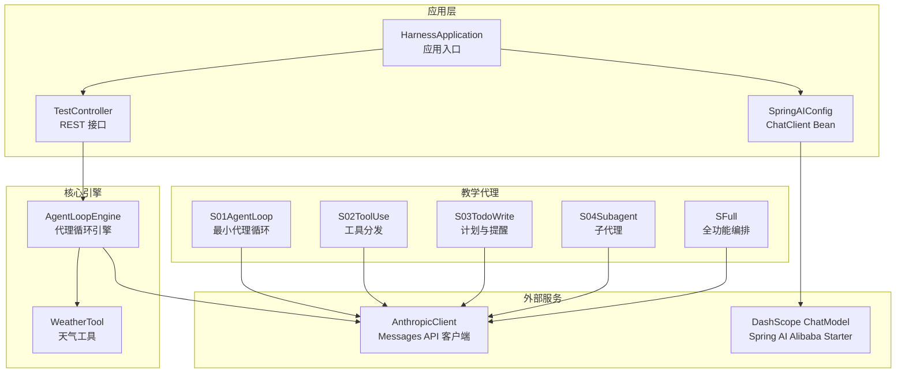
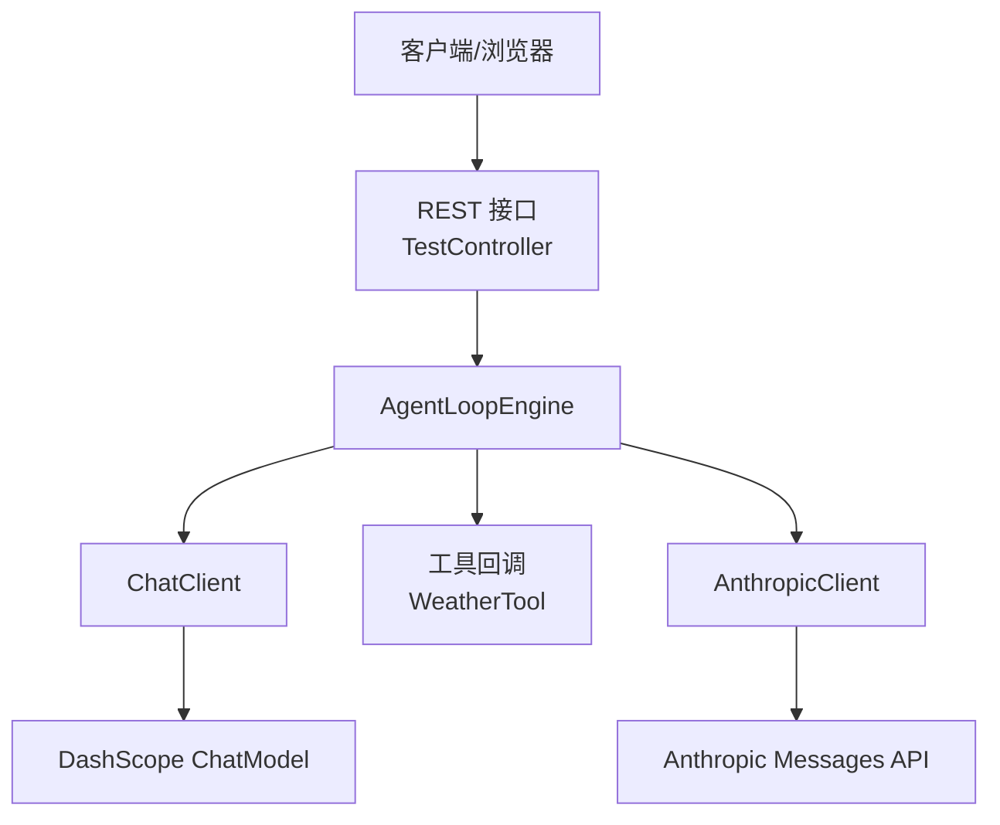
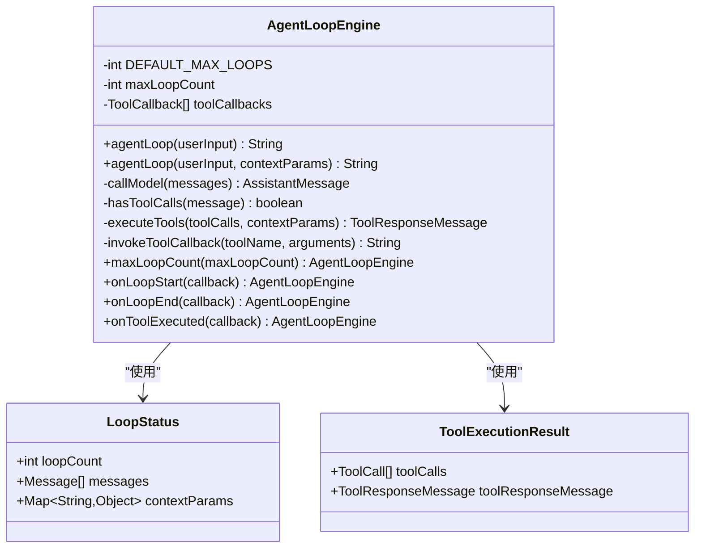
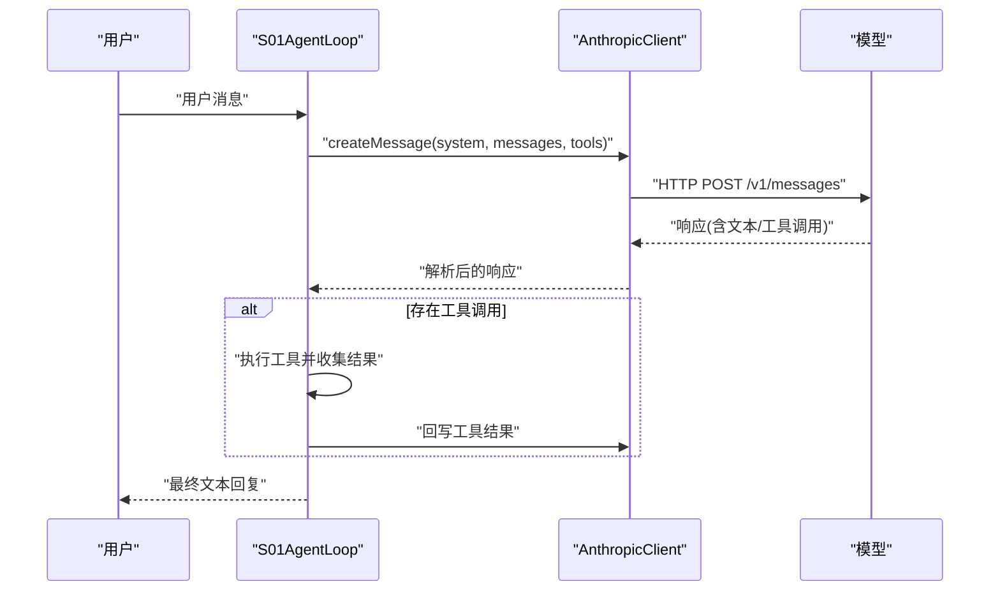
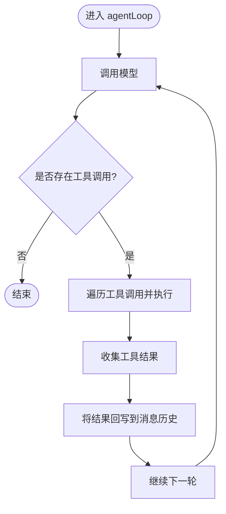
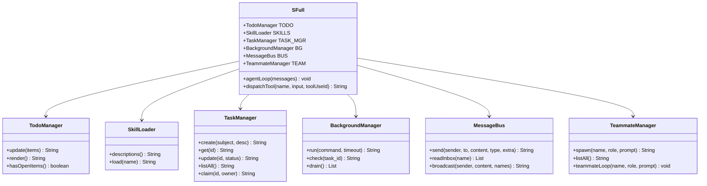
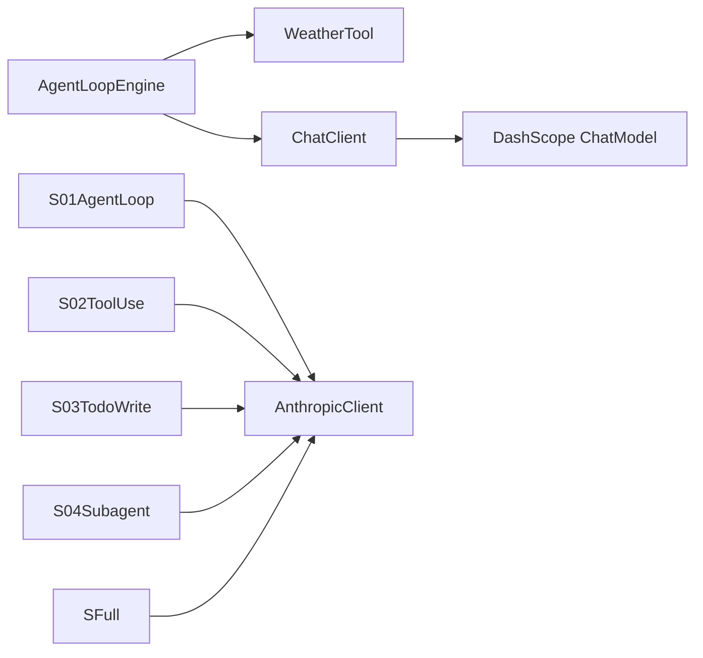

# 项目概述

<cite>
**本文引用的文件**
- [pom.xml](file://pom.xml)
- [README.md](file://README.md)
- [HarnessApplication.java](file://src/main/java/com/learn/harness/HarnessApplication.java)
- [application.yml](file://src/main/resources/application.yml)
- [SpringAIConfig.java](file://src/main/java/com/learn/harness/config/SpringAIConfig.java)
- [AgentLoopEngine.java](file://src/main/java/com/learn/harness/core/AgentLoopEngine.java)
- [TestController.java](file://src/main/java/com/learn/harness/TestController.java)
- [WeatherTool.java](file://src/main/java/com/learn/harness/tools/WeatherTool.java)
- [AnthropicClient.java](file://src/main/java/com/learn/harness/agent/AnthropicClient.java)
- [S01AgentLoop.java](file://src/main/java/com/learn/harness/agent/S01AgentLoop.java)
- [S02ToolUse.java](file://src/main/java/com/learn/harness/agent/S02ToolUse.java)
- [S03TodoWrite.java](file://src/main/java/com/learn/harness/agent/S03TodoWrite.java)
- [S04Subagent.java](file://src/main/java/com/learn/harness/agent/S04Subagent.java)
- [SFull.java](file://src/main/java/com/learn/harness/agent/SFull.java)
- [BUILD.md](file://src/main/java/com/learn/harness/agent/BUILD.md)
</cite>

## 目录
1. [引言](#引言)
2. [项目结构](#项目结构)
3. [核心组件](#核心组件)
4. [架构总览](#架构总览)
5. [详细组件分析](#详细组件分析)
6. [依赖关系分析](#依赖关系分析)
7. [性能考虑](#性能考虑)
8. [故障排查指南](#故障排查指南)
9. [结论](#结论)
10. [附录](#附录)

## 引言
learn-harness 是一个基于 Spring Boot 与 Spring AI Alibaba 的渐进式智能代理开发框架。它以 19 个从基础到复杂的代理模块（S01–S19）为教学载体，系统性地展示如何构建具备工具调用、任务规划、子代理、团队协作、内存与上下文压缩、权限与钩子、错误恢复、定时任务与工作区隔离等能力的智能体。项目既适合初学者循序渐进地理解 AI 代理的构建方式，也为有经验的开发者提供了可扩展的工程化范式。

## 项目结构
项目采用标准的 Spring Boot Maven 结构，核心模块包括：
- 应用入口与配置：应用启动类、Spring AI 配置、YAML 配置
- 核心引擎：Agent 循环引擎，封装多轮对话、工具回调与循环控制
- 控制器：对外提供 REST 接口用于测试与演示
- 工具：内置天气查询工具，演示工具注册与调用
- 教学代理：S01–S19 渐进式代理模块，覆盖从“最小可用代理循环”到“全功能编排代理”的完整路径
- 依赖管理：通过 Maven 引入 Spring Boot 与 Spring AI Alibaba

**图表来源**
- [HarnessApplication.java:1-14](file://src/main/java/com/learn/harness/HarnessApplication.java#L1-L14)
- [SpringAIConfig.java:1-26](file://src/main/java/com/learn/harness/config/SpringAIConfig.java#L1-L26)
- [TestController.java:1-45](file://src/main/java/com/learn/harness/TestController.java#L1-L45)
- [AgentLoopEngine.java:1-353](file://src/main/java/com/learn/harness/core/AgentLoopEngine.java#L1-L353)
- [WeatherTool.java:1-66](file://src/main/java/com/learn/harness/tools/WeatherTool.java#L1-L66)
- [AnthropicClient.java:1-127](file://src/main/java/com/learn/harness/agent/AnthropicClient.java#L1-L127)
- [S01AgentLoop.java:1-177](file://src/main/java/com/learn/harness/agent/S01AgentLoop.java#L1-L177)
- [S02ToolUse.java:1-152](file://src/main/java/com/learn/harness/agent/S02ToolUse.java#L1-L152)
- [S03TodoWrite.java:1-227](file://src/main/java/com/learn/harness/agent/S03TodoWrite.java#L1-L227)
- [S04Subagent.java:1-164](file://src/main/java/com/learn/harness/agent/S04Subagent.java#L1-L164)
- [SFull.java:1-640](file://src/main/java/com/learn/harness/agent/SFull.java#L1-L640)

**章节来源**
- [pom.xml:1-89](file://pom.xml#L1-L89)
- [HarnessApplication.java:1-14](file://src/main/java/com/learn/harness/HarnessApplication.java#L1-L14)
- [application.yml:1-13](file://src/main/resources/application.yml#L1-L13)
- [SpringAIConfig.java:1-26](file://src/main/java/com/learn/harness/config/SpringAIConfig.java#L1-L26)

## 核心组件
- 应用入口与配置
  - 应用入口负责启动 Spring Boot 应用
  - Spring AI 配置类注入 ChatClient Bean，依赖 DashScope ChatModel（由 Spring AI Alibaba Starter 自动装配）
  - YAML 配置定义服务器端口、应用名以及 DashScope API Key 与模型参数
- 代理循环引擎（AgentLoopEngine）
  - 封装多轮对话、工具回调、循环次数限制、状态回调与日志
  - 通过 ChatClient 调用模型，解析工具调用并执行对应工具，再将结果回写上下文
- REST 控制器（TestController）
  - 提供通用对话接口与天气查询接口，便于快速验证代理行为
- 工具（WeatherTool）
  - 基于注解声明的工具，演示工具注册与调用流程
- 教学代理模块
  - 从 S01 的最小代理循环逐步扩展到 S04 的子代理，再到 SFull 的全功能编排
  - 通过 AnthropicClient 统一访问 Messages API，实现工具调用与消息处理

**章节来源**
- [HarnessApplication.java:1-14](file://src/main/java/com/learn/harness/HarnessApplication.java#L1-L14)
- [SpringAIConfig.java:1-26](file://src/main/java/com/learn/harness/config/SpringAIConfig.java#L1-L26)
- [application.yml:1-13](file://src/main/resources/application.yml#L1-L13)
- [AgentLoopEngine.java:1-353](file://src/main/java/com/learn/harness/core/AgentLoopEngine.java#L1-L353)
- [TestController.java:1-45](file://src/main/java/com/learn/harness/TestController.java#L1-L45)
- [WeatherTool.java:1-66](file://src/main/java/com/learn/harness/tools/WeatherTool.java#L1-L66)
- [AnthropicClient.java:1-127](file://src/main/java/com/learn/harness/agent/AnthropicClient.java#L1-L127)

## 架构总览
本项目采用“配置驱动 + 引擎内核 + 教学代理模块”的分层架构：
- 配置层：Spring AI Alibaba Starter 自动装配 DashScope ChatModel；Spring AI Config 注入 ChatClient
- 引擎层：AgentLoopEngine 统一处理对话循环、工具调度与回调
- 控制层：REST 接口对外暴露能力
- 教学层：S01–S19 以“最小可用模式 + 逐步增量”的方式呈现代理能力边界
- 交互层：AnthropicClient 封装 Messages API 请求与响应解析

**图表来源**
- [TestController.java:1-45](file://src/main/java/com/learn/harness/TestController.java#L1-L45)
- [AgentLoopEngine.java:1-353](file://src/main/java/com/learn/harness/core/AgentLoopEngine.java#L1-L353)
- [SpringAIConfig.java:1-26](file://src/main/java/com/learn/harness/config/SpringAIConfig.java#L1-L26)
- [AnthropicClient.java:1-127](file://src/main/java/com/learn/harness/agent/AnthropicClient.java#L1-L127)

## 详细组件分析

### 组件 A 分析：AgentLoopEngine（代理循环引擎）
- 设计要点
  - 通过 ChatClient 发起对话请求，接收包含文本与工具调用的响应
  - 识别工具调用并执行，将结果回写上下文，继续多轮对话直至无工具调用或达到最大循环次数
  - 支持回调钩子：循环开始、循环结束、工具执行
- 数据结构与复杂度
  - 消息列表线性增长，工具执行按调用数量线性处理
  - 循环次数上限避免无限调用
- 错误处理与优化
  - 工具执行异常捕获并返回错误信息
  - 日志记录便于问题定位
- 性能影响
  - 工具调用与模型往返是主要耗时点；可通过减少工具数量与优化模型参数降低延迟

**图表来源**
- [AgentLoopEngine.java:1-353](file://src/main/java/com/learn/harness/core/AgentLoopEngine.java#L1-L353)

**章节来源**
- [AgentLoopEngine.java:1-353](file://src/main/java/com/learn/harness/core/AgentLoopEngine.java#L1-L353)

### 组件 B 分析：S01AgentLoop（最小代理循环）
- 设计要点
  - 保持最小可用代理循环，明确每轮的状态与过渡条件
  - 显式维护消息历史、回合计数与过渡原因
  - 通过 AnthropicClient 发送请求、解析响应、执行工具并回写结果
- 关键流程
  - 用户输入 → 模型回复 → 若存在工具调用则执行 → 回写工具结果 → 继续下一轮
- 安全与限制
  - 对危险命令进行拦截
  - 进程超时控制与输出截断

**图表来源**
- [S01AgentLoop.java:1-177](file://src/main/java/com/learn/harness/agent/S01AgentLoop.java#L1-L177)
- [AnthropicClient.java:1-127](file://src/main/java/com/learn/harness/agent/AnthropicClient.java#L1-L127)

**章节来源**
- [S01AgentLoop.java:1-177](file://src/main/java/com/learn/harness/agent/S01AgentLoop.java#L1-L177)
- [AnthropicClient.java:1-127](file://src/main/java/com/learn/harness/agent/AnthropicClient.java#L1-L127)

### 组件 C 分析：S02ToolUse（工具分发与消息规范化）
- 设计要点
  - 在 S01 基础上引入工具分发表，统一工具执行逻辑
  - 提供消息规范化方法，确保每次调用前对消息进行清洗
- 工具集
  - bash、read_file、write_file、edit_file
- 安全与路径校验
  - 对文件路径进行安全校验，防止越权访问

**图表来源**
- [S02ToolUse.java:1-152](file://src/main/java/com/learn/harness/agent/S02ToolUse.java#L1-L152)

**章节来源**
- [S02ToolUse.java:1-152](file://src/main/java/com/learn/harness/agent/S02ToolUse.java#L1-L152)

### 组件 D 分析：S03TodoWrite（会话计划与提醒）
- 设计要点
  - 引入 TodoManager 管理会话计划，支持多步任务与“进行中”唯一约束
  - 当多轮未更新计划时，向模型注入提醒，促使持续更新
- 交互策略
  - 通过专用工具“todo”更新计划；若连续多轮未更新，插入提醒文本块

**章节来源**
- [S03TodoWrite.java:1-227](file://src/main/java/com/learn/harness/agent/S03TodoWrite.java#L1-L227)

### 组件 E 分析：S04Subagent（子代理）
- 设计要点
  - 父代理通过“task”工具派生子代理，子代理拥有独立消息上下文但共享文件系统
  - 子代理仅返回摘要，避免父代理上下文膨胀
- 上下文隔离
  - 子代理初始化空消息列表，确保与父代理完全隔离

**章节来源**
- [S04Subagent.java:1-164](file://src/main/java/com/learn/harness/agent/S04Subagent.java#L1-L164)

### 组件 F 分析：SFull（全功能编排代理）
- 设计要点
  - 融合所有机制：工具分发、待办管理、子代理、技能加载、上下文压缩、任务系统、后台任务、消息总线、团队管理、协议处理等
  - 提供 REPL 命令：/compact、/tasks、/team、/inbox
- 关键能力
  - 上下文压缩与持久化输出
  - 团队消息总线与成员生命周期管理
  - 计划审批与关闭协议
  - 后台任务与通知队列

**图表来源**
- [SFull.java:1-640](file://src/main/java/com/learn/harness/agent/SFull.java#L1-L640)

**章节来源**
- [SFull.java:1-640](file://src/main/java/com/learn/harness/agent/SFull.java#L1-L640)

### 组件 G 分析：AnthropicClient（Messages API 客户端）
- 设计要点
  - 统一封装 Messages API 的请求与响应解析
  - 提供工具调用块提取、文本提取、停止原因解析等辅助方法
- 环境变量
  - 通过环境变量配置 API Key、基础地址与模型 ID

**章节来源**
- [AnthropicClient.java:1-127](file://src/main/java/com/learn/harness/agent/AnthropicClient.java#L1-L127)

### 组件 H 分析：Spring AI 配置与依赖
- 依赖
  - Spring Boot Starter Web、Spring AI Alibaba Agent Framework、DashScope ChatModel Starter
- 配置
  - ChatClient Bean 由 Spring AI Alibaba Starter 自动装配的 ChatModel 构建
  - YAML 中配置 DashScope API Key 与模型名称

**章节来源**
- [pom.xml:1-89](file://pom.xml#L1-L89)
- [SpringAIConfig.java:1-26](file://src/main/java/com/learn/harness/config/SpringAIConfig.java#L1-L26)
- [application.yml:1-13](file://src/main/resources/application.yml#L1-L13)

## 依赖关系分析
- 模块耦合
  - AgentLoopEngine 与 WeatherTool 通过工具回调解耦
  - 教学代理模块与 AnthropicClient 强耦合，便于统一 API 访问
  - SFull 作为编排中心，聚合多个内部组件
- 外部依赖
  - Spring AI Alibaba Starter 提供 ChatModel 自动装配
  - Anthropic Messages API 作为推理与工具调用后端

**图表来源**
- [AgentLoopEngine.java:1-353](file://src/main/java/com/learn/harness/core/AgentLoopEngine.java#L1-L353)
- [WeatherTool.java:1-66](file://src/main/java/com/learn/harness/tools/WeatherTool.java#L1-L66)
- [SpringAIConfig.java:1-26](file://src/main/java/com/learn/harness/config/SpringAIConfig.java#L1-L26)
- [AnthropicClient.java:1-127](file://src/main/java/com/learn/harness/agent/AnthropicClient.java#L1-L127)
- [S01AgentLoop.java:1-177](file://src/main/java/com/learn/harness/agent/S01AgentLoop.java#L1-L177)
- [S02ToolUse.java:1-152](file://src/main/java/com/learn/harness/agent/S02ToolUse.java#L1-L152)
- [S03TodoWrite.java:1-227](file://src/main/java/com/learn/harness/agent/S03TodoWrite.java#L1-L227)
- [S04Subagent.java:1-164](file://src/main/java/com/learn/harness/agent/S04Subagent.java#L1-L164)
- [SFull.java:1-640](file://src/main/java/com/learn/harness/agent/SFull.java#L1-L640)

**章节来源**
- [pom.xml:1-89](file://pom.xml#L1-L89)
- [SpringAIConfig.java:1-26](file://src/main/java/com/learn/harness/config/SpringAIConfig.java#L1-L26)

## 性能考虑
- 工具调用与模型往返是主要性能瓶颈，建议：
  - 合理设置最大循环次数，避免长链路阻塞
  - 对大输出进行截断或持久化，减少上下文长度
  - 使用上下文压缩与最近结果保留策略，控制消息体积
- 并发与异步
  - 后台任务采用线程池与阻塞队列，注意资源占用与超时控制
- 网络与模型
  - 选择合适的模型与参数，平衡质量与延迟

## 故障排查指南
- 环境变量缺失
  - MODEL_ID 未设置会导致 AnthropicClient 初始化失败
- API 调用异常
  - 检查 Anthropic API Key 与网络连通性
  - 关注 HTTP 状态码与响应体中的错误信息
- 工具执行失败
  - 查看 AgentLoopEngine 的工具执行回调与日志
  - 确认工具名称与参数格式匹配
- 路径越权与安全
  - 文件操作工具需确保路径位于工作目录内
- 会话计划与提醒
  - 若长时间无计划更新，检查 TodoWrite 工具是否被正确调用

**章节来源**
- [AnthropicClient.java:1-127](file://src/main/java/com/learn/harness/agent/AnthropicClient.java#L1-L127)
- [AgentLoopEngine.java:1-353](file://src/main/java/com/learn/harness/core/AgentLoopEngine.java#L1-L353)
- [S02ToolUse.java:1-152](file://src/main/java/com/learn/harness/agent/S02ToolUse.java#L1-L152)

## 结论
learn-harness 以渐进式模块化的方式，系统性展示了从“最小代理循环”到“全功能编排代理”的完整能力谱系。借助 Spring Boot 与 Spring AI Alibaba，项目实现了配置驱动、工具回调、上下文管理与团队协作等工程化能力，既满足教学演示需求，也具备进一步扩展为生产级智能体平台的基础。

## 附录

### 快速开始指南
- 环境要求
  - Java 19（Maven 编译插件配置为 19）
  - Maven 3.x
  - 可选：Anthropic API Key 与 MODEL_ID 环境变量（用于教学代理模块）
- 安装步骤
  - 克隆仓库并导入为 Maven 项目
  - 配置 DashScope API Key 与模型名称（application.yml）
  - 运行应用入口类启动 Spring Boot 应用
- 基本使用示例
  - 通过 REST 接口测试对话与天气查询
  - 运行教学代理模块（如 S01AgentLoop）体验最小代理循环
  - 运行 SFull 体验全功能编排代理的 REPL 交互

**章节来源**
- [pom.xml:1-89](file://pom.xml#L1-L89)
- [application.yml:1-13](file://src/main/resources/application.yml#L1-L13)
- [HarnessApplication.java:1-14](file://src/main/java/com/learn/harness/HarnessApplication.java#L1-L14)
- [TestController.java:1-45](file://src/main/java/com/learn/harness/TestController.java#L1-L45)
- [BUILD.md:1-29](file://src/main/java/com/learn/harness/agent/BUILD.md#L1-L29)